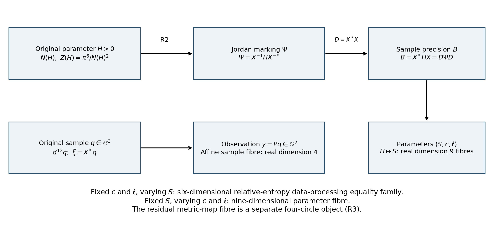
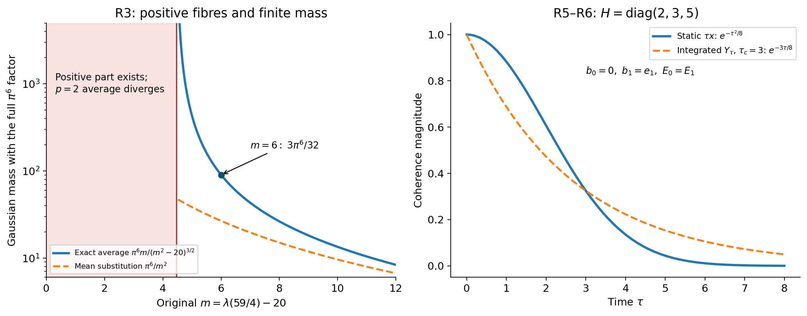
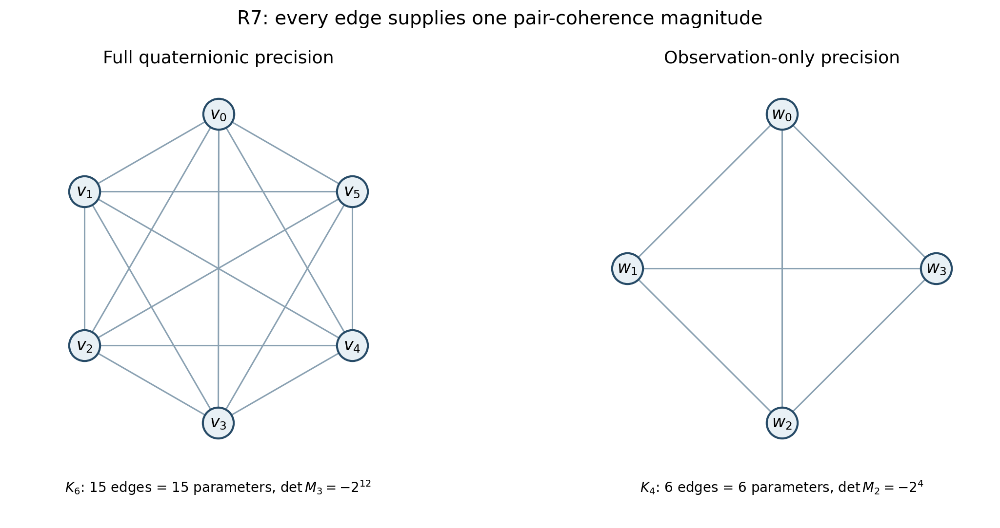
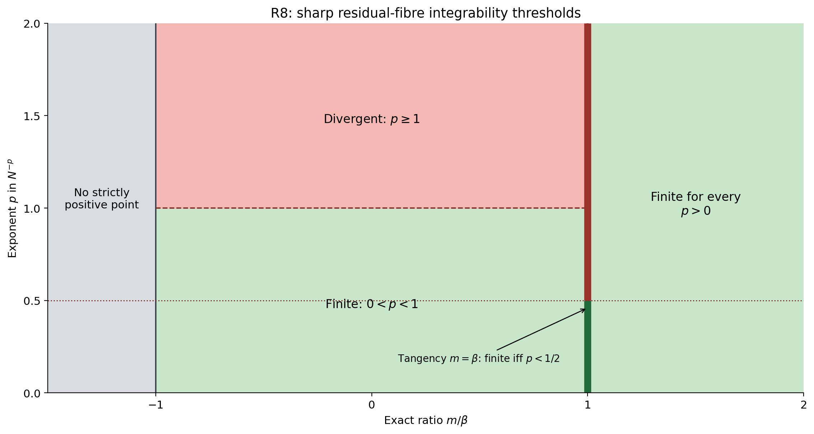

# Exact marking, measured fibres and Gaussian phase dynamics

This note supplies complete arguments for the comparisons used by the consolidation. It preserves the original quaternionic matrices, coordinates, cubic, Lebesgue measure, observation and constants. The phase dynamics introduced below is an added finite-dimensional model. Its construction does not identify the existing S6 gauge action with a decoherence model. No novelty claim is made.

The antecedent source is the retained Gaussian contribution, [Gaussian contribution](source/antecedents/quaternionic_gaussian_fibres_2026-09-04.tex), especially `eq:cubic`, `lem:spectral`, `thm:gaussian`, `thm:disintegration`, `thm:KLloss` and `thm:Fisherloss`. The residual-fibre antecedent is [residual-fibre antecedent](source/antecedents/residual_measure_2026-09-04.tex), especially `rm:marked-matrix`, `rm:moore-polynomial`, `eq:cubic0` and `eq:cubic1`. The source-inspired measured-fibre perspective retains the required citation: Nolan, Michael J. $2025$, [*Threads as Fiber Density, and Holographic Cosmology*](https://github.com/mikalnolan/Holographic-Spindle-Torus-Cosmology), GitHub. The actual derivations below are identified as this consolidation's arguments.

For the environment-overlap and semigroup comparison, original-author TeX was obtained and read at the bounded loci recorded in the reading ledger: Klaus Hornberger, [Introduction to Decoherence Theory, arXiv:quant-ph/0612118v3](https://arxiv.org/abs/quant-ph/0612118v3), `KHScoh` and the semigroup subsection; Dariusz Chruściński and Saverio Pascazio, [A Brief History of the GKLS Equation, arXiv:1710.05993v2](https://arxiv.org/abs/1710.05993v2), Section 2. The proofs here do not substitute those references for an evaluated integral or a channel calculation.

## 1. Original cubic and evaluated finite measure

Fix the quaternionic frame $1,\mathbf i,\mathbf j,\mathbf k$, with $\mathbf i\mathbf j=\mathbf k$, $\mathbf j\mathbf i=-\mathbf k$ and each imaginary unit having square $-1$. Write $q_j=x_{j0}+x_{j1}\mathbf i+x_{j2}\mathbf j+x_{j3}\mathbf k$, in this order. Let $J=\operatorname{Herm}_3(\mathbb H)$ and $\mathcal P=\{H\in J:q^*Hq>0\text{ for every }q\ne0\}$. The full original Moore cubic is

$$
N\!\begin{pmatrix}a&v&q_1\\\bar v&b&q_2\\\bar q_1&\bar q_2&\lambda\end{pmatrix}
=ab\lambda-\lambda|v|^2-b|q_1|^2-a|q_2|^2
+2\operatorname{Re}(\bar q_1vq_2).
$$

In this displayed polynomial, $q_1,q_2$ denote matrix entries; the latent column $q\in\mathbb H^3$ below is a different specified object. No cyclic product or summand is removed.

Let $\mathscr L(H)$ be the real matrix of left multiplication by $H$ on the twelve stated coordinates. For $h=a+b\mathbf i+c\mathbf j+d\mathbf k$, its four-by-four block is

$$
L(h)=\begin{pmatrix}
a&-b&-c&-d\\ b&a&-d&c\\ c&d&a&-b\\ d&-c&b&a
\end{pmatrix}.
$$

Multiplication of quaternions verifies $L(hk)=L(h)L(k)$ and $L(\bar h)=L(h)^T$. Thus $\mathscr L(H)$ is symmetric, $q^*Hq=x^T\mathscr L(H)x$, and $H>0$ exactly when $\mathscr L(H)>0$.

**Proposition R1.** For $H\in\mathcal P$, the measure and its mass are

$$
d\mu_H(q)=e^{-q^*Hq}\prod_{j=1}^3\prod_{r=0}^3 dx_{jr},\qquad
Z(H)=\frac{\pi^6}{N(H)^2},\qquad
dp_H=Z(H)^{-1}d\mu_H.
$$

The original real covariance is $\Sigma_H=\frac12\mathscr L(H)^{-1}$; the quaternionic moment is $\mathbb E_H[qq^*]=2H^{-1}$. In particular the full matrix is recovered by $H=2(\mathbb E_H[qq^*])^{-1}$. The pair $(Z(H),p_H)$ retains the complete finite measure.

**Proof.** First prove the spectral step rather than introducing it as a missing assumption. On the unit sphere in $\mathbb H^3\simeq\mathbb R^{12}$, the real continuous Rayleigh function $q^*Hq$ attains its maximum. Differentiating against every real variation gives $Hq=\lambda q$ at a maximizer, with real $\lambda$. Its quaternionic orthogonal complement is invariant, because $q^*Hz=(Hq)^*z=\lambda q^*z$. Induction on the quaternionic dimension gives an orthonormal quaternionic eigenbasis. For $H>0$, all three eigenvalues $\lambda_j$ are positive. The corresponding unitary matrix is a real orthogonal transformation on the twelve coordinates, so its absolute real Jacobian is one.

We also compare the eigenvalue product with the full polynomial. For the displayed matrix, $a>0$. Completing its first-coordinate square produces the lower two-by-two matrix

$$
\begin{pmatrix}
b-|v|^2/a&q_2-\bar vq_1/a\\
\bar q_2-\bar q_1v/a&\lambda-|q_1|^2/a
\end{pmatrix}.
$$

Its two-by-two Moore expression is $rs-|w|^2$. Multiplying it by $a$ gives, before cancellation,

$$
ab\lambda-b|q_1|^2-\lambda|v|^2
+|v|^2|q_1|^2/a
-a|q_2|^2+2\operatorname{Re}(\bar q_2\bar vq_1)
-|v|^2|q_1|^2/a.
$$

The two displayed reciprocal terms cancel exactly. Conjugation of the real part gives $\operatorname{Re}(\bar q_2\bar vq_1)=\operatorname{Re}(\bar q_1vq_2)$, yielding the original polynomial with its original sign and order.

The determinant assertion can be checked without invoking a quaternionic determinant theorem. For a positive two-by-two Hermitian block

$$
K=\begin{pmatrix}r&w\\ \bar w&s\end{pmatrix},
$$

the real block determinant and $L(\bar w)L(w)=|w|^2I_4$ give

$$
\det\mathscr L(K)
=r^4\det\!\left(sI_4-r^{-1}L(\bar w)L(w)\right)
=(rs-|w|^2)^4.
$$

The first-coordinate completion above is a real triangular congruence with determinant one. It carries $\mathscr L(H)$ to the direct sum of $aI_4$ and the realification of the displayed lower block. Consequently

$$
\det\mathscr L(H)
=a^4\bigl((b-|v|^2/a)(\lambda-|q_1|^2/a)
-|q_2-\bar vq_1/a|^2\bigr)^4
=N(H)^4.
$$

Positivity of $H$ makes both diagonal blocks after completion positive, so their Moore expressions and hence $N(H)$ are positive. Spectral diagonalization gives $\det\mathscr L(H)=\prod_j\lambda_j^4$. Positive fourth roots therefore give $N(H)=\lambda_1\lambda_2\lambda_3$.

The square of $\int_{\mathbb R}e^{-s^2}ds$ equals $2\pi\int_0^\infty re^{-r^2}dr=\pi$. Scaling gives $\int e^{-\lambda s^2}ds=\sqrt{\pi/\lambda}$. Each of the four real components in the $j$th quaternionic direction contributes that factor, giving $Z(H)=\prod_j\pi^2/\lambda_j^2=\pi^6/N(H)^2$. Integration by parts, with vanishing boundary term $se^{-\lambda s^2}$, gives each component variance $1/(2\lambda_j)$. Off-diagonal moments vanish by symmetry. Conjugating back gives both covariance formulas and their inverse. The relation $d\mu_H=Z(H)dp_H$ retains the mass rather than suppressing it. ∎

## 2. The two markings and their exact comparison

Retain

$$
P=\begin{pmatrix}1&-1&0\\0&1&-1\end{pmatrix},\quad
u=\begin{pmatrix}1\\1\\1\end{pmatrix},\quad
C=PP^*=\begin{pmatrix}2&-1\\-1&2\end{pmatrix},
$$

$$
C^{-1}=\frac13\begin{pmatrix}2&1\\1&2\end{pmatrix},\quad
R=P^*C^{-1}=\frac13\begin{pmatrix}2&1\\-1&1\\-1&-2\end{pmatrix},\quad
X=(R\ u),\quad D=X^*X=\operatorname{diag}(C^{-1},3).
$$

The Jordan marking in the comparison source is $\Psi=X^{-1}HX^{-*}$, with $X^{-*}=(X^*)^{-1}$. The sample precision in the Gaussian contribution is $B=X^*HX$. These are two coordinate expressions of the same original $H$, rather than the same expression with a relabelled symbol.

**Proposition R2.** The exact comparison, on all Hermitian matrices, is

$$
B=D\Psi D,\qquad \Psi=D^{-1}BD^{-1},\qquad
z=X^{-1}q=\binom yt,\qquad \xi=X^*q=Dz.
$$

Moreover $q^*Hq=z^*Bz=\xi^*\Psi\xi$. The real twelve-dimensional Jacobians of $q\leftrightarrow z$, $q\leftrightarrow\xi$ and $z\leftrightarrow\xi$ all have absolute value one. Each congruence preserves positivity and the original cubic. At the original scalar vacuum $H=vI$, $B=vD$ and $\Psi=vD^{-1}$; neither can be replaced by $vI$ in its marked coordinates.

**Proof.** Direct multiplication gives $PR=I_2$, $Pu=0$, $u^*R=0$, $u^*u=3$, hence $X^{-1}=(P;u^*/3)$. Expansion of the displayed three-by-three real determinant gives $\det X=1$, and $\det D=\det(C^{-1})\cdot3=(1/3)\cdot3=1$. Substituting $H=X\Psi X^*$ gives $B=X^*X\Psi X^*X=D\Psi D$. Since $q=Xz$, $\xi=X^*Xz=Dz$, and substitution gives both quadratic identities.

The real matrices $X$ and $D$ act on each of four quaternion components separately, giving real Jacobians $\det(X)^4=1$ and $\det(D)^4=1$. For positive $H$, changing variables in the evaluated Gaussian integral gives equal masses, hence equal positive cubics by R1. The cubic equalities extend to every Hermitian matrix: the differences are real polynomials in the fifteen entries, vanishing on the nonempty open positive cone. A polynomial vanishing on an open box is identically zero, by successively fixing all but one variable and using the fact that a nonzero one-variable polynomial has finitely many roots. Congruence positivity follows by evaluating on the corresponding invertible changes of column. Substitution of $H=vI$ gives the vacuum identities. ∎

Write the full sample precision and its Schur coordinates as

$$
B=\begin{pmatrix}A&b\\b^*&c\end{pmatrix},\qquad
c=u^*Hu>0,\quad \ell=c^{-1}b^*,\quad S=A-c\ell^*\ell.
$$

Here $S\in\operatorname{Herm}_2(\mathbb H)$ and $S>0$. It is the source's $S_H$, not the complex matrix $[z,w]$ in the metric-map source. Quaternionic products keep their displayed order. With $y=Pq$ and $t=u^*q/3$,

$$
q=Ry+ut,\qquad q^*Hq=y^*Sy+c|t+\ell y|^2,
$$

$$
B=\begin{pmatrix}S+c\ell^*\ell&c\ell^*\\c\ell&c\end{pmatrix},\qquad
H=X^{-*}BX^{-1},\qquad N(H)=cN_2(S).
$$

These formulas give mutually inverse global coordinates of dimensions $6+1+8=15$. Positivity follows in both directions from the completed square. The determinant identity follows either by the polynomial completion in R1 or by evaluating the two independent Gaussian integrals. Their full constants are

$$
P_*\mu_H(dy)=\frac{\pi^2}{c^2}e^{-y^*Sy}d^8y,\quad
p_S(y)=\frac{N_2(S)^2}{\pi^4}e^{-y^*Sy},\quad
k_H(t\mid y)=\frac{c^2}{\pi^2}e^{-c|t+\ell y|^2}.
$$

Multiplying the last two probability densities gives $N(H)^2\pi^{-6}e^{-q^*Hq}d^{12}q$, since the coordinate Jacobian is one. On the actual affine fibre $P^{-1}(y)$, $t\mapsto Ry+ut$ has real Gram matrix $3I_4$; its surface Jacobian is nine. Thus the conditional density against $d\mathcal H^4_y$ is $k_H(t\mid y)/9$. All factors are retained.

The parameter fibre of $H\mapsto S_H$ is the nine-dimensional set parameterized by $c>0,\ell\in\mathbb H^{1\times2}$. The affine sample fibre is four-dimensional. The data-processing equality family for relative entropy under $P$, through $H$, has the complementary description $H+P^*TP>0$, $T\in\operatorname{Herm}_2(\mathbb H)$, with fixed $c,\ell$ and varying $S$. To verify the last assertion without conflating these fibres, let $E=G-H$. The condition $Eu=0$ is equivalent to the last column and row of $X^*EX$ vanishing. It is therefore equivalent to $X^*EX=\operatorname{diag}(T,0)$, or $E=P^*TP$. In that case $T=S_G-S_H$. Conversely those formulas keep $c,\ell$ fixed. The original Gaussian log-density ratio splits into marginal and conditional ratios; direct integration gives the conditional loss

$$
2\left[\frac{c_G}{c_H}-1-\log\frac{c_G}{c_H}\right]
+2c_G(\ell_G-\ell_H)S_H^{-1}(\ell_G-\ell_H)^*.
$$

The scalar function $x-1-\log x$ is nonnegative, with equality only at $x=1$, by differentiation. The last term vanishes only when $\ell_G=\ell_H$. This proves the equality-family statement and its exact relation to the parameter coordinates.

## 3. Residual-fibre averaging retains an integrability defect

This section uses the residual source's different marked coordinates. Fix $\mathbb C=\mathbb R+\mathbb R\mathbf i\subset\mathbb H$, with $\mathbf ja=\bar a\mathbf j$ for complex $a$. Retain

$$
H=XMX^*,\quad M=\begin{pmatrix}K&q\\q^*&\lambda\end{pmatrix},\quad
K=G+\bar\rho\varepsilon\mathbf j,\quad q=z+w\mathbf j,
$$

$$
G=\begin{pmatrix}a&c_0\\\bar c_0&b\end{pmatrix},\quad
\varepsilon=\begin{pmatrix}0&1\\-1&0\end{pmatrix},\quad
S_{\rm col}=[z,w],\quad \delta=\det S_{\rm col},\quad r=|\delta|>0.
$$

The subscript on $S_{\rm col}$ distinguishes the source's complex column matrix from the preceding quaternionic Schur block; its entries and formula are unchanged. The symbol $c_0$ denotes this displayed off-diagonal complex entry and is unrelated to the preceding positive scalar $c=u^*Hu$. Put

$$
\Delta=\det G-|\rho|^2,\quad
m=\lambda\Delta-\operatorname{tr}(\operatorname{adj}G\,S_{\rm col}S_{\rm col}^*),\quad
\beta=2|\rho|r.
$$

Assume $a>0,\Delta>0,\rho\ne0$. Let $Q_8=\{\pm I,\pm i\sigma_1,\pm i\sigma_2,\pm i\sigma_3\}$, where

$$
\sigma_1=\begin{pmatrix}0&1\\1&0\end{pmatrix},\quad
\sigma_2=\begin{pmatrix}0&-i\\i&0\end{pmatrix},\quad
\sigma_3=\begin{pmatrix}1&0\\0&-1\end{pmatrix}.
$$

Take the four representatives $\mathcal R_0=\{I,i\sigma_1,i\sigma_2,i\sigma_3\}$. The actual residual action holds $G,\rho,\lambda$ fixed and sends $S_{\rm col}$ to $S_{\rm col}e^{i\theta}q_0$. Its Haar probability is

$$
\frac1{8\pi}\sum_{q_0\in\mathcal R_0}\int_0^{2\pi}(\cdot)\,d\theta.
$$

**Proposition R3.** Along these four circles,

$$
N(H_\theta)=m-\rho\delta e^{2i\theta}-\overline{\rho\delta}e^{-2i\theta}.
$$

There is a positive matrix on the orbit exactly when $m+\beta>0$. Every matrix on it is strictly positive exactly when $m>\beta$. Among the orbits with a nonempty positive part, the Gaussian mass $Z(H)=\pi^6/N(H)^2$, restricted to that part and averaged against its Haar probability conditional on positivity, has finite integral exactly when $m>\beta$. In that case the whole orbit is positive and

$$
\mathcal A Z=\frac{\pi^6 m}{(m^2-\beta^2)^{3/2}}
>\frac{\pi^6}{m^2}.
$$

When $-\beta<m\le\beta$, the positive part has nonzero Haar probability, but this conditional mass average is infinite.

**Proof.** Quaternionic multiplication in the stated frame is $(a+b\mathbf j)(c+d\mathbf j)=ac-b\bar d+(ad+b\bar c)\mathbf j$. Applying it to the cyclic term of the original cubic gives

$$
\operatorname{Re}(\bar q_1(c_0+\bar\rho\mathbf j)q_2)
=\operatorname{Re}\bigl(c_0(\bar z_1z_2+\bar w_1w_2)-\rho\delta\bigr).
$$

Also $|c_0+\bar\rho\mathbf j|^2=|c_0|^2+|\rho|^2$, and $|q_j|^2=|z_j|^2+|w_j|^2$. Substitution into every term of R1's polynomial yields

$$
N(H)=\lambda(\det G-|\rho|^2)
-\operatorname{tr}(\operatorname{adj}G\,S_{\rm col}S_{\rm col}^*)
-2\operatorname{Re}(\rho\delta).
$$

Every $q_0$ is unitary with determinant one. Thus the action fixes $S_{\rm col}S_{\rm col}^*$ and sends $\delta$ to $e^{2i\theta}\delta$, proving the first formula on every component.

The upper quaternionic block $K$ has first diagonal entry $a>0$ and two-by-two cubic $\Delta>0$, so the completed square makes $K>0$. Completing the last coordinate of $M$ gives positivity exactly when $\lambda-q^*K^{-1}q>0$, and the full cubic is $\Delta(\lambda-q^*K^{-1}q)$. Therefore $H_\theta>0$ exactly when $N(H_\theta)>0$. For $\rho\delta=|\rho\delta|e^{i\varphi}$, the variable $t=2\theta+\varphi$ modulo $2\pi$ is uniform. Its cubic is $m-\beta\cos t$, ranging over the closed interval $[m-\beta,m+\beta]$. This proves both positivity criteria and the positive-part nonzero probability assertion.

For $m>\beta$, evaluate first

$$
I(m,\beta)=\frac1{2\pi}\int_0^{2\pi}\frac{dt}{m-\beta\cos t}
=\frac1{\sqrt{m^2-\beta^2}}.
$$

To verify the integral, split the circle at $\pi$ and set $s=\tan(t/2)$; the result is $2\int_{-\infty}^{\infty}ds/[(m-\beta)+(m+\beta)s^2]$ before dividing by $2\pi$. Scaling that elementary integral gives the displayed value. Differentiation in $m$ is justified by the positive bound $m-\beta$ on a small parameter neighborhood. Hence

$$
\frac1{2\pi}\int_0^{2\pi}\frac{dt}{(m-\beta\cos t)^2}
=-\partial_m I=\frac{m}{(m^2-\beta^2)^{3/2}}.
$$

Multiplying by the retained $\pi^6$ proves the averaged mass. The strict inequality follows from $m>\beta>0$, since $m^3/(m^2-\beta^2)^{3/2}>1$.

For $-\beta<m<\beta$, $m-\beta\cos t$ has a zero with nonzero derivative. On its positive side, Taylor's formula bounds its positive value above by a fixed constant times the distance to that zero. The mass is therefore bounded below by a positive constant times that distance to the power $-2$, whose integral diverges. For $m=\beta$, $m-\beta\cos t=\beta(1-\cos t)\le\beta t^2/2$ near zero, giving a lower bound proportional to $t^{-4}$, again divergent. The conditional Haar probability divides by a strictly positive finite probability of the positive part; it cannot remove either divergence. ∎

The corresponding integrability-defect set is now specified exactly: retain these original coordinates and let $a>0,\Delta>0,r>0,\rho\ne0,-\beta<m\le\beta$. On it the positive-part fibre exists and its Gaussian-mass integral is infinite. Its inclusion into the original positive-image set preserves every displayed coordinate and the residual action. The complementary finite-mass locus has $m>\beta$, with the exact mass above. This constructs the spaces determined by the obstruction instead of treating the obstruction as a reason to discard the measured map.

An exact source example makes the distinction visible. Take $G=4I_2$, $S_{\rm col}=\operatorname{diag}(2,1)$, $\rho=1/2+i$. Then $a=4$, $r=2$, $\Delta=59/4$, $\operatorname{tr}(\operatorname{adj}G\,S_{\rm col}S_{\rm col}^*)=20$, and $\beta=2\sqrt5$. At the source value $\lambda=80/59$, $m=0$: half of each circle is positive, and its conditional mass integral diverges. At $\lambda=104/59$, $m=6>2\sqrt5$: the entire orbit is positive, $m^2-\beta^2=16$, and $\mathcal A Z=3\pi^6/32$. Replacing the cubic by its mean before evaluating the mass would give $\pi^6/36$, smaller by the exact ratio $27/8$. No matrix, scale or summand has been changed in either calculation.

## 4. A common Hilbert space, affinity and Fisher coefficient

Use the fixed space $\mathcal K=L^2(\mathbb R^{12},d^{12}x)$ and

$$
\psi_H(x)=\sqrt{p_H(x)}=\frac{N(H)}{\pi^3}
             e^{-x^T\mathscr L(H)x/2}.
$$

**Proposition R4.** The map $H\mapsto\psi_H$ is injective and has unit norm. For $H,G>0$, its exact affinity is

$$
\langle\psi_H,\psi_G\rangle
=\frac{N(H)N(G)}{N((H+G)/2)^2}.
$$

For Hermitian $K,L$, its derivative metric and local affinity are

$$
4\langle D\psi_H[K],D\psi_H[L]\rangle
=\mathcal I_H(K,L)=2\operatorname{Re}\operatorname{tr}(H^{-1}KH^{-1}L),
$$

$$
\langle\psi_H,\psi_{H+\epsilon K}\rangle
=1-\frac{\epsilon^2}{8}\mathcal I_H(K,K)+O(\epsilon^3).
$$

**Proof.** R1 gives unit norm and covariance recovery, hence injectivity. Multiplying the two square roots gives the finite integral at the unchanged matrix $(H+G)/2$, with prefactor $N(H)N(G)/\pi^6$. R1 evaluates that integral and proves the affinity.

To calculate derivatives, differentiate $\det\mathscr L(H)=N(H)^4$ on the positive cone. The real determinant derivative follows from $\det(I+\epsilon A)=1+\epsilon\operatorname{tr}A+O(\epsilon^2)$, directly from the permutation formula. Moreover $\operatorname{tr}_{\mathbb R}\mathscr L(A)=4\operatorname{Re}\operatorname{tr}A$. Therefore $D\log N_H[K]=\operatorname{Re}\operatorname{tr}(H^{-1}K)$ and $D^2\log N_H[K,L]=-\operatorname{Re}\operatorname{tr}(H^{-1}KH^{-1}L)$, using $D(H^{-1})[L]=-H^{-1}LH^{-1}$. The score is $s_{H,K}=2\operatorname{Re}\operatorname{tr}(H^{-1}K)-q^*Kq$, and $D\psi_H[K]=s_{H,K}\psi_H/2$.

In a neighborhood of $H>0$, all matrices have a uniform positive lower bound $cI$. Derivatives of the densities and square roots are polynomials in $x$ times Gaussians bounded by $e^{-c|x|^2/2}$, with every needed polynomial moment integrable by the one-variable integration-by-parts argument in R1. Thus the differentiations hold under the integral and in $L^2$. Twice differentiating $\log Z=\log\pi^6-2\log N$ shows that the covariance of $q^*Kq,q^*Lq$ is $2\operatorname{Re}\operatorname{tr}(H^{-1}KH^{-1}L)$. This proves the derivative metric. Finally expand the logarithm of the evaluated affinity: its linear coefficient is zero, and its quadratic coefficient is $D^2\log N_H[K,K]/4=-\mathcal I_H(K,K)/8$. Exponentiation proves the stated expansion and remainder. ∎

This uses one common reference measure for every parameter. Parameter-dependent whitening remains an exact change of variables from R1; it is not a replacement for this common-space derivative.

## 5. Phase channel and full observed/conditional factorization

Choose a finite integer $d\ge2$, a specified orthonormal pointer basis $e_1,\ldots,e_d$ of $\mathbb C^d$, real energies $E_a$, a retained $\hbar>0$, and known coefficient vectors $b_a\in\mathbb R^{12}$. Write $\omega_a=E_a/\hbar$. These are added system/interaction data. For time $\tau\in\mathbb R$, define

$$
U_\tau(x)=\sum_a e^{-i\tau(\omega_a+b_a^Tx)}|e_a\rangle\langle e_a|,
\qquad \mathcal E^H_\tau(\rho)=\int U_\tau(x)\rho U_\tau(x)^*dp_H(x).
$$

**Proposition R5.** This is a completely positive, trace-preserving channel. If $b_{ab}=b_a-b_b$, its exact coherence multiplier is

$$
C^H_{ab}(\tau)=e^{-i\tau(\omega_a-\omega_b)}
\exp\!\left[-\frac{\tau^2}{4}b_{ab}^T\mathscr L(H)^{-1}b_{ab}\right].
$$

Let $R_{\mathbb R},u_{\mathbb R},\ell_{\mathbb R}$ denote the real maps of the original $R,u,\ell$, of sizes $12\times8,12\times4,4\times8$. Then this same multiplier, with no discarded conditional part, is

$$
C^H_{ab}(\tau)=e^{-i\tau(\omega_a-\omega_b)}
\exp\!\left[-\frac{\tau^2}{4}
\left(\alpha_{ab}^T\mathscr L(S)^{-1}\alpha_{ab}
+\frac{|\gamma_{ab}|^2}{c}\right)\right],
$$

$$
\alpha_{ab}=(R_{\mathbb R}-u_{\mathbb R}\ell_{\mathbb R})^Tb_{ab},
\qquad \gamma_{ab}=u_{\mathbb R}^Tb_{ab}.
$$

For coefficients $b_a=P_{\mathbb R}^Ta_a$, with $a_a\in\mathbb R^8$, the conditional term vanishes, $\alpha_{ab}=a_a-a_b$, and the channel depends only on the original observed precision $S_H$.

**Proof.** Linearity and trace preservation follow by integrating unitary conjugations against a probability with evaluated total mass one. For every ancilla dimension $n$ and positive $T\in\mathbb M_d\otimes\mathbb M_n$, the matrices $(U_\tau(x)\otimes I_n)T(U_\tau(x)^*\otimes I_n)$ are positive; their integral is positive by evaluation against every vector. This proves complete positivity.

The characteristic function of a one-variable Gaussian is evaluated without a contour shift. For $f(t)=\int e^{-\lambda s^2}e^{-its}ds$, differentiation and integration by parts give $f'(t)=-tf(t)/(2\lambda)$, with $f(0)=\sqrt{\pi/\lambda}$, hence $f(t)=f(0)e^{-t^2/(4\lambda)}$. The boundary term vanishes because of the Gaussian. Orthogonal real diagonalization of $\mathscr L(H)$, or the eigenbasis from R1 followed by a real orthogonal rotation, gives the stated twelve-variable multiplier. Its phase and real damping factors are both retained.

There is also an explicit environment dilation in the common space of R4. The controlled unitary on $\mathbb C^d\otimes\mathcal K$ multiplies its $a$th component by $e^{-i\tau(\omega_a+b_a^Tx)}$. Its inverse multiplies by the complex conjugate, so it is unitary. Start the environment in $|\psi_H\rangle\langle\psi_H|$. Partial trace gives the multiplier $e^{-i\tau(\omega_a-\omega_b)}\langle e^{-i\tau b_b^Tx}\psi_H,e^{-i\tau b_a^Tx}\psi_H\rangle$, exactly the evaluated characteristic function. The map $e_a\mapsto e^{-i\tau\omega_a}e_a\otimes(e^{-i\tau b_a^Tx}\psi_H)$ is an isometry; it proves the environment-overlap representation directly.

For the conditional formula, put $w=t+\ell y$ in R2. Under $p_H$, $y$ and $w$ are independent with the fully evaluated densities $p_S(y)$ and $c^2\pi^{-2}e^{-c|w|^2}$. The original column is $q=(R-u\ell)y+uw$. Thus its real linear phase splits into $\alpha_{ab}^Ty_{\mathbb R}+\gamma_{ab}^Tw_{\mathbb R}$. Evaluating the independent eight- and four-variable integrals gives the displayed formula. Equivalently it proves the exact covariance identity

$$
\mathscr L(H)^{-1}=(R_{\mathbb R}-u_{\mathbb R}\ell_{\mathbb R})
\mathscr L(S)^{-1}(R_{\mathbb R}-u_{\mathbb R}\ell_{\mathbb R})^T
+c^{-1}u_{\mathbb R}u_{\mathbb R}^T.
$$

Finally $P_{\mathbb R}u_{\mathbb R}=0$ and $P_{\mathbb R}R_{\mathbb R}=I_8$, which give $\gamma_{ab}=0$ and the observed coefficient. ∎

## 6. Static time law, correctly clocked semigroup and noiseless blocks

**Proposition R6.** The static family $\mathcal E^H_\tau$, restricted to $\tau\ge0$, is a time-homogeneous semigroup exactly when all $b_a$ coincide. Nevertheless it is CP-divisible: for $\tau\ge s\ge0$, its propagator is the same Gaussian phase channel with damping clock $\sqrt{\tau^2-s^2}$ and deterministic phase clock $\tau-s$. Its time-dependent generator is

$$
\mathcal L^{\rm static}_\tau(\rho)
=-\frac{i}{\hbar}[\operatorname{diag}(E_a),\rho]
-\tau\sum_{r=1}^{12}[L^{(0)}_r,[L^{(0)}_r,\rho]],
\qquad
L^{(0)}_r=\operatorname{diag}\bigl((b_a^T\Sigma_H^{1/2})_r\bigr).
$$

For a separate construction, fix $\tau_c>0$. For every $\tau\ge0$, let $Y_\tau$ have the centered Gaussian law $\nu^H_\tau$ on $\mathbb R^{12}$ with covariance $\tau_c\tau\Sigma_H$; at $\tau=0$, let $\nu^H_0$ be the point mass at zero. Define

$$
V_\tau(y)=\sum_a e^{-i\tau\omega_a-i b_a^Ty}|e_a\rangle\langle e_a|,
\qquad
\mathcal F^H_\tau(\rho)=\int V_\tau(y)\rho V_\tau(y)^*\,d\nu^H_\tau(y).
$$

Then $\mathcal F^H_{\tau+s}=\mathcal F^H_\tau\mathcal F^H_s$, and its exact multiplier is

$$
F^H_{ab}(\tau)=e^{-i\tau(\omega_a-\omega_b)}
e^{-\tau_c\tau\,b_{ab}^T\mathscr L(H)^{-1}b_{ab}/4}.
$$

Its full GKLS generator is

$$
\mathcal L^{\rm Brownian}(\rho)
=-\frac{i}{\hbar}[\operatorname{diag}(E_a),\rho]
-\frac12\sum_{r=1}^{12}[L_r,[L_r,\rho]],
\qquad L_r=\sqrt{\tau_c}L^{(0)}_r.
$$

The maximal coordinate blocks with no stochastic decoherence are exactly the equivalence classes $b_a=b_b$. Such a block still retains its deterministic energy evolution; it is fixed pointwise for all times only when the energies also coincide within the block.

**Proof.** Write $d_{ab}=b_{ab}^T\mathscr L(H)^{-1}b_{ab}\ge0$. The ratio of the multiplier at $\tau+s$ to the product of the multipliers at $\tau$ and $s$ is $e^{-\tau s d_{ab}/2}$. The semigroup identity on all matrix units therefore forces $d_{ab}=0$ for every pair. Positive definiteness forces $b_a=b_b$. Conversely, common coefficients contribute only a scalar random phase that cancels from conjugation, leaving the deterministic unitary group.

For divisibility the ratio at $\tau$ and $s$ is $e^{-i(\tau-s)\Delta\omega}e^{-(\tau^2-s^2)d_{ab}/4}$. R5 proves that this is a channel: use a centered Gaussian with the original covariance, the nonnegative coupling time $\sqrt{\tau^2-s^2}$, and the separate deterministic phase time $\tau-s$. Its composition with $\mathcal E_s$ gives $\mathcal E_\tau$ on every matrix unit. Differentiating R5 gives damping $-\tau d_{ab}/2$. Since $\sum_r(L^{(0)}_{r,aa}-L^{(0)}_{r,bb})^2=b_{ab}^T\Sigma_Hb_{ab}=d_{ab}/2$, the stated time-dependent double-commutator generator follows. Thus failure of the homogeneous semigroup law does not by itself establish failure of CP-divisibility.

For the second family, the characteristic function of $Y_\tau$ is $e^{-\tau_c\tau b^T\Sigma_Hb/2}$. If $Y_\tau$ and $Y'_s$ are independent, then $Y_\tau+Y'_s$ has covariance $\tau_c(\tau+s)\Sigma_H$; evaluation of the characteristic function therefore proves $\nu^H_\tau*\nu^H_s=\nu^H_{\tau+s}$. The deterministic phases also add, so multiplication on every matrix unit proves the channel semigroup identity. The integrated phase variable $Y_\tau$ is a new random variable and is not the static variable $\tau x$. Differentiating its exact multiplier gives the generator. Expanding $-[L,[L,\rho]]/2$ gives $L\rho L-(L^2\rho+\rho L^2)/2$, the complete dissipative term, with no discarded factor.

For either model, an off-diagonal multiplier has magnitude one at a nonzero time exactly when $d_{ab}=0$, equivalently $b_a=b_b$. Requiring this for every pair in a coordinate block proves the maximal-block classification. The remaining phase is $e^{-i\tau(E_a-E_b)/\hbar}$, giving the energy condition for pointwise fixed states. ∎

For units, let $[x]=Q$, $[H]=Q^{-2}$, $[b_a]=T^{-1}Q^{-1}$, $[E_a]/[\hbar]=T^{-1}$, and $[\tau_c]=T$. Then $[\Sigma_H]=Q^2$, $[Y_\tau]=TQ$, and $[\operatorname{Cov}(Y_\tau)]=T^2Q^2$. Also $Z(H)$ has units $Q^{12}$, the static exponent $\tau^2b^T\mathscr L(H)^{-1}b/4$ has no units, and the Brownian exponent $\tau_c\tau b^T\mathscr L(H)^{-1}b/4$ has no units. The Lindblad coefficients $L_r$ have units $T^{-1/2}$. These assignments retain the integrated phase variable and the clock parameter.

## 7. What process tomography recovers, and what observation loses

Write $\operatorname{vec}_{\mathbb R}$ for the real coordinate map using the ordered quaternionic frame $(1,\mathbf i,\mathbf j,\mathbf k)$ in each component. In $\mathbb H^3$, take

$$
\begin{aligned}
v_0&=(0,0,0),&v_1&=(1,0,0),&v_2&=(0,1,0),\\
v_3&=(0,0,1),&v_4&=(0,\mathbf i+\mathbf k,1+\mathbf i),
&v_5&=(1+\mathbf j,-\mathbf i,\mathbf j).
\end{aligned}
$$

In $\mathbb H^2$, take

$$
w_0=(0,0),\qquad w_1=(1,0),\qquad w_2=(0,1),
\qquad w_3=(-\mathbf i,-\mathbf j).
$$

**Proposition R7.** One six-level static channel with couplings $b_a=\operatorname{vec}_{\mathbb R}(v_a)$, observed through all fifteen pair-coherence magnitudes at one specified $\tau\ne0$, determines the full original $H$. This uses the minimum possible number of scalar quadratic-form magnitudes and the minimum possible number of levels for such a pair-coherence design. The energy values need not be known.

For observation-only couplings $b_a=P_{\mathbb R}^T\operatorname{vec}_{\mathbb R}(w_a)$, one four-level channel and its six pair-coherence magnitudes determine $S_H$; these counts are again minimal within this measurement class. All $H$ in the nine-dimensional parameter fibre over that $S_H$ give the same observed channel. This loss is exact and does not contradict covariance injectivity for the full law.

**Proof.** Put $A=H^{-1}\in\operatorname{Herm}_3(\mathbb H)$. For $q\in\mathbb H^3$, R1 and R5 give

$$
-\frac{2}{\tau^2}\log|C_{ab}^H(\tau)|
=(b_a-b_b)^T\Sigma_H(b_a-b_b)
=\frac12(v_a-v_b)^*A(v_a-v_b).
$$

The deterministic energy phase has disappeared after taking the magnitude. Order the fifteen real coordinates of $A$ as its three real diagonal entries followed by the four components of $A_{12},A_{13},A_{23}$. Order the pairs $(a,b)$ lexicographically. Expansion of the original quaternion products gives $2y=M_3\theta_3(A)$, where $y$ is the vector of the fifteen displayed magnitude data. The exact integer matrix $M_3$, every expansion row, and its fraction-free reduction are recorded in [the tomography design appendix](TOMOGRAPHY_DESIGN.md). Its determinant is

$$
\det M_3=-4096=-2^{12}.
$$

Thus $A=M_3^{-1}(2y)$ is determined, and then $H=A^{-1}$ is determined without replacing either object by an unrestricted real covariance.

For the observed channel, put $B=S_H^{-1}\in\operatorname{Herm}_2(\mathbb H)$. R5 gives the same formula with $w_a-w_b$ and $B$. In the order consisting of two diagonal entries followed by the four components of $B_{12}$, the six data obey $2y_{
m obs}=M_2\theta_2(B)$. The appendix gives the complete matrix and

$$
\det M_2=-16=-2^4.
$$

Hence the four-level channel determines $B$, and therefore $S_H$.

Minimality follows on the correct parameter spaces. The real vector spaces $\operatorname{Herm}_3(\mathbb H)$ and $\operatorname{Herm}_2(\mathbb H)$ have dimensions fifteen and six. Each magnitude datum is one real linear functional of $A$ or $B$. If fewer such functionals were used, their joint linear map would have a nonzero Hermitian kernel element $K$. For any positive-definite $A_0$, both $A_0+\epsilon K$ and $A_0-\epsilon K$ remain positive for all sufficiently small positive $\epsilon$, while producing identical data. Thus at least fifteen and six scalar magnitudes are required. Since a $d$-level channel has $d(d-1)/2$ unordered pair coherences, at least six and four levels are required respectively, and the displayed designs attain both bounds.

The coordinates in R2 show that arbitrary $c>0,\ell\in\mathbb H^{1\times2}$ keep $S$ fixed while varying $H$. Conversely the four-level observed design determines $S$, so its ambiguity is exactly that parameter fibre.

A complete original-coordinate witness is

$$
H_r=P^*C^{-1}P+\frac r3uu^*=I+\frac{r-1}{3}uu^*,\qquad r>0.
$$

Here $P^*C^{-1}P$ is the orthogonal projection onto $u^\perp$: it is Hermitian, its square equals itself by $PP^*=C$, it annihilates $u$, and it is the identity on the range of $P^*$. Therefore $H_r$ has two eigenvalues one and the eigenvalue $r$ on $u$, so it is positive. Multiplication gives $X^*H_rX=\operatorname{diag}(C^{-1},3r)$. Hence $S=C^{-1},c=3r,\ell=0$ for every $r$, while $N(H_r)=r$ and $Z(H_r)=\pi^6/r^2$. All observed channels agree although both the full matrix and its mass change.

Their affinity is $\langle\psi_{H_r},\psi_{H_s}\rangle=4rs/(r+s)^2$, by R4, and their full relative entropy is $2[s/r-1-\log(s/r)]$, by integrating the single conditional quaternion density. Both distinguish different positive $r,s$. A hidden coefficient $b=u_{\mathbb R}e_1$ instead gives $b^T\mathscr L(H_r)^{-1}b=3/r$ and damping $e^{-3\tau^2/(4r)}$. Thus the missing parameter is restored by a specified additional observation, with the full connecting map and constants. ∎

## 8. All residual negative-power moments and their sharp thresholds

Retain the original residual cubic from R3 and write $f_{m,\beta}(t)=m-\beta\cos t$, with $\beta=2|\rho||\delta|>0$. For $p>0$, define the unnormalized positive-part moment and its positive Haar proportion by

$$
J_p(m,\beta)=\frac1{2\pi}\int_{\{t:f_{m,\beta}(t)>0\}}
f_{m,\beta}(t)^{-p}\,dt,
\qquad
h(m,\beta)=\frac1{2\pi}\bigl|\{t:f_{m,\beta}(t)>0\}\bigr|.
$$

The conditional moment is $J_p/h$ whenever $h>0$.

**Proposition R8.** The exact positive proportion is

$$
h(m,\beta)=
\begin{cases}
0,&m\le-\beta,\\
1-\pi^{-1}\arccos(m/\beta),&-\beta<m<\beta,\\
1,&m\ge\beta.
\end{cases}
$$

For $m\le-\beta$, the positive set is empty and the unnormalized moment is $J_p(m,\beta)=0$; its conditional version is undefined because $h=0$. For $-\beta<m<\beta$, the moment $J_p$ is finite exactly when $0<p<1$. At the tangential boundary $m=\beta$, it is finite exactly when $0<p<\tfrac12$. For $m>\beta$, it is finite for every $p>0$, and its full exact value is

$$
J_p(m,\beta)=m^{-p}
{}_2F_1\!\left(\frac p2,\frac{p+1}{2};1;\frac{\beta^2}{m^2}\right),
$$

where

$$
{}_2F_1(a,b;1;z)=\sum_{k=0}^{\infty}
\frac{(a)_k(b)_k}{(k!)^2}z^k.
$$

For every integer $p\ge1$, the same value has the derivative form

$$
J_p(m,\beta)=
\frac{(-1)^{p-1}}{(p-1)!}
\frac{\partial^{p-1}}{\partial m^{p-1}}
(m^2-\beta^2)^{-1/2}.
$$

In particular, $p=2$ recovers the full R3 mass factor $m(m^2-\beta^2)^{-3/2}$, before multiplication by the retained $\pi^6$.

**Proof.** The inequality $m-\beta\cos t>0$ is equivalent to $\cos t<m/\beta$. Measuring that subset of one circle gives the displayed formula for $h$, including the empty set for $m\le-\beta$ and the complement of one point for $m=\beta$. Integration over the empty set gives $J_p=0$ when $m\le-\beta$, while division by $h=0$ is not defined.

If $-\beta<m<\beta$, each boundary point $t_0$ satisfies $\cos t_0=m/\beta$ and

$$
|f'_{m,\beta}(t_0)|^2
=\beta^2\sin^2t_0=\beta^2-m^2>0.
$$

On the positive side of each zero, the mean-value theorem and continuity of the derivative give constants $c,C,\epsilon>0$ for which $c|t-t_0|\le f_{m,\beta}(t)\le C|t-t_0|$ whenever $0<|t-t_0|<\epsilon$. The local integral is therefore finite exactly when $\int_0^\epsilon s^{-p}ds$ is finite, namely when $p<1$.

At $m=\beta$,

$$
f_{\beta,\beta}(t)=\beta(1-\cos t),
\qquad
\lim_{t\to0}\frac{f_{\beta,\beta}(t)}{t^2}=\frac\beta2.
$$

Thus the local integral is comparable on both sides to $\int_0^\epsilon s^{-2p}ds$, which is finite exactly when $p<1/2$. Away from these zeros the continuous positive integrand is bounded, so the local tests are also sufficient. Dividing by the positive finite value of $h$ does not change any threshold.

If $m>\beta$, the denominator is at least $m-\beta>0$. Put $z=\beta/m$, so $|z|<1$. The binomial series for $(1-z\cos t)^{-p}$ converges uniformly on the circle. Its odd powers integrate to zero, while

$$
\frac1{2\pi}\int_0^{2\pi}\cos^{2k}t\,dt
=\frac{(2k)!}{4^k(k!)^2},
\qquad
(p)_{2k}=4^k\left(\frac p2\right)_k
\left(\frac{p+1}{2}\right)_k.
$$

Termwise integration gives the stated hypergeometric series with every original $m$ and $\beta$ retained. For integer $p$, differentiate the evaluated R3 identity $J_1=(m^2-\beta^2)^{-1/2}$ exactly $p-1$ times. The uniform lower bound on a neighborhood of the chosen $m>\beta$ justifies differentiation under the integral, and

$$
\partial_m^{p-1}(m-\beta\cos t)^{-1}
=(-1)^{p-1}(p-1)!(m-\beta\cos t)^{-p}.
$$

This proves the derivative formula and completes every case. ∎

## 9. Receiving scope and remaining mathematics

R2 supplies the exact comparison of marking conventions used by the quaternionic and Gaussian lanes. R3 combines two retained constructions and proves the mass-integrability classification without withdrawing the source's correct nonempty-positive-image criterion. R4–R7 complete the common-Hilbert-space, affinity, phase-channel, dilation, observed/conditional, clock, noiseless-block and level-minimal identifiability calculations in the Gaussian source's unfinished decoherence worklog. R6 preserves the distinction between CP-divisibility and the homogeneous semigroup property. R8 continues from R3's obstruction and determines every positive exponent's sharp boundary threshold, together with exact no-crossing moments.

The matrices, observation and probabilistic laws determine the proved channel after the specified extra system data have been chosen. They do not choose a pointer basis, system energies, coupling vectors or correlation clock by themselves. The given controlled unitary is an exact system/environment model for that choice; it is not a construction of bosonic canonical commutation relations, environmental fragments with redundant records, or a decoherent-histories functional. No statement about those additional structures is inferred here. Nor does this note certify the complex global S6 atlas, sphere recognition, an interacting quantum Yang–Mills gap, or an original-zeta reconstruction of every historical heat calculation. The catalogue and continuing source queue retain those exact source materials without manufacturing their missing conclusions.
