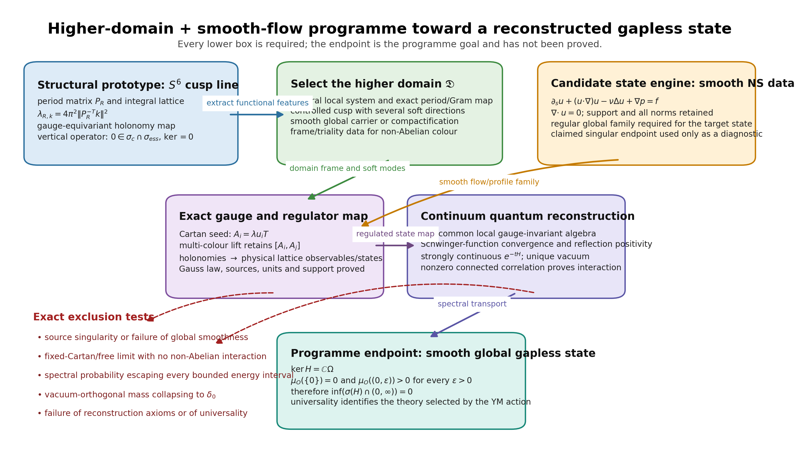
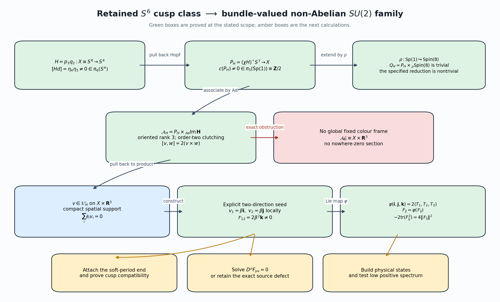
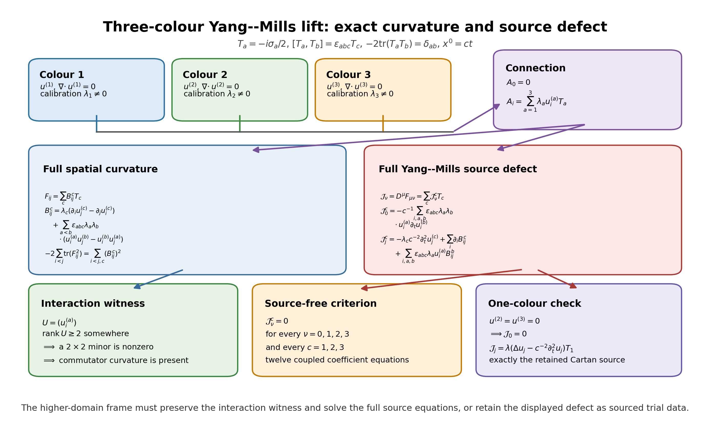

# A higher-domain and smooth-flow program for a global no-gap Yang--Mills state

## Research program extracted from the \(S^6\), Navier--Stokes, higher-rung, and Yang--Mills records

**Status, 2026-09-29.**  This document formulates the research direction in
the form intended by the user:

\[
 \boxed{
 \text{(S^6)-type structural prototype}
 \longrightarrow
 \text{right higher domain}
 \longrightarrow
 \text{exact gauge/state map}
 \longrightarrow
 \text{smooth global continuum}
 \longrightarrow
 \text{no positive gap}.}
\]

Navier--Stokes data enter as a possible mechanism for constructing the
smooth state family.  The domain need not be \(S^6\), need not be a sphere,
and need not be complex.  It must perform the same mathematical jobs that
make the \(S^6\) cusp line useful: carry an integral lattice or local system,
produce controlled soft spectral directions, admit an exact gauge map, and
extend to a globally defined geometric object.

This is a well-posed counterexample-search program.  No present source proves
a completed counterexample.  The program below records the exact intermediate
objects, the already proved maps, the required new maps, and the tests that
separate a genuine quantum no-gap result from a classical or finite-regulator
analogy.

**Programme goal.**  Construct a globally smooth, interacting state within
the stated four-dimensional Yang--Mills axioms, prove that its reconstructed
Hamiltonian has no positive mass gap, and derive the resulting contradiction
of the stated mass-gap claim.  An intermediate gapless model that has not yet
been identified with that Yang--Mills theory is unfinished work, not an
alternative conclusion of this programme.

**Audit correction, 2026-09-30.**  The 29 September text correctly proved
the retained \(\operatorname{Sp}(1)\) reduction and a local interaction
seed, but overstated that seed as a completed map from the rank-\(24\)
triality bundle.  The corrected global map is the quadratic morphism \(\mathcal M_H\)
proved in Section 3.4 and in
`PROOF.md`.  Its top-rank core is interacting
and has exact nonzero Yang--Mills source.  The source-free correction,
soft-period extension, physical state map, reconstruction, and contradiction
remain programme tasks.

*Figure 1.  The structural \(S^6\) input, the higher-domain search, and the
smooth-flow state engine meet in an exact gauge and regulator map.  The
spectral conclusion is reached only after continuum reconstruction,
interaction, unique-vacuum, and universality proofs.  The source is
`figures/s6_ns_no_gap_program_figure.py`.*

## 1. The research thesis

The thesis is not that the \(S^6\) construction itself is a Yang--Mills
counterexample.  It is that the \(S^6\) line reveals a reusable mechanism:

1. a family of integral period lattices has a controlled degeneration;
2. the dual lattice develops positive eigenvalues that approach zero;
3. a gauge-equivariant holonomy map transports the geometric data into
   lattice gauge variables;
4. retaining the degeneration parameter as part of one operator produces
   continuous spectrum at zero without a zero eigenvector;
5. a higher domain with more interacting directions may transport this
   mechanism into a non-Abelian, globally smooth state rather than the
   present scalar or free comparison sector;
6. Navier--Stokes or a related smooth-flow system may generate the required
   spatial profiles and concentration scales;
7. if the resulting quantum continuum satisfies the reconstruction axioms,
   is interacting, has a unique vacuum, and has spectral support reaching
   zero, then its Hamiltonian has no positive mass gap.

The mathematical problem is to construct and prove every arrow.  The
existing sources already prove substantial parts of arrows 1--4 and an exact
but restricted version of arrow 6.

## 2. What the \(S^6\) prototype actually supplies

The exact cusp-to-gauge source works with a radial cusp parameter (R>R_0),
the regular-fibre real period matrix

\[
 P_R=
 \begin{pmatrix}
  6a_R&u_R&1&0\\
  6m_R&T_R&0&0\\
  c_R^{\mathrm{re}}&a_R&0&1\\
  p_R&m_R&0&0
 \end{pmatrix},
\]

and the positive determinant quantity

\[
 \delta_R=6m_R^2-p_RT_R
 =R^2+(2h_0-d_0)R+
   (h_0^2-d_0h_0+6m_0^2)+O(Re^{-2\pi R}).
\]

It proves all of the following maps and formulas.

### 2.1 Marked fibres and holonomy

The marked fibre is

\[
 F_R=\mathbb R^4/P_R\mathbb Z^4,
 \qquad G_R=P_R^{\mathsf T}P_R,
 \qquad \operatorname{Vol}(F_R,G_R)=\delta_R.
\]

For every division order \(N\ge2\), the source gives the exact bijection

\[
 (\mathbb Z/N\mathbb Z)^4\longrightarrow F_R[N],
 \qquad [n]\longmapsto[P_Rn/N],
\]

and the gauge-equivariant holonomy law

\[
 \operatorname{Hol}_{R,N}(A^g)_j(n)=
 g(n)^{-1}\operatorname{Hol}_{R,N}(A)_j(n)g(n+e_j).
\]

This is the first feature that the higher domain must retain: an exact map
into finite gauge variables, including the gauge action at both endpoints.

### 2.2 Soft dual spectrum

The dual lattice is identified by

\[
 k\longmapsto P_R^{-\mathsf T}k.
\]

For the two soft coordinates,

\[
 P_R^{-\mathsf T}(r,s,0,0)=
 \left(0,\frac{m_Rr-p_Rs}{\delta_R},0,
          \frac{-T_Rr+6m_Rs}{\delta_R}\right).
\]

The scalar eigenvalues are

\[
 \lambda_{R,k}=4\pi^2\|P_R^{-\mathsf T}k\|^2,
\]

and the first positive one satisfies

\[
 \lambda_1(F_R,G_R)=\frac{4\pi^2}{R^2}
 \left[1+
 \frac{\min\{2(d_0-h_0),-2h_0\}}{R}+O(R^{-2})\right].
\]

The low-energy mode count at fixed \(0<E<4\pi^2\) is

\[
 N_R(E)=\frac{E}{4\pi}\delta_R+O_E(R).
\]

Thus the prototype has both a closing first eigenvalue and a growing number
of low-energy modes.

### 2.3 Exact continuous threshold

The source retains (R) as a noncompact measure variable and defines

\[
 \mathscr H_{\mathrm v}=
 L^2([R_0,\infty),dR;L^2_0(\mathbb R^4/\mathbb Z^4)),
\]

with

\[
 (H_{\mathrm v}f)_k(R)=\lambda_{R,k}f_k(R).
\]

It proves

\[
 0\in\operatorname{Spec}_{\mathrm c}(H_{\mathrm v})
    \cap\operatorname{Spec}_{\mathrm{ess}}(H_{\mathrm v}),
 \qquad \ker H_{\mathrm v}=\{0\}.
\]

The proof uses the exact orthonormal Weyl sequence

\[
 \Psi_j(R,y)=\mathbf1_{[j,j+1]}(R)e_{(1,0,0,0)}(y),
 \qquad \|H_{\mathrm v}\Psi_j\|=O(j^{-2}).
\]

This is already an exact no-gap theorem for the explicitly defined
vertical decomposable operator.  It is not yet a theorem about the
four-dimensional Yang--Mills Hamiltonian.  In particular, the source states
that \(H_{\mathrm v}\) contains no derivative in \(R\) and imposes no
boundary condition at the completed cusp.

### 2.4 Finite gauge Hessian and Gaussian quantization

The same source constructs the flat Yang--Mills Hessian after the exact gauge
quotient, its metric cubical discretization, and the Gaussian Hamiltonian

\[
 \widehat H^{\mathrm{quad}}_{R,N}=
 -\frac{g_{\mathrm{YM}}^2}{2}\Delta_{\mathscr C_{R,N}}
 +\frac1{2g_{\mathrm{YM}}^2}
  \langle a,L_{R,N}a\rangle_{1,R,N}.
\]

Its finite gap is

\[
 \operatorname{gap}(\widehat H^{\mathrm{quad}}_{R,N})
 =\sqrt{\lambda_{1,R,N}^{\mathrm{coch}}}
 =\frac{s_N}{R}
 \left[1+\frac{\min\{d_0-h_0,-h_0\}}{R}+O(R^{-2})\right],
\]

where \(s_N=2N\sin(\pi/N)\) and \(4\le s_N<2\pi\).  Every finite
quadratic regulator is gapped and the gaps close as \(R\to\infty\).

This establishes the structural prototype sought by the user.

## 3. Why the higher domain should be functionally similar rather than identical

The higher-rung source proves that a literal complex-sphere continuation is
the wrong requirement.  A smooth homotopy sphere of dimension greater than
six admits no almost-complex structure under the stated theorem, and the
direct rank-three toroidal attempt has an Euler mismatch.  These obstructions
do not end the program.  They define the correct search space: higher domains
with the required lattice, cusp, smooth carrier, and interaction maps, without
requiring another complex sphere.

The same source constructs a strong alternative carrier:

\[
 \operatorname{Fl}(\mathbb O)=F_4/\operatorname{Spin}(8),
 \qquad
 T\operatorname{Fl}(\mathbb O)\cong
 V_8\oplus S_8^+\oplus S_8^-.
\]

It is a smooth (24)-dimensional object with three exact rank-eight
triality sectors.  The source also constructs:

- the Albert algebra \(\mathfrak h_3(\mathbb O)\) and its determinant;
- a spectral graph identifying \(\mathbb O^3\) with the equal-diagonal
  positive determinant boundary;
- an explicit degree-\(+1\) collapse
  \(F_4/\operatorname{Spin}(8)\to S^{24}\);
- exact marked Niemeier/Leech lattice intersections and a triality cubic;
- ordered eigenvalues, spectral projectors, and inverse maps on the regular
  orbit family.

It also states the present limit exactly: no interacting quantum Hamiltonian
has been specified on this carrier.  The (24)-dimensional object is therefore
a candidate **global and three-directional carrier**, not yet the required
soft-period gauge domain.

### 3.1 The full triality stabilizer cannot become three ordinary frames

There is an additional exact obstruction before a domain-to-flow map can be
claimed.

**Proposition 3.1 (full-stabilizer low-dimensional target obstruction).**
Let \(G\) be a finite-dimensional Lie group with \(\dim G<28\).  Every
continuous group homomorphism

\[
 \rho:\operatorname{Spin}(8)\longrightarrow G
\]

is trivial.  In particular this holds for \(G=SO(3)^3\) and for
\(G=SO(3)_{\mathrm{space}}\times SO(3)_{\mathrm{colour}}\).

**Proof.**  A continuous homomorphism between finite-dimensional Lie groups is
smooth.  Its differential is a Lie-algebra homomorphism

\[
 d\rho:\mathfrak{so}(8)\longrightarrow\mathfrak g.
\]

Its kernel is an ideal.  Since \(\mathfrak{so}(8)\) is simple, the kernel is
either zero or all of \(\mathfrak{so}(8)\).  A zero kernel would give an
injective linear map from a space of dimension \(28\) to one of dimension
less than \(28\), which is impossible.  Hence \(d\rho=0\).  For every
\(X\in\mathfrak{so}(8)\),
\(\rho(\exp X)=\exp(d\rho X)=e\).  Thus the kernel contains an identity
neighborhood and is an open subgroup.  The connected group
\(\operatorname{Spin}(8)\) has no proper open subgroup, so the kernel is the
whole group.
\(\square\)

Thus the three triality sectors cannot be relabelled directly as three
spatial or colour frames while retaining the full stabilizer action.  The
obstruction defines the replacement search space.  Let

\[
 \mathcal V_{\mathrm{div}}
 =\{u\in C_c^\infty(\mathbb R^3,\mathbb R^3):\nabla\cdot u=0\}.
\]

Define \(\mathfrak R_{\mathrm{red}}^{\mathrm{fix}}\) to be the initial
fixed-colour search space of tuples

\[
 (K,\mathcal P_K,\rho_K,q),
\]

where \(K\subsetneq\operatorname{Spin}(8)\) is a stated closed subgroup,
\(\mathcal P_K\) is a proved \(K\)-reduction of the relevant triality-frame
bundle, \(\rho_K:K\to
SO(3)_{\mathrm{space}}\times SO(3)_{\mathrm{colour}}\) is explicit, and

\[
 q:\mathcal P_K\times_K(V_8\oplus S_8^+\oplus S_8^-)
 \longrightarrow
 \mathcal V_{\mathrm{div}}\otimes\mathbb R^3_{\mathrm{colour}}
\]

is a smooth \(K\)-equivariant map with its kernel, rank, support, and cusp
behavior proved.  A lattice marking may supply the reduction by breaking the
full stabilizer to a marked subgroup.  The first higher-domain calculation is
therefore the construction or exclusion of members of
\(\mathfrak R_{\mathrm{red}}^{\mathrm{fix}}\), or construction of its
bundle-valued replacement, rather than an impossible full-
\(\operatorname{Spin}(8)\) frame homomorphism.

### 3.2 The retained cusp already selects a proper subgroup reduction

The higher-rung source contains more than the full-stabilizer obstruction.
For the exact retained map \(H=p_3q_2:X\cong S^6\to S^4\), it pulls back the
right quaternionic Hopf bundle to

\[
 P_H=(\chi H)^*S^7\longrightarrow X
\]

and proves

\[
 c(P_H)=\partial[\chi Hd]\ne0
 \quad\text{in}\quad
 \pi_5(\operatorname{Sp}(1))\cong\mathbb Z/2.
\]

The associated bundle

\[
 \mathcal A_H=P_H\times_{\operatorname{Ad}}\operatorname{Im}\mathbb H
\]

is an oriented nontrivial real three-plane bundle with no nowhere-zero
section and with fibre bracket

\[
 [v,w]_{\mathcal A_H}=2(v\times w).
\]

The same source proves the explicit injection

\[
 \rho:\operatorname{Sp}(1)\hookrightarrow\operatorname{Spin}(8),
 \qquad
 \rho(u)=(B_u,A_u,D_u),
\]

where, for \(\mathbb O=\mathbb H\oplus\mathbb H\ell\),

\[
 B_u(a,b)=(ua\bar u,b),\qquad
 A_u(a,b)=(ua,b\bar u),\qquad
 D_u(a,b)=(a\bar u,b\bar u).
\]

Although

\[
 Q_H=P_H\times_\rho\operatorname{Spin}(8)
\]

is trivial, the specified \(\rho(\operatorname{Sp}(1))\)-reduction is
nontrivial.  It determines a non-null map

\[
 f_H:X\longrightarrow
 \operatorname{Spin}(8)/\rho(\operatorname{Sp}(1))
\]

and a non-null oriented Grassmannian map whose pulled-back tautological
three-plane is exactly \(\mathcal A_H\).  Thus one explicit candidate in the
subgroup-selection problem has been proved:

\[
 K=\rho(\operatorname{Sp}(1)).
\]

The nonzero clutching class also sharpens the target.  A global fixed colour
frame \(\mathcal A_H\cong X\times\mathbb R^3\) is impossible.  Write
\(\mathfrak R_{\mathrm{fix}}\) for reductions with such a fixed frame.  The
retained reduction is excluded from \(\mathfrak R_{\mathrm{fix}}\).  After
the quadratic map in Section 3.4 is included, it belongs to the corrected
bundle-valued candidate space
\(\mathfrak R_{\mathrm{bun}}^{X,\mathrm{poly}}\).  This is a reduction over
\(X\cong S^6\) of the extended bundle \(Q_H\); it is not yet a reduction of
the tangent frame bundle of the \(24\)-dimensional flag manifold.

### 3.3 Exact bundle-to-gauge morphism and a non-Abelian seed

Define

\[
 \varphi:\operatorname{Im}\mathbb H\longrightarrow\mathfrak{su}(2),
 \qquad
 \varphi(\mathbf i)=2T_1,
 \quad
 \varphi(\mathbf j)=2T_2,
 \quad
 \varphi(\mathbf k)=2T_3.
\]

Since \([\mathbf i,\mathbf j]=2\mathbf k\) and
\([2T_1,2T_2]=4T_3\), with the cyclic identities retained,
\(\varphi\) is a Lie-algebra isomorphism.  Its exact metric factor is

\[
 -2\operatorname{tr}(\varphi(v)\varphi(w))
 =4\langle v,w\rangle_{\mathbb H}.
\]

It integrates to \(\Phi:\operatorname{Sp}(1)\to SU(2)\), and

\[
 \varphi(uv\bar u)=
 \Phi(u)\varphi(v)\Phi(u)^{-1}.
\]

Consequently an \(\mathcal A_H\)-valued spatial one-form on
\(X\times\mathbb R^3\) gives local \(SU(2)\) gauge potentials.  Their
transition functions depend only on the parameter in \(X\), so their
spatial derivative term vanishes on overlaps.  The bundle-valued profile
space is

\[
 \begin{aligned}
 \mathcal U_H=\bigl\{v={}&\sum_i v_i(d,x)\,dx^i\in
 \Gamma^\infty(\operatorname{pr}_X^*\mathcal A_H\otimes
 \operatorname{pr}_{\mathbb R^3}^*T^*\mathbb R^3):\\
 &\operatorname{supp}v\subset X\times K
 \text{ for some compact }K\subset\mathbb R^3,
 \quad \sum_i\partial_i v_i=0\bigr\}.
 \end{aligned}
\]

Its curvature and the local \(SU(2)\) curvature are

\[
 \mathcal F_{ij}=\partial_i v_j-\partial_jv_i+[v_i,v_j],
 \qquad
 F_{ij}=\varphi(\mathcal F_{ij}),
\]

with

\[
 -2\operatorname{tr}(F_{ij}^2)=4\lVert\mathcal F_{ij}\rVert^2.
\]

**Proposition 3.2 (nonzero commutator curvature on the retained
reduction).**  There is a smooth \(v\in\mathcal U_H\) for which
\([v_1,v_2]\ne0\) on a nonempty open subset of
\(X\times\mathbb R^3\).

**Proof.**  Choose a trivializing open set \(U\subset X\), an oriented local
frame \((\mathbf i_U,\mathbf j_U,\mathbf k_U)\), and
\(0\le\beta\in C_c^\infty(U)\) positive on an open
\(U_0\Subset U\).  Choose \(\chi\in C_c^\infty(\mathbb R^3)\) equal to one
on \(B_r(0)\), and put

\[
 w=\nabla\times(0,0,\chi x_2),
 \qquad
 z=\nabla\times(0,0,-\chi x_1).
\]

Both fields are compactly supported and divergence-free.  On \(B_r(0)\),
\(w=(1,0,0)\) and \(z=(0,1,0)\).  Set

\[
 v_i(d,x)=\beta(d)
 \bigl(w_i(x)\mathbf i_U(d)+z_i(x)\mathbf j_U(d)\bigr)
\]

on \(U\times\mathbb R^3\), and extend by zero.  The compact support of
\(\beta\) inside \(U\) makes the extension smooth, and

\[
 \sum_i\partial_i v_i
 =\beta\bigl((\nabla\cdot w)\mathbf i_U
             +(\nabla\cdot z)\mathbf j_U\bigr)=0.
\]

For \(d\in U_0\) and \(x\in B_r(0)\),
\(v_1=\beta\mathbf i_U\), \(v_2=\beta\mathbf j_U\), and their spatial
derivatives vanish.  Hence

\[
 \mathcal F_{12}=[v_1,v_2]
 =2\beta^2\mathbf k_U\ne0,
 \qquad
 F_{12}=4\beta^2T_{3,U}\ne0.
\]

\(\square\)

This proves that the selected reduction supports a global smooth
bundle-valued profile with a genuine non-Abelian interaction witness.  The
profile is supported in one parameter chart, and the Yang--Mills source
equations have not yet been solved.  Those two facts fix the next
calculation.  `checks/SP1_BUNDLE_BRIDGE_CHECK.json` independently verifies the local
bracket, metric factor, divergence, core-field, and curvature identities.
Figure 4 records the exact bridge and its remaining boundary.

### 3.4 Corrected global triality-to-profile morphism

Proposition 3.2 proves that the receiving profile space contains an
interacting element.  Its field was chosen in a parameter chart and did not
depend on the rank-\(24\) triality coordinates.  It therefore did not prove
the required domain-to-profile arrow.

The retained source splitting is

\[
 \mathcal W_H\cong
 (\mathbb R^5\oplus\mathcal A_H)
 \oplus(\mathcal L_{q,1}\oplus\mathcal L_{q,2})
 \oplus(\mathcal L_{p,1}\oplus\mathcal L_{p,2}).
\]

Fibrewise,

\[
 \operatorname{Hom}_{\operatorname{Sp}(1)}
 \bigl(W,\operatorname{Im}\mathbb H_{\operatorname{Ad}}\bigr)
 =\mathbb R\,\pi_{\operatorname{Ad}}.
\]

Indeed, the trivial summands have no fixed vector in the adjoint target,
\(\mathbb H_L\) and \(\operatorname{Im}\mathbb H_{\operatorname{Ad}}\) are
nonisomorphic irreducible real representations, and the commutant of the
standard \(SO(3)\)-representation consists of real scalars.  Consequently
every linear equivariant profile map has one colour direction and zero
commutator curvature.  This obstruction requires a nonlinear map.

For \(e\in\{\mathbf i,\mathbf j,\mathbf k\}\), define

\[
 \mu_e(a)=ae\bar a.
\]

It obeys

\[
 \mu_e(ua)=u\mu_e(a)\bar u,\qquad
 |\mu_e(a)|=|a|^2,
\]

and hence descends to

\[
 \boldsymbol\mu_e:\mathcal L_H\longrightarrow\mathcal A_H.
\]

The differential

\[
 d\mu_e|_a(h)=he\bar a+ae\bar h
\]

has rank \(3\) for \(a\ne0\) and rank \(0\) for \(a=0\).  To see this, write
\(a=ru\) and \(h=u(t+\xi)\); after conjugation and multiplication by the
nonzero scalar \(r\), the image is
\[
 2te+[\xi,e]=\mathbb Re\oplus e^\perp.
\]

Choose \(\chi\in C_c^\infty(\mathbb R^3)\), equal to one on \(B_r(0)\), and
put

\[
 \begin{aligned}
 w^{(1)}&=\nabla\times(0,0,\chi x_2),\\
 w^{(2)}&=\nabla\times(0,0,-\chi x_1),\\
 w^{(3)}&=\nabla\times(0,\chi x_1,0).
 \end{aligned}
\]

These fields are divergence-free and equal \(e_1,e_2,e_3\) on \(B_r(0)\).
For ordered fibre coordinates
\((\zeta;\alpha,\beta;\gamma,\delta)\) in the displayed splitting, define

\[
 \boxed{
 \mathcal M_H=
 \boldsymbol\mu_{\mathbf i}(\alpha)\otimes w^{(1)}
 +\boldsymbol\mu_{\mathbf j}(\beta)\otimes w^{(2)}
 +\boldsymbol\mu_{\mathbf k}(\gamma)\otimes w^{(3)}.}
\]

This is a global smooth fibrewise quadratic bundle map

\[
 \mathcal M_H:\mathcal W_H\longrightarrow
 \mathcal A_H\otimes\underline{\mathcal V_{\mathrm{div},R}}.
\]

The independence of the three spatial fields and the identity
\(\mu_e(a)=0\Longleftrightarrow a=0\) give

\[
 \mathcal M_H^{-1}(0)
 =\mathcal V_{r,H}\oplus\mathcal L_{p,2},
\]

with zero in the three selected quaternionic lines.  This zero set has real
rank \(12\).  If exactly \(m\) of \(\alpha,\beta,\gamma\) are nonzero, the
vertical derivative has rank \(3m\), so the strata have ranks
\(0,3,6,9\).

At a fibre point represented by
\(\alpha=\beta=\gamma=1\), the core \(B_r(0)\) has

\[
 v_1=\mathbf i,\qquad v_2=\mathbf j,\qquad v_3=\mathbf k.
\]

Therefore

\[
 \mathcal F_{12}=2\mathbf k,\qquad
 \mathcal F_{23}=2\mathbf i,\qquad
 \mathcal F_{31}=2\mathbf j,
\]

and

\[
 F_{12}=4T_3,\qquad F_{23}=4T_1,\qquad F_{31}=4T_2,
\qquad
 -2\sum_{i<j}\operatorname{tr}(F_{ij}^2)=48.
\]

The same core is not source-free.  Since its spatial derivatives vanish,

\[
 \mathcal J_j=\sum_i[v_i,\mathcal F_{ij}],
\]

and direct bracket calculation gives

\[
 \boxed{
 \mathcal J_0=0,\qquad
 \mathcal J_1=-8\mathbf i,\qquad
 \mathcal J_2=-8\mathbf j,\qquad
 \mathcal J_3=-8\mathbf k.}
\]

After \(\varphi\),

\[
 D^\mu F_{\mu j}=-16T_j.
\]

Thus \(\mathcal M_H\) repairs the missing global classical map and simultaneously
defines the next obstruction: its explicit interacting core lies outside
the source-free locus.  The complete proof, including well-definedness,
zero-set and rank arguments, is in
PROOF.md.  The exact symbolic receipt is
checks/SP1_MOMENT_MAP_BRIDGE_CHECK.json.

*Figure 5.  The linear obstruction, the quadratic map \(\mathcal M_H\), its rank
strata, and its exact core curvature and source.  The reproducible source is
figures/s6_ns_moment_map_bridge_figure.py.*

## 4. Definition of the domain being sought

Call a tuple

\[
 \mathfrak D=
 (B^\circ,\overline B,\Lambda_{\mathbb Z},\rho,P,
  \gamma,\mathcal C,\Phi,\mathcal F,\eta)
\]

an **admissible soft-period gauge domain** when every item below is proved.
Its point space is denoted by

\[
 \lvert\mathfrak D\rvert:=B^\circ.
\]

1. **Parameter space.**  \(B^\circ\) is a connected smooth noncompact
   manifold and \(\overline B\) is a stated smooth, stratified, or analytic
   compactification.  The exact category is part of the data.
2. **Integral structure.**  \(\Lambda_{\mathbb Z}\) is an integral local
   system of fixed rank and
   \(\rho:\pi_1(B^\circ)\to\operatorname{Aut}(\Lambda_{\mathbb Z})\)
   is its full monodromy.
3. **Period or Gram map.**  \(P_b\) is an invertible real period, metric, or
   Gram map on every regular point.  Its domain, codomain, determinant,
   orientation, and transformation under \(\rho\) are explicit.
4. **Controlled cusp.**  A ray \(\gamma(R)\), \(R\to\infty\), has a proved
   asymptotic singular-value decomposition of
   \(P_{\gamma(R)}^{-\mathsf T}\).
   At least two soft directions are retained for a genuinely multi-directional
   construction.
5. **Spectral density.**  The eigenvalues and their counting measure along
   the soft sector are computed with errors uniform on the intended joint
   regulator path.
6. **Finite gauge map.**  A cellulation or graph and its holonomy map are
   gauge equivariant, have physical mesh tending to zero, and preserve every
   metric factor.
7. **Global carrier.**  \(\mathcal C\) receives the regular family through
   \(\Phi\), and the image extends across all stated boundary strata in the
   declared smoothness class.
8. **Interaction frame.**  \(\mathcal F\) produces at least three typed
   directions whose image in \(\mathfrak{su}(2)\) is not confined to one
   Cartan line.  The bracket is preserved by a proved map, and every metric
   scaling factor is computed and retained.  For the present \(\varphi\),
   the factor is exactly \(4\).
9. **Internal parameter.**  The measure \(\eta\) and the domain coordinate
   define states or observables inside one Yang--Mills theory.  They do not
   merely form a direct sum of different couplings, backgrounds, or theories.
10. **Reconstruction compatibility.**  The maps produce a common local
    gauge-invariant observable algebra on which all Euclidean correlations
    and refinement maps are defined.

The \(S^6\) cusp line proves concrete models for items 2--6 and a vertical
version of item 5.  The octonionic flag and Albert spectral graph give a
concrete candidate for items 7--8.  Their exact joining map is the first
domain problem.

## 5. Candidate-domain ladder

| Candidate | Exact strength already present | Exact defect that remains |
|---|---|---|
| \(S^6\) regular-fibre cusp | Period matrix, integral lattice, dual spectrum, holonomy, continuous vertical threshold | Existing Yang--Mills use reduces the period data to one positive scalar \(D\); the vertical operator is not the interacting quantum Hamiltonian |
| Direct rank-three toroidal successor | Local lattice, kernel/quotient, and filling maps exist | Literal complex higher-sphere globalization is obstructed; the global filling data do not close |
| \(F_4/\operatorname{Spin}(8)\) carrier together with the separate retained \(S^6\)-based \(\operatorname{Sp}(1)\) reduction | The flag manifold supplies the global smooth \(24\)-manifold, triality sectors, determinant, projectors, and degree-one map to \(S^{24}\).  Over \(X\cong S^6\), the retained class supplies \(P_H\), \(\mathcal A_H\), the rank-\(24\) bundle \(\mathcal W_H\), and the quadratic map \(\mathcal M_H\) with a three-direction interaction core | No fibre product identifies the two bases; no reduction of the flag tangent frame bundle, soft-period degeneration, source-free correction, gauge Hamiltonian, or continuum state has been constructed.  The explicit \(\mathcal M_H\) core has nonzero source |
| Marked Niemeier/Leech sector | Exact integral lattices, intersections, cyclic actions, and cubic data occur in the higher-rung corpus | The displayed common intersection relevant to the marked construction is rank four; a rank-(24) period-to-gauge map is not supplied by that fact alone |
| \(\operatorname{Sp}(1)\)-reduced Leech/triality soft-period hybrid | It combines the proved candidate in \(\mathfrak R_{\mathrm{bun}}^{X,\mathrm{poly}}\), the three-sector carrier, and the exact map \(\mathcal M_H\) with the arithmetic and \(S^6\)-type soft-spectrum targets | This is the lead search class, not yet an admissible domain; its fibre product, cusp, monodromy, source-free correction, and quantum map must be constructed |

The selection rule is now precise: retain the first candidate that satisfies
all ten clauses of Section 4.  A dimension match, a sphere map, or the presence
of a Leech lattice is insufficient by itself.

## 6. What Navier--Stokes contributes

For every regular smooth incompressible profile in the retained class, the
existing source proves the exact Cartan-valued connection map

\[
 A_0=0,
 \qquad A_i=\lambda u_iT,
 \qquad T=-i\sigma_3/2,
\]

with inverse on the displayed image and curvature

\[
 F_{0i}=\frac\lambda c\partial_tu_iT,
 \qquad
 F_{ij}=\lambda(\partial_i u_j-\partial_j u_i)T.
\]

It follows exactly that

\[
 -2\sum_{i<j}\operatorname{tr}(F_{ij}^2)
 =\lambda^2|\nabla\times u|^2.
\]

The complete classical Yang--Mills source defect is also retained:

\[
 j_0=0,
 \qquad
 j_i=\frac\lambda{g^2}
 \left(\Delta u_i-c^{-2}\partial_t^2u_i\right)T.
\]

Thus Navier--Stokes supplies three useful ingredients:

1. smooth divergence-free spatial profiles;
2. exact energy and vorticity identities with all scales retained;
3. a gauge-invariant classical curvature density that is finite locally for
   the stated smooth profiles.

The displayed current is covariantly conserved because it is
\(g^{-2}D^\mu F_{\mu\nu}\).  This does not define a quantum state or make the
current vanish.

It does not yet supply the target state.  The map is restricted to one Cartan
direction, so all commutators vanish.  It is generally sourced.  The fluid
time is not the quantum Hamiltonian time.  The reported singular endpoint is
especially unsuitable as the globally smooth target under this map: the
spatial gauge current must be singular there, as the source proves from

\[
 \int_0^1(1-s)\|J(s)\|_\infty\,ds=\infty.
\]

The claimed Navier--Stokes breakdown may still reveal concentration scales
and profiles.  The target construction must use a regular global family, a
different desingularized map, or a state-space limit in which smoothness and
all quantum axioms are proved.

## 7. First attempted synthesis: the exact three-colour lift

The fixed-Cartan defect identifies the next object.  Let

\[
 T_a=-\frac{i}{2}\sigma_a,
 \qquad [T_a,T_b]=\varepsilon_{abc}T_c,
 \qquad -2\operatorname{tr}(T_aT_b)=\delta_{ab}.
\]

Take three smooth real vector fields

\[
 u^{(a)}=(u_1^{(a)},u_2^{(a)},u_3^{(a)}),
 \qquad \nabla\cdot u^{(a)}=0,
 \qquad a=1,2,3,
\]

and retain three nonzero calibrations \(\lambda_a\).  Define

\[
 A_0=0,
 \qquad
 A_i=\sum_{a=1}^3\lambda_a u_i^{(a)}T_a.
\]

Direct substitution into \(F_{ij}=\partial_iA_j-\partial_jA_i+[A_i,A_j]\)
gives

\[
 F_{ij}=\sum_{c=1}^3 B_{ij}^cT_c,
\]

where every derivative and commutator term is

\[
 B_{ij}^c=
 \lambda_c(\partial_i u_j^{(c)}-\partial_j u_i^{(c)})
 +\sum_{1\le a<b\le3}
  \varepsilon_{abc}\lambda_a\lambda_b
  \bigl(u_i^{(a)}u_j^{(b)}-u_i^{(b)}u_j^{(a)}\bigr).
\]

Consequently the complete magnetic density is

\[
 \boxed{
 -2\sum_{i<j}\operatorname{tr}(F_{ij}^2)
 =\sum_{i<j}\sum_{c=1}^3(B_{ij}^c)^2.}
\]

This is the first new calculation in the combined program.  It retains a
genuine non-Abelian term.  If the \(3\times3\) profile matrix
\(U=(u_i^{(a)})\) has rank at least two at a point, then some two-by-two
minor

\[
 u_i^{(a)}u_j^{(b)}-u_i^{(b)}u_j^{(a)}
\]

is nonzero there; hence the commutator contribution is not identically zero
for nonzero corresponding calibrations.  Rank-one profile matrices recover
the reducible Cartan-like sector.

This calculation defines two exact spaces of objects:

\[
 \mathfrak N_{\mathrm{int}}=
 \{(u^{(1)},u^{(2)},u^{(3)}):
   \nabla\cdot u^{(a)}=0,
   \operatorname{rank}U\ge2\text{ somewhere}\},
\]

and

\[
 \mathfrak Z_{\mathrm{YM}}=
 \{(u^{(1)},u^{(2)},u^{(3)}):
   D^\mu F_{\mu\nu}=0\text{ for the displayed }A\}.
\]

The first is the smooth non-Abelian trial-profile space.  The second is the
source-free defect-zero space.  Their intersection is the classical
source-free candidate space.  The map from the higher domain must land in
\(\mathfrak N_{\mathrm{int}}\); whether it can land in
\(\mathfrak Z_{\mathrm{YM}}\) is a concrete nonlinear calculation.  Landing
outside \(\mathfrak Z_{\mathrm{YM}}\) still permits quantum trial states, but
the classical source cannot then be hidden.

### 7.1 The full source defect

The next calculation can also be completed before a higher-domain frame is
chosen.  Use Minkowski coordinates \(x^0=ct\), metric
\(\eta=\operatorname{diag}(-1,1,1,1)\), and

\[
 D_\mu X=\partial_\mu X+[A_\mu,X],
 \qquad \partial_0=c^{-1}\partial_t.
\]

Write

\[
 \mathcal J_\nu:=D^\mu F_{\mu\nu}
 =\sum_{c=1}^3\mathcal J_\nu^cT_c.
\]

**Proposition 7.1 (exact three-colour Yang--Mills source).**  For the
connection in Section 7, with each \(u^{(a)}\) divergence free, the complete
source coefficients are

\[
 \boxed{
 \mathcal J_0^c
 =-\frac1c\sum_{i=1}^3\sum_{a,b=1}^3
   \varepsilon_{abc}\lambda_a\lambda_b
   u_i^{(a)}\partial_tu_i^{(b)}}
\]

and, for \(j=1,2,3\),

\[
 \boxed{
 \mathcal J_j^c
 =-\frac{\lambda_c}{c^2}\partial_t^2u_j^{(c)}
   +\sum_{i=1}^3\partial_iB_{ij}^c
   +\sum_{i=1}^3\sum_{a,b=1}^3
      \varepsilon_{abc}\lambda_a u_i^{(a)}B_{ij}^b.}
\]

If the source convention is
\(D^\mu F_{\mu\nu}=g^2j_\nu\), then

\[
 j_\nu=\frac1{g^2}\sum_{c=1}^3\mathcal J_\nu^cT_c.
\]

**Proof.**  Since \(A_0=0\),

\[
 F_{0i}=\frac1c\partial_tA_i,
 \qquad F_{i0}=-\frac1c\partial_tA_i.
\]

The time component is therefore

\[
 \begin{aligned}
 D^\mu F_{\mu0}
 &=\sum_{i=1}^3D_iF_{i0}\\
 &=-\frac1c\sum_i
   \bigl(\partial_i\partial_tA_i+[A_i,\partial_tA_i]\bigr).
 \end{aligned}
\]

The derivative term vanishes because

\[
 \sum_i\partial_i\partial_tA_i
 =\sum_a\lambda_a\partial_t(\nabla\cdot u^{(a)})T_a=0.
\]

Expanding the remaining bracket with
\([T_a,T_b]=\varepsilon_{abc}T_c\) gives the displayed
\(\mathcal J_0^c\).  For a spatial index \(j\), raising the time index gives
\(D^0=-D_0\), so

\[
 \begin{aligned}
 D^\mu F_{\mu j}
 &=D^0F_{0j}+\sum_{i=1}^3D_iF_{ij}\\
 &=-\frac1{c^2}\partial_t^2A_j
   +\sum_i\bigl(\partial_iF_{ij}+[A_i,F_{ij}]\bigr).
 \end{aligned}
\]

Substitution of
\(A_i=\sum_a\lambda_a u_i^{(a)}T_a\) and
\(F_{ij}=\sum_bB_{ij}^bT_b\) gives the displayed
\(\mathcal J_j^c\), with no discarded term.  Finally, if only
\(u^{(1)}=u\) and \(\lambda_1=\lambda\) are nonzero, then every bracket term
vanishes and

\[
 \mathcal J_0=0,
 \qquad
 \mathcal J_j
 =\lambda\bigl(\Delta u_j-c^{-2}\partial_t^2u_j\bigr)T_1,
\]

which recovers the retained one-colour source exactly.  \(\square\)

The matrix expansion was checked independently in
`checks/verify_three_colour_curvature.py`.  Its machine receipt
`checks/THREE_COLOUR_CURVATURE_CHECK.json` records exact symbolic equality for all
nine \(\mathfrak{su}(2)\) brackets, all three curvature coefficients, the
magnetic-density identity, all six source coefficients, and the one-colour
reduction; every recorded check passed under SymPy 1.13.1.

*Figure 2.  The three divergence-free colour profiles, their non-Abelian
curvature, the full time and spatial source defects, the rank interaction
witness, and the exact one-colour reduction.  The reproducible source is
`figures/three_colour_source_figure.py`.*

Consequently the defect-zero space introduced above has the explicit form

\[
 \mathfrak Z_{\mathrm{YM}}
 =\left\{(u^{(1)},u^{(2)},u^{(3)}):
   \nabla\cdot u^{(a)}=0,
   \ \mathcal J_\nu^c=0
   \text{ for every }\nu=0,1,2,3\text{ and }c=1,2,3\right\}.
\]

The new time component is decisive: three divergence-free colour profiles do
not generally have zero colour charge.  A higher-domain frame must solve all
twelve coefficient equations, or its nonzero \(\mathcal J\) must remain
visible as a source or as a correction defect.

## 8. What “globally smooth state” must mean

Four different requirements must be separated and then proved together.

### 8.1 Smooth domain geometry

The map from the regular parameter space extends across every designated
boundary stratum of \(\overline B\) in the claimed category.  A cusp may stay
at infinite metric distance; its treatment and measure are explicit.

### 8.2 Smooth classical input

Every \(u^{(a)}(d,s,x)\), connection coefficient, curvature component, and
gauge transformation used before quantization is smooth on its stated
domain, with support and growth uniform enough for the regulator limit.  The
singular endpoint in the claimed blowup construction does not satisfy this
condition under the current gauge map.

### 8.3 One quantum theory

The domain parameter \(d\) cannot merely label different couplings or
different theories.  The resulting vectors or observables must live in one
physical Hilbert space at every regulator and in one reconstructed continuum
theory.  If

\[
 d\longmapsto\Psi_{j,d}\in\mathcal H_j^{\mathrm{phys}},
\]

then the full kernels

\[
 G_j(d,d')=\langle\Psi_{j,d},\Psi_{j,d'}\rangle,
 \qquad
 K_j(d,d')=\langle\Psi_{j,d},A_j\Psi_{j,d'}\rangle
\]

must be calculated.  Replacing them by a direct integral with artificially
orthogonal fibres would manufacture continuous spectrum and would not prove a
property of one Yang--Mills theory.

### 8.4 Quantum fields remain distributions

Global smoothness of the generating geometry does not require pointwise
quantum fields.  The continuum observables may be operator-valued
distributions.  Their smeared Euclidean correlations, reflection positivity,
and reconstructed positive-time vectors must be well defined.  This is the
appropriate sense in which smooth classical input can produce a valid
quantum state.

There is also a basic geometric constraint: an elliptic operator on one fixed
compact smooth manifold has discrete spectrum.  The no-gap mechanism must
therefore come from the infinite-volume/continuum limit, a genuine internal
continuous variable, or a noncompact end.  A smooth compact carrier alone
cannot be cited as the source of continuous spectrum at zero.

## 9. The complete composite map

The program seeks the following proved chain:

\[
 \begin{aligned}
 d\in\lvert\mathfrak D\rvert
 &\longmapsto
   (P_d,\Lambda_d,\mathcal F_d)\\
 &\longmapsto
   (u_d^{(1)},u_d^{(2)},u_d^{(3)})\\
 &\longmapsto
   A_i(d)=\sum_a\lambda_a u_{d,i}^{(a)}T_a\\
 &\longmapsto
   U_{j,e}(d)=\mathcal P\exp\left(-\int_eA(d)\right)\\
 &\longmapsto
   O_{j,d}\psi_j\in\mathcal H_j^{\mathrm{phys}}\\
 &\longmapsto
   S^{(n)}(O_1,t_1;\ldots;O_n,t_n)\\
 &\longmapsto
   (\mathcal H,\mathcal A,\Omega,H)\\
 &\longmapsto
   \mu_O,\qquad
   \mu_O(\{0\})=0,
   \quad\mu_O((0,\varepsilon))>0
   \quad(\varepsilon>0).
 \end{aligned}
\]

Every arrow has a separate injectivity, gauge, support, smoothness, and limit
question.  No arrow is supplied by similarity of formulas.

## 10. Work program

### Phase A: select the higher domain

1. Express the \(S^6\) prototype as the ten-clause object of Section 4.
2. Apply the same clauses to the direct rank-three toroidal successor,
   \(F_4/\operatorname{Spin}(8)\), the Albert determinant carrier, and the
   marked Niemeier/Leech data.
3. Retain the proved subgroup
   \(K=\rho(\operatorname{Sp}(1))\), its nontrivial reduction \(P_H\), and
   the bundle-valued profile space \(\mathcal U_H\).  Determine whether the
   profile can remain nonzero along the whole intended parameter path and
   whether the reduction extends through the soft-period end.  Test another
   marked subgroup only if this exact reduction fails one of those clauses.
4. Construct an actual period or Gram degeneration over the three-sector
   carrier.  Compute its determinant, inverse transpose, soft singular values,
   monodromy, and boundary maps.
5. Prove whether the Leech marking extends over the cusp and whether the full
   rank-(24) lattice, rather than only the proved rank-four intersection,
   participates in the map.
6. Compute the low-energy mode-counting law and identify the multiplicity of
   independent soft directions.

**Exit criterion:** one object satisfies all ten clauses of Section 4, or a
proved obstruction defines a narrower replacement class and the calculation
continues there.

### Phase B: construct the smooth-flow family

1. Use regular smooth Navier--Stokes profiles first; do not take the singular
   endpoint as the desired state.
2. Build three divergence-free profiles from domain data and compute the map
   from the domain frame to the coefficient matrix (U=(u_i^{(a)})).
3. Prove global smoothness and uniform support or decay on the full parameter
   path.
4. Calculate the full fluid energy, vorticity, and higher derivative bounds
   needed by holonomy and quantum-state limits.
5. Compare the claimed Navier--Stokes construction with the regular family.
   Its theorem remains an external, incompletely verified input; none of its
   singular conclusions enters a proved Yang--Mills statement until the
   original source argument is independently established.

**Exit criterion:** a regulator-independent smooth family lands in
\(\mathfrak N_{\mathrm{int}}\) and has the uniform estimates required by the
next phase.

### Phase C: solve the gauge-source and Gauss-law problems

1. Use the exact formulas in Proposition 7.1 for
   \(D^\mu F_{\mu\nu}\), with all derivative and commutator terms retained.
2. Determine the zero set \(\mathfrak Z_{\mathrm{YM}}\) and its tangent
   complex at each constructed solution.
3. If the image is sourced, decide explicitly whether it is used only as
   quantum trial data or whether a domain-dependent correction
   \(A\mapsto A+\alpha\) cancels the current.
4. On every finite lattice, prove the Gauss constraint by the actual physical
   projection and calculate any lost norm.  Do not infer survival merely from
   the classical gauge law.
5. Prove that at least one non-Abelian commutator contribution survives the
   physical projection and the intended joint limit.

**Exit criterion:** a nonzero physical state family exists with a proved
non-Abelian interaction witness and with every classical source identified.

### Phase D: internalize the higher-domain parameter

1. At fixed regulator, place all \(O_{j,d}\psi_j\) in the same physical
   Hilbert space.
2. Compute the exact Gram and Hamiltonian kernels \(G_j(d,d')\) and
   \(K_j(d,d')\).
3. Construct smooth compactly supported coefficient functions (f(d)) and
   the actual superpositions

   \[
    \Psi_{j,f}=\int_{\lvert\mathfrak D\rvert}
      f(d)O_{j,d}\psi_j\,d\eta(d),
   \]

   first as Bochner integrals on a bounded domain and then by a proved limit.
4. Calculate their raw spectral measures.  Determine whether the soft-domain
   modes create low positive energy, high-energy escape, or a zero atom.
5. Prove that \(d\) is an internal state coordinate or observable label, not
   an external coupling or a superselection mixture.

**Exit criterion:** one family has nonzero locally finite raw mass in every
\((0,\varepsilon)\) without a zero atom at the regulator limit.

### Phase E: use a prescribed Yang--Mills continuum path

Retain

\[
 L_j=j^2,
 \qquad a_j=(100j)^{-1},
 \qquad \ell_j=a_j(2L_j+1)\to\infty,
\]

and replace posterior selected dyadics by a prescribed running coupling.  The
current candidates are

\[
 g_j^2=\frac1{\log j},
 \qquad
 g_j^2=\frac{\kappa_*}{200j},
\]

together with a step-scaling coupling defined by one exact gauge-invariant
renormalization condition.  Prove all domain, NS, holonomy, state, and spectral
estimates uniformly on the same path.

The Section 24 directional-electric density remains the strongest present
infrared comparison:

\[
 \rho_h^E(\omega)>0\quad(\omega>0),
 \qquad \nu_h^E(\{0\})=0.
\]

Use it as a benchmark for the domain-generated states and as a candidate
continuum observable if its positive-time correlations can be transported on
the prescribed path.

### Phase F: reconstruct the continuum theory

1. Build one common local gauge-invariant algebra with exact refinement maps.
2. Prove convergence of every required Euclidean (n)-point function.
3. Prove reflection positivity, Euclidean covariance, regularity, locality,
   and clustering in the chosen reconstruction system.
4. Construct the Hilbert space, the strongly continuous semigroup, and its
   nonnegative generator \(H\).
5. Prove

   \[
    \ker H=\mathbb C\Omega.
   \]

6. Prove nontriviality by a positive local variance and interaction by a
   connected correlation that differs from all Wick pairings.

**Exit criterion:** a single nontrivial interacting Yang--Mills continuum
theory with a unique vacuum has been constructed from the stated regulator
path.

### Phase G: transport the no-gap measure

Construct a local or positive-time vector \(v=O\Omega\), or its rigorously
smeared counterpart, and prove that its spectral measure satisfies

\[
 \mu_v(\{0\})=0,
 \qquad
 \mu_v((0,\varepsilon))>0
 \quad\text{for every }\varepsilon>0.
\]

The spectral theorem then gives

\[
 \inf(\operatorname{Spec}(H)\cap(0,\infty))=0.
\]

High-energy escape does not meet this condition.  A limit
\(d\delta_0\) for a vacuum-orthogonal state also does not meet it; it creates
a second vacuum.  These are exact exclusion tests inherited from the current
spatial source.

### Phase H: establish the logical relation to the four-dimensional mass-gap statement

A gapless model satisfying broad axioms does not by itself complete the
intended contradiction.  The program must identify the reconstructed object
as the continuum theory selected by the original four-dimensional
Yang--Mills action and regulator, and prove the necessary universality or
uniqueness statement.  Completion requires one of the following exact
theorems:

1. the canonical prescribed Wilson-lattice continuum is gapless and every
   admissible construction of that same theory is equivalent to it; or
2. the axioms plus the Yang--Mills action force the constructed spectral
   sector in every admissible theory.

If neither theorem has yet been proved, the programme remains incomplete.
Any distinguished gapless branch found at that stage becomes the next object
whose exact comparison or universality morphism must be constructed; it does
not replace the goal.

## 11. Immediate calculations

The broad outline now yields four concrete calculations in dependency order.

### Calculation 1: retained reduction to a soft-period gauge family

The flag source has the exact tangent splitting

\[
 T(F_4/\operatorname{Spin}(8))\cong V_8\oplus S_8^+\oplus S_8^-
\]

Separately, over \(X\cong S^6\), the retained cusp data prove
\(K=\rho(\operatorname{Sp}(1))\), the nontrivial reduction \(P_H\), the
adjoint bundle \(\mathcal A_H\), and the pulled-back rank-\(24\) bundle
\(\mathcal W_H\).  Section 3.4 now constructs the global polynomial
triality-to-profile map \(\mathcal M_H\), whose zero set has rank \(12\) and whose
vertical rank strata are \(0,3,6,9\).  Its top stratum contains a
three-direction interaction core.

No base map or fibre product yet identifies this \(S^6\)-based reduction
with the tangent frame bundle of the flag manifold.  A
full-\(\operatorname{Spin}(8)\) frame map is excluded by Proposition 3.1,
and a fixed global colour frame is excluded by the clutching class.  The
remaining calculation constructs the exact base relation, attaches the
\(S^6\) period degeneration to \(P_H\), follows the clutching data and the
map \(\mathcal M_H\) along the complete cusp, and proves the monodromy and
boundary laws.

### Calculation 2: solve the explicit full source equations

Section 7 has already reduced the full source map to the coefficient equations
\(\mathcal J_\nu^c=0\).  Section 3.4 inserts an explicit top-rank
\(\mathcal M_H\)-profile and proves

\[
 \mathcal J_0=0,\qquad
 \mathcal J_j=-8e_j.
\]

The first generated core therefore lies outside the source-free locus.  Its
obstruction defines the correction problem

\[
 D_{\mathcal M_H+\alpha}^{\mu}F_{\mu\nu}(\mathcal M_H+\alpha)=0.
\]

Derive this equation on every rank stratum, impose its Gauss and support
conditions, and construct a solution that retains nonzero commutator
curvature.  The calculation remains unfinished until such a solution is
proved or the exact empty locus is proved and its stronger replacement space
is constructed.

### Calculation 3: finite physical-state kernel

Map the resulting connections to link holonomies, form the chosen
gauge-invariant observable or projected state, and compute

\[
 G_j(d,d'),\qquad K_j(d,d'),
\]

without making distinct parameter values orthogonal by definition.

### Calculation 4: low-energy measure on one prescribed path

For compactly supported domain coefficients \(f\), compute the spectral
measure of \(\Psi_{j,f}\) on bounded energy intervals and compare it with the
known Section 24 density.  This decides whether the domain produces the
desired continuous accumulation, high-energy escape, or zero collapse.

The remaining parts of Calculations 1--2 are the next mathematical step.
They test the proposed (S^6+)NS synergy before the much larger reconstruction
effort begins.

## 12. Exact failure spaces

Every failed route defines a new space of objects.

- **External-parameter space:** the domain coordinate labels different
  theories rather than states of one theory.
- **Reducible-flow space:** the profile matrix has rank at most one and the
  commutator curvature vanishes.
- **Sourced-flow space:** \(D^\mu F_{\mu\nu}\ne0\) with the exact current
  retained.
- **Singular-current space:** the classical state cannot extend smoothly
  across its endpoint.
- **Gauge-kernel space:** physical projection annihilates the proposed state.
- **High-energy escape space:** normalized spectral mass leaves every bounded
  interval.
- **Zero-collapse space:** a nonzero vacuum-orthogonal mass converges to an
  atom at zero.
- **Free-limit space:** all higher connected correlations reduce to Wick
  pairings.
- **Nonuniversal space:** different prescribed regulator paths yield
  inequivalent local correlation theories.

Each space has an exact defining map or spectral condition.  None is a reason
to discard the underlying geometry.

## 13. Underclaims and overclaims found while constructing the program

| ID | Finding | Exact correction or strengthening |
|---|---|---|
| S6NS-20260929-001 | Claude compresses the idea to closing gaps and spectral escape | The user's direction is a domain-selection and state-construction program; high-energy escape is an exclusion test |
| S6NS-20260929-002 | The \(S^6\) role is described through the scalar \(D\) entering a background angle | The full source also has a marked period matrix, exact dual spectrum, gauge holonomy, a continuous-threshold vertical operator, and a closing finite Gaussian gap |
| S6NS-20260929-003 | A literal higher complex sphere might appear to be the intended generalization | The higher-rung obstruction rules out that route; the desired object is functionally similar and may be noncomplex and nonspherical |
| S6NS-20260929-004 | The claimed Navier--Stokes singularity may seem to supply the globally smooth state | Under the current exact map its gauge current cannot remain smooth through the singular endpoint; regular profiles remain useful state generators |
| S6NS-20260929-005 | The Cartan fluid map transfers curvature | It is reducible and sourced; the three-colour formula in Section 7 is the first exact non-Abelian extension |
| S6NS-20260929-006 | The (24)-dimensional triality carrier may appear to finish the higher-domain step | It supplies a global three-sector carrier and exact lattice maps, but no soft-period gauge family or interacting quantum Hamiltonian |
| S6NS-20260929-007 | A smooth compact higher object may appear to imply continuous spectrum | A fixed compact elliptic problem has discrete spectrum; the soft variable must be internalized through a genuine continuum or noncompact mechanism |
| S6NS-20260929-008 | A gapless admissible theory may appear to complete the contradiction before its relation to the stated Yang--Mills theory is proved | Universality or uniqueness is a required part of the programme goal; a distinguished branch without that identification is an intermediate object whose comparison morphism remains to be constructed |
| S6NS-20260929-009 | Three divergence-free profiles may appear to preserve the zero charge density of the one-colour map | Proposition 7.1 shows the new charge defect \(\mathcal J_0=-c^{-1}\sum_i[A_i,\partial_tA_i]\); source freedom requires all twelve displayed coefficient equations |
| S6NS-20260929-010 | The three triality sectors may appear to map directly to three spatial or colour frames with full stabilizer symmetry | Proposition 3.1 proves the stronger statement that every continuous \(\operatorname{Spin}(8)\to G\) homomorphism is trivial when \(\dim G<28\); the first replacement is the fixed-colour proper-subgroup search space \(\mathfrak R_{\mathrm{red}}^{\mathrm{fix}}\), followed by the proved bundle-valued candidate space \(\mathfrak R_{\mathrm{bun}}^{X,\mathrm{poly}}\) |
| S6NS-20260929-011 | The proper subgroup and non-Abelian classical map appeared to remain wholly unconstructed | The retained class supplies the candidate \(K=\rho(\operatorname{Sp}(1))\), the nontrivial adjoint bundle \(\mathcal A_H\), and the rank-\(24\) bundle \(\mathcal W_H\).  The corrected quadratic map \(\mathcal M_H\) now gives a global domain-to-profile morphism; the clutching class excludes a fixed global colour frame |
| S6NS-20260930-012 | The chart-supported bump profile was promoted to a map from the triality carrier | The bump proves only that the receiving space is nonempty.  The actual map is \(\mathcal M_H\), built from three equivariant quadratic quaternionic moment maps |
| S6NS-20260930-013 | The subgroup-selection and classical bundle-map calculation was called complete | One candidate subgroup and one polynomial map over \(X\cong S^6\) are now proved.  Final domain selection, the soft end, source-free correction, and the base relation to \(F_4/\operatorname{Spin}(8)\) remain open calculations |
| S6NS-20260930-014 | The retained \(S^6\)-based reduction was presented as a reduction of the \(24\)-dimensional flag carrier | The proved \(P_H\) is a reduction over \(X\) of the extended bundle \(Q_H=P_H\times_\rho\operatorname{Spin}(8)\).  No reduction of the flag manifold's tangent frame bundle has been constructed |
| S6NS-20260930-015 | The spatial coefficients were called a full connection on \(X\times\mathbb R^3\) | They define a partial connection along the spatial fibres.  Components in the \(X\)-directions remain to be supplied for a full connection |
| S6NS-20260930-016 | Classical curvature was said to map directly into finite Yang--Mills local-energy states | The proved object is a classical curvature density.  The holonomy, physical projection, and nonzero quantum-state map remain unconstructed |
| S6NS-20260930-017 | The first global \(\mathcal M_H\) profile might appear to solve the source equations | Its three-direction core has \(\mathcal J_j=-8e_j\) and \(D^\mu F_{\mu j}=-16T_j\).  It defines the correction equation for \(\mathcal M_H+\alpha\) |

## 14. Source witnesses and exact reading scope

1. **Exact \(S^6\) cusp-to-gauge chain.**
   `sources/s6_cusp/tex/satellites/29_s6_cusp_gauge_spectral_chain.tex`,
   SHA-256
   `1c09f1847ed5e2c907a02c13f1b63df2174f10afc51749ecfdd8299e5abec47b`.
   Exact locators read: Proposition
   `prop:s6cusp-determinant-expansion` (lines 74--136), Proposition
   `prop:s6cusp-marking-cellulation` and equations
   `eq:s6cusp-holonomy-map`--`eq:s6cusp-holonomy-gauge-equivariance`
   (lines 146--210), Theorem `thm:s6cusp-dual-isomorphism` and Theorem
   `thm:s6cusp-sharp-scalar-spectrum` (lines 221--350), Proposition
   `prop:s6cusp-low-energy-count` (lines 351--375), Theorem
   `thm:s6cusp-vertical-continuous-threshold` (lines 420--490), and Theorems
   `thm:s6cusp-discrete-gauge-spectrum`,
   `thm:s6cusp-sharp-discrete-cusp-scale`, and
   `thm:s6cusp-gaussian-quantization` (lines 747--1018).
2. **Higher-rung (24)-dimensional source.**
   `sources/higher_rung/s6_higher_rung_24d_preprint.tex`,
   SHA-256
   `8c526746de9b56a4fcd0a274df0c470092cc82a16e49857df539a1c9d033956f`.
   Exact locators read: Theorem `thm:all-higher-spheres` and Proposition
   `prop:euler-mismatch` (lines 316--376), Theorem
   `thm:octonionic-triality` (lines 1538--1622), Theorem
   `thm:octonionic-determinant-S24` (lines 1977--2045), Theorem
   `fc:collapse` and Corollary `fc:boundary-composite` (lines 3434--3580),
   the common marked-lattice spectral map (lines 6906--7263), and the scope
   statement excluding an interacting quantum Hamiltonian (lines 7265--7288).
   This is a derivative research source in the preserved S6 corpus; its
   external citations were not all re-read for this outline.
3. **Higher-rung continuation.**
   `sources/higher_rung/supporting_materials/workbench/research/higher_rung_24d_continuation.tex`,
   SHA-256
   `2cdee1e5882ec08191a55cdd652c1a24f6556517fdcd9c267c3262322f41c481`.
   Exact locators read: full higher toroidal wrap definition (lines 116--185),
   complete higher-sphere exclusion and Euler mismatch (lines 223--286),
   octonionic flag and triality tangent theorem (lines 1406--1529), degree-one
   collapse (lines 3341--3475), common marked-lattice spectral map (lines
   6815--7188), and the no-Hamiltonian scope statement (lines 7191--7195).
4. **Spatial Yang--Mills source.**
   `sources/spatial/spatial_continuum.tex`,
   SHA-256
   `e035407b59854b77307ad1bb0021a4f834aa13231ca6028f2b8de5409ab5aba4`.
   Exact locators read: Sections 17--18 (lines 3562--4558), zero-collapse
   Section 20 (lines 4559--4668), fluid-to-gauge Section 21 (lines
   4669--5047), radial raw-measure Sections 22--23 (lines 5048--6294), the
   directional-electric spectrum in Section 24 (lines 6295--7088), prescribed
   path Sections 25--26 (lines 7089--8753), and the current conclusion in
   Section 28 (lines 8825--8991).
5. **Gauge and Navier--Stokes bridge.**
   `sources/navier_stokes/GAUGE_AND_NAVIER_STOKES_BRIDGE.md`,
   SHA-256
   `c674559b58bc8fc6d519d9484fa6c8752fdb21cb716468b4ecaf0359e279e002`.
   Whole file read for the physical projection, curvature map, exact source,
   and gap criterion.
6. **Claude formulation.**
   `sources/claude/y9a_directions.tex`
   and `sources/claude/y9_open.tex`, whole files read.  The relevant passage is
   `y9a_directions.tex`, lines 5--7, and the corresponding question is
   `y9_open.tex`, line 12.  Their assessment motivated the axiomatic endpoint;
   the user's clarifications determine the domain and smooth-state structure
   of this program.
7. **Claude side-branch scope.**
   `sources/claude/y6_side.tex`, whole
   file read.  Lines 23--29 state that the retained Yang--Mills calculation
   uses the regular-fibre period data only through
   \(D=L_Tq_T+6m_T^2\) and \(\theta=2\pi a^2/D\), and does not derive a
   mass-gap conclusion from the global \(S^6\) claim.  Lines 14--21 record the
   Cartan fluid map and the conditional, incompletely audited status of the
   imported Navier--Stokes theorem.
8. **Sol 6 redo and corrected domain-to-profile proof.**
   `PROOF.md`, whole file.  Sections 4--7
   prove the exact retained splitting, the linear equivariant obstruction,
   the quadratic moment maps, and Theorem 7.1.  Sections 8--9 compute the
   three core curvatures, magnetic density \(48\), and source
   \(\mathcal J_j=-8e_j\).  The machine calculation is
   `checks/verify_sp1_moment_map_bridge.py`; its passing receipt is
   `checks/SP1_MOMENT_MAP_BRIDGE_CHECK.json`.

The higher-rung source gives the following human references for the specific
topological and triality inputs used here: D. Husemoller, *Fibre Bundles*,
Chapter 17, Section 7, Theorem 7.2
([DOI](https://doi.org/10.1007/978-1-4757-2261-1)); A. Borel and J.-P. Serre,
*Groupes de Lie et puissances réduites de Steenrod*, Sections 12 and 15
([DOI](https://doi.org/10.2307/2372495)); A.-L. Mare and M. Willems,
*Topology of the octonionic flag manifold*, especially pp. 489--492
([arXiv source record](https://arxiv.org/abs/0809.4318)); I. Yokota,
*Exceptional Lie groups*
([arXiv source record](https://arxiv.org/abs/0902.0431)); and R. A. Wilson,
*Octonions and the Leech lattice*, Sections 2--4
([DOI](https://doi.org/10.1016/j.jalgebra.2009.03.021)).  These references are
citation provenance inherited from the retained source; the exact claims used
in this program were checked in the local theorem source at the locators above.

The OpenAI Navier--Stokes existence manuscript remains under independent
validation in its own main.  This program uses only the fluid-to-gauge
identities proved directly for smooth inputs.  A claimed singular solution is
not treated as an established input.

## 15. Completion certificate

The research direction succeeds only after one admissible higher domain has
been constructed, its smooth three-directional state family has been mapped
into one prescribed sequence of physical Yang--Mills regulators, the common
interacting continuum has been reconstructed with a unique vacuum, and one
local or positive-time observable has nonzero spectral mass in every
\((0,\varepsilon)\) with no zero atom.  The required universality or
identification theorem must then connect this reconstructed theory to the
four-dimensional Yang--Mills theory named in the mass-gap statement.  The
completion certificate is the resulting contradiction; without that final
map, the goal has not yet been reached.

## Higher carrier and source evolution — proved continuation

The complete derivation is in [HIGHER_CARRIER_AND_EVOLUTION.md](HIGHER_CARRIER_AND_EVOLUTION.md).
Its Theorem 2.1 constructs the exact map \(r_H:X\to D=F_4/\rho(\operatorname{Sp}(1))\),
with \(r_H^*(F_4\to D)\cong P_H\), \(\pi r_H\) constant, and
\(E_D\cong\pi^*T(F_4/\operatorname{Spin}(8))\). The dimensions are
\(\dim D=49\), \(\dim(F_4/\operatorname{Spin}(8))=24\), and fibre dimension 25.
The profile map extends to \(E_D\); its pullback is exactly \(\mathcal M_H\).
Section 4 supplies a full parameter-space connection and retains its mixed curvature.

For the original compactly supported profile \(C=\mathcal M_H(v)\), the source
\(S_j=\sum_iD_iF_{ij}(C)\) is a permitted initial acceleration with zero
initial electric field. Proposition 6.1 proves that \(A=C+s^2S/2\) preserves
Gauss's law exactly, retains the support, and has the complete residual
\(s^2L/2+s^4Q/4+s^6N/8\). Theorem 7.1 constructs the exact source-free
homogeneous core evolution for every input and every initial rank stratum.
For the equal-colour core, \(f''+8f^3=0\) has
\(f'^2+4f^4=4\) and physical energy density \(24/g^2\).

The homogeneous solution has finite energy on each stated spatial torus and
infinite total energy on \(\mathbb R^3\) when it is nontrivial. The original
cutoff boundary still requires the full PDE correction. Proposition 9.1 proves
that a nonzero-curvature compactly supported correction cannot remain static.
At this earlier checkpoint the next calculation retained time evolution, the support boundary,
and the full soft-period data. The quantum-state and reconstruction goal remains active.

## Global compact-support Cauchy continuation

The complete proof is [COMPACT_SUPPORT_CAUCHY_EVOLUTION.md](COMPACT_SUPPORT_CAUCHY_EVOLUTION.md).
Theorem 2.1 applies Oh's established global theorem to the original cutoff
data with zero electric field, checking every hypothesis and the metric,
trace, coupling and time conventions. Proposition 3.1 gives the support
bound \(R+|s|\), and Corollary 3.2 proves exact agreement with the
homogeneous solution on \(|x|+|s|<r\). The gauge-invariant core witness
in CE17 is at least 128, including at magnetic zeros.

Proposition 4.1 identifies the energy-zero inputs exactly with the original
rank-12 subbundle. CE22 retains all cutoff energy terms. Sections 5–6 prove
smooth parameter dependence, exact solution-map ranks and fibres, bundle
descent and every mixed curvature component. CE38–CE45 retain dilation,
support, energy and the ordered gauge-equivariant link-holonomy map.

The classical finite-energy Cauchy step is now supplied. The complete
period and monodromy coupling, physical gauge projection, actual Gram and
Hamiltonian kernels, quantum spectrum and continuum reconstruction remain
active. Classical energies tending to zero are not quantum spectral weight.

## Finite physical-state continuation, 8 October 2026

The [complete period and physical-kernel proof](https://github.com/KokunoYumeto/yang-mills-interacting-workbench/blob/main/yang-mills/continuations/20260930-s6-ns-moment-map-bridge/PERIOD_COUPLING_AND_PHYSICAL_KERNELS.md) now supplies the
full angular pullback, exact physical gauge projection, actual Gram and
Hamiltonian kernels, and a nonzero vector orthogonal to the interacting
finite-lattice vacuum. Equations PK43–PK43g correct the joint path while
retaining the same coupling and every original cutoff energy term.

Theorem 9.1 identifies the complete first electric layer. Equations PK47–PK49
strengthen the raw norm using all faces in both reflected core cubes.
Equations PK50–PK54 retain the full magnetic operator, calculate its first
compression and the exact complementary resolvent return. The continuum
spectral measure, reconstruction and theory identification remain the active
calculation; decreasing classical energy does not settle them.

## Complete complementary moment, 9 October 2026

The [full complementary calculation](https://github.com/KokunoYumeto/yang-mills-interacting-workbench/blob/main/yang-mills/continuations/20260930-s6-ns-moment-map-bridge/PERIOD_COUPLING_AND_PHYSICAL_KERNELS.md) evaluates the second
electric moment and fourth magnetic compression, including every six-face
cube term. Theorem 9.2 and PK55–PK62 give the original C*B^2C, the nonzero
next map, its complete Gram and bounds, an exact second return, and a stronger
finite-volume upper resolvent bound. The vacuum shift, both coupling factors,
all face labels and boundary counts remain explicit. The next calculation is
the full second-complement return and actual heat-packet coefficients; the
continuum endpoint remains active.

## Full packet and complete cutoff, 9 October 2026

The [full packet calculation](https://github.com/KokunoYumeto/yang-mills-interacting-workbench/blob/main/yang-mills/continuations/20260930-s6-ns-moment-map-bridge/PERIOD_COUPLING_AND_PHYSICAL_KERNELS.md) gives both exact complementary
returns for the actual heat packet, with every cross term. PK65–PK75
give a finite electric cutoff, a proved interval for the actual vacuum
energy, and an explicit error for the full raw spectral transform.
The cutoff is specified on the original regulator path with error at most
Gamma_j/(kappa_* j). PK76–PK78 evaluate the whole first cutoff and the
original smallest-box example. A positive lower spectral mass and the
interacting continuum state remain active research calculations.

## Actual packet moments and spectral escape, 9 October 2026

The [complete PK79–PK100 calculation](https://github.com/KokunoYumeto/yang-mills-interacting-workbench/blob/main/yang-mills/continuations/20260930-s6-ns-moment-map-bridge/PERIOD_COUPLING_AND_PHYSICAL_KERNELS.md) evaluates the actual
first and second interacting moment kernels, with every shared-link
contraction and vacuum-shift term. A sharper variational vacuum bound
and an original-graph Haar estimate prove that the fixed-heat packet
loses its spectral-weight fraction even below the expanding threshold
kappa_* j. Its accurate finite cutoff is not the reason the low-mass
test failed: the actual fraction tends to zero.

The next state map is constructed using the full interacting semigroup.
Its raw norms, decreasing relative energy and preserved spectral support
are proved. The scale of its supported bottom and the required continuum
construction remain active research. This result concerns the specified
packet family; it does not settle the spectrum of other states.
