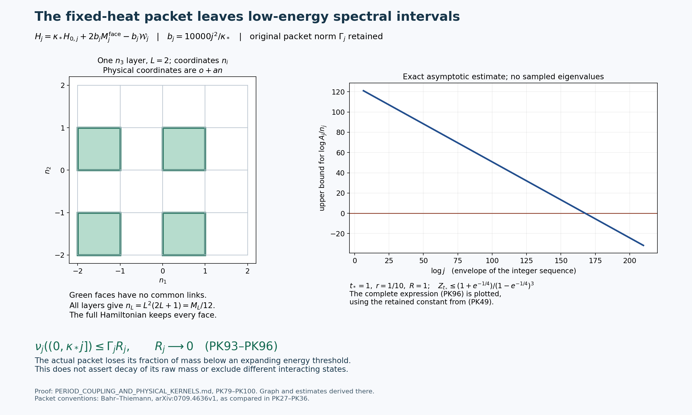
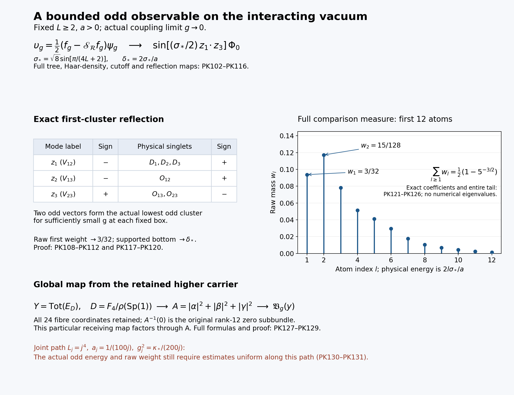
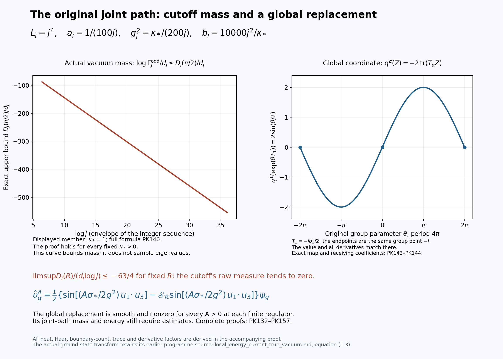
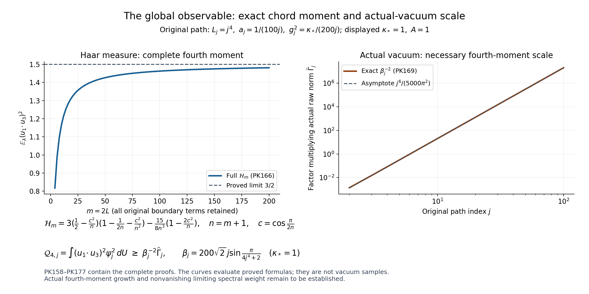
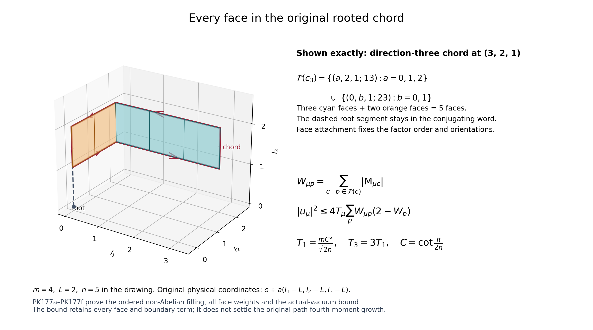
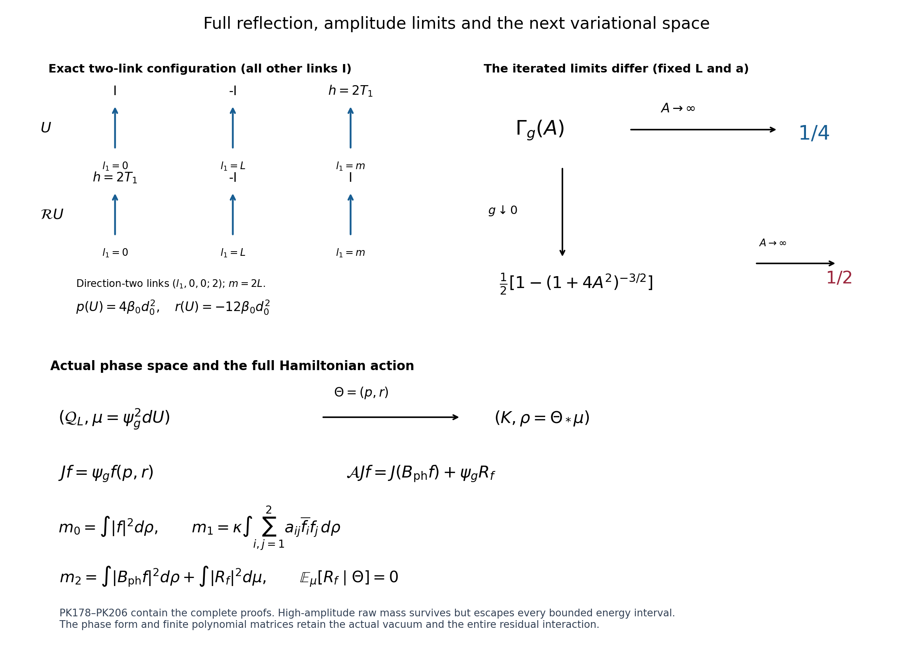
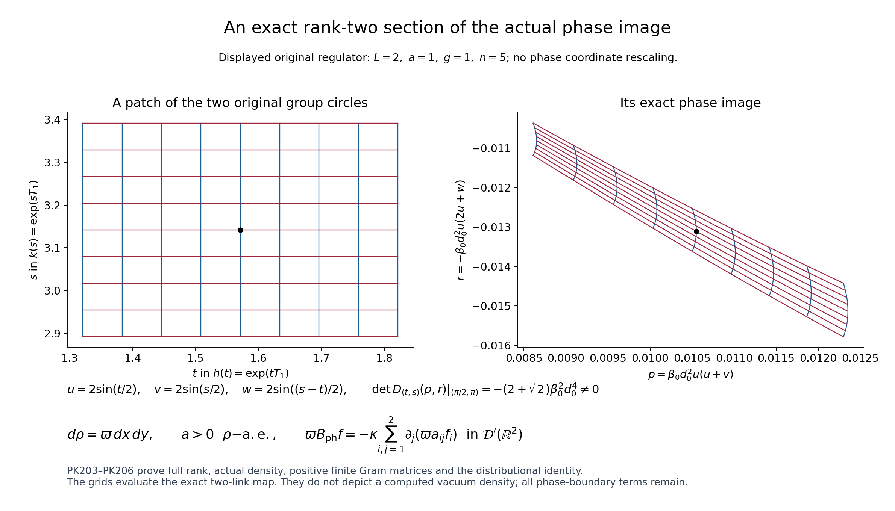
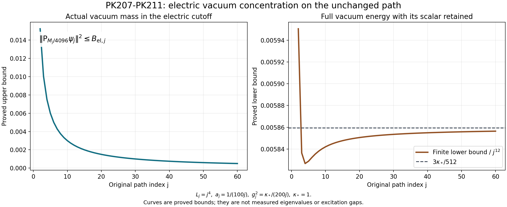
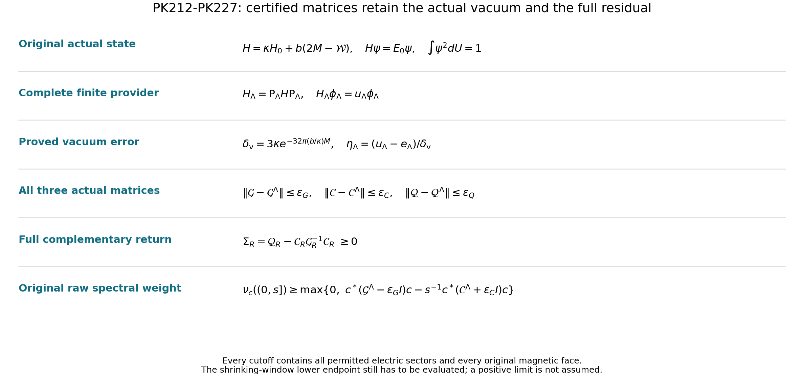

# Full cusp coupling and physical kernels of the classical holonomy family

**Reviewed edition, 9 October 2026:** complete PK1–PK227 proofs,
including PK109a, PK141a, PK143a and PK177a–PK177f, and 564 exact checks.
Original rooted-face weights and actual fourth-moment bounds are evaluated.
The full reflected phase gives an actual large-amplitude raw mass of 1/4,
with a different iterated weak-coupling limit and proved high-energy escape.
The actual two-phase space, its complete energy form, residual interaction
and convergent finite variational matrices are constructed. The actual
phase density, almost-everywhere full rank, positive finite Gram matrices
and complete distributional boundary identity are proved.
The actual vacuum leaves an extensive electric cutoff on the original path;
its full energy has a proved lower bound. Complete finite approximations
to its phase Gram, energy, second-moment and residual matrices now have
explicit actual-vacuum errors, including a simultaneous-path cutoff.
The original-path low-energy calculation and the interacting continuum
endpoint remain active research.

30 September 2026. This note constructs the full angular cusp pullback of
the retained bundle and its actual classical solution family. It then maps
the actual link configurations to nonzero gauge-invariant quantum vectors
on the original finite lattice, computes their Gram and full Hamiltonian
kernels, and constructs a nonzero vector orthogonal to the actual vacuum.
Sections 8–9 fix a joint path and compute its first electric projection and
the exact interacting return through the complementary space.
No continuum spectral conclusion is claimed here.

*The coordinate drawing is a schematic projection of the original core and its
reflection at \(s=0\). It retains both cubes and their complete face count.
The operator diagram is the exact identity PK54 on the reflection-odd physical
space. The full hypotheses and proofs are PK38–PK54; the complete classical
energy bracket is PK43f. Reproducible source:
[period_physical_figure.py](figures/period_physical_figure.py).*

## 1. Inputs, coordinates and source conventions

The original objects are the bundle \(P_H\to X\), its rank-24 associated
bundle \(\mathcal W_H\), the map \(\mathcal M_H\), and its global
classical Cauchy solution \(A(v;s,x)\), with \(s=ct\). Complete proofs are
in [the Cauchy continuation, CE1–CE45](https://github.com/KokunoYumeto/yang-mills-interacting-workbench/blob/7d5681ed53835433a5fb72d880b6292832f2efbf/yang-mills/continuations/20260930-s6-ns-moment-map-bridge/COMPACT_SUPPORT_CAUCHY_EVOLUTION.md)
and [the higher-carrier continuation, HC1–HC12](https://github.com/KokunoYumeto/yang-mills-interacting-workbench/blob/7d5681ed53835433a5fb72d880b6292832f2efbf/yang-mills/continuations/20260930-s6-ns-moment-map-bridge/HIGHER_CARRIER_AND_EVOLUTION.md).
The complete period input and the original lattice Hamiltonian are retained
in [Spatial continuum, Sections 1–2](https://github.com/KokunoYumeto/yang-mills-interacting-workbench/blob/7d5681ed53835433a5fb72d880b6292832f2efbf/yang-mills/continuations/20260930-s6-ns-moment-map-bridge/sources/spatial/spatial_continuum.tex#L113).
Its radial formulas are now extended through the entire angular coordinate.

To avoid confusing the physical support radius \(R\) with cusp depth,
write the original cusp depth as \(T\). Keep
\[
 t_c=e^{-2\pi T+i\phi},\qquad
 \sigma=\frac{\phi}{2\pi}+iT,\qquad
 \mu=\mu(t_c),\quad \tau=\sigma+h(t_c),\quad
 \beta=b_{\rm per}(t_c)-\sigma-h(t_c).
 \tag{PK1}
\]
Here \(h,\mu,b_{\rm per}\) are the original holomorphic functions,
including every bounded correction. Define
\[
 \begin{gathered}
 a=\operatorname{Re}\mu,\ m=\operatorname{Im}\mu,
 u=\operatorname{Re}\tau,\ L=\operatorname{Im}\tau,
 d=\operatorname{Im}b_{\rm per},\ q=L-d,
 c_0=\operatorname{Re}\beta,\\
 P=\begin{pmatrix}6a&u&1&0\\6m&L&0&0\\c_0&a&0&1\\-q&m&0&0\end{pmatrix},
 \quad D=Lq+6m^2>0,
 \quad A_{\rm per}=\begin{pmatrix}6a&u\\c_0&a\end{pmatrix},
 \quad B=\begin{pmatrix}6m&L\\-q&m\end{pmatrix}.
 \end{gathered}\tag{PK2}
\]
The source's \(p\) is exactly \(-q\); its \(\delta\) is exactly \(D\).
This dictionary preserves the original real coordinate order
\((\operatorname{Re}z_1,\operatorname{Im}z_1,
\operatorname{Re}z_2,\operatorname{Im}z_2)\).

The finite-state construction is the real-label part of the heat-kernel
construction of [Brian C. Hall, arXiv:1707.02355v1, Sections 1.2–1.3](https://arxiv.org/abs/1707.02355v1),
and its gauge average is the construction in
[Benjamin Bahr and Thomas Thiemann, arXiv:0709.4636v1, Sections 2, 3 and 4.2](https://arxiv.org/abs/0709.4636v1).
The exact convention comparison is supplied in Section 5. Complex labels,
their additional identifications, and semiclassical asymptotics from those
papers are not imported. All arguments needed for the results here follow
below. Original author TeX, reading coverage and exact hashes are recorded
in SOURCE_PROVENANCE.md and the private reading ledger.

## 2. Angular monodromy, determinant and the complete covered metric

Put
\[
 N_0=\begin{pmatrix}0&0&0&0\\0&0&0&0\\0&1&0&0\\-1&0&0&0\end{pmatrix},
 \quad M_0=I+N_0,\qquad S_M=\operatorname{diag}(1,1,M,M),\quad M\in\mathbb N.
 \tag{PK3}
\]
Directly from (PK1), continuation of the logarithm by
\(\phi\mapsto\phi+2\pi\) changes \(\tau\) to \(\tau+1\) and
\(\beta\) to \(\beta-1\), while leaving all three holomorphic functions
unchanged. Consequently
\[
 P(T,\phi+2\pi)=P(T,\phi)M_0,\quad N_0^2=0,\quad
 M_0^M=I+MN_0,\quad S_M^{-1}M_0^MS_M=M_0.
 \tag{PK4}
\]
These equations fix the orientation by the displayed logarithm change.
The earlier source calls its printed matrix clockwise and later refers to
a positive loop. No conclusion here relies on that verbal convention:
reversing the displayed logarithm change replaces \(M_0\) by its inverse.

On the covering base use
\(v_c=e^{-2\pi T/M+i\theta}\), so \(t_c=v_c^M\) and
\(\phi=M\theta\). The covered marked torus is
\[
 \widetilde F_{T,\theta,M}=\mathbb R^4/P(T,M\theta)S_M\mathbb Z^4.
 \tag{PK5}
\]
Its marked presentation identifies
\[
 (T,\theta,y)\sim(T,\theta+2\pi,M_0^{-1}y),\qquad
 y\in\mathbb R^4/\mathbb Z^4.
 \tag{PK6}
\]
Indeed \(P(T,M\theta+2\pi M)S_MM_0^{-1}y=P(T,M\theta)S_My\).
This proves the gluing, not just invariance of a determinant. The map
\([P S_My]\mapsto[P S_My]\) to the original fibre has degree \(M^2\)
and deck group \((\mathbb Z/M\mathbb Z)^2\), since the lattice quotient
is \(\mathbb Z^4/S_M\mathbb Z^4\).

Reorder covering rows only as \((x^1,x^3;x^2,x^4)\). The row permutation
has sign \(-1\). In this order
\[
 Q=\begin{pmatrix}A_{\rm per}&MI_2\\B&0\end{pmatrix},\quad
 Q^{-1}=\begin{pmatrix}0&B^{-1}\\M^{-1}I_2&-M^{-1}A_{\rm per}B^{-1}\end{pmatrix},
 \quad B^{-1}=D^{-1}\begin{pmatrix}m&-L\\q&6m\end{pmatrix}.
 \tag{PK7}
\]
Multiplying both ways proves the inverse. Thus in the original order
\[
 \det(PS_M)=-M^2D,\quad
 G_M=S_M^{\mathsf T}P^{\mathsf T}PS_M,\quad
 \sqrt{\det G_M}=M^2D,
 \tag{PK8}
\]
with inverse metric, in the unchanged marked-column order,
\[
 G_M^{-1}=Q^{-1}Q^{-\mathsf T}
 =\begin{pmatrix}
 B^{-1}B^{-\mathsf T}&-M^{-1}B^{-1}B^{-\mathsf T}A_{\rm per}^{\mathsf T}\\
 -M^{-1}A_{\rm per}B^{-1}B^{-\mathsf T}&
 M^{-2}(I_2+A_{\rm per}B^{-1}B^{-\mathsf T}A_{\rm per}^{\mathsf T})
 \end{pmatrix}.
 \tag{PK9}
\]
Every angular real-part term survives in this formula. Re-marking by
(PK6) gives the congruence law for \(G_M\); it does not identify the
matrix entries in two different markings.

Here are uniform bounds with explicit roles for the constants. Fix a
sufficiently small closed cusp disk on which the three holomorphic
functions are bounded, and then \(T\ge T_0\). There are finite constants
\(C_B,C_A\), defined respectively as bounds on
\(\|B-TJ\|\) and
\(\|A_{\rm per}-(\phi/(2\pi))J\|\), where
\(J=\left(\begin{smallmatrix}0&1\\-1&0\end{smallmatrix}\right)\).
Enlarge \(T_0\) so that \(T_0>C_B\); the preceding fixed disk bounds
remain valid on the smaller end.
On \(0\le\theta\le2\pi\),
\[
 T-C_B\le\sigma_{\min}(B)\le\sigma_{\max}(B)\le T+C_B,
 \qquad \|A_{\rm per}\|\le M+C_A.
 \tag{PK10}
\]
The first inequalities follow from \(|TJz|=T|z|\) and the triangle
inequality. They imply
\[
 \begin{split}
 \sigma_{\min}(PS_M)&\ge
 \left[M^{-1}+\frac{1+\|A_{\rm per}\|/M}{T-C_B}\right]^{-1},\\
 \sigma_{\max}(PS_M)&\le \|A_{\rm per}\|+M+T+C_B,\\
 \operatorname{sys}(\widetilde F_{T,\theta,M})&\ge\min(T-C_B,M).
 \end{split}\tag{PK11}
\]
For the first use (PK7) and bound its three nonzero blocks separately;
\(\sigma_{\min}=\|Q^{-1}\|^{-1}\). The second uses the three blocks of
\(Q\). For the third, a period has the exact form
\((A_{\rm per}n+Mz,Bn)\), \(n,z\in\mathbb Z^2\). If \(n\ne0\),
its second block has length at least \(T-C_B\); otherwise its first
block has length at least \(M\). No real-part correction is discarded.

Holomorphy also gives, uniformly in the original angular variable,
\[
 D=T^2+(2h_0-d_0)T+(h_0^2-d_0h_0+6m_0^2)
       +O(Te^{-2\pi T}),
 \tag{PK12}
\]
where \(h_0=\operatorname{Im}h(0)\),
\(d_0=\operatorname{Im}b_{\rm per}(0)\),
\(m_0=\operatorname{Im}\mu(0)\). Substitution of
\(L=T+\operatorname{Im}h(t_c)\), \(q=L-\operatorname{Im}b_{\rm per}(t_c)\)
in (PK2) proves every term.

## 3. Exact bundle pullback and low modes on the full end

Let \(\mathcal C\subset X\) be the original regular cusp
\(0<|t_c|<\epsilon\). Let \(\mathcal C_M\) be its covered family (PK5)–(PK6),
and \(c_M:\mathcal C_M\to\mathcal C\hookrightarrow X\) the actual
cover map, including the base change. Define
\[
 P_M=c_M^*P_H,\quad \mathcal W_M=c_M^*\mathcal W_H,\quad
 \mathcal A_M=c_M^*\mathcal A_H,\quad
 r_M=r_Hc_M:\mathcal C_M\to F_4/\rho(\operatorname{Sp}(1)).
 \tag{PK13}
\]
The bundle isomorphism in HC4 pulls back to
\(P_M\cong r_M^*(F_4\to F_4/\rho(\operatorname{Sp}(1)))\).
Explicitly \((z,p)\mapsto(z,a(p))\), with \(a(p)\) from HC5, is the
map, with inverse supplied by that same fibrewise bijection. This proves
the relation to the higher carrier on the whole covered end.

The original Hopf coordinate, on its open cell, remains
\[
 z_H=-\cot(\pi r_c/\epsilon)-\cot(\phi/2)\mathbf i
       -\cot(\pi u_1)\mathbf j-\cot(\pi u_2)\mathbf k,
 \quad r_c=e^{-2\pi T},\quad \phi=M\theta,
 \quad u_1=y_1,\ u_2=y_2.
 \tag{PK14}
\]
The last two equalities use the first two entries of \(S_My\).
Those entries are fixed by \(M_0\). Hence (PK14), its based extension,
and the exact transition \(g(z_H)=\overline z_H/|z_H|\) respect (PK6).
The entire angle is retained; it is not identified with a half-angle
rotation in the structure group. The nonzero global clutching class over
\(X\) remains the one proved by `rettri:bundleclass` in the
[retained source](https://github.com/KokunoYumeto/yang-mills-interacting-workbench/blob/7d5681ed53835433a5fb72d880b6292832f2efbf/yang-mills/continuations/20260930-s6-ns-moment-map-bridge/sources/higher_rung/s6_higher_rung_24d_preprint.tex#L5281).

There is a useful strengthening about the end itself. Restrict to
\(r_c<\epsilon/2\). On the open cell
\[
 |z_H|\ge\cot(\pi r_c/\epsilon)>0,\qquad
 w_H=z_H^{-1}=\overline z_H/|z_H|^2.
 \tag{PK15}
\]
At every collapsed angular or torus seam set \(w_H=0\). This is
continuous: approaching a seam makes at least one squared cotangent
diverge, hence \(|w_H|=|z_H|^{-1}\to0\). It also tends uniformly to zero
as \(r_c\to0\), by (PK15). Therefore the literal Hopf section
\[
 s_\infty(w_H)=\frac{(w_H,1)}{\sqrt{1+|w_H|^2}}
 \tag{PK16}
\]
is a global continuous section of \(P_M\) on this end. Its pullback
transition to \(s_0(z_H)\) is precisely the original \(g(z_H)\).
Thus the restriction to this noncompact end is trivial, even though the
bundle over the whole \(X\) is nontrivial. This is proved by a section;
it does not erase the global clutching class.

The smooth bundle structure constructed in HC4 can be used on the end.
A smooth trivialization exists as well: view (PK16) as a continuous unit
section of its associated quaternionic line; a locally finite smooth
partition of unity and local approximation give a smooth section within
fibre norm \(1/2\) of it. Dividing that section by its displayed positive
norm gives a smooth unit section. The straight interpolation with (PK16),
divided by its norm, is a continuous homotopy of nowhere-zero sections.
It is an isomorphism of the same bundle, not a differentiability assertion
about the literal collapsed source coordinates. Formula (PK14) remains
the topological comparison map.

Pullback of CE34 now gives, without a newly assumed evolution theorem,
\[
 \mathfrak E_M:\mathcal W_M\longrightarrow P_M\times_{\operatorname{Sp}(1)}\mathscr S,
 \quad [p,v]\longmapsto[p,A(v;s,x)].
 \tag{PK17}
\]
Its equivariance is CE33; both pullback compositions agree pointwise.
The zero subbundle and vertical ranks remain \(12\) and \(0,3,6,9\).
The same statement applies to the dilation family of CE38–CE45 for every
\(\lambda>0\), including its support \(|x|\le\lambda R+|s|\).
Smoothness is in the retained smooth bundle coordinates. It is not an
unproved uniform derivative estimate at the completed cusp.

The full dual spectrum also descends. Write \(k=(n,z)\in\mathbb Z^2\oplus\mathbb Z^2\).
Equations (PK7)–(PK9) give
\[
 \Lambda_{T,\theta,M;k}=4\pi^2\left[
  M^{-2}|z|^2+
  \left|B^{-\mathsf T}(n-M^{-1}A_{\rm per}^{\mathsf T}z)\right|^2\right].
 \tag{PK18}
\]
The corresponding character is
\(\exp(2\pi i\langle P^{-\mathsf T}S_M^{-1}k,x\rangle)\).
The transformation \(y\mapsto M_0^{-1}y\) transports its label to
\(k\mapsto M_0^{\mathsf T}k\); inserting this in the transformed metric
proves spectral invariance. The original fibre characters are exactly
the covered labels with \(k_3,k_4\) divisible by \(M\).

For completeness, an explicit full low-mode count follows from the
singular-value estimate. Fix \(E>0\), set
\(\rho_E=\sqrt E/(2\pi)\),
\(s_* =\sigma_{\min}(PS_M)\), and suppose \(\rho_Es_*>1\).
Let \(N(E)\) count the nonzero labels with eigenvalue at most \(E\).
Then
\[
 (1-(\rho_Es_*)^{-1})^4\frac{E^2M^2D}{32\pi^2}
 \le N(E)+1\le
 (1+(\rho_Es_*)^{-1})^4\frac{E^2M^2D}{32\pi^2}.
 \tag{PK19}
\]
Indeed the ellipsoid of allowed real labels is
\((PS_M)^{\mathsf T}\overline B_{\rho_E}\), of volume
\(M^2D\,\pi^2\rho_E^4/2\). Each point in a unit lattice cube is within
distance one of its centre in four dimensions. The ellipsoid contains
\(B_{\rho_Es_*}\). Its outer unit neighbourhood is contained in its
\(1+1/(\rho_Es_*)\) dilate; its inner such dilate lies in the union
of cubes whose centres it contains. Comparing volumes proves (PK19).
Boundary cubes can be made half-open, so they do not change the count.

For the joint path \(T=j^6,M=j^4\) prescribed in Section 8,
(PK10)–(PK11) give \(s_*\ge j^4/2\) at the explicit threshold there.
Consequently (PK19) retains the full factor
\(E^2j^8D/(32\pi^2)\), with multiplicative bounds
\((1-2/(\rho_Ej^4))^4\) and \((1+2/(\rho_Ej^4))^4\)
when \(\rho_Ej^4>2\). In particular no bounded correction inside \(D\)
is discarded. Also
\[
 \frac{4\pi^2}{(T+C_B+M+\|A_{\rm per}\|)^2}
 \le\Lambda_1\le\frac{4\pi^2}{(T-C_B)^2}.
 \tag{PK20}
\]
The lower bound uses \(|k|\ge1\); for the upper bound use a unit label
\((n,0)\) and (PK10). These are scalar geometric modes. The quantum
Hamiltonian below is a different operator whose connection to these
scales must be tested using its actual kernels.

## 4. Receiving the actual fields in the original lattice

The physical coordinate permutation from the source is
\[
 (y^0,y^1,y^2,y^3)=(x^3,x^2,x^4,x^1).
 \tag{PK21}
\]
It has determinant \(+1\). Denote its matrix by \(\mathsf S\).
On any ball of radius \(b_*\) with
\(4b_*<\min(T-C_B,M)\), the quotient to (PK5) is an isometric embedding.
The proof is \(|x-x'+\ell|\ge|\ell|-2b_*>2b_*\) for every nonzero
period. A physical path \(\gamma\) in this patch has marked coordinates
\[
 \eta=(PS_M)^{-1}\mathsf S^{-1}\gamma.
 \tag{PK22}
\]
The pulled-back one-form has components
\(\widetilde A_a=\sum_\mu(\mathsf S PS_M)_{\mu a}
A_\mu(\mathsf S PS_M\eta)\); its curvature is the exterior-square
pullback. The chain rule retains each derivative and bracket. Along
(PK22), the period matrix and its inverse cancel in the transport ODE,
proving equality of its holonomy with the actual physical path holonomy.
This cancellation is a proved map with all matrices present, not deletion
of the period data. Equations (PK4)–(PK6) prove angular compatibility.

This construction uses physical patches of the Euclidean torus carrier.
The physical evolution remains the Lorentzian Cauchy solution on
\(\mathbb R^{1+3}\). It does not identify physical time periodically or
assert that the solution closes around a torus time cycle. Its entire
curvature is pulled back on every patch where it is used.

Fix a positive integer \(L\ge1\) and the original open cubic graph with
vertices \(\{-L,\ldots,L\}^3\),
spacing \(a>0\), and a specified physical origin \(o\), so an edge
is \(\gamma_{n,i}(t)=o+a(n+te_i)\). Let \(H_e(A)\) be CE42's forward
transport. Define the lattice centre
\[
 h_e=H_e(A)^{-1}.
 \tag{PK23}
\]
CE43 gives \(h_e(A^q)=q_{s(e)}h_eq_{t(e)}^{-1}\), exactly the original
lattice action. This inverse is essential. All reversed edges are the
inverses of the same variables; they are not independent variables.

Put
\[
 N_L=3(2L)(2L+1)^2,\quad M_L=3(2L)^2(2L+1),\quad Q_L=SU(2)^{N_L},
 \quad dU=\prod_e dU_e,
 \tag{PK24}
\]
where each Haar measure has total mass one. For \(T_a=-i\sigma_a/2\),
let \(X_{e,a}\) differentiate \(U_e\mapsto e^{tT_a}U_e\). The complete
Hamiltonian is
\[
 H=\kappa\sum_e E_e+b\sum_p(2-W_p),\quad
 E_e=-\sum_aX_{e,a}^2,\quad \kappa=\frac{2g^2}{a},\quad
 b=\frac1{2g^2a},\quad W_p=\operatorname{tr}
 (U_i(n)U_j(n+e_i)U_i(n+e_j)^{-1}U_j(n)^{-1}).
 \tag{PK25}
\]
Its domains are \(H^2(Q_L)\) and form domain \(H^1(Q_L)\), because
the potential is smooth and \(0\le V\le4bM_L\). The physical Hilbert
space is the range of the orthogonal Haar projection
\[
 (\Pi f)(U)=\int_{SU(2)^{V_L}}f(q\cdot U)\,dq,\qquad
 (q\cdot U)_e=q_sU_eq_t^{-1}.
 \tag{PK26}
\]
Haar invariance proves self-adjointness and idempotence; the image is
exactly the invariant functions. Each \(E_e\) commutes with the action,
and every \(W_p\) is conjugated at its base vertex, so \(H\Pi=\Pi H\).
The source Lie metric is \(-\operatorname{tr}(XY)/2\), for which
\(\Delta^c=4\sum_aX_a^2\). It is one quarter of CE4's matrix metric.
Thus (PK25) retains the original electric coefficient; none is transferred
silently into a metric or a coupling.

## 5. Nonzero physical vectors and their exact Gram kernel

For \(t>0\) define the heat kernel in the original \(T_a\) convention
\[
 p_t(U)=\sum_{j\in\frac12\mathbb Z_{\ge0}}(2j+1)e^{-tj(j+1)}\chi_j(U).
 \tag{PK27}
\]
Every derivative series converges uniformly: derivatives of a spin-\(j\)
matrix are bounded by powers of \(j\), whereas the exponential is
quadratic in \(j\). Orthogonality of matrix coefficients proves
\(p_t*p_s=p_{t+s}\), \(\int p_t=1\), and
\(\partial_tp_t=-E p_t\). The compact connected-group heat equation
and the strong maximum principle give \(p_t>0\). In particular all
packets below are smooth vectors in every Sobolev domain.

The exact source comparisons are as follows. Bahr–Thiemann's real-label
packet with parameter \(2t\) is \(p_t(Uh^{-1})\), using trace cyclicity
and \(\chi_j(k^{-1})=\chi_j(k)\) on \(SU(2)\). Hall uses
\(\partial_t\rho=\Delta^c\rho/2=-2E\rho\) with his displayed
\(SU(2)\) metric \(-\operatorname{tr}(XY)/2\); hence
\(\rho_{t/2}=p_t\). These factors refer to smoothing parameters,
not to the coupling or Planck's constant of (PK25).

For positive edge parameters \(\mathbf t=(t_e)\), set
\[
 f_{h,\mathbf t}(U)=\prod_e p_{t_e}(U_eh_e^{-1}),\qquad
 \Phi_{h,\mathbf t}=\Pi f_{h,\mathbf t}
 =\int dq\prod_e p_{t_e}(U_e(q\cdot h)_e^{-1}).
 \tag{PK28}
\]
The second equality follows by substituting inverse vertex variables and
using conjugation invariance of \(p_t\). It proves that \(\Phi\) depends
only on the gauge orbit of \(h\). Positivity and unit integral give
\[
 \Phi_{h,\mathbf t}>0,\qquad \int\Phi_{h,\mathbf t}\,dU=1,
 \qquad \|\Phi_{h,\mathbf t}\|_2^2\ge1.
 \tag{PK29}
\]
Thus physical projection does not annihilate any of these actual
classical configurations. In particular simultaneous colour conjugation
from a change of frame in \(P_M\) disappears under \(\Pi\); (PK28)
therefore gives a well-defined map on the entire associated bundle.
The equal-field circles and all spectator directions of CE34a retain
exactly equal vectors. No parameter labels have been made orthogonal.

The exact raw Gram kernel is
\[
 G(h,k;\mathbf t,\mathbf s)
 =\langle\Phi_{h,\mathbf t},\Phi_{k,\mathbf s}\rangle
 =\int dq\prod_e p_{t_e+s_e}(h_e(q\cdot k)_e^{-1}).
 \tag{PK30}
\]
To prove it, use \(\Pi^*=\Pi^2=\Pi\), integrate the two heat kernels
on each original link, and apply their convolution law. The same result
comes from the two vertex integrals in (PK28), followed by their relative
vertex change. It is real, strictly positive, symmetric under exchanging
the two labelled packets, and positive semidefinite as a Gram kernel.

There are no further identifications for real labels at a fixed
\(\mathbf t\), apart from gauge orbits. Indeed (PK28) is the product heat
operator applied to the orbit probability measure \(\nu_h\). Every
Peter–Weyl coefficient is multiplied by the nonzero number
\(\exp(-\sum_et_ej_e(j_e+1))\). Equality of packets gives equality of
all Fourier coefficients of the two measures. Matrix coefficients form a
self-adjoint algebra separating points, so their uniform density gives
equality of the measures. The support of \(\nu_h\) is exactly the
compact orbit of \(h\): every nonempty open set meeting the orbit has
positive Haar preimage. Equality of the measures therefore gives equality
of their orbits. This argument also proves that distinct-orbit packets
cannot be proportional, since their integrals are both one. More strongly,
a finite collection of packets at distinct gauge orbits and fixed heat
parameters is linearly independent. A vanishing linear combination, after
the same injective heat operation, gives a vanishing linear combination of
orbit measures. Their compact supports are disjoint. Restricting the measure
to each of those Borel supports gives its coefficient zero. Thus the Gram
matrix is strictly positive definite on each such finite collection.

## 6. Full Hamiltonian kernel, including every magnetic face

Write \(x_e=(q\cdot h)_e\), \(y_e=(r\cdot k)_e\). Define one-link
scalar and matrix functions
\[
 Z_e(x,y)=p_{t_e+s_e}(xy^{-1}),\qquad
 R_e^{\pm}(x,y)=\int_{SU(2)}p_{t_e}(Ux^{-1})p_{s_e}(Uy^{-1})U^{\pm1}\,dU.
 \tag{PK31}
\]
For each oriented face with ordered distinct edges
\((e_1^{\epsilon_1},\ldots,e_4^{\epsilon_4})\), put
\[
 B_p(h,k)=\int dq\,dr\;
 \left(\prod_{e\notin\partial p}Z_e(x_e,y_e)\right)
 \operatorname{tr}\left(
 R_{e_1}^{\epsilon_1}(x_{e_1},y_{e_1})
 R_{e_2}^{\epsilon_2}(x_{e_2},y_{e_2})
 R_{e_3}^{\epsilon_3}(x_{e_3},y_{e_3})
 R_{e_4}^{\epsilon_4}(x_{e_4},y_{e_4})\right).
 \tag{PK32}
\]
The order in this trace is the original face order. Link integration in
\(\langle\Phi_h,W_p\Phi_k\rangle\) proves precisely (PK32); no
commuting replacement of the four matrices is made. Differentiating the
right packet in (PK28) proves the full answer
\[
 K(h,k;\mathbf t,\mathbf s)
 :=\langle\Phi_{h,\mathbf t},H\Phi_{k,\mathbf s}\rangle
 =-\kappa\sum_e\partial_{s_e}G
       +2bM_LG-b\sum_pB_p.
 \tag{PK33}
\]
Every original boundary face, scalar Wilson term and electric coefficient
is retained. All differentiations are justified by the uniformly
convergent series following (PK27).

The integrals in these formulas have a completely specified convergent
algebraic evaluation. Here is one that also fixes their representation
conventions. Let \(D^j=\operatorname{Sym}^{2j}(U)\) in the orthonormal
symmetric-tensor basis, with indices \(0\le r,s\le n=2j\). For
\(U=\left(\begin{smallmatrix}a&b\\c&d\end{smallmatrix}\right)\),
\[
 D^j(U)_{rs}=\sqrt{\frac{\binom ns}{\binom nr}}
 \sum_{k=\max(0,r-n+s)}^{\min(r,s)}
 \binom{n-s}{r-k}\binom sk
 a^{n-s-r+k}c^{r-k}b^{s-k}d^k.
 \tag{PK34}
\]
This follows by expanding the two factors
\((az_1+cz_2)^{n-s}(bz_1+dz_2)^s\), with the displayed symmetric
basis factors. Thus it is an explicit finite matrix, including its signs.

For a list of these representations or their complex conjugates, let
\(T_a^{\rm tot}\) be the sum of their infinitesimal matrices in the
corresponding tensor slots, and \(C=-\sum_a(T_a^{\rm tot})^2\).
Let \(J_{\max}\) be the sum of their spins. Their Haar matrix is
\[
 Q^{\rm list}=\int \bigotimes_\ell D^{j_\ell}(U)\,dU
 =\begin{cases}
 0,&J_{\max}\in\mathbb Z+\tfrac12,\\
 \displaystyle\prod_{J=1}^{J_{\max}}\left(I-\frac{C}{J(J+1)}\right),
      &J_{\max}\in\mathbb Z.
 \end{cases}\tag{PK35}
\]
Conjugated slots use the conjugated matrices in this equation; the empty
product is the identity. To prove it, Haar averaging is the orthogonal
projection onto invariant tensors. The finite-dimensional unitary
\(SU(2)\) representation decomposes orthogonally by its highest weights:
starting with a largest eigenvector of \(iT_3^{\rm tot}\), repeated
lowering gives the spin-\(J\) string with Casimir \(J(J+1)\); its
orthogonal complement is invariant, so induction exhausts the tensor
space. Its weights have the parity of \(J_{\max}\) and absolute value
at most \(J_{\max}\). Thus the polynomial in (PK35) is one on the
spin-zero space and zero on every possible nonzero spin. For half-integral
parity there is no zero spin. This proves the formula, even when some of
the listed integer spins do not occur.

In particular, the entries of (PK31) are exactly
\[
 \begin{split}
 (R^+)_{ab}(x,y)
 &=\sum_{j,k}d_jd_ke^{-t j(j+1)-s k(k+1)}
   \sum_{m,n,p,q}D^j(x^{-1})_{nm}D^k(y^{-1})_{qp}
   Q^{j,k,1/2}_{(m,p,a),(n,q,b)},\\
 (R^-)_{ab}(x,y)
 &=\sum_{j,k}d_jd_ke^{-t j(j+1)-s k(k+1)}
   \sum_{m,n,p,q}D^j(x^{-1})_{nm}D^k(y^{-1})_{qp}
   Q^{j,k,\overline{1/2}}_{(m,p,b),(n,q,a)},
 \qquad d_j=2j+1.
 \end{split}\tag{PK36}
\]
Expanding each heat trace proves the first equation. The second uses
\((U^{-1})_{ab}=\overline U_{ba}\), hence the transposed indices shown.
The remaining vertex averages in (PK30) and (PK32) are evaluated by the
same (PK35) at each vertex, with the exact incoming conjugated slots.
The polynomial growth in dimensions and the heat exponential give absolute
convergence of these sums and all finite derivatives. Thus (PK30)–(PK36)
specify actual computable kernels, including the entire nonlinear
magnetic interaction, rather than a diagonal assignment to labels.

## 7. A nonzero vector exactly orthogonal to the actual vacuum

We now construct an excitation, not merely a positive physical packet.
The original \(H\) has compact resolvent. A ground minimizer can be
chosen nonnegative because \(|\nabla|f||\le|\nabla f|\); the functions
\((|f|^2+\varepsilon^2)^{1/2}\) justify this at zeros. Elliptic regularity
and the strong maximum principle give a smooth strictly positive minimizer
\(\psi\), with eigenvalue \(E_0\) and \(\int\psi^2=1\).
The exact identity
\[
 \langle\psi F,(H-E_0)\psi F\rangle
 =\kappa\sum_{e,a}\int\psi^2|X_{e,a}F|^2dU
 \tag{PK37}
\]
follows by the product rule and integration by parts. Another ground
vector divided by \(\psi\) has all derivatives zero, so it is constant
on connected \(Q_L\). This proves uniqueness. Gauge actions and graph
reflections preserve \(H\), positivity and norm, so they fix \(\psi\).
The bounds \(0\le E_0\le2bM_L\) follow from positivity and the unit
constant trial vector, whose mean Wilson trace is zero on every face.

Let \(\mathcal R\) be the graph reflection \(n_1\mapsto-n_1\).
For reversed edges it also inverts the link; the other edges are permuted.
It is an involution preserving product Haar measure, \(\sum E_e\),
and the sum of all face traces. With a common heat parameter \(t>0\),
it sends \(\Phi_{h,t}\) to \(\Phi_{\mathcal Rh,t}\). Define
\[
 \eta_{h,t}=\Phi_{h,t}-\Phi_{\mathcal Rh,t}.
 \tag{PK38}
\]
It is gauge invariant and reflection odd, so
\(\langle\psi,\eta_{h,t}\rangle=0\) exactly. Its complete kernels are
\[
 \begin{split}
 G^- (h,k)&=G(h,k)-G(h,\mathcal Rk)-G(\mathcal Rh,k)+G(\mathcal Rh,\mathcal Rk),\\
 K^- (h,k)&=K(h,k)-K(h,\mathcal Rk)-K(\mathcal Rh,k)+K(\mathcal Rh,\mathcal Rk),\\
 \Gamma(h)&=G^-(h,h)=2[G(h,h)-G(h,\mathcal Rh)].
 \end{split}\tag{PK39}
\]
No norm division or vacuum overlap has been omitted.

Here is an actual field and graph for which \(\Gamma>0\). Use the
equal-colour initial input, dilated by \(\lambda>0\), at \(s=0\).
Choose \(a\) with \(\sqrt2a<\lambda r\) and \(0<a/\lambda<\pi\).
Let \(K\) be an integer with \(aK>2\lambda R\), choose \(L>K+2\),
and set the physical origin \(o=(aK,0,0)\). The face starting at
\(n=(-K,0,0)\) lies in the original core. There
\(\varphi(A_i)=2T_i/\lambda\), so (PK23) gives its exact face word
\[
 h_p=e^{2aT_1/\lambda}e^{2aT_2/\lambda}
              e^{-2aT_1/\lambda}e^{-2aT_2/\lambda},\qquad
 W_p(h)=2-4\sin^4(a/\lambda)<2.
 \tag{PK40}
\]
To verify the trace, insert
\(e^{2aT_i/\lambda}=\cos(a/\lambda)I+2T_i\sin(a/\lambda)\),
multiply the four matrices using
\(T_iT_j=-\delta_{ij}I/4+\epsilon_{ijk}T_k/2\), and take the trace.
Every point of the reflected face has first coordinate at least
\(2aK-a>\lambda R\) after enlarging \(K\), if necessary, by one.
There \(C=0\), hence all four links are the identity and
\(W_p(\mathcal Rh)=2\). Thus the two configurations are not gauge
equivalent. The real-label injectivity proved after (PK30) gives
\(\eta_{h,t}\ne0\). This proves a nonzero, smooth, finite-energy
physical vector orthogonal to the actual interacting finite-lattice vacuum.

There is also a quantitative raw-norm lower bound. A face Wilson trace
is an electric eigenfunction with eigenvalue
\(4\cdot(3/4)=3\); each of its four links occurs in the fundamental
representation. Equations (PK27)–(PK28) therefore give
\[
 \int W_p(U)\Phi_{h,t}(U)dU=e^{-3t}W_p(h).
\]
Its Haar squared norm is one: integrating three links reduces its
holonomy to a single Haar element, and character orthogonality gives
\(\int\chi_{1/2}^2=1\). Cauchy–Schwarz applied to (PK38) proves
\[
 \Gamma(h)\ge e^{-6t}|W_p(h)-W_p(\mathcal Rh)|^2
       =16e^{-6t}\sin^8(a/\lambda)>0.
 \tag{PK41}
\]
This bound retains the decreasing amplitude; it is not a uniform
positive lower bound in a limit with \(a/\lambda\to0\).

For an explicit finite energy control put
\(D_h=-\sum_e\partial_{s_e}G(h,h;\mathbf t,\mathbf s)|_{\mathbf s=\mathbf t}\).
This is \(\sum_{e,a}\|X_{e,a}\Phi_{h,t}\|_2^2\ge0\). Reflection
invariance and \(|u-v|^2\le2|u|^2+2|v|^2\) give
\[
 0<\frac{K^-(h,h)-E_0\Gamma(h)}{\Gamma(h)}
 \le \frac{4\kappa D_h}{\Gamma(h)}+4bM_L.
 \tag{PK42}
\]
The strict inequality follows from uniqueness of the ground state and
\(\eta\ne0\); all vectors are in the operator domain. The upper bound
is finite and explicit in the kernels. It is not claimed to tend to zero.

## 8. One fixed joint path and the next actual spectral calculation

Fix \(\kappa_*>0\), \(t_*>0\), the original cutoff \(\chi,r,R\), and
the original physical unit \(\ell_*=1\), the length of its real period
vector. Use the same \(g_j\) in the classical physical energy and the
quantum Hamiltonian. Before estimating any spectral limit, prescribe
\[
 \begin{gathered}
 T_j=j^6,\quad M_j=j^4,\quad v_{c,j}=e^{-2\pi j^2},\quad
 a_j=\frac1{100j},\quad L_j=j^4,\quad
 g_j^2=\frac{\kappa_*}{200j},\quad t_j=t_*,\quad \lambda_j=j^2,\\
 K_j=\left\lceil\frac{3\lambda_jR}{a_j}\right\rceil+1,\qquad
 o_j=(a_jK_j,0,0),\quad h_j=H(A^{[\lambda_j]}(0))^{-1},
 \quad \eta_j=\Phi_{h_j,t_*}-\Phi_{\mathcal Rh_j,t_*}.
 \end{gathered}\tag{PK43}
\]
The base identity remains exact:
\(v_{c,j}^{M_j}=e^{-2\pi j^6}\). The full graph and Hamiltonian constants are
\[
 \begin{gathered}
 N_{L_j}=3(2j^4)(2j^4+1)^2,\qquad
 M_{L_j}=3(2j^4)^2(2j^4+1),\\
 \kappa_j=\kappa_*,\qquad b_j=\frac{10000j^2}{\kappa_*},\qquad
 \xi_j=\frac{10000j^2}{\kappa_*^2},\qquad
 \frac{a_j}{\lambda_j}=\frac1{100j^3},\qquad
 K_j=\lceil300Rj^3\rceil+1 .
 \end{gathered}\tag{PK43a}
\]
In particular every original edge and face remains in (PK25).

Here is one sufficient threshold, including the small-core condition.
Increase the already fixed \(T_0\), if needed, so (PK10) holds and
\(e^{-2\pi T_0}<\epsilon/2\). Take every integer \(j\) satisfying
\[
 j\ge 1+\left\lceil\max\left\{
 2,\ T_0^{1/6},\ (2C_B)^{1/6},\
 \sqrt{4+2C_A},\ \sqrt{32(3R+1)},\
 100(4R+2),\ \left(\frac{\sqrt3}{25r}\right)^{1/3}
 \right\}\right\rceil.
 \tag{PK43b}
\]
The constants here are those of the original cutoff and full period matrix.
Since \(j^6-C_B\ge j^6/2\ge j^4\), (PK11) gives
\(\operatorname{sys}\ge j^4\). Its inverse-matrix estimate also gives
\[
 \sigma_{\min}(PS_{M_j})
 \ge\left[j^{-4}+2j^{-6}(2+C_Aj^{-4})\right]^{-1}
 \ge \frac{j^4}{2}.
 \tag{PK43c}
\]
The last inequality follows from \(j^2\ge4+2C_A\) and \(j\ge1\).
All bounds hold uniformly for \(0\le\theta\le2\pi\).

The spatial box has half-width \(a_jL_j=j^3/100\), and
\[
 3Rj^2<a_jK_j<3Rj^2+2a_j.
\]
Consequently it exhausts \(\mathbb R^3\). For the entire physical time
slab \(|s|\le j^2\), its image in \(\mathbb R^4\) is contained in the ball
of radius
\[
 B_j=\frac{\sqrt3j^3}{100}+(3R+1)j^2+\frac1{50j}
 <\frac{j^4}{8}.
 \tag{PK43d}
\]
Indeed each of the three terms is at most \(j^4/32\) under (PK43b):
for the first and third it suffices that \(j\ge1\), while the middle
term uses \(j^2\ge32(3R+1)\). Thus the slightly larger open ball of
radius \(j^4/8\) embeds isometrically in the covered torus by (PK22).
This leaves a collar around the entire slab.

The complete evolved support also lies inside this box on the stated slab.
CE39 gives its radius at most \((R+1)j^2\), whereas
\[
 (R+1)j^2+a_jK_j
 <(4R+1)j^2+\frac1{50j}<\frac{j^3}{100}.
 \tag{PK43e}
\]
The last inequality follows from \(j\ge100(4R+2)\). This verifies the
boundary condition with the actual translated origin, including the
negative \(x^1\) boundary. Moreover \(L_j>K_j+2\), since
\(j>300R+4\), and \(\sqrt2a_j<\lambda_jr\). The reflected face has
first coordinate at least \(2a_jK_j-a_j>6Rj^2+a_j>\lambda_jR\).
Hence the nonzero-vector construction in Section 7 applies at every
integer in (PK43b).

The complete classical energy comparison, with the original coefficients
of CE18–CE22, is
\[
 \begin{aligned}
 \mathscr E_{g_j}^{[\lambda_j]}(v)
 &=\frac{2}{g_j^2\lambda_j}\left[
   \sum_{a,b}\langle c_a,c_b\rangle I_{ab}
   +2\sum_{a,\ b<c}\langle c_a,[c_b,c_c]\rangle J_{a,bc}
   +\sum_{a<b,\ c<d}\langle[c_a,c_b],[c_c,c_d]\rangle K_{ab,cd}
   \right]\\
 &=\frac{400}{\kappa_*j}\left[
   \sum_{a,b}\langle c_a,c_b\rangle I_{ab}
   +2\sum_{a,\ b<c}\langle c_a,[c_b,c_c]\rangle J_{a,bc}
   +\sum_{a<b,\ c<d}\langle[c_a,c_b],[c_c,c_d]\rangle K_{ab,cd}
   \right]\\
 &=\frac{200g_{\rm ref}^2}{\kappa_*j}\mathscr E_{g_{\rm ref}}(v)
 \end{aligned}\tag{PK43f}
\]
for any fixed reference \(g_{\rm ref}>0\). The first equality is CE39
together with the explicit \(g^{-2}\) in CE22. Thus no coupling change
has been hidden in a classical norm. This energy tends to zero for each
fixed original \(v\), and its zero inputs remain exactly the rank-12
zero subbundle. At the equal-colour input, CE23 retains the lower bound
\[
 \mathscr E_{g_j}^{[\lambda_j]}
 \ge\frac{6400\pi r^3}{\kappa_*j}>0.
 \tag{PK43g}
\]
The annulus contribution remains in (PK43f); (PK43g) is only its core
lower bound. The superseded choice \(\lambda_j=\sqrt j\), with the same
\(g_j\), would instead give
\(200g_{\rm ref}^2\sqrt j\,\mathscr E_{g_{\rm ref}}/\kappa_*\).
It increases for every nonzero input. This is the exact defect corrected
by (PK43), before any quantum spectral asymptotics are inferred.

The exact finite raw spectral measure is now a definite object:
\[
 \nu_j(I)=\langle\eta_j,\mathbf1_I(H_j-E_{0,j})\eta_j\rangle,
 \quad \nu_j(\{0\})=0,\quad \nu_j([0,\infty))=\Gamma_j>0.
 \tag{PK44}
\]
The finite-volume heat kernel or spectral resolution of the actual
operator (PK25) computes its Laplace transform. Equivalently expand the
bounded magnetic perturbation around its electric heat semigroup:
\[
 e^{-uH_j}=\sum_{n=0}^{\infty}(-1)^n
 \int_{0<s_1<\cdots<s_n<u}
 e^{-(u-s_n)\kappa_*H_0}V_j e^{-(s_n-s_{n-1})\kappa_*H_0}
 \cdots V_j e^{-s_1\kappa_*H_0}\,d^ns.
 \tag{PK45}
\]
The \(n=0\) term is the electric semigroup. The operator norm of the
\(n\)-th term is at most \((4b_jM_{L_j}u)^n/n!\); hence the series
converges in operator norm for every fixed \(j,u\). Its matrix elements
are computed by the same heat kernels and face insertions in Section 6,
retaining every face word. Multiplication by \(e^{uE_{0,j}}\) gives
\(\int e^{-u\omega}\,d\nu_j(\omega)\). This specifies a convergent
calculation of the full nonlinear dynamics on the constructed vectors.

The next calculation is to estimate these actual raw masses, energy
moments and Laplace transforms uniformly along (PK43), including
\(\Gamma_j\), whose lower bounds in (PK41) and (PK49) decrease. Fixed-scale
scalar low modes (PK18)–(PK20) and decreasing classical energy do not
provide that estimate. In particular the present finite-state construction
does not establish persistence of positive spectral mass near zero,
continuum vacuum uniqueness, reconstruction, or the theory-identification
map. Those remain the active programme calculations on this specified path.

## 9. The complete first electric layer and its interacting return

The original cubic graph supplies a finite subspace on which the following
computations are exact. Write \(M=M_L\) in this section only; the covering
integer remains \(M_{\rm cov}\) when both occur in one formula. Keep
\(\mathcal W=\sum_pW_p\), \(H_0=\sum_eE_e\), and the original identity
\[
 H=\kappa H_0+2bM I-b\mathcal W.
 \tag{PK46}
\]
Here \(\mathcal W\) means multiplication by the complete face sum.

**Theorem 9.1 (first physical electric layer).** On the original physical
Hilbert space, the first positive eigenvalue of \(H_0\) is \(3\). Its
eigenspace is exactly
\(\mathcal F=\operatorname{span}\{W_p:p\text{ an elementary face}\}\).
The displayed \(M\) functions form an orthonormal basis of \(\mathcal F\).
On the orthogonal complement of the constants and \(\mathcal F\), the
electric operator has lowest eigenvalue exactly \(9/2\).

**Proof.** The integral of a matrix entry of \(U\) or \(U^{-1}\) against
Haar measure is zero: replacing \(U\) by \(-U\) reverses its sign. Hence
\(\int W_p=0\). Integrating any one link in a face reduces its squared
trace to \(\int_{SU(2)}(\operatorname{tr}U)^2dU=1\). One can see this last
constant without a character convention: \(SU(2)\) is the unit quaternion
three-sphere, \(\operatorname{tr}\Psi(a)=2a_0\), its Haar probability is
the rotation-invariant sphere probability, and each of the four squared
coordinates has mean \(1/4\). If \(p\ne q\), there is an edge of \(p\)
absent from \(q\); integration in that edge gives
\(\langle W_p,W_q\rangle=0\). There are exactly \(M\) original faces.
For every edge of \(p\),
\(E_eW_p=(3/4)W_p\), because \(-\sum_aT_a^2=3I/4\).
The same calculation holds for an inverse link. Thus \(H_0W_p=3W_p\).

For the completeness and lower spectral bounds, decompose the product
matrix coefficients into edge spins \(j_e\). On this finite spin block,
\(H_0\) is the scalar \(\sum_ej_e(j_e+1)\). These blocks span a dense
subspace: polynomials in fundamental matrix entries and their conjugates
separate points on the compact product group, their algebra contains the
constants, and uniform density followed by the finite-dimensional
highest-weight decomposition used in (PK35) gives the claimed matrix
coefficient density. Averaging at a vertex acts only on its incident
representation slots. A vertex incident to exactly one nonzero spin has
zero invariant part, because a nontrivial irreducible representation has
no fixed vector. Therefore the support graph of any nonconstant physical
spin block has minimum degree at least two.

A nonempty finite graph of minimum degree at least two contains a cycle:
extend a nonbacktracking path until a vertex repeats. The cubic graph is
simple and bipartite, so this cycle has at least four edges. Each nonzero
spin contributes at least \(3/4\), giving the lower bound \(3\). Equality
requires exactly four spin-\(1/2\) edges. Four such edges form a unit
coordinate square; at its degree-two vertices, the invariant pairing is
one-dimensional. Contracting those pairings is precisely its Wilson trace.
The dimension statement also follows directly from Schur's lemma: an
intertwiner between the two irreducible incident slots is scalar when their
spins agree and zero otherwise. This proves that no other vector occurs
at eigenvalue \(3\).

There is no five-edge nonempty support graph of minimum degree at least
two in the cubic graph. It would be connected, since two components would
require at least eight edges. With at most four vertices a simple bipartite
graph has at most four edges; with five vertices and five edges, minimum
degree two forces every degree to be two, giving an odd cycle. A four-edge
support is a square, whose successive degree-two invariant pairings force
one common spin \(j\); after \(j=1/2\), its energy is at least
\(4\cdot1(1+1)=8\). Every support with at least six edges has energy at
least \(6\cdot3/4=9/2\). This proves the complementary bound. It is
attained: the rectangle with corners
\((-1,-1,0),(1,-1,0),(1,0,0),(-1,0,0)\) lies in every box \(L\ge1\).
Its ordered boundary uses six distinct links. The fundamental trace of
that holonomy has Haar squared norm one by integrating one boundary link,
and each of its six link Casimirs contributes \(3/4\). It is therefore a
nonzero eigenvector at \(9/2\), orthogonal to the constants and the
eigenvalue-\(3\) face space by self-adjointness. The arguments
extend from the dense finite spin sums to the form domain by their
orthogonal spectral expansion. \(\square\)

Let \(P_{\mathcal F}\) be this electric spectral projection. Applying
(PK28) to each gauge-invariant electric eigenfunction gives the full
projection, with every original face retained:
\[
 \begin{aligned}
 P_{\mathcal F}\eta_{h,t}
 &=e^{-3t}\sum_p\bigl(W_p(h)-W_p(\mathcal Rh)\bigr)W_p,\\
 S(h,t)&=e^{-6t}\sum_p\bigl|W_p(h)-W_p(\mathcal Rh)\bigr|^2,\\
 \Gamma(h)&=S(h,t)+\|\eta_{h,t}-P_{\mathcal F}\eta_{h,t}\|_2^2,\\
 \langle\eta_{h,t},H_0\eta_{h,t}\rangle
 &\ge3S(h,t)+\frac92\bigl(\Gamma(h)-S(h,t)\bigr).
 \end{aligned}\tag{PK47}
\]
The constant coefficient of \(\eta\) is zero since its two integrals equal
one. This is why Theorem 9.1 applies to the remainder. These are electric
spectral statements; the magnetic terms in (PK46) are still present.

Here is the resulting strengthened lower bound for the actual field.
Set
\[
 m=\left\lfloor\frac{\lambda r}{2\sqrt3\,a}\right\rfloor,\qquad
 M_m=3(2m)^2(2m+1).
\]
Use all faces of the coordinate cube
\((-K,0,0)+\{-m,\ldots,m\}^3\), assuming \(m\ge1\) and
\(L>K+m\). Every point of this cube has physical norm at most
\(\sqrt3am\le\lambda r/2\), so every one of its \(M_m\) face traces is
the value (PK40). Their reflected cube lies outside the original support:
its first physical coordinate is at least \(2aK-am>\lambda R\).
The two face sets are disjoint. Their coefficients in (PK47) have equal
magnitudes and opposite signs, which proves
\[
 \Gamma(h)\ge32M_m e^{-6t}\sin^8(a/\lambda).
 \tag{PK48}
\]
The single-face-plus-reflection case already improves (PK41)'s constant
from \(16\) to \(32\). Equation (PK48) retains every face of the selected
core cube; all remaining face coefficients and the orthogonal remainder
remain in the exact identity (PK47).

On (PK43), \(m_j=\lfloor50rj^3/\sqrt3\rfloor\), and (PK43b) gives
\(m_j\ge25rj^3/\sqrt3\ge1\) and \(L_j>K_j+m_j\).
For the second assertion, \(m_j\le50rj^3/\sqrt3<30Rj^3\), whereas
\(K_j<300Rj^3+2\) and \(j\ge100(4R+2)>330R+2\).
Concavity of sine on \([0,\pi/2]\), or its second derivative, gives
\(\sin x\ge2x/\pi\) on that interval. Consequently the completely
specified lower bound along the corrected path is
\[
 \begin{aligned}
 \Gamma_j
 &\ge32\,[3(2m_j)^2(2m_j+1)]e^{-6t_*}
                  \sin^8\!\left(\frac1{100j^3}\right)\\
 &\ge32\cdot24
    \left(\frac{25r}{\sqrt3}\right)^3
    \left(\frac2{100\pi}\right)^8e^{-6t_*}\,j^{-15}>0.
 \end{aligned}\tag{PK49}
\]
This is a lower bound for the raw norm, not an assertion that its actual
asymptotic size is \(j^{-15}\), and not a limiting quantum spectral mass.

To calculate the interaction with this electric layer, we need a small
geometric fact. A nonempty collection of at most five distinct elementary
faces in the cubic lattice has an edge incident to an odd number of the
selected faces. Here is a proof retaining the ambient graph. For a finite
collection with every edge even, define the occupation of a unit cube,
modulo two, by the number of selected horizontal faces crossed by the
vertical ray from its centre to positive infinity. Across a horizontal
face the occupation changes exactly when that face is selected. Across
a vertical face, sum the edge-even equations in the finite vertical strip
between the two rays; internal terms cancel in pairs and give that same
change law. Above all selected faces every occupation is zero. Below
all selected faces, the vertical-face change law makes the occupations
equal in every horizontal column; a column outside the finite horizontal
support has occupation zero. Thus the occupations also vanish below all
selected faces. Only finitely many columns can meet the selected horizontal
faces, so the occupied cube set is finite. Its boundary is exactly the
selected face collection. If it is nonempty,
choose a cube at the maximum and minimum in each of the three coordinate
directions. Its outward face is a boundary face. These six faces are
distinct by their directions and supporting coordinate planes. Thus the
boundary contains at least six faces, proving the assertion. The open
finite box embeds in this infinite lattice, so the fact applies to its
face subsets without a periodic-boundary assumption.

Replacing one link \(U_e\) by \(-U_e\) changes the sign of each trace using
that edge and preserves Haar measure. It follows that a product of at most
five Wilson traces has zero integral whenever the collection of faces with
odd multiplicity is nonempty. Thus
\(\int W_pW_rW_q=0\) and every product of five traces has zero integral.
For fourth moments, the only nonzero cases are pairs of equal faces or four
copies of one face. Distinct squared traces have integral one: first
integrate an edge unique to one of the two faces, making its squared trace
equal to one, then integrate the other. A single fourth power has integral
two. For this last constant, the spin decomposition
\(\chi_{1/2}^2=1+\chi_1\) follows by separating symmetric and antisymmetric
tensors of two fundamental vectors, and character orthogonality gives
\(\int(1+\chi_1)^2=2\).

These identities determine three complete finite matrices in the original
orthonormal face basis. Let \({\bf 1}\) be the \(M\)-component column of ones.
Then
\[
 \begin{aligned}
 P_{\mathcal F}\mathcal W P_{\mathcal F}&=0,\\
 P_{\mathcal F}\mathcal W^2 P_{\mathcal F}
   &=(M-1)I_M+2{\bf1}{\bf1}^{\mathsf T},\\
 P_{\mathcal F}\mathcal W H_0\mathcal W P_{\mathcal F}
   &=(6M-4)I_M+6{\bf1}{\bf1}^{\mathsf T},\\
 P_{\mathcal F}\mathcal W^3 P_{\mathcal F}&=0.
 \end{aligned}\tag{PK50}
\]
For the second matrix its diagonal is \(2+(M-1)=M+1\) and its off-diagonal
entries are \(2\), from the two pairings of two different faces. For the
third, first observe
\[
 \langle W_p^2,H_0W_p^2\rangle=8,\quad
 \langle W_p^2,H_0W_q^2\rangle=0\ (p\ne q),\quad
 \langle W_pW_q,H_0W_pW_q\rangle=6\ (p\ne q).
\]
The first two follow from \(W_p^2=1+\chi_1(U_p)\), whose nonconstant
part has electric energy \(4\cdot2=8\); distinct such face characters
are orthogonal by their unique edges. For the third, expand the gradient
of the product. Each individual face has Dirichlet energy \(3\);
integrating an edge unique to the other face removes its squared trace
with factor one. Every cross term vanishes: integrate an edge unique to
one face to obtain
\(\int W_p X_{e,a}W_p= \tfrac12X_{e,a}\int W_p^2=0\).
This proves the total \(3+3=6\), including adjacent faces sharing an edge.
Consequently the third matrix has diagonal \(8+6(M-1)=6M+2\) and
off-diagonal \(6\). Haar link sign changes commute with \(H_0\), so the
same parity argument eliminates all other terms. The first and fourth
matrices are respectively the triple and quintuple moments proved above.

Compression of the *full* Hamiltonian to constants plus faces is therefore
\[
 \begin{pmatrix}
 2bM&-b{\bf1}^{\mathsf T}\\
 -b{\bf1}&(2bM+3\kappa)I_M
 \end{pmatrix}.
 \tag{PK51}
\]
Restricting this matrix to the constant vector and the direction
\(\sum_pW_p\), with its squared norm \(M\) retained, gives the ground
variational upper bound
\[
 E_0\le2bM+\frac{3\kappa-\sqrt{9\kappa^2+4b^2M}}2.
 \tag{PK52}
\]
This is an upper bound for the actual interacting ground energy; it is
not an identification of the compressed eigenvalue with \(E_0\).

Now use the reflection-odd subspace \(\mathcal H_-\). Put
\(P_-=P_{\mathcal F}|_{\mathcal H_-}\) and
\(Q_-=I_{\mathcal H_-}-P_-\). Every face coefficient vector in this
subspace has sum zero. Equations (PK50)–(PK52) give
\[
 \begin{gathered}
 P_-HP_-=(2bM+3\kappa)P_-,\qquad
 d:=2bM+3\kappa-E_0
 \ge\frac{3\kappa+\sqrt{9\kappa^2+4b^2M}}2,\\
 C:=Q_-\mathcal WP_-=\mathcal WP_-,\qquad
 C^*C=(M-1)P_-,\\
 C^*H_0C=(6M-4)P_-,\qquad C^*\mathcal WC=0.
 \end{gathered}\tag{PK53}
\]
The equality for \(C\) uses both reflection invariance and
\(P_-\mathcal WP_-=0\). Every nonzero vector confined to this first
odd electric layer has excitation-energy mean exactly \(d\). On
(PK43) its proved lower bound in (PK53) grows at least as
\(b_j\sqrt{M_{L_j}}\), rather than tending to zero.

This calculation identifies and evaluates the next return through the
complement instead of stopping at that limitation. Let \(s>0\), and define
the self-adjoint operator
\[
 B_-=Q_-(H-E_0)Q_-
\]
on \(Q_-\mathcal H_-\) by its closed quadratic form. Since \(H-E_0\ge0\),
\(B_-\ge0\), and \(B_-+s\) is invertible without a gap assumption. All
vectors in the range of \(C\) are smooth finite polynomials. The exact
block resolvent and its first-return bounds are
\[
 \begin{aligned}
 P_-(H-E_0+s)^{-1}P_-
 &=\left[(d+s)P_--b^2 C^*(B_-+s)^{-1}C\right]^{-1}_{P_-\mathcal H_-},\\
 \frac{(M-1)^2}
 {\kappa(6M-4)+(2bM-E_0+s)(M-1)}P_-
 &\le C^*(B_-+s)^{-1}C\le\frac{M-1}{s}P_-.
 \end{aligned}\tag{PK54}
\]
To prove the first identity, solve the \(Q_-\) component of the block
equation for \(H-E_0+s\); its off-diagonal block is \(-bC\).
Substitution into the \(P_-\) equation gives the displayed Schur
complement. It is strictly positive: minimizing the full positive form
over the \(Q_-\) variable gives a value at least \(s\|f\|^2\) for
each \(f\in P_-\mathcal H_-\). The finite inverse therefore exists.
The upper bound follows from \(B_-\ge0\) and \(C^*C=(M-1)P_-\).
For the lower bound, Cauchy–Schwarz applied to
\((B_-+s)^{1/2}Cf\) and \((B_-+s)^{-1/2}Cf\), together with (PK53), gives
\[
 (M-1)^2\|f\|^4\le
 \left[\kappa(6M-4)+(2bM-E_0+s)(M-1)\right]\|f\|^2
 \langle Cf,(B_-+s)^{-1}Cf\rangle.
\]
This proves (PK54), retaining the actual vacuum shift and both couplings.
No artificial orthogonality between geometric parameters or omitted
magnetic interaction enters the calculation.

The full packet \(\eta_{h,t}\) also has its complementary part in
(PK47). Its actual spectral measure remains (PK44), evaluated by (PK33),
(PK45) and the full complementary operator in (PK54). The first electric
projection alone cannot supply a decreasing excitation-energy mean on the
chosen path. The exact complementary return above is the next receiving
operator; further uniform estimates of that operator and of the packet's
complementary coefficients remain active calculations.

## 9.2. The complete second complementary moment

Continue with the original open box and every face in (PK24). In this
subsection write \(P=P_-\), \(Q=Q_-\), \(B=B_-\), and
\(\mathcal W=\sum_pW_p\), with exactly the definitions of (PK53)–(PK54).
No change of spatial scale, coupling, inner product or Hamiltonian is made.
Put
\[
 m=M-1,\qquad \alpha=2bM-E_0,\qquad
 \mu=\kappa(6M-4)+\alpha(M-1).
 \tag{PK55}
\]
Thus \(C^*C=mP\) and \(C^*BC=\mu P\). The latter identity follows
from (PK53), since \(C\) has range in \(Q\mathcal H_-\).
The ground-energy bound (PK52) gives
\(\alpha\ge(\sqrt{9\kappa^2+4b^2M}-3\kappa)/2>0\).
Consequently \(m>0\) and \(\mu>0\).

For two distinct original faces, define \(A_{pq}=1\) when they share a
link and \(A_{pq}=0\) otherwise; set \(A_{pp}=0\).
Let \(D_{pp}=\sum_qA_{pq}\), \(D_{pq}=0\) for \(p\ne q\).
Let \(N_{pq}\), for \(p\ne q\), count elementary cubes in the original box
whose boundaries contain both \(p\) and \(q\), and set \(N_{pp}=0\).
All three matrices act on the full original face coefficient space
\(\mathbb C^M\), identified isometrically with \(\mathcal F\) by
\((z_p)\mapsto\sum_pz_pW_p\). Their definitions include faces on the box
boundary. Reflection permutes faces, links and cubes, so these matrices
commute with the reflection and preserve \(P\mathcal H_-\).

**Theorem 9.2.** In the original orthonormal face basis,
\[
\begin{aligned}
 P_{\mathcal F}\mathcal W H_0^2\mathcal WP_{\mathcal F}
   &=(36M-8)I_M+36{\bf1}{\bf1}^{\mathsf T}
                       +\frac34(D+A),\\
 P_{\mathcal F}\mathcal W^4P_{\mathcal F}
   &=(3M^2-7M+5)I_M+(12M-8){\bf1}{\bf1}^{\mathsf T}
                       +\frac32N.
\end{aligned}\tag{PK56}
\]
The full complementary second moment is
\[
\begin{aligned}
 K_2:=C^*B^2C={}&
 \kappa^2P\left[(36M-8)I_M+\frac34(D+A)\right]P\\
 &+\left[2\kappa\alpha(6M-4)+\alpha^2(M-1)
                        +b^2(2M^2-5M+4)\right]P
 +\frac32b^2PNP.
\end{aligned}\tag{PK57}
\]
Here \(B\) is the entire complementary operator, with the actual vacuum
energy \(E_0\), not a finite compression substituted for that energy.

**Proof of the geometry needed for (PK56).**
The vertical-ray occupation construction before (PK50) maps every finite
edge-even face set \(S\) to a finite cube set \(K\) with boundary \(S\),
over \(\mathbb Z/2\mathbb Z\). To make the change law explicit, for a cube
with lower corner \(n=(n_1,n_2,n_3)\) let its occupation be the parity of
selected horizontal faces above its centre. The difference of occupations
above and below a horizontal face is that face's indicator. For a vertical
face between two horizontally adjacent columns, sum the edge-even equations
on the common vertical strip from its lower edge to a height beyond \(S\).
Each internal vertical-face indicator occurs twice. The surviving terms
are the two horizontal-ray counts and the indicator of that vertical face.
Thus the occupation difference across it is again precisely its indicator.
At sufficiently high height all occupations are zero. At sufficiently low
height these change laws make occupations equal across all horizontal
columns, and an exterior column has value zero. Occupied cubes are therefore
finite in both height and horizontal extent, and their boundary is exactly
\(S\). A cube outside the open box has occupation zero: its column is exterior,
or it is above or below all box faces. Thus the filling respects the original
box when \(S\) lies there.

In integer coordinates, write \(s_{ij}(n)\in\{0,1\}\) for the indicator of
the face with lower corner \(n\) in coordinate directions \(i,j\), and let
\(e_1,e_2,e_3\) be the integer coordinate vectors. The construction and all
three boundary components are exactly
\[
\begin{aligned}
 k(n)&=\sum_{t=n_3+1}^{\infty}s_{12}(n_1,n_2,t)\pmod2,\\
 s_{12}(n)&=k(n-e_3)+k(n),\\
 s_{23}(n)&=k(n-e_1)+k(n),\\
 s_{13}(n)&=k(n-e_2)+k(n).
\end{aligned}
\]
The last two equations follow by summing, respectively, the edge equations
\[
\begin{aligned}
 s_{12}(n)+s_{12}(n-e_1)+s_{23}(n)+s_{23}(n-e_3)&=0,\\
 s_{12}(n)+s_{12}(n-e_2)+s_{13}(n)+s_{13}(n-e_3)&=0
\end{aligned}
\]
over heights \(t\ge n_3+1\). The vertical-face terms telescope to the
face at height \(n_3\); the face at infinity is zero by finite support.
All additions in these five boundary equations are modulo two.

Let \(\pi_{23}K,\pi_{13}K,\pi_{12}K\) be the sets of unit cells obtained by
projecting the occupied cubes in the three coordinate directions. Every
nonempty line of cubes parallel to the first axis has two end faces
normal to that axis; these end faces are distinct for different projected
cells. The same statement holds for the second and third axes. Hence
\[
 |\partial K|\ge
 2\bigl(|\pi_{23}K|+|\pi_{13}K|+|\pi_{12}K|\bigr)\ge6.
\]
If \(|\partial K|=6\), each of these three projections consists of one cell.
Any two cubes of \(K\) then have the same pair of second/third coordinates,
the same first/third coordinates and the same first/second coordinates.
They coincide. Conversely one cube has six boundary faces. We have proved
that every six-face nonempty edge-even set is exactly one cube boundary,
including at the box boundary.

There are two further elementary geometric facts used below. Distinct unit
squares of the cubic lattice share at most one edge. Therefore in a set
of at most three distinct faces, each face has an edge unused by the other
faces. Integrating such an edge makes any power of its trace equal to the
corresponding single-group Haar moment, independently of all remaining
link variables. Repeating proves factorization of trace powers for these
sets; no independence of larger face collections is assumed.

**Haar coefficients.**
For \(U=q_0I-i_{\mathbb C}\sum_{a=1}^3q_a\sigma_a\), with
\(\sum_{a=0}^3q_a^2=1\), Haar probability is uniform measure on \(S^3\) and
\(\operatorname{tr}U=2q_0\). Its even coordinate moment is
\[
 \int q_0^{2r}\,dU
 =\frac{1\cdot3\cdots(2r-1)}{4\cdot6\cdots(2r+2)}.
\]
For completeness, integrate a rotationally invariant Gaussian in
\(\mathbb R^4\) in Cartesian and polar coordinates. Integration by parts
gives the one-coordinate Gaussian recursion
\(\int_{\mathbb R}t^{2r}e^{-t^2/2}dt
=(2r-1)\int_{\mathbb R}t^{2r-2}e^{-t^2/2}dt\).
Radial integration gives the recursion by \(2r+2\) for the corresponding
four-dimensional radial moment. Dividing the Cartesian moment by that radial
moment yields the displayed ratio, including the initial moment one.
Thus the trace moments at powers \(2,4,6\) are respectively \(1,2,5\).

The integral of one trace on each of the six cube faces is exactly \(1/16\).
Orient the six faces outward. The two traversals of each of the twelve
edges then have opposite orientations. Reversing any original face
orientation does not change its trace, since for \(SU(2)\) the trace of
the inverse equals the trace. The entry identity is
\[
 \int U_{ij}(U^{-1})_{kl}\,dU
       =\frac12\delta_{il}\delta_{jk}.
\]
One can prove it directly from the displayed quaternion matrix and the
second coordinate moments \(\int q_aq_b=\delta_{ab}/4\).
Expand all six traces into matrix entries and integrate every edge.
Each contributes \(1/2\) and identifies the corner indices at its two
ends. At each cube vertex its three incident face-corner indices are
identified cyclically; no equality joins distinct vertices. There remain
eight free indices, each taking two values. The integral is therefore
\(2^8/2^{12}=1/16\). This also proves positivity and the orientation sign
without a surface approximation.

For a diagonal entry of the second matrix in (PK56), the two external
traces are both \(W_p\). The four internal choices have nonzero integrals
only when every face has even multiplicity. A nonempty odd-multiplicity
set would have at most four faces and is excluded by the proved geometry.
The four possibilities, with their multiplicities retained, give
\[
 5+2(M-1)+6\cdot2(M-1)+6\binom{M-1}{2}
       =3M^2+5M-3.
\]
They are respectively four further copies of \(p\); four copies of another
face; two further copies of \(p\) and two of another face; and two each
of two other faces. Each integral uses at most three distinct faces, so
the factorization proved above applies.

For distinct external faces \(p,q\), the even-multiplicity cases have
internal multiplicities \((3p,1q)\), \((1p,3q)\), or
\((1p,1q,2r)\) with \(r\ne p,q\). Their sum is
\[
 4\cdot2+4\cdot2+12(M-2)=12M-8.
\]
If the odd-multiplicity set is nonempty, it must contain six distinct faces,
each appearing once in the full product, and must be a cube boundary.
For each cube containing \(p,q\), the remaining four faces have \(4!=24\)
orders. The additional contribution is \(24/16=3/2\) per such cube.
This proves the magnetic matrix in (PK56), including every entry of \(N\).

**Electric coefficients.**
The single-face identity \(W_p^2=1+\chi_1(U_p)\) gives
\[
 H_0W_p^2=8\chi_1(U_p),\qquad
 \|H_0W_p^2\|_2^2=64,\qquad
 \langle H_0W_p^2,H_0W_q^2\rangle=0\quad(p\ne q).
\]
The last assertion follows by integrating an edge unique to one of the
two faces: a spin-one character has zero average. The eigenvalue eight
retains all four link Casimirs \(1(1+1)=2\).

For faces \(p\ne q\) with no common link, \(W_pW_q\) is an electric
eigenfunction with eigenvalue \(8\cdot3/4=6\), and its squared norm is one.
Its second moment is therefore \(36\).
For adjacent faces let \(U\) be the shared link, and write the two traces,
after cyclic permutation and permitted inversion, as
\(\operatorname{tr}(AU)\) and \(\operatorname{tr}(U^{-1}B)\).
The other six links are distinct. Haar projection onto constants in the
shared link is
\[
 F_0(A,B)=\int\operatorname{tr}(AU)\operatorname{tr}(U^{-1}B)\,dU
                  =\frac12\operatorname{tr}(AB).
\]
Its squared norm over the other six links is \(1/4\).
The full product has squared norm one by the two-face integration argument.
The complementary part \(F_1\) consequently has squared norm \(3/4\).
Its shared-link representation is spin one: the tensor product of the
fundamental representation and its dual splits into the scalar identity
matrix and the three traceless matrices. Conjugation on the traceless
matrices is the spin-one representation. Its Casimir for the original
\(T_a=-i_{\mathbb C}\sigma_a/2\) is two, as follows by applying
\(-\sum_a[T_a,[T_a,V]]\) to each \(V=T_b\).
On the scalar part the shared-link Casimir is zero. Each of the other
six links contributes \(3/4\) to both parts. Hence
\[
 H_0F_0=\frac92F_0,\qquad H_0F_1=\frac{13}2F_1,\qquad
 \|H_0(W_pW_q)\|_2^2
  =\frac14\left(\frac92\right)^2
       +\frac34\left(\frac{13}2\right)^2=\frac{147}4.
\]
This is \(36+3/4\), not \(36\). Keeping the shared-link tensor sector is
essential for the second moment even though its first moment is six.

For an arbitrary matrix entry, expand
\(\langle H_0(\mathcal WW_p),H_0(\mathcal WW_q)\rangle\).
Changing one link to its negative commutes with \(H_0\); therefore a term
vanishes if its four face factors have a nonempty odd-multiplicity set.
The diagonal terms are \(64\) for the repeated face, \(147/4\) for every
adjacent face and \(36\) for every other face. Their sum is
\(36M+28+(3/4)D_{pp}\).
For \(p\ne q\), one remaining pairing gives the squared moment of
\(W_pW_q\); the other gives
\(\langle H_0W_p^2,H_0W_q^2\rangle=0\).
Thus the off-diagonal entry is \(36+(3/4)A_{pq}\).
This proves the first matrix in (PK56).

**Passage to the entire complement.**
All face polynomials, and their images under any finite word in \(H_0\)
and \(\mathcal W\), are smooth on the compact product of link groups.
They lie in the domain of every required power of the elliptic operator.
The projections \(P\) and \(Q\) preserve this domain, since \(P\) has smooth
finite-dimensional range. Thus the following expressions are operator
identities between finite-dimensional maps, with no form-domain
substitution:
\[
\begin{aligned}
 C^*B^2C
 &=C^*(H-E_0)Q(H-E_0)C\\
 &=C^*(H-E_0)^2C-C^*(H-E_0)P(H-E_0)C.
\end{aligned}
\]
Since \(PH_0=3P\), \(PC=0\), and \(P\mathcal WC=mP\),
\(P(H-E_0)C=-bmP\). The second term is exactly \(b^2m^2P\).
Expand the first term using \(H-E_0=\kappa H_0+\alpha-b\mathcal W\):
\[
\begin{aligned}
 C^*(H-E_0)^2C={}&
 \kappa^2C^*H_0^2C+2\kappa\alpha C^*H_0C+\alpha^2 C^*C
 +b^2C^*\mathcal W^2C\\
 &-\kappa b C^*(H_0\mathcal W+\mathcal WH_0)C
 -2\alpha b C^*\mathcal WC.
\end{aligned}
\]
The last term vanishes by (PK53). Each mixed electric/magnetic term on
the preceding line has five total face factors, and \(H_0\) preserves
each edge parity. Five factors cannot have all face multiplicities even;
the nonempty odd set has at most five faces and is excluded. Hence both
mixed terms vanish. Insert (PK56), (PK53), and the exact \(b^2m^2P\)
subtraction. The all-ones matrix annihilates the odd subspace. The remaining
magnetic scalar is
\(b^2[(3M^2-7M+5)-(M-1)^2]=b^2(2M^2-5M+4)\).
This proves (PK57). \(\square\)

## 9.3. A second exact return and a stronger resolvent bound

The calculated moment supplies the next connecting map, not only a finite
matrix comparison. Define projections and operators on the original
complementary Hilbert space by
\[
\begin{gathered}
 \Pi=\frac1mCC^*,\qquad Q_2=Q-\Pi,\qquad
 T=Q_2BC,\qquad B_2=Q_2BQ_2,\\
 V:=T^*T=K_2-\frac{\mu^2}{m}P .
\end{gathered}\tag{PK58}
\]
The operator \(B_2\) is defined by restriction of the closed nonnegative
form to \(Q_2\mathcal H_-\); it is self-adjoint and nonnegative.
Indeed \(C^*C=mP\) proves \(\Pi^*=\Pi\), \(\Pi^2=\Pi\) and that its
range is exactly \(\operatorname{ran}C\). This finite-dimensional range
consists of smooth vectors. Its orthogonal complement preserves the form
domain; restriction is therefore dense and closed.
In the last identity of (PK58), subtract
\(C^*B\Pi BC=(C^*BC)^2/m=(\mu^2/m)P\).

The full expression, retaining both its previous form and its exact
evaluated comparison, is
\[
\begin{aligned}
 V={}&K_2-\frac{[\kappa(6M-4)+\alpha(M-1)]^2}{M-1}P\\
 ={}&\kappa^2P\left[
     \left(4-\frac4{M-1}\right)I_M+\frac34(D+A)\right]P\\
 &+b^2P\left[(2M^2-5M+4)I_M+\frac32N\right]P .
\end{aligned}\tag{PK59}
\]
The cancellation of \(\alpha\) follows by expanding its entire square:
the \(\alpha^2(M-1)\) and \(2\kappa\alpha(6M-4)\) terms cancel exactly.
Also
\((6M-4)^2/(M-1)=36M-12+4/(M-1)\), giving the displayed electric scalar.
No vacuum energy has been removed from \(B\), \(B_2\), or \(\mu\).

These matrices give explicit nonzero bounds for the next map. For any face
vector \(z\),
\[
 z^*(D+A)z=\sum_{\{p,q\}:A_{pq}=1}|z_p+z_q|^2.
\]
Every face has four edges, and each edge belongs to at most four faces.
Different faces share at most one edge, so \(D_{pp}\le12\). Thus
\(0\le D+A\le24I_M\).
Let \(J_{pc}=1\) if face \(p\) belongs to cube \(c\), and zero otherwise.
With \(k_p=\sum_cJ_{pc}\in\{1,2\}\), the exact identity is
\(N=JJ^{\mathsf T}-\operatorname{diag}(k_p)\). Therefore \(N\ge-2I_M\).
Its row sum is \(5k_p\le10\), and
\(\left|z^*Nz\right|\le\sum_{p<q}N_{pq}(|z_p|^2+|z_q|^2)
\le10\|z\|^2\), so \(N\le10I_M\).
Consequently
\[
\begin{aligned}
 \left[\kappa^2\left(4-\frac4m\right)
                  +b^2(2M^2-5M+1)\right]P
 &\le V\\
 &\le
 \left[\kappa^2\left(22-\frac4m\right)
                  +b^2(2M^2-5M+19)\right]P.
\end{aligned}\tag{PK60}
\]
Here \(L\ge1\) gives \(M=3(2L)^2(2L+1)\ge36\), so the lower bound is
strictly positive. In particular \(T\) is injective on the actual odd face
space: the next return is not zero.

For every \(s>0\), the exact second return is
\[
 C^*(B+s)^{-1}C
 =m^2\left[(\mu+sm)P-T^*(B_2+s)^{-1}T\right]^{-1}_{P\mathcal H_-}.
 \tag{PK61}
\]
To prove it without changing the metric, solve
\((B+s)(Cf+y)=Cu\), where \(y\in Q_2\mathcal H_-\).
The \(Q_2\) equation gives \(y=-(B_2+s)^{-1}Tf\).
Applying \(C^*\) to the other equation gives
\([(\mu+sm)P-T^*(B_2+s)^{-1}T]f=mu\).
Finally \(C^*(Cf+y)=mf\), producing both factors \(m\) in (PK61).
Its denominator is strictly positive: minimizing the quadratic form of
\(B+s\) over \(y\) leaves at least \(sm\|f\|^2\). These arguments extend
from smooth vectors by the closed form and resolvent; the finite off-diagonal
map \(T\) is bounded.

There is also an upper bound using the complete second moment:
\[
 \frac{m^2}{\mu+sm}P
 \ \le\ C^*(B+s)^{-1}C
 \ \le\ \frac m sP-\frac{\mu^2}{s}(K_2+s\mu P)^{-1}.
 \tag{PK62}
\]
The first inequality is (PK54). For the second put
\[
 X=[B(B+s)]^{1/2}C,\qquad
 Y=[B(B+s)^{-1}]^{1/2}C .
 \]
These maps are defined since \(C\) has range in the domain of \(B\).
The spectral functional calculus gives
\[
 X^*X=K_2+s\mu P,\quad
 X^*Y=\mu P,\quad
 Y^*Y=mP-sC^*(B+s)^{-1}C.
\]
The first matrix is positive definite because \(s\mu>0\).
Expanding
\([Y-X(X^*X)^{-1}X^*Y]^*[Y-X(X^*X)^{-1}X^*Y]\ge0\)
gives \(Y^*Y\ge\mu^2(K_2+s\mu P)^{-1}\). Rearrangement proves
(PK62). Its positive subtracted matrix makes the upper bound strictly
stronger than \(mP/s\) for every finite box and every \(s>0\).

Equations (PK57)–(PK62) retain the exact relation of the full complementary
operator to the original first electric layer. They do not substitute a
finite-level spectrum for the spectrum of \(H\).
For the actual corrected path (PK43), \(M=3(2j^4)^2(2j^4+1)\) and
\(b=10000j^2/\kappa_*\); the nonzero term
\(b^2(2M^2-5M+1)\) in (PK60) explicitly prevents treating the next map
as a uniformly small perturbation. The next calculation is the entire
\(T^*(B_2+s)^{-1}T\), together with the complementary coefficients of
the actual heat packet in (PK47). Its small-energy measure remains the
quantity (PK44); neither a shrinking classical energy nor these finite
moments replace that calculation.

The figure shows the coordinate projection of an actual side-a lattice cube, the two shared-link electric sectors, and the exact composition T=Q2 B C. Complete proofs and all factors are PK55–PK62. Its [reproducible source](figures/complementary_moment_figure.py) retains the original operators. The finite Haar calculation is derived here; no novelty claim is made for character integration or Schur inversion.

## 9.4. The full packet through both complementary returns

Keep the original finite open box, Haar measure, physical Hilbert space,
Hamiltonian \(H=\kappa H_0+2bM-b\mathcal W\), and actual ground energy
\(E_0\) of (PK24)–(PK37). All inverses in this section have a positive
energy parameter \(s>0\). The inner product is conjugate linear in its
first argument. On the reflection-odd physical space put
\(A=H-E_0\), \(p=P\eta_{h,t}\), \(q=Q\eta_{h,t}\), with the original
first-face projections \(P,Q\) of (PK51)–(PK54). In particular \(p\)
is the explicit face sum (PK47); \(q\) is the entire remainder.
The complete raw Stieltjes transform is
\[
 \begin{aligned}
 F_{h,t}(s)
 &:=\langle\eta_{h,t},(A+s)^{-1}\eta_{h,t}\rangle
   =\int_{(0,\infty)}\frac{d\nu_{h,t}(\omega)}{\omega+s},\\
 D_s&=B+s,\qquad
 S_s=(d+s)P-b^2C^*D_s^{-1}C,\\
 F_{h,t}(s)
 &=\langle q,D_s^{-1}q\rangle+
   \langle p+bC^*D_s^{-1}q,\,
        S_s^{-1}(p+bC^*D_s^{-1}q)\rangle .
 \end{aligned}\tag{PK63}
\]
Here \(d=2bM+3\kappa-E_0\), \(C=Q\mathcal WP\), and \(B=QAQ\)
remain the operators already proved in (PK54).

Indeed the block equations for \((A+s)(x+y)=p+q\), with \(x=Px\),
\(y=Qy\), are
\((d+s)x-bC^*y=p\) and \(D_sy-bCx=q\). Thus
\(y=D_s^{-1}(q+bCx)\) and
\(S_sx=p+bC^*D_s^{-1}q\). Taking the inner product with \(p+q\)
gives (PK63), including both cross terms. The closed form of \(A+s\)
is at least \(sI\). Minimizing it over \(y\) proves \(S_s\ge sP\);
also \(D_s\ge sQ\). Therefore every inverse used here is defined and
bounded. The off-diagonal map has finite-dimensional smooth range, so
the calculation on smooth vectors extends to the full form domain and
the resolvent. No packet norm has been divided out.

The next return also acts on the entire complementary packet. Retain
\(m=M-1\), \(\Pi=CC^*/m\), \(Q_2=Q-\Pi\), \(T=Q_2BC\), \(B_2=Q_2BQ_2\),
and \(\mu=\kappa(6M-4)+(2bM-E_0)m\). Define
\[
 \begin{gathered}
 w=m^{-1}C^*q=m^{-1}P\mathcal W\eta_{h,t},\qquad
 z=Q_2q,\qquad q=Cw+z,\\
 D_{2,s}=B_2+s,\qquad
 K_s=(\mu+sm)P-T^*D_{2,s}^{-1}T,\qquad
 r_s=mw-T^*D_{2,s}^{-1}z,\\
 C^*D_s^{-1}q=mK_s^{-1}r_s,\qquad
 \langle q,D_s^{-1}q\rangle
   =\langle z,D_{2,s}^{-1}z\rangle+\langle r_s,K_s^{-1}r_s\rangle,\\
 S_s=(d+s)P-b^2m^2K_s^{-1},\\
 F_{h,t}(s)=
 \langle z,D_{2,s}^{-1}z\rangle+\langle r_s,K_s^{-1}r_s\rangle+
 \langle p+bmK_s^{-1}r_s,\,
 S_s^{-1}(p+bmK_s^{-1}r_s)\rangle .
 \end{gathered}\tag{PK64}
\]
The equality for \(w\) uses \(C^*C=mP\) and \(P\mathcal WP=0\);
it retains the original non-unit Gram of the map \(C\).
To prove the other formulas, write \(D_s^{-1}q=Cf+y\), \(Q_2y=y\).
The two equations are
\((\mu+sm)f+T^*y=mw\) and \(Tf+D_{2,s}y=z\).
They give \(K_sf=r_s\) and \(y=D_{2,s}^{-1}(z-Tf)\).
Taking the inner product with \(Cw+z\) proves the middle line.
The same minimization as in (PK61) gives \(K_s\ge smP\).
Substitution in (PK63) proves the final line. In particular omitting
\(z\), either of its return terms, or the change from \(p\) to
\(p+bmK_s^{-1}r_s\) does not compute the original measure.

## 9.5. A complete electric cutoff with a vacuum-energy interval

We next bound the entire omitted operator space, while retaining all
magnetic faces. This supplies a finite calculation with an explicit
error for the same \(F_{h,t}\), without evaluating successive moments
indefinitely.

For a real number \(\Lambda\ge3\), let
\[
 \begin{gathered}
 \mathsf P_\Lambda=\mathbf1_{[0,\Lambda]}(H_0)
       \quad\hbox{on the full physical Hilbert space},\qquad
 \mathsf Q_\Lambda=I-\mathsf P_\Lambda,\\
 H_\Lambda=\mathsf P_\Lambda H\mathsf P_\Lambda
          \big|_{\operatorname{Ran}\mathsf P_\Lambda},\qquad
 u_\Lambda=\min\sigma(H_\Lambda),\qquad
 \ell=2bM .
 \end{gathered}\tag{PK65}
\]
The ground calculation uses both reflection parities. Its vacuum is
not replaced by the bottom of the odd compression.

Here is the exact finite construction of this space and matrix.
For each assignment of link spins \(j_e\in\{0,\tfrac12,1,\ldots\}\)
with \(\lambda_{\mathbf j}=\sum_ej_e(j_e+1)\le\Lambda\), take all
products \(\prod_e\sqrt{2j_e+1}\,D^{j_e}(U_e)_{r_es_e}\).
They are orthonormal in the full product Haar space by matrix-entry
orthogonality. Their union spans the electric cutoff: on each link the
Casimir is \(j_e(j_e+1)\), and the matrix coefficients give the complete
Peter–Weyl expansion used in (PK27)–(PK36).
There are finitely many assignments and finitely many entries per assignment.
Apply the vertex Haar projections (PK35). Remove the zero eigenvectors of
their finite Gram matrix and orthonormalize its positive eigenspaces.
Since gauge averaging commutes with \(H_0\), this gives an orthonormal
physical basis \(v_\alpha\), with
\(H_0v_\alpha=\lambda_\alpha v_\alpha\).
Reflection commutes with the same operators; diagonalize its involution
within each electric eigenspace to retain both parities explicitly.
Every entry is then
\[
 \begin{aligned}
 (H_\Lambda)_{\alpha\beta}
 &=\kappa\lambda_\beta\delta_{\alpha\beta}
      +2bM\delta_{\alpha\beta}
      -b\sum_{p\in\mathcal F_L}
       \int\overline{v_\alpha(U)}\,W_p(U)v_\beta(U)\,dU,\\
 a_\alpha(h,t)
 &:=\langle v_\alpha,\eta_{h,t}\rangle
   =e^{-t\lambda_\alpha}
       \bigl(\overline{v_\alpha(h)}
                    -\overline{v_\alpha(\mathcal Rh)}\bigr),\\
 \eta_\Lambda&=\mathsf P_\Lambda\eta_{h,t}
                      =\sum_\alpha a_\alpha(h,t)v_\alpha,\qquad
 \Gamma_\Lambda=\sum_\alpha|a_\alpha(h,t)|^2 .
 \end{aligned}\tag{PK66}
\]
The link integrals are finite products of the exact entry projectors
(PK35), after the ordered face word has been inserted; the entire face
sum is present. The coefficient formula follows by applying the heat
semigroup to \(v_\alpha\) and evaluating at the label, then averaging
over its gauge orbit. It is zero for even \(v_\alpha\). The same formula,
over all electric eigenvalues, constructs the full packet and hence
\(q,w,z\) in (PK64). Here \(h\) remains the actual inverse holonomy of
(PK23), including its original compact-support field and parameters.
This is a finite algebraic matrix together with exact evaluations at
those holonomies; no numerical holonomy evaluation is claimed.

Positivity of the original Wilson potential and its full bound give
\[
 H\ge\kappa H_0,\qquad
 0\le b\sum_p(2-W_p)\le4bM,\qquad
 \|\mathsf Q_\Lambda H\mathsf P_\Lambda\|
 =b\|\mathsf Q_\Lambda\mathcal W\mathsf P_\Lambda\|\le\ell .
 \tag{PK67}
\]
The last equality holds because both \(H_0\) and the scalar \(2bM\)
commute with the cutoff. The inequality uses \(|W_p|\le2\) for each
original face. The high compression, defined by its closed quadratic
form, is at least \(\kappa\Lambda\mathsf Q_\Lambda\).
The cutoff contains the unit constant, whose energy is \(2bM\).
Consequently \(0\le E_0\le u_\Lambda\le2bM\).

For \(\kappa\Lambda>2bM\), define
\[
 \begin{aligned}
 e_\Lambda&=\max\left\{0,\,
  \frac{u_\Lambda+\kappa\Lambda
    -\sqrt{(\kappa\Lambda-u_\Lambda)^2+4\ell^2}}2\right\},\\
 w_\Lambda&=u_\Lambda-e_\Lambda,\qquad
 D_\Lambda=\kappa\Lambda-2bM>0 .
 \end{aligned}\tag{PK68}
\]
Then the true vacuum energy satisfies the proved interval
\[
 0\le e_\Lambda\le E_0\le u_\Lambda\le2bM,\qquad
 0\le w_\Lambda\le
 \frac{2\ell^2}{
 \sqrt{(\kappa\Lambda-u_\Lambda)^2+4\ell^2}
       +\kappa\Lambda-u_\Lambda}
 \le\frac{\ell^2}{D_\Lambda}.
 \tag{PK69}
\]
For a unit form-domain vector \(x+y\), \(x=\mathsf P_\Lambda x\),
\(y=\mathsf Q_\Lambda y\), its energy is at least
\(u_\Lambda\|x\|^2-2\ell\|x\|\|y\|
+\kappa\Lambda\|y\|^2\).
The smallest eigenvalue of the real two-by-two matrix with diagonal
\(u_\Lambda,\kappa\Lambda\) and off-diagonal \(-\ell\) is the root
in (PK68). Minimizing proves the lower bound; the independent inequality
\(H\ge0\) supplies the maximum with zero. Rayleigh minimization in the
cutoff gives the upper bound. Subtracting that root from \(u_\Lambda\)
and rationalizing gives the middle expression of (PK69); if the root is
negative, taking the maximum with zero can only decrease the width.
Finally \(\kappa\Lambda-u_\Lambda\ge D_\Lambda>0\) proves the last bound.
Thus no unknown vacuum shift is assumed in the finite calculation.

## 9.6. The raw packet, its tail, and a resolvent error

For fixed original \(h,t,L,a,g\) set
\(\Gamma=\|\eta_{h,t}\|^2\) and
\(\tau_\Lambda=\|\mathsf Q_\Lambda\eta_{h,t}\|^2\).
The exact identity is \(\Gamma=\Gamma_\Lambda+\tau_\Lambda\).
The common heat parameter gives
\(\eta_{h,t}=e^{-(t/2)H_0}\eta_{h,t/2}\), including the physical
projection and reflection. Therefore
\[
 \begin{gathered}
 0\le\tau_\Lambda\le
 e^{-t\Lambda}\|\eta_{h,t/2}\|^2
 \le 4e^{-t\Lambda}Z_t^{\,N_L},\\
 Z_t=p_t(I)=
 \sum_{j\in\{0,1/2,\ldots\}}(2j+1)^2e^{-tj(j+1)}
 =\sum_{n=1}^\infty n^2e^{-t(n^2-1)/4},\\
 Z_t\le\mathcal Z_t:=
 \frac{1+e^{-t/4}}{(1-e^{-t/4})^3}.
 \end{gathered}\tag{PK70}
\]
The first inequality is spectral calculus on electric eigenvalues
strictly greater than \(\Lambda\). Before physical projection, the squared
norm of a product heat packet of time \(t/2\) is \(p_t(I)^{N_L}\),
by Haar invariance and the convolution law. Orthogonal gauge projection
decreases norm; the difference of two such packets has squared norm at
most four times this number. Finally, with \(q_t=e^{-t/4}\),
\(n^2\ge n\) gives
\(Z_t\le e^{t/4}\sum_{n\ge1}n^2q_t^n
=e^{t/4}q_t(1+q_t)/(1-q_t)^3\).
This proves the stated bound and retains the original heat convention.

The finite number to compute is
\[
 \begin{gathered}
 f_\Lambda(s)=
 \langle\eta_\Lambda,
       (H_\Lambda-e_\Lambda+s)^{-1}\eta_\Lambda\rangle,\qquad
 \beta_\Lambda(s)=\kappa\Lambda-e_\Lambda+s,\\
 |F_{h,t}(s)-f_\Lambda(s)|
 \le
 \frac{\Gamma_\Lambda\ell^2}{\beta_\Lambda(s)s^2}
 +\frac{2\sqrt{\Gamma_\Lambda\tau_\Lambda}+\tau_\Lambda}{s}
 +\frac{\Gamma w_\Lambda}{s^2}
 =:\mathcal E_\Lambda(s).
 \end{gathered}\tag{PK71}
\]
Here \(\Gamma\), \(E_0\), the packet, and \(H\) have their original
meanings. The new \(e_\Lambda\) is explicitly an endpoint used for an
approximation with the displayed error, never a replacement definition
of the vacuum energy.

To prove (PK71), first use the full resolvent
\(R_e=(H-e_\Lambda+s)^{-1}\). Its norm is at most \(1/s\) by (PK69).
Its high block before inversion, \(D_e\), is at least
\(\beta_\Lambda(s)\mathsf Q_\Lambda\).
Writing \(J=\mathsf Q_\Lambda H\mathsf P_\Lambda\) and
\(L_e=H_\Lambda-e_\Lambda+s\), block elimination gives
\[
 \mathsf P_\Lambda R_e\mathsf P_\Lambda
       =(L_e-J^*D_e^{-1}J)^{-1},\qquad
 0\le J^*D_e^{-1}J\le
       \frac{\ell^2}{\beta_\Lambda(s)}\mathsf P_\Lambda .
 \]
Both inverses, \(L_e^{-1}\) and the displayed compressed resolvent,
have norm at most \(1/s\). The latter fact follows either by compression
of \(R_e\) or by minimizing the full positive form over its high component.
The identity
\((L_e-R)^{-1}-L_e^{-1}=(L_e-R)^{-1}RL_e^{-1}\)
therefore bounds their difference by
\(\ell^2/(\beta_\Lambda(s)s^2)\). Multiplying by the actual low-vector
norm gives the first term of (PK71). Expanding
\(\eta_{h,t}=\eta_\Lambda+\mathsf Q_\Lambda\eta_{h,t}\) in \(R_e\)
and applying Cauchy–Schwarz gives its second term. Lastly the resolvent
identity for the two scalar shifts gives
\[
 (H-E_0+s)^{-1}-R_e
   =(E_0-e_\Lambda)(H-E_0+s)^{-1}R_e .
 \]
Both factors have norm at most \(1/s\), and
\(0\le E_0-e_\Lambda\le w_\Lambda\). This gives the third term and
completes the proof, including all infinite complementary components.

A fully finite upper error is also available: replace \(\tau_\Lambda\)
by \(T_\Lambda=4e^{-t\Lambda}\mathcal Z_t^{N_L}\) and \(\Gamma\)
by \(\Gamma_\Lambda+T_\Lambda\) on the right of (PK71).
Every term is increasing in these nonnegative variables, so the resulting
number is a proved upper bound, without a separate evaluation of \(\Gamma\).

## 9.7. An explicit cutoff on the original regulator path

Take the same integers \(j\) satisfying (PK43b), the same labels \(h_j\),
and the same \(t_*>0,\kappa_*>0,r,R\). Define, without dropping any factors,
\[
 \begin{gathered}
 N_j=3(2j^4)(2j^4+1)^2,\qquad
 M_j^{\rm face}=3(2j^4)^2(2j^4+1),\qquad
 b_j=\frac{10000j^2}{\kappa_*},\\
 m_j^{\rm core}=\left\lfloor\frac{50rj^3}{\sqrt3}\right\rfloor,\qquad
 \gamma_j=32\,[3(2m_j^{\rm core})^2(2m_j^{\rm core}+1)]
       e^{-6t_*}\sin^8\left(\frac1{100j^3}\right),\\
 s_j=\frac{\kappa_*}{j},\qquad
 \delta_j=\frac1{\kappa_*j},\qquad
 \rho_j=\frac1{6j^2},\\
 \Lambda_j=
 1+\left\lceil\max\left\{
 3,\quad
 \frac{2b_jM_j^{\rm face}}{\kappa_*}
       +\frac{16b_j^2(M_j^{\rm face})^2j^3}{\kappa_*^2},
 \quad
 \frac{\log4+N_j\log\mathcal Z_{t_*}
                   -\log\gamma_j+2\log(6j^2)}{t_*}
 \right\}\right\rceil .
 \end{gathered}\tag{PK72}
\]
The superscripts distinguish the face count and core size from the
covering degree \(M_{\rm cov}=j^4\) and the return Gram \(m=M_L-1\).
The proof of (PK48)–(PK49) gives \(0<\gamma_j\le\Gamma_j\).
All entries of (PK72) are defined at the stated threshold.

For this explicit finite cutoff the actual transform obeys
\[
 \left|F_{h_j,t_*}(s_j)-f_{\Lambda_j}(s_j)\right|
       \le\frac{\Gamma_j}{\kappa_*j}.
 \tag{PK73}
\]
To verify the constants, put \(\ell_j=2b_jM_j^{\rm face}\) and
\(D_j=\kappa_*\Lambda_j-2b_jM_j^{\rm face}\). Formula (PK72) gives
\[
 D_j\ge\frac{4\ell_j^2}{\delta_js_j^2},\qquad
 \tau_{\Lambda_j}\le\gamma_j\rho_j^2\le\Gamma_j\rho_j^2,\qquad
 \beta_{\Lambda_j}(s_j)\ge D_j .
 \]
Using \(\Gamma_{\Lambda_j}\le\Gamma_j\) and (PK69), the first and third
terms of (PK71) together are at most
\(2\Gamma_j\ell_j^2/(D_js_j^2)\le\delta_j\Gamma_j/2\).
The second term is at most
\(\Gamma_j(2\rho_j+\rho_j^2)/s_j
\le3\Gamma_j\rho_j/s_j=\delta_j\Gamma_j/2\).
Adding proves (PK73). This is an error measured against the original
raw norm; the measure and vectors have not been redefined.
The cutoff grows substantially because the full
\(b_j^2(M_j^{\rm face})^2\) contribution is retained. No feasible matrix
size or evaluated small-energy mass at these cutoffs is asserted.

The transform error has an exact consequence for the original spectral
mass. For every \(\epsilon,s>0\), writing
\(n(\epsilon)=\nu_{h,t}((0,\epsilon])\), one has
\[
 \max\left\{0,\,
 \frac{s(\epsilon+s)}{\epsilon}F_{h,t}(s)
                 -\frac{s\Gamma}{\epsilon}\right\}
 \le n(\epsilon)\le
 \min\{\Gamma,\,(\epsilon+s)F_{h,t}(s)\}.
 \tag{PK74}
\]
Indeed \(1/(\omega+s)\ge1/(\epsilon+s)\) on \((0,\epsilon]\),
which proves the upper bound. On this interval it is at most \(1/s\),
and on \((\epsilon,\infty)\) it is at most \(1/(\epsilon+s)\).
Thus \(F(s)\le n(\epsilon)/s+
(\Gamma-n(\epsilon))/(\epsilon+s)\); rearranging proves the lower bound.
There is no atom at zero by (PK44).
Consequently a fully finite interval for \(n(\epsilon)\) is obtained by
using \(f_\Lambda-\mathcal E_\Lambda\) in the lower expression and
\(f_\Lambda+\mathcal E_\Lambda\) in the upper one. If \(\Gamma\) is
not evaluated, its finite upper bound \(\Gamma_\Lambda+T_\Lambda\)
may be used in the negative lower-bound term and in the upper cap.

In particular put \(\epsilon=s=s_j\), \(f_j=f_{\Lambda_j}(s_j)\).
The exact path estimate (PK73) yields
\[
 \max\{0,\,2s_jf_j-\Gamma_j-2\Gamma_j/j^2\}
 \le\nu_j((0,s_j])
 \le\min\{\Gamma_j,\,2s_jf_j+2\Gamma_j/j^2\}.
 \tag{PK75}
\]
These inequalities are proved for the constructed original vectors.
They do not assert that their lower endpoint is positive. They turn the
remaining low-energy-weight question into a specific finite expression
with a proved error, while (PK63)–(PK64) identify exactly which full
packet components it receives. The next calculation is to estimate or
evaluate that expression along the path, and to pursue the continuum
state and reconstruction using the resulting spectral information.

## 9.8. The complete first cutoff on the original smallest box

The finite construction can already be evaluated exactly at its first
nonconstant cutoff. For \(3\le\Lambda<9/2\), Theorem 9.1 says
\(\operatorname{Ran}\mathsf P_\Lambda
=\operatorname{span}\{1,W_p:p\in\mathcal F_L\}\).
These \(M+1\) vectors are orthonormal. The constant electric eigenvalue
is zero, every face eigenvalue is \(3\), and (PK50) gives
\(P_{\mathcal F}\mathcal WP_{\mathcal F}=0\).
Also \(\langle1,\mathcal WW_p\rangle=1\) and
\(\langle1,\mathcal W1\rangle=0\). Hence the entire cutoff matrix is
\[
 H_\Lambda=
 \begin{pmatrix}
  2bM&-b\mathbf1^{\,T}\\
  -b\mathbf1&(2bM+3\kappa)I_M
 \end{pmatrix},\qquad
 u_\Lambda=2bM+
      \frac{3\kappa-\sqrt{9\kappa^2+4b^2M}}2 .
 \tag{PK76}
\]
On the \(M-1\) face-coefficient vectors orthogonal to \(\mathbf1\),
the eigenvalue is \(2bM+3\kappa\). On the remaining two-dimensional
space, use the unit constant and the unit face sum
\(M^{-1/2}\sum_pW_p\): the off-diagonal entry is \(-b\sqrt M\).
Its two eigenvalues are the two roots displayed by (PK76), with minus
and plus signs. This proves the asserted minimum and recovers the earlier
trial bound as the exact minimum of this whole cutoff.

For the actual box \(L=1\), choose \(a=1\), \(g=2\), and \(\Lambda=3\).
Then \(N_L=54\), \(M=36\), \(\kappa=8\), \(b=1/8\), \(\ell=9\),
and \(\kappa\Lambda=24>2bM=9\). The full physical cutoff has dimension
37, and
\[
 u_\Lambda=21-\frac{3\sqrt{257}}4,\qquad
 e_\Lambda=
 \frac{u_\Lambda+24-\sqrt{(24-u_\Lambda)^2+324}}2>0 .
 \tag{PK77}
\]
Positivity follows from \(24u_\Lambda>81\): indeed \(\sqrt{257}<17\)
gives \(u_\Lambda>33/4\). Thus (PK69) gives the explicit genuine vacuum
interval \(e_\Lambda\le E_0\le u_\Lambda\) in this original interacting
box. This interval is not asserted to have sharp endpoints.

Reflection fixes exactly the four faces in the \(n_1=0\) coordinate
plane parallel to the second and third axes; the other 32 faces form
16 pairs. Therefore the odd cutoff has dimension 16 and its entire
Hamiltonian is \(33I_{16}\). For every original real label \(h\) and
heat time \(t>0\) on this box,
\[
 f_\Lambda(s)=
 \frac{e^{-6t}\sum_{p\in\mathcal F_1}
       |W_p(h)-W_p(\mathcal Rh)|^2}{33-e_\Lambda+s}.
 \tag{PK78}
\]
This is an evaluated finite resolvent with the full original face
coefficients; the cutoff error is still (PK71), with
\(\beta_\Lambda(s)=24-e_\Lambda+s\) and
\(T_\Lambda=4e^{-3t}\mathcal Z_t^{54}\).
It is a calculation at these stated box and coupling parameters,
not an evaluation at the much larger cutoffs (PK72).

The block-inversion method is classical; compare Geneviève Dusson,
Israel Michael Sigal and Benjamin Stamm, [The Feshbach–Schur map and
perturbation theory, arXiv:2105.02058v1](https://arxiv.org/abs/2105.02058v1),
original TeX labels thm:isospF, Fesh, QP and Ulam-def.
The original source was read at lines 398–473. Its complementary
inverse and reconstruction map agree with the block equations above
when its operator is \(H-E_0+s\) and its projection is the indicated
electric projection. All invertibility and error estimates used here
are proved above for the actual lattice operators. No perturbative
smallness hypothesis or novelty of Schur inversion is asserted.

The diagram retains the exact maps in PK63–PK64 and the three contributions in PK71. Its numerical endpoints illustrate the exact radicals PK77; the displayed 33 is the odd cutoff eigenvalue in PK78. [Reproducible figure source](figures/full_packet_resolvent_figure.py).

## 9.9. The actual first and second interacting packet moments

Retain the original open cube, all \(N=N_L\) links and \(M=M_L\) faces,
the gauge projection (PK26), and
\[
 H=\kappa H_0+2bM-b\mathcal W,\qquad
 H_0=\sum_eE_e,\qquad \mathcal W=\sum_pW_p .
\]
All kernels below have the original, un-divided packet norms.
Put \(D_{\mathbf t}=\sum_e\partial_{t_e}\) and
\(D_{\mathbf s}=\sum_e\partial_{s_e}\). The new two-face kernel is
\[
 C_{pq}(h,k;\mathbf t,\mathbf s)
 =\langle\Phi_{h,\mathbf t},W_pW_q\Phi_{k,\mathbf s}\rangle .
 \tag{PK79}
\]
Here the sum over \(p,q\) is ordered and includes \(p=q\), adjacent
faces, disjoint faces and every boundary face.

For completeness, (PK79) has the following exact link contraction.
Treat \(p\) and \(q\) as two labelled occurrences \(A=1,2\), even when
their underlying face is the same. Write their four ordered edges as
\((e_{A,\ell}^{\epsilon_{A,\ell}})_{\ell=1}^4\). Introduce indices
\(i_{A,\ell}\in\{1,2\}\) with \(i_{A,5}=i_{A,1}\).
For a link \(e\), let \(O_e\) be its list of occurrences \((A,\ell)\),
in lexicographic order. With the original \(x_e=(q_0\cdot h)_e\) and
\(y_e=(r_0\cdot k)_e\), define
\[
 \begin{split}
 S_e^{O_e}(x_e,y_e;\mathbf i)
 &=\int_{SU(2)}p_{t_e}(Ux_e^{-1})p_{s_e}(Uy_e^{-1})
   \prod_{(A,\ell)\in O_e}
       (U^{\epsilon_{A,\ell}})_{i_{A,\ell},i_{A,\ell+1}}\,dU,\\
 C_{pq}
 &=\int dq_0\,dr_0
   \sum_{\{i_{A,\ell}=1,2\}}
       \prod_e S_e^{O_e}(x_e,y_e;\mathbf i).
 \end{split}\tag{PK80}
\]
The empty occurrence list gives \(S_e^\varnothing=Z_e\).
Each nonempty list has one or two slots. Shared links are integrated
once with both slots; two independent link integrals would give a
different answer. Formula (PK80) follows by expanding the two original
cyclic traces into their matrix entries and then integrating each link.
The scalar entries commute, while their index contractions preserve
the original matrix order.

There is also a fully specified representation expansion for every
local integral. For an occurrence with matrix indices \((a_o,b_o)\),
put
\[
 (\rho_o,\alpha_o,\beta_o)=
 \begin{cases}
 (1/2,a_o,b_o),&\epsilon_o=1,\\
 (\overline{1/2},b_o,a_o),&\epsilon_o=-1 .
 \end{cases}
\]
Using exactly the matrices and Haar polynomial of (PK34)–(PK35),
\[
 S_e^{O_e}
 =\sum_{j,k}d_jd_k e^{-t_ej(j+1)-s_ek(k+1)}
 \sum_{m,n,p',q'}
 D^j(x_e^{-1})_{nm}D^k(y_e^{-1})_{q'p'}
 Q^{j,k,\rho_1,\ldots,\rho_{|O_e|}}_
 {(m,p',\alpha_1,\ldots),(n,q',\beta_1,\ldots)} .
 \tag{PK81}
\]
The two minus slots, when present, each retain their own transposition.
The remaining vertex integrals use (PK35) with the actual incident
slots. Polynomial growth of all finite derivatives and the positive
heat parameters prove absolute convergence. Thus (PK80) is an actual
convergent calculation on the original graph.

Define \(\mathcal L(h,k)=\langle H\Phi_h,H\Phi_k\rangle\), keeping the
two heat-parameter lists independent until after differentiation.
Direct expansion gives
\[
 \begin{split}
 \mathcal L
 ={}&\kappa^2D_{\mathbf t}D_{\mathbf s}G
 -2\kappa bM(D_{\mathbf t}+D_{\mathbf s})G\\
 &+\kappa b(D_{\mathbf t}+D_{\mathbf s})\sum_pB_p
 +4b^2M^2G-4b^2M\sum_pB_p+b^2\sum_{p,q}C_{pq}.
 \end{split}\tag{PK82}
\]
Indeed \(H_0\Phi_{h,\mathbf t}=-D_{\mathbf t}\Phi_{h,\mathbf t}\).
The electric–magnetic terms therefore have the displayed positive
derivative sign. Moving \(H_0\) to the opposite packet by self-adjointness
does not move it through the multiplication operator \(W_p\). This
accounts for both derivatives of \(B_p\), including the commutator
contribution that a commuting substitution would lose. Smooth packets
belong to all operator domains, so this is also the \(H^2\) kernel.

Apply the four-term reflection operation in (PK39) to \(G,K,\mathcal L\)
and then set all \(t_e=s_e=t\). The first two moments of the actual
spectral measure (PK44) are
\[
 \begin{split}
 \int_0^\infty\lambda\,d\nu(\lambda)
 &=K^-(h,h)-E_0\Gamma,\\
 \int_0^\infty\lambda^2\,d\nu(\lambda)
 &=\mathcal L^-(h,h)-2E_0K^-(h,h)+E_0^2\Gamma .
 \end{split}\tag{PK83}
\]
The total derivatives commute with reflection's edge permutation.
Equations (PK79)–(PK83) retain the whole magnetic square, both mixed
terms and the actual vacuum shift. We next estimate these actual
moments by locating their spectral weight.

## 9.10. A vacuum bound with the original couplings

Write a link as \(U=x_0I+2\sum_{a=1}^3x_aT_a\), where
\(\sum_{\alpha=0}^3x_\alpha^2=1\). For a trial parameter \(\zeta>0\)
define
\[
 v_\zeta(U)=\exp\!\left(\zeta\sum_e\operatorname{tr}U_e\right),\quad
 Z_\zeta=\frac2\pi\int_{-1}^1
          e^{4\zeta x}\sqrt{1-x^2}\,dx,\quad
 m_\zeta=\frac{2}{\pi Z_\zeta}\int_{-1}^1
          x e^{4\zeta x}\sqrt{1-x^2}\,dx .
 \tag{PK84}
\]
These formulas use the Haar probability measure on each original
\(SU(2)\). The marginal follows from the spherical area element of
the unit \(S^3\): the slice at \(x_0=x\) has density proportional to
\(\sqrt{1-x^2}\), whose integral is \(\pi/2\).
The full squared norm is \(Z_\zeta^N\). Reflection permutes the links
and inverts some of them; trace is unchanged, so \(v_\zeta\) is even.
Its gauge invariance is not assumed. The unique ground vector on the
whole link space is gauge invariant by (PK37); therefore a trial on
that whole space bounds the same physical ground energy.

For one link,
\[
 \sum_a(X_a\operatorname{tr}U)^2=1-x_0^2,\qquad
 E(\operatorname{tr}U)=\tfrac34\operatorname{tr}U .
\]
Integration of the derivative of
\((1-x^2)^{3/2}e^{4\zeta x}\), whose endpoints vanish, gives
\[
 4\zeta\,\mathbb E_\zeta(1-x_0^2)=3m_\zeta,\qquad
 \frac{\langle v_\zeta,H_0v_\zeta\rangle}{Z_\zeta^N}
 =\frac{3N\zeta m_\zeta}{4}.
 \tag{PK85}
\]
The marginal is even before tilting; pairing \(x\) with \(-x\)
shows \(0<m_\zeta<1\). For its other useful bound set \(y=1-x\).
Its density is proportional to
\(y^{1/2}e^{-4\zeta y}\sqrt{2-y}\,\mathbf1_{[0,2]}(y)\).
Start with the gamma probability density proportional to
\(y^{1/2}e^{-4\zeta y}\) on \([0,\infty)\). Its mean is
\(3/(8\zeta)\), as one integration by parts shows. The extra factor
\(g(y)=\sqrt{2-y}\mathbf1_{[0,2]}(y)\) is nonincreasing.
For independent copies \(Y,Y'\),
\[
 2\operatorname{Cov}(Y,g(Y))
 =\mathbb E[(Y-Y')(g(Y)-g(Y'))]\le0 .
 \]
Dividing by \(\mathbb E g(Y)>0\) proves
\[
 0<1-m_\zeta\le\frac3{8\zeta}.
 \tag{PK86}
\]

The tilted link distribution is central, so
\(\mathbb E_\zeta U=\mathbb E_\zeta U^{-1}=m_\zeta I\).
Four distinct links occur in every face. Independence in the squared
trial density gives \(\mathbb E_\zeta W_p=2m_\zeta^4\), including
every boundary face. Consequently
\[
 \begin{split}
 \frac{\langle v_\zeta,Hv_\zeta\rangle}{Z_\zeta^N}
 &=\frac{3\kappa N\zeta m_\zeta}{4}
       +2bM(1-m_\zeta^4)\\
 &\le\frac{3\kappa N\zeta}{4}+\frac{3bM}{\zeta}.
 \end{split}\tag{PK87}
\]
The inequality uses
\(1-m^4=(1-m)(1+m+m^2+m^3)\le4(1-m)\).
At the specific value
\(\zeta=2\sqrt{bM/(\kappa N)}\), both upper-bound terms are equal.
Combining with the constant trial proves the unconditional bound
\[
 0\le E_0\le U_{\rm vac}:=
 \min\{\,2bM,\;3\sqrt{\kappa bNM}\,\}.
 \tag{PK88}
\]

The same upper bound for L at least two appears in the retained
spatial-continuum Section 12, equations (93)–(99). PK101 gives the
exact trial-parameter and scalar-factor comparison. Its rederivation
here also covers L=1; the packet-escape application below is unchanged.

This also tightens every earlier vacuum interval by intersecting its
upper endpoint with \(U_{\rm vac}\); no vacuum eigenvalue is replaced
by this bound.

## 9.11. The small-potential region and a spectral projection

Select the original \(12\)-faces based at
\[
 (-L+2u,-L+2v,-L+w),\qquad
 0\le u,v\le L-1,\quad 0\le w\le2L .
 \tag{PK89}
\]
They use pairwise disjoint links: distinct layers use different links,
and at a fixed layer the length-one squares have base coordinates
separated by two. Their number is
\(n_L=L^2(2L+1)=M/12\).
Under product Haar measure their holonomies are independent Haar
elements, since each face product contains four independent Haar links.
For one such face put \(D=2-\operatorname{tr}U\). For \(s>0\),
\[
 \begin{split}
 \mathbb E e^{-sD}
 &=\frac2\pi\int_0^2e^{-2sy}\sqrt{y(2-y)}\,dy\\
 &\le\frac{2\sqrt2}{\pi}
        \int_0^\infty e^{-2sy}y^{1/2}\,dy
 =\frac1{2\sqrt\pi\,s^{3/2}} .
 \end{split}\tag{PK90}
\]
All \(2-W_p\) are nonnegative. For the complete potential
\(V=b\sum_p(2-W_p)\), any \(\delta>0\) therefore satisfies
\[
 \begin{split}
 \operatorname{Haar}\{V\le bM\delta\}
 &\le \Pr\!\left\{\sum_{\text{selected }p}D_p
                     \le12n_L\delta\right\}\\
 &\le
 \min\!\left\{1,\left[
       8\sqrt{\frac2\pi}\,e^{3/2}\delta^{3/2}
                     \right]^{n_L}\right\}.
 \end{split}\tag{PK91}
\]
To obtain the second line multiply the indicator by
\(\exp(s(12n_L\delta-\sum D_p))\), use independence and (PK90),
and take \(s=1/(8\delta)\). This estimate uses a subset only to
bound the complete nonnegative potential; the Hamiltonian and all its
faces are unchanged.

Let \(\mathsf P_E=\mathbf1_{[0,E]}(H)\), let \(f\in L^2(Q_L)\), and
let \(q>0\). Set \(v=\mathsf P_Ef\) and
\(\chi=\mathbf1_{\{V\le q\}}\). Since \(H\ge V\ge0\),
\(\|(1-\chi)v\|^2\le E\|v\|^2/q\). Orthogonality of the spectral
projection and Cauchy–Schwarz, with both regions retained, give
\[
 \begin{split}
 \|v\|^2
 &=\langle f,v\rangle\\
 &\le\bigl(\|\chi f\|+\sqrt{E/q}\,\|f\|\bigr)\|v\|,\\
 \|\mathsf P_Ef\|^2
 &\le\bigl(\|\mathbf1_{\{V\le q\}}f\|
                     +\sqrt{E/q}\,\|f\|\bigr)^2 .
 \end{split}\tag{PK92}
\]
Absolute values in the middle line justify it also for complex \(f\).
If \(v=0\) the last inequality is immediate; otherwise divide by
\(\|v\|\). A bounded-energy spectral vector is in the form domain,
so the quadratic-form comparison used here is justified without a
pointwise eigenfunction assumption.

## 9.12. The fixed-heat packet actually escapes to high energies

Use the exact path (PK43), its threshold (PK43b), and the raw lower
bound \(\gamma_j\) in (PK72). Write \(N_j,M_j^{\rm face},b_j\)
exactly as there, and set
\[
 \begin{gathered}
 n_j=j^8(2j^4+1)=M_j^{\rm face}/12,\qquad
 Z_{t_*}=p_{t_*}(I),\qquad
 C_{\rm H}=8\sqrt{2/\pi}\,e^{3/2},\\
 \varepsilon_j=\kappa_*j,\qquad
 q_j=\frac{b_jM_j^{\rm face}}{\sqrt j},\\
 A_j=\frac{Z_{t_*}^{\,2N_j}}{\gamma_j}
          \min\{1,(C_{\rm H}j^{-3/4})^{n_j}\},\\
 B_j=\frac{3\kappa_*}{100\sqrt j}
              \sqrt{\frac{N_j}{M_j^{\rm face}}}
       +\frac{\kappa_*^2}{10000M_j^{\rm face}\sqrt j},\qquad
 R_j=\min\{1,(\sqrt{A_j}+\sqrt{B_j})^2\}.
 \end{gathered}\tag{PK93}
\]
No spatial lattice spacing or covering degree is denoted by \(q_j\)
or \(n_j\); these are the displayed potential threshold and selected
face count.

For every \(U\), character unitarity gives
\(|p_{t_*}(U)|\le p_{t_*}(I)=Z_{t_*}\).
The heat kernel is positive. Each averaged packet is therefore between
zero and \(Z_{t_*}^{N_j}\), and
\[
 |\eta_j(U)|\le Z_{t_*}^{N_j},\qquad
 \|\mathbf1_{\{V_j\le q_j\}}\eta_j\|^2
 \le Z_{t_*}^{2N_j}
       \min\{1,(C_{\rm H}j^{-3/4})^{n_j}\}.
 \tag{PK94}
\]
The difference of two numbers in that interval has absolute value at
most its length; no extra factor two is required.
Apply (PK92) with \(E=E_{0,j}+\varepsilon_j\).
Reflection oddness removes the ground vector exactly. Using (PK88),
\(\Gamma_j\ge\gamma_j\), and the original
\(\kappa_j=\kappa_*,b_j=10000j^2/\kappa_*\) gives
\[
 0\le\nu_j((0,\kappa_*j])\le\Gamma_jR_j,\qquad
 R_j\longrightarrow0 .
 \tag{PK95}
\]
Indeed \((U_{\rm vac}+\kappa_*j)/q_j\le B_j\); direct substitution
gives both terms of (PK93), with no change of coupling.
Moreover \(N_j/M_j^{\rm face}=1+1/(2j^4)\), so \(B_j\to0\).
To prove \(A_j\to0\), retain the explicit positive constant \(c_\gamma\)
from the second line of (PK49), so \(\gamma_j\ge c_\gamma j^{-15}\).
For all sufficiently large \(j\),
\[
 \frac{\log A_j}{n_j}
 \le 2\left(12+\frac6{j^4}\right)\log Z_{t_*}
       +\log C_{\rm H}-\frac34\log j
       +\frac{15\log j-\log c_\gamma}{n_j}
 \longrightarrow-\infty .
 \tag{PK96}
\]
Here \(N_j/n_j=12+6/j^4\) exactly. This proves (PK95) with the full
volume counts. Ratios in this comparison do not replace \(\eta_j\)
or its actual raw norm by a different object.

The consequences for the moments (PK83) and the actual resolvent are
now definite:
\[
 \begin{split}
 K_j^--E_{0,j}\Gamma_j
   &\ge\kappa_*j\,\Gamma_j(1-R_j),\\
 \mathcal L_j^--2E_{0,j}K_j^-+E_{0,j}^2\Gamma_j
   &\ge(\kappa_*j)^2\Gamma_j(1-R_j),\\
 0\le\frac{s_jF_{h_j,t_*}(s_j)}{\Gamma_j}
   &\le R_j+\frac1{j^2+1},\qquad s_j=\kappa_*/j,\\
 0\le\frac{s_jf_j}{\Gamma_j}
   &\le R_j+\frac1{j^2+1}+\frac1{j^2}
       \longrightarrow0 .
 \end{split}\tag{PK97}
\]
The moment inequalities integrate over
\((\kappa_*j,\infty)\). For the resolvent split at \(\kappa_*j\);
on the low interval \(s_j/(\lambda+s_j)\le1\), and on its complement
it is at most \(1/(j^2+1)\). The last line uses (PK73).
Thus the lower expression inside the maximum in (PK75) is negative
for all sufficiently large \(j\). Its inability to certify positive
mass is explained here by the actual packet, not by cutoff error.

Equation (PK95) proves that the fraction of this packet's spectral
mass in every fixed bounded excitation interval tends to zero; even
the expanding interval \((0,\kappa_*j]\) loses that fraction.
It does not assert that its un-divided raw mass tends to zero:
\(\Gamma_j\) has not been replaced by its lower bound as an
asymptotic equality. It also does not bound the spectral measures of
other states or decide the intended continuum Yang–Mills problem.
It rules out the fixed-\(t_*\) packet path as a source of a nonvanishing
fraction of low-energy weight in the present construction.

## 9.13. An exact interacting evolution of the escaping packet

The next operation can be constructed on the same Hilbert space and
classical labels. For each original finite lattice and every \(u>0\)
put \(A=H-E_0\) and
\[
 \xi_{h,t}(u)=e^{-uA}\eta_{h,t},\qquad
 Q_{h,t}(u)=\|\xi_{h,t}(u)\|^2
          =\int_0^\infty e^{-2u\lambda}\,d\nu(\lambda).
 \tag{PK98}
\]
The operator commutes with the original gauge action and reflection,
so this map stays physical and odd. It depends on the complete
interacting Hamiltonian. Every spectral multiplier is positive, so
\(\xi(u)\ne0\) whenever \(\eta\ne0\). It is smooth by the elliptic
spectral domain characterization on the compact link manifold.
Its Gram kernel, with both original labels retained, is
\(\langle\eta_h,e^{-2u(H-E_0)}\eta_k\rangle\).
The product formula (PK45), with its original potential, evaluates
this kernel; it is not the free heat operation (PK28).

Let \(Q_n(u)=\int\lambda^n e^{-2u\lambda}\,d\nu(\lambda)\).
Differentiation is justified by the exponential bound on
\(\lambda^n e^{-u\lambda}\), and gives the exact calculation
\[
 \begin{split}
 Q_0'(u)&=-2Q_1(u),\qquad Q_1'(u)=-2Q_2(u),\\
 \frac{d}{du}\frac{Q_1(u)}{Q_0(u)}
 &=-2\frac{Q_2(u)Q_0(u)-Q_1(u)^2}{Q_0(u)^2}\le0 .
 \end{split}\tag{PK99}
\]
The numerator is one half of the double integral of
\((\lambda-\mu)^2e^{-2u(\lambda+\mu)}\) against \(d\nu(\lambda)d\nu(\mu)\),
so the sign is proved with every weight retained.

This operation has an exactly identifiable limit and defect. The
compact-resolvent spectrum is discrete; \(\eta\) has zero vacuum
component. Let
\(\alpha=\min\{\lambda>0:\mathbf1_{\{\lambda\}}(A)\eta\ne0\}\) and
\(c_\alpha=\|\mathbf1_{\{\alpha\}}(A)\eta\|^2>0\).
Then
\[
 e^{2u\alpha}Q_0(u)\longrightarrow c_\alpha,\qquad
 \frac{Q_1(u)}{Q_0(u)}\longrightarrow\alpha>0,\qquad
 \mathbf1_I(A)\xi(u)=e^{-uA}\mathbf1_I(A)\eta .
 \tag{PK100}
\]
To prove the limits, split off the atom at \(\alpha\).
For \(u\ge1\), each remaining summand of the first expression is
bounded by its original squared coefficient and tends to zero.
For the energy numerator use
\(\lambda e^{-2(\lambda-\alpha)}\le C_\alpha\) on
\([\alpha,\infty)\) and the same summable coefficients. Dominated
convergence proves both limits. The last identity follows from the
commuting spectral multipliers and shows exactly that no previously
absent spectral support is created.

We have therefore constructed and calculated the interacting
evolution, rather than assuming that it supplies the missing state.
On the original path take, for example, \(u_j=j/\kappa_*\);
(PK98)–(PK100) give its actual raw norms, moments and support maps.
The next unresolved calculation is the scale of the actual supported
bottom \(\alpha_j\) and the corresponding weights for this new map,
using the full odd finite operator and the vacuum intervals.
The fixed-\(t_*\) escape theorem requires this new analysis; it does
not answer it or close the research programme.

The coordinate diagram shows one exact lattice layer and its physical-coordinate map. The curve is the PK96 bound, using the specified PK49 constant and the PK70 upper bound for the heat value. It is an estimate, not sampled eigenvalues. Complete proofs are PK79–PK100. [Reproducible figure source](figures/packet_escape_figure.py).

## 9.14. Exact receiving maps from the retained weak-coupling calculation

The retained programme already proves the full fixed-open-box
weak-coupling comparison. We use its exact objects, rather than deriving
a second boundary model. The complete providers are:

- [Finite-box proof, Sections 1–7](https://github.com/KokunoYumeto/yang-mills-interacting-workbench/blob/c4a1fd2e34a5d75a5a1b04df4d097f992c345cc7/yang-mills/sources/ym_gap_primary_20260908/finite_box_weak_coupling_physical_gap.md):
  original Hamiltonian, maximal-tree/Haar map, full kinetic tensor,
  all open-boundary modes and actual eigenvalue convergence.
- [Actual vacuum and spectral maps, Sections 1–4](https://github.com/KokunoYumeto/yang-mills-interacting-workbench/blob/c4a1fd2e34a5d75a5a1b04df4d097f992c345cc7/yang-mills/sources/ym_gap_primary_20260908/weak_coupling_state_observable_limit.md):
  compactness, strong vacuum convergence and norm convergence of finite
  spectral projections, with the density and dilation retained.
- [Cubic symmetry, Sections 1–3](https://github.com/KokunoYumeto/yang-mills-interacting-workbench/blob/c4a1fd2e34a5d75a5a1b04df4d097f992c345cc7/yang-mills/sources/ym_gap_primary_20260908/cubic_box_gap_symmetry.md):
  original signed graph automorphisms, the three lowest cochains, and
  their exact nonlinear-chart and limiting intertwiners.

All three providers have been read at these loci. Their mathematical
proofs are included in this repository. Historical references to a
literature audit do not mean that an external PDF was read again here.
Their fixed \(L,a\) quantifiers remain in every use below.

There is also a provenance correction to (PK84)–(PK88). The same vacuum
upper bound was proved in [spatial-continuum Section 12, equations
(93)–(99)](https://github.com/KokunoYumeto/yang-mills-interacting-workbench/blob/c4a1fd2e34a5d75a5a1b04df4d097f992c345cc7/yang-mills/sources/ym_spatial_continuum_astra_20260908/spatial_continuum.md#L1214).
For its parameter \(t_{\rm WC}\), one-link integral \(Z_t^{\rm WC}\) and
product trial \(F_{t_{\rm WC}}\), the exact comparison is
\[
 t_{\rm WC}=2\zeta,\quad
 Z_\zeta=Z_{2\zeta}^{\rm WC},\quad m_\zeta=q_{2\zeta}^{\rm WC},\quad
 v_\zeta=(Z_{2\zeta}^{\rm WC})^{N/2}F_{2\zeta},\quad
 3\sqrt{\kappa bNM}=\frac{3\sqrt{NM}}a .
 \tag{PK101}
\]
The last equality follows from the original \(\kappa b=1/a^2\).
Thus the bound was rederived, not newly obtained in this programme.
The current proof also covers \(L=1\); the earlier stated domain was
\(L\ge2\). Its use in the new packet-escape argument is unchanged.

Fix now \(L\ge2,a>0\) and let \(g\downarrow0\), retaining
\[
 H_g=\frac{2g^2}{a}H_0+\frac1{2g^2a}\sum_p(2-W_p),\quad
 A_g=H_g-E_{0,g},\quad \psi_g>0,\quad \|\psi_g\|=1.
 \tag{PK102}
\]
For clarity, the complete original coordinate maps used below are
specified here. Root the tree at \((-L,-L,-L)\), with parent obtained
by decreasing the first coordinate in the order \(1,2,3\) that exceeds
\(-L\). If \(t_v\) is its ordered tree holonomy, set
\(Z_c=t_{s(c)}U_ct_{t(c)}^{-1}\) for each chord.
The inverse retains the tree links and uses
\(U_c=t_s^{-1}Z_ct_t\). Independent left/right Haar translations
on the chords preserve the entire product measure. Based gauge
averaging removes the tree variables; the residual action is one
simultaneous adjoint rotation on all chord variables.

There are \(d_L=2(2L)^3+3(2L)^2\) chords. On real cochains let
\((Tx)_c=p_s(x)+x_c-p_t(x)\), where \(p_v\) is the signed additive
tree-path integral, let \(j_{\mathcal C}\) insert zero tree entries,
and retain
\[
 G=TT^*,\quad C=d_1j_{\mathcal C},\quad
 O^TG^{1/2}C^*CG^{1/2}O
       =\operatorname{diag}(\sigma_1^2,\ldots,\sigma_{d_L}^2),\quad
 z^\alpha=O^TG^{-1/2}x^\alpha .
 \tag{PK103}
\]
These are maps on the original counting inner products. The source
proves \(Tj_{\mathcal C}=I\), \(\ker T=\operatorname{im}d_0=\ker d_1\)
and \(d_1T^*G^{-1}=C\); hence the positive matrices and all inverses
in (PK103) exist.

In the unique logarithm chart \(Z_c=\exp(y_c^\alpha T_\alpha)\),
\(|y_c|<2\pi\), set \(y=gx\). The exact Hilbert map, including its
zero extension, is
\[
 \begin{split}
 \mathcal J(y)&=(16\pi^2)^{-d_L}
   \prod_c\left[\frac{\sin(|y_c|/2)}{|y_c|/2}\right]^2,\qquad
 \Omega_g=\{x:|x_c|<2\pi/g\ \text{for every }c\},\\
 (\mathcal B_gF)(x)&=
 \mathbf1_{\Omega_g}(x)\,g^{3d_L/2}\mathcal J(gx)^{1/2}
                          F(\exp(gx)).
 \end{split}\tag{PK104}
\]
It is an isometry onto the subspace supported in \(\Omega_g\),
not onto all Euclidean \(L^2\). Its adjoint has the reciprocal density
and dilation on that subspace. The complete transformed form is
\[
 \frac2a\int A^{ij}(gx)
 \left(\partial_i f-\frac g2(\partial_i\log\mathcal J)(gx)f\right)^*
 \left(\partial_j f-\frac g2(\partial_j\log\mathcal J)(gx)f\right)dx
 +\int\frac{W(gx)}{2g^2a}|f|^2dx .
 \tag{PK105}
\]
Here \(A(0)=G\otimes I_3\) and
\(W(y)=\frac14\sum_\alpha\|Cy^\alpha\|^2+O_L(|y|^3)\).
The full \(A,\mathcal J,W\), including their remainders, remain in
(PK105). The retained proof localizes this form and proves convergence
of actual eigenvalues, vacua and finite spectral projections at fixed
\(L,a\).

## 9.15. The bottom of the actual reflection-odd sector

Let \(m=2L\), \(\lambda_q=4\sin^2(\pi q/[2(m+1)])\).
On the one-dimensional vertex and edge counting spaces use
\[
 \begin{split}
 v_0(l)&=(m+1)^{-1/2},\\
 v_q(l)&=\sqrt{2/(m+1)}
               \cos\frac{\pi q(l+1/2)}{m+1},\quad 1\le q\le m,\\
 w_q(l)&=-\sqrt{2/(m+1)}
               \sin\frac{\pi q(l+1)}{m+1},\quad 1\le q\le m .
 \end{split}\tag{PK106}
\]
The index is \(l=n_i+L\); original physical coordinates are still
\(o+an\) and edge midpoints \(o+a(n+e_i/2)\).
The difference map satisfies \(Dv_q=\sqrt{\lambda_q}w_q\).
At a frequency triple \(q\), the transverse edge multiplicity is
\(\#\{i:q_i>0\}-1\) when at least two components are positive,
with squared frequency \(\sum_i\lambda_{q_i}\).
This follows from the exact curl identity
\(\sum_{i<h}|s_ix_h-s_hx_i|^2=|s|^2|x|^2-|s\cdot x|^2\)
on the complement of the gradient \(s_i=\sqrt{\lambda_{q_i}}\).
These tensor bases exhaust all original cochains.

For \(i<j\) let \(b_i^{ij}\) be the edge tensor with \(w_1\) in
direction \(i\), \(v_1\) in direction \(j\), and \(v_0\) in the other
direction; define \(b_j^{ij}\) with \(i,j\) interchanged. The three
lowest transverse cochains are
\[
 V_{ij}=(b_i^{ij}-b_j^{ij})/\sqrt2,\quad
 V_{ji}=-V_{ij},\quad
 \sigma_*=\sqrt8\sin\frac{\pi}{4L+2},\quad
 \delta_*=\frac{2\sigma_*}{a}.
 \tag{PK107}
\]
Choose the first three columns of \(O\) in (PK103) to be
\(G^{-1/2}TV_{12},G^{-1/2}TV_{13},G^{-1/2}TV_{23}\);
complete them by any fixed orthonormal spectral basis. This specifies
the three coordinates \(z_1,z_2,z_3\) used below without a basis ambiguity.

A graph reflection in coordinate \(r\) maps a vertex index to \(m-l\)
and an edge index to \(m-1-l\), reversing that directed edge. From
(PK106), \(v_1(m-l)=-v_1(l)\) and \(w_1(m-1-l)=w_1(l)\).
Including the directed-edge sign gives
\[
 V_{ij}\longmapsto\eta_i\eta_jV_{ij}
 \quad\text{under }\operatorname{diag}(\eta_1,\eta_2,\eta_3).
 \tag{PK108}
\]
Coordinate permutations send \(V_{ij}\) to \(V_{\pi(i)\pi(j)}\)
with its displayed antisymmetric sign. Thus reflection \(\mathcal R\)
in coordinate one acts on \((z_1,z_2,z_3)\) by \((-z_1,-z_2,z_3)\).
These are spatial mode signs; every \(z_\mu\) still has three colour
components.

The comparison oscillator retains all modes:
\[
 H_{\rm osc}
 =\sum_{\nu=1}^{d_L}
   \left[-\frac2a\Delta_{z_\nu}
                  +\frac{\sigma_\nu^2}{8a}|z_\nu|^2\right],
 \qquad \mu_0=\frac3{2a}\sum_{\nu=1}^{d_L}\sigma_\nu .
 \tag{PK109}
\]
In the original \(x\) coordinates its vacuum is exactly
\[
 \Phi_0(x)=(\det G)^{-3/4}
     \prod_{\nu=1}^{d_L}\left(\frac{\sigma_\nu}{4\pi}\right)^{3/4}
     \exp\!\left[-\frac18\sum_{\nu=1}^{d_L}
                                  \sigma_\nu|z_\nu|^2\right].
 \tag{PK109a}
\]
Indeed \(x=G^{1/2}Oz\) in each colour component has absolute Jacobian
\((\det G)^{3/2}\); its square-root factor is retained in this
wavefunction. Its physical vectors are simultaneous-colour-rotation invariants.
One quantum transforms as an adjoint vector and has no invariant
component. The first physical cluster therefore has excitation
\(\delta_*\), with six basis vectors
\[
 D_\mu=\frac{\sigma_*}{2\sqrt6}
          (|z_\mu|^2-6/\sigma_*)\Phi_0,\qquad
 O_{\mu\nu}=\frac{\sigma_*}{2\sqrt3}
                    (z_\mu\cdot z_\nu)\Phi_0,\quad\mu<\nu .
 \tag{PK110}
\]
Here \(\Phi_0\) is the exact product vacuum after the full constant
Jacobian in (PK103); each component of the three selected modes has
variance \(2/\sigma_*\). These factors make the six vectors
orthonormal. Under \(\mathcal R\), the odd vectors are exactly
\(O_{13},O_{23}\). The other four are even.

Let \(E_-(g)\) be the lowest eigenvalue of the actual \(H_g\) on its
physical reflection-odd subspace. Then
\[
 \lim_{g\downarrow0}\bigl(E_-(g)-E_{0,g}\bigr)=\delta_* .
 \tag{PK111}
\]
Here is the passage from the comparison vectors to that exact sector.
Take an interval around \(\mu_0+\delta_*\) with endpoints outside the
oscillator spectrum, containing no other level. The retained spectral
projection proof gives an actual six-dimensional cluster for sufficiently
small positive \(g\), and its chart images converge in norm to the
span of (PK110). The original graph reflections commute with \(H_g\).
Their exact chart maps are \(\mathcal B_g\mathscr S_R\mathcal B_g^*\),
not a substituted linear action. The rooted-tree map after a reflection
is the original finite word map \(\beta_R\), with
\(g^{-1}\log\beta_R(\exp(gx))=D\beta_R(I)x+O_L(g|x|^2)\).
The density maps (PK104) and that expansion give the strong limiting
action (PK108) on polynomial Gaussian vectors, as proved in the cubic
source. Uniform boundedness of the unitaries and approximation by those
vectors give convergence on the six-dimensional cluster.

For the group of all eight coordinate sign flips, each character
projection is its exact finite average
\(8^{-1}\sum_R\chi(R)\mathscr S_R\). Its trace on the cluster is
an integer and converges to the corresponding trace in (PK110);
it therefore equals that limiting integer for all sufficiently small
\(g\). The trivial sign character has dimension three (the \(D_\mu\));
the other three occurring characters each have dimension one
(the \(O_{\mu\nu}\)). Signed coordinate permutations carry these
three lines transitively to one another. Since \(H_g\) commutes with
those permutations, its eigenvalue on these three one-dimensional
lines is the same number, denoted \(E_T(g)\).

The actual vacuum is even. Eigenvalue convergence excludes all levels
between it and this first cluster. Within the cluster the trivial
sign character is even under \(\mathcal R\), while two of the three
nontrivial character lines are odd. Consequently
\[
 E_-(g)=E_T(g),\qquad
 \dim\ker(H_g-E_-(g))\big|_{\rm physical,\ odd}=2
 \tag{PK112}
\]
for all sufficiently small \(g>0\) at fixed \(L,a\).
Possible equality with an even eigenvalue does not alter that dimension.
The cluster limits prove (PK111). This identifies the actual odd
bottom; it does not yet identify its overlap with a chosen state.

## 9.16. A bounded odd observable on the actual interacting vacuum

Construct that overlap explicitly. Let \(\rho=\pi/4\), let
\(b_0(s)=e^{-1/s}\) for \(s>0\) and \(b_0(s)=0\) for \(s\le0\), and set
\[
 \chi(y)=
 \frac{b_0(4\rho^2-|y|^2)}
      {b_0(4\rho^2-|y|^2)+b_0(|y|^2-\rho^2)} .
 \tag{PK113}
\]
The denominator never vanishes: its two arguments cannot both be
nonpositive. The function is smooth, equals one on \(|y|\le\rho\),
and vanishes on \(|y|\ge2\rho\). Its support is strictly inside every
single-chord logarithm boundary. It is invariant under simultaneous
colour rotation.

Write \(\widetilde z^\alpha(y)=O^TG^{-1/2}y^\alpha\).
On the logarithm chart define, with every scale shown,
\[
 f_g(U)=\sin\!\left(
       \frac{\sigma_*}{2g^2}\chi(y(U))\,
              \widetilde z_1(y(U))\cdot\widetilde z_3(y(U))
                    \right),
 \tag{PK114}
\]
and set it equal to zero outside the chart. The support property makes
this extension smooth, including near any chord \(-I\).
All tree and chord maps are the ones specified above.
Residual simultaneous conjugation rotates both three-vectors by the
same orthogonal matrix; their dot product is fixed. Thus \(f_g\) is
physical. It is bounded in absolute value by one.

Let the reflection act on functions by the original graph unitary,
and put
\[
 F_g=\tfrac12(f_g-\mathscr S_{\mathcal R}f_g),\qquad
 \upsilon_g=F_g\psi_g,\qquad
 \Gamma_g^{\rm odd}=\|\upsilon_g\|^2 .
 \tag{PK115}
\]
This is the exact nonlinear antisymmetrization, including the reflected
root and chord words. It proves \(|F_g|\le1\),
\(\mathscr S_{\mathcal R}F_g=-F_g\) and
\(\langle\psi_g,\upsilon_g\rangle=0\). Every vector is smooth and
physical on the original compact link space. No trial vacuum is
substituted for \(\psi_g\).

At fixed \(x\), \(y=gx\), the exact scale in (PK114) tends to
\((\sigma_*/2)z_1\cdot z_3\). Under the exact reflected chart it
tends to its negative, by (PK108). The strong actual-vacuum limit
and boundedness therefore prove
\[
 \mathcal B_g\upsilon_g\longrightarrow
 \upsilon_0:=\sin\!\left(\frac{\sigma_*}{2}z_1\cdot z_3\right)\Phi_0
 \quad\text{in }L^2 .
 \tag{PK116}
\]
For detail, subtract the limiting multiplier times the actual chart
vacuum; its norm tends to zero by dominated convergence against
\(|\Phi_0|^2\) and strong convergence of that vacuum, since all
multipliers are bounded by one. The remaining term tends to zero
by the same vacuum convergence. This argument also applies to the
reflected multiplier, with the exact density map, and then to their
half-difference.

Under \(|\Phi_0|^2\), the vectors \(z_1,z_3\) are independent
three-dimensional Gaussians with component variance \(2/\sigma_*\).
Conditioning on \(z_1\), and then doing the three elementary Gaussian
integrals, gives for real \(\theta\)
\[
 \mathbb E e^{i\theta z_1\cdot z_3}
       =(1+4\theta^2/\sigma_*^2)^{-3/2}.
 \tag{PK117}
\]
Taking \(\theta=\sigma_*\) in the cosine in \(\sin^2\) proves
\[
 \|\upsilon_0\|^2
       =\tfrac12(1-5^{-3/2}) .
 \tag{PK118}
\]
Differentiating (PK117) at \(\theta=\sigma_*/2\), with
the exact coefficient in \(O_{13}\), gives
\[
 \langle O_{13},\upsilon_0\rangle
 =\frac{\sigma_*}{2\sqrt3}
       \mathbb E[(z_1\cdot z_3)\sin(\sigma_*z_1\cdot z_3/2)]
 =\sqrt{3/32},\qquad
 \langle O_{23},\upsilon_0\rangle=0 .
 \tag{PK119}
\]
The second equality follows by integrating the independent centered
vector \(z_2\). The other four first-cluster vectors have even parity.
Combining (PK116), norm convergence of the actual cluster projection
and (PK112) proves the actual raw limits
\[
 \Gamma_g^{\rm odd}\longrightarrow\tfrac12(1-5^{-3/2}),\qquad
 \|\mathbf1_{\{E_-(g)-E_{0,g}\}}(A_g)\upsilon_g\|^2
                       \longrightarrow\frac3{32}.
 \tag{PK120}
\]
In particular the second quantity is positive for every sufficiently
small \(g>0\) at this fixed box. The supported spectral bottom of
\(\upsilon_g\) is exactly \(E_-(g)-E_{0,g}\), rather than an
unspecified larger odd eigenvalue.

## 9.17. Every raw spectral weight of the limiting odd observable

The first weight is part of a completely calculable measure. Define the
exact orthogonal change on the two selected spatial modes by
\[
 q_+=(z_1+z_3)/\sqrt2,\qquad q_-=(z_1-z_3)/\sqrt2,\qquad
 z_1\cdot z_3=(|q_+|^2-|q_-|^2)/2 .
 \tag{PK121}
\]
Its absolute Jacobian is one for each colour component; it preserves
both equal-frequency kinetic and potential terms. The other modes
remain in their original vacuum. For
\(r_\pm=\sigma_*|q_\pm|^2/4\), the two independent radial densities
are \(r^{k-1}e^{-r}/\Gamma(k)\) with \(k=3/2\).
Thus the multiplier in (PK116) is exactly \(\sin(r_+-r_-)\).

Define \(L_n^{k-1}(r)\) by the finite polynomial
\[
 L_n^{k-1}(r)=
 \sum_{\ell=0}^n
    \frac{(-1)^\ell(k)_n}{(k)_\ell(n-\ell)!\,\ell!}r^\ell,
 \qquad (k)_n=k(k+1)\cdots(k+n-1),\quad(k)_0=1 .
 \tag{PK122}
\]
Integration by parts in the identity
\(r^{k-1}e^{-r}L_n^{k-1}(r)
 =n!^{-1}\frac{d^n}{dr^n}(e^{-r}r^{n+k-1})\)
proves orthogonality and squared norm \((k)_n/n!\).
All boundary terms vanish first on the appropriate monomial integrals;
the exponential controls infinity and \(k>0\) controls zero.
The normalized radial polynomial is therefore
\(\ell_n=\sqrt{n!/(k)_n}L_n^{k-1}\).
The finite coefficients satisfy
\(rL_n''+(k-r)L_n'+nL_n=0\). With \(r=\sigma_*|q|^2/4\),
direct differentiation of the polynomial times the original Gaussian gives
\[
 (H_{\rm osc}^{(q)}-3\sigma_*/(2a))(L_n(r)\Phi^{(q)})
 =\frac{2\sigma_*}{a}
       [-rL_n''-(3/2-r)L_n']\Phi^{(q)}
 =\frac{2n\sigma_*}{a}L_n(r)\Phi^{(q)} .
\]
For the specific vector here, exhaustion of its full norm by these
orthogonal eigenvectors is proved below by equality of the sum of
their squared coefficients with its directly computed norm.

Termwise integration of (PK122), or its displayed derivative identity,
gives the exact coefficient
\[
 a_n(\beta):=\langle\ell_n,e^{i\beta r}\rangle
 =\sqrt{\frac{(k)_n}{n!}}\,
       \frac{(-i\beta)^n}{(1-i\beta)^{k+n}} .
 \tag{PK123}
\]
The power branch is the one continuous from \(\beta=0\).
At \(\beta=1\), the coefficient of the two-mode radial state
\((m,n)\) in \(\sin(r_+-r_-)\) is
\[
 c_{mn}=
 \frac{a_m(1)a_n(-1)-a_m(-1)a_n(1)}{2i},\qquad
 |c_{mn}|^2
 =2^{-3-m-n}\frac{(3/2)_m(3/2)_n}{m!\,n!}
                    \sin^2\frac{(n-m)\pi}{4}.
 \tag{PK124}
\]
No products between the two radial factors are dropped. Reflection
interchanges them, with a minus on both Cartesian vectors that does
not affect their radii; the coefficients are accordingly antisymmetric.

For \(l\ge0\) put \(w_l=\sum_{m+n=l}|c_{mn}|^2\). Vandermonde's
coefficient identity and \(\sin^2x=(1-\cos2x)/2\) give
\[
 \begin{split}
 w_l&=2^{-l-4}
 \left[
       \frac{(l+1)(l+2)}2
       -\mathbf1_{\{l\ {\rm even}\}}(-1)^{l/2}
                   \frac{(3/2)_{l/2}}{(l/2)!}
 \right],\\
 \sum_{l=0}^\infty w_ls^l
   &=\frac1{16}\left[(1-s/2)^{-3}
                        -(1+s^2/4)^{-3/2}\right],
                   \qquad |s|<2 .
 \end{split}\tag{PK125}
\]
To verify the cosine term, its generating function is
\((1-is)^{-3/2}(1+is)^{-3/2}=(1+s^2)^{-3/2}\).
The first term comes from \((1-s)^{-3}\).
This proves the displayed coefficients, not merely their sum.
The nonnegativity of every \(w_l\) also follows directly from
(PK124); \(w_0=0\), \(w_1=3/32\), and \(w_2=15/128\).
At \(s=1\) the sum is exactly (PK118).

Consequently the complete raw comparison spectral measure and its
Euclidean-time function are
\[
 \begin{split}
 \nu_0^{\rm odd}
   &=\sum_{l=1}^\infty w_l\delta_{\,2l\sigma_*/a},\\
 \langle\upsilon_0,e^{-\tau(H_{\rm osc}-\mu_0)}\upsilon_0\rangle
   &=\frac1{16}\left[
       (1-\tfrac12e^{-2\tau\sigma_*/a})^{-3}
       -(1+\tfrac14e^{-4\tau\sigma_*/a})^{-3/2}
                \right],\qquad \tau\ge0 .
 \end{split}\tag{PK126}
\]
The actual raw measures of \(\upsilon_g\) converge weakly to this
measure at fixed \(L,a\). Indeed (PK116) gives convergence of their
total masses, and each finite spectral projection converges in norm.
Choosing an oscillator cutoff beyond all but a small tail of the
explicit summable weights then proves tightness and convergence
against every bounded continuous test function. This argument
retains the raw total mass (PK118).

The interacting evolution
\(\widetilde\upsilon_g(u)=e^{-uA_g}\upsilon_g\) has all the exact
moment-flow identities (PK98)–(PK100), now with a supported bottom
known to be \(E_-(g)-E_{0,g}\) for sufficiently small \(g\) at fixed
box. Its first atom is positive by (PK120). This constructs a
vacuum-based state family that addresses the original packet's
missing-overlap problem.

## 9.18. A receiving map from the full higher-carrier domain

The domain need not be abandoned when changing the quantum state map.
Retain \(Y=\operatorname{Tot}(E_D)\), \(D=F_4/\rho(\operatorname{Sp}(1))\),
and the exact ordered rank-24 decomposition and three selected
quaternionic coordinates \(\alpha,\beta,\gamma\) of
[the moment-map proof, Sections 4–7](https://github.com/KokunoYumeto/yang-mills-interacting-workbench/blob/c4a1fd2e34a5d75a5a1b04df4d097f992c345cc7/yang-mills/continuations/20260930-s6-ns-moment-map-bridge/PROOF.md)
and [HC4–HC9](https://github.com/KokunoYumeto/yang-mills-interacting-workbench/blob/c4a1fd2e34a5d75a5a1b04df4d097f992c345cc7/yang-mills/continuations/20260930-s6-ns-moment-map-bridge/HIGHER_CARRIER_AND_EVOLUTION.md).
Their other twelve real fibre coordinates remain in the domain. Define
\[
 \mathfrak a(y)=|\alpha(y)|^2+|\beta(y)|^2+|\gamma(y)|^2,\qquad
 d_{\rm vert}\mathfrak a(\dot y)
 =2\operatorname{Re}
    (\dot\alpha\bar\alpha+\dot\beta\bar\beta+\dot\gamma\bar\gamma).
 \tag{PK127}
\]
Although the displayed coordinates use a local bundle frame, each
selected quaternion transforms by the prescribed unit-quaternion
representation. Its norm is unchanged, so both the function and its
differential glue globally. Its zero set is exactly the retained
rank-12 zero subbundle of the original colour-profile map. All three
selected inputs occur; no global colour frame is chosen.

In (PK114), replace the multiplier of the sine by
\(\mathfrak a(y)\) times that entire multiplier, including
\(\sigma_*/(2g^2)\), and apply the same exact half-difference (PK115).
Denote the resulting vector by
\[
 \mathfrak V_g(y)=
 \frac12\left[
  \sin\!\left(\mathfrak a(y)\frac{\sigma_*}{2g^2}
      \chi(y_{\rm ch})\widetilde z_1(y_{\rm ch})
                            \cdot\widetilde z_3(y_{\rm ch})\right)
  -\mathscr S_{\mathcal R}
  \sin\!\left(\mathfrak a(y)\frac{\sigma_*}{2g^2}
      \chi(y_{\rm ch})\widetilde z_1(y_{\rm ch})
                            \cdot\widetilde z_3(y_{\rm ch})\right)
 \right]\psi_g .
 \tag{PK128}
\]
Here \(y\in Y\), whereas \(y_{\rm ch}\) is the chord-logarithm
argument of the physical configuration \(U\); their domains are
explicitly different. Reflection acts only on \(U\), not on the
parameter \(y\). The formula extends by the same zero cutoff.
It defines a global smooth map from \(Y\) to the smooth physical odd
vectors at each fixed regulator. For example its first parameter
derivative is the same half-difference with each sine replaced by
\(d\mathfrak a\) times the entire chord multiplier times its cosine.
Higher derivatives follow from that formula, with bounded configuration
coefficients on each compact parameter set at fixed \(g>0\).
The unit-quaternion transition law leaves \(\mathfrak a\) invariant,
so no parameter derivative creates a frame inconsistency.

This map factors through the explicitly proved scalar map \(\mathfrak a\);
it is not asserted to distinguish configurations with the same scalar.
The original rank-24 moment map and its angular data remain available
as separate proved maps. At fixed parameter \(y\), the preceding
Gaussian calculation, with \(A=\mathfrak a(y)\), gives
\[
 \begin{split}
 \|\mathfrak V_g(y)\|^2
     &\longrightarrow \tfrac12[1-(1+4A^2)^{-3/2}],\\
 \|\mathbf1_{\{E_-(g)-E_{0,g}\}}(A_g)\mathfrak V_g(y)\|^2
     &\longrightarrow \frac{3A^2}{(1+A^2)^5}.
 \end{split}\tag{PK129}
\]
These follow from (PK117) at \(\theta=A\sigma_*/2\) and its
derivative; the mode \(O_{23}\) still has zero coefficient.
For every fixed \(A>0\) the second limit is strictly positive.
At \(A=0\) the vector is exactly zero for every \(g\).
The selected input with \(A=1\) gives (PK118)–(PK126).
For the original equal-colour input
\(|\alpha|=|\beta|=|\gamma|=1\), the first-band weight instead
tends to \(27/100000\), with raw total mass
\(\frac12(1-37^{-3/2})\). No division by the parameter amplitude
has been introduced.

## 9.19. The original joint path and the remaining estimate

On the original geometric sequence \(L_j=j^4,a_j=1/(100j)\),
the exactly computed comparison threshold is
\[
 \delta_{*,j}
 =400\sqrt2\,j\sin\frac{\pi}{4j^4+2}
 <100\sqrt2\,\pi j^{-3},\qquad
 \delta_{*,j}\sim100\sqrt2\,\pi j^{-3}.
 \tag{PK130}
\]
The inequality is \(\sin x<x\); the asymptotic follows from
\(\sin x/x\to1\), with its original denominator retained.
Equations (PK111) and (PK120) take \(g\to0\) **after fixing** \(L,a\).
They therefore do not yet give these limits along
\(g_j^2=\kappa_*/(200j)\). That path keeps
\(\kappa_j=\kappa_*\), \(b_j=10000j^2/\kappa_*\) and the previous
classical dilation \(\lambda_j=j^2\); none has been replaced by a
smaller coupling selected from a fixed-box existence statement.

The exact new quantities to estimate on that path are now specified:
\[
 \begin{split}
 \mathfrak e_j&=
       E_-(g_j;L_j,a_j)-E_{0,j}-\delta_{*,j},\\
 \mathfrak w_j&=
       \|\mathbf1_{\{E_-(g_j)-E_{0,j}\}}(A_j)\upsilon_{g_j}\|^2,\\
 \Gamma_j^{\rm odd}&=\|\upsilon_{g_j}\|^2 ,
 \end{split}\tag{PK131}
\]
where the observable, exact tree/Haar maps, reflection and actual
vacuum are all given above. The fixed-box limits of these quantities
are \(0,3/32,\frac12(1-5^{-3/2})\), respectively.
The \(L,a\)-dependent localization constants are still present in
(PK105); they have not been assumed uniform. This leaves a concrete
original-operator calculation, while replacing the escaping fixed-heat
packet by an explicit bounded observable on the actual vacuum.
The new family is distinct from \(\eta_{h,t}\), and (PK115) specifies
its exact receiving map. A continuum state, reconstruction and the
intended theory identification remain to be constructed.

**Subsequent joint-path calculation:** PK137–PK142 below prove that this chart-supported family's raw total mass and first weight tend to zero on the prescribed path. PK143–PK157 construct and calculate a different global observable. The preceding fixed-box theorems retain their exact quantifiers.

The mode labels identify the cochains specifying each coordinate; they do not equate cochains with coordinates. The plot shows the exact first twelve atoms from PK125, with the full tail given by PK125–PK126. The actual fixed-box limits and the separate original joint path have their stated quantifiers. The parameter map keeps the full domain and explicitly factors through PK127. [Reproducible figure source](figures/odd_observable_figure.py).

## 9.20. An actual-vacuum density estimate with all dimensions retained

The order of limits in PK111–PK129 is essential. We now calculate the
raw mass on the original simultaneous path, rather than selecting a
smaller coupling from a fixed-box existence statement. This calculation
uses the original operator, its positive vacuum, the Haar map PK104
and the earlier vacuum upper bound PK88/PK101.

Put \(m=2L\), and retain every boundary contribution:
\[
 N=3m(m+1)^2,\qquad M=3m^2(m+1),\qquad
 d=2m^3+3m^2,\qquad
 H=\kappa H_0+V,\quad V=b\sum_p(2-W_p),\quad
 \kappa=\frac{2g^2}{a},\quad b=\frac1{2g^2a}.
 \tag{PK132}
\]
Here \(N\) is the number of links, \(M\) the number of faces, and
\(d\) the number of chords. The actual positive unit vacuum is
\(\psi\), with energy \(E_0\); write \(d\mu=\psi^2dU\).
In particular
\[
 0\le E_0\le \min\{2bM,B\},\qquad B=\frac{3\sqrt{NM}}a.
\]
The full \(2bM\) scalar and all face terms remain in \(H\).

For the one-link electric operator \(E=-\sum_{\alpha=1}^3X_\alpha^2\),
with \(T_\alpha=-i\sigma_\alpha/2\), its heat kernel relative to
Haar probability has identity value
\[
 K_s(I)=\sum_{n=1}^{\infty}n^2e^{-s(n^2-1)/4}
 \le e^{s/4}
 \left(\frac{2\sqrt\pi}{s^{3/2}}+\frac4s+\frac{\sqrt\pi}{s^{1/2}}\right).
 \tag{PK133}
\]
The equality follows from the complete matrix coefficients in PK65:
the spin \((n-1)/2\) block has dimension \(n^2\) and Casimir
\((n^2-1)/4\). For the bound, on \(x\in[n-1,n]\),
\(n^2e^{-sn^2/4}\le(x+1)^2e^{-sx^2/4}\). Sum the integrals
over these intervals. The three terms of the resulting integral are,
respectively, the integrals of \(x^2,2x,1\) times \(e^{-sx^2/4}\);
their displayed values follow by substitution and integration by parts.
The factor \(e^{s/4}\) from the original Casimir has not been discarded.
For \(0<s\le1\) this also gives
\[
 K_s(I)\le C_0s^{-3/2},\qquad
 C_0=e^{1/4}(3\sqrt\pi+4).
 \tag{PK134}
\]

Here is the passage from this free kernel to the actual interacting
vacuum. The free product semigroup \(P_t=e^{-t\kappa H_0}\) preserves
nonnegative functions. For a smooth nonnegative initial function this
follows from the heat equation: apply the minimum argument to the
solution plus \(\varepsilon(1+t)\); a first nonpositive spatial minimum
would have nonpositive time derivative and nonnegative Laplacian,
contradicting the positive \(\varepsilon\) term. Let \(\varepsilon\)
decrease to zero and then use approximation for nonnegative \(L^2\)
functions. Its kernel is the product of the one-link kernels, whose
series converge with all derivatives for positive time.

Differentiate \(P_{t-r}e^{-rE_0}\psi\) in \(r\), using
\((\kappa H_0-E_0)\psi=-V\psi\), and integrate. Every function is
smooth on this compact finite-dimensional manifold. The exact identity is
\[
 e^{-tE_0}\psi
 =P_t\psi-\int_0^tP_{t-r}e^{-rE_0}V\psi\,dr
 \le P_t\psi .
\]
The integral is nonnegative because \(V\ge0\) and \(\psi>0\).
Cauchy–Schwarz in the original Haar measure, and the convolution
identity for the square of the product heat kernel, therefore give
\[
 \|\psi\|_\infty^2
 \le e^{2tE_0}K_{2\kappa t}(I)^N
 \le e^{2tB}K_{2\kappa t}(I)^N .
 \tag{PK135}
\]
There is no product-vacuum substitution in this inequality.
Set \(t=N/(2B)\) and \(s=\kappa N/B=(\kappa a/3)\sqrt{N/M}\).
For every finite box with \(s\le1\), the resulting explicit bound is
\[
 \|\psi\|_\infty^2
 \le [eC_0s^{-3/2}]^N,\qquad
 s=\frac{\kappa a}{3}\sqrt{\frac NM}.
 \tag{PK136}
\]
Using the full expression in PK133 instead of PK134 gives a bound
for every positive \(s\), with no small-\(s\) restriction.

## 9.21. The chart cutoff loses its entire raw mass on the original path

For \(R>0\), define the exact configuration set
\[
 S_R=\left\{U:\ Z_c=\exp(y_c^\alpha T_\alpha),\
 |y_c|<2\pi\text{ for all }c,\quad
 \sum_c|y_c|^2\le R^2\right\}.
\]
Its definition is independent of based gauge variables and is invariant
under residual simultaneous conjugation. The exact tree map preserves
product Haar measure; integrating its tree variables gives one.
Since every squared sinc in PK104 is at most one, integration on the
intersection of the logarithm domain with the Euclidean \(3d\)-ball gives
\[
 \begin{split}
 \lambda(S_R)
 &\le (16\pi^2)^{-d}
        \frac{\pi^{3d/2}R^{3d}}{\Gamma(3d/2+1)}\\
 &=\frac{R^{3d}}{16^d\pi^{d/2}\Gamma(3d/2+1)},\\
 \mu(S_R)&\le
 \min\left\{1,\,
 [eC_0s^{-3/2}]^N
 \frac{R^{3d}}{16^d\pi^{d/2}\Gamma(3d/2+1)}\right\}
 =:\mathcal E_{L,a,g}(R)
 \qquad(s\le1).
 \end{split}\tag{PK137}
\]
The first inequality holds also when \(R>2\pi\): replacing the chart
intersection by the whole Euclidean ball only increases the integral.
The Euclidean volume factor follows by evaluating the Cartesian Gaussian
integral in polar coordinates; neither the Haar scalar nor the dimension
has been replaced.

For PK113–PK115, \(f_g\) is supported in \(S_{\pi/2}\) and
\(|f_g|\le1\). Let \(P_-=(I-\mathscr S_{\mathcal R})/2\).
The actual vacuum is reflection invariant, so
\(\upsilon_g=P_-(f_g\psi)\). Orthogonal projection is contractive.
Consequently, with the original raw norm and spectral measure,
\[
 \Gamma_g^{\rm odd}=\|\upsilon_g\|^2
 \le\|f_g\psi\|^2\le\mu(S_{\pi/2})
 \le\mathcal E_{L,a,g}(\pi/2),\qquad
 0\le\nu_g^{\rm odd}(J)\le\Gamma_g^{\rm odd}
 \tag{PK138}
\]
for every Borel energy set \(J\). This avoids any extra support-volume
factor from a union with the reflected chart.
The identical inequality holds for PK128 at every parameter \(y\),
even if \(y\) varies along the sequence: each sine stays bounded by one.

Now substitute the original path, including all its coefficients:
\[
 \begin{gathered}
 L_j=j^4,\quad m_j=2j^4,\quad a_j=\frac1{100j},\quad
 g_j^2=\frac{\kappa_*}{200j},\quad
 \kappa_j=\kappa_*,\quad b_j=\frac{10000j^2}{\kappa_*},\\
 N_j=3(2j^4)(2j^4+1)^2,\quad
 M_j=3(2j^4)^2(2j^4+1),\quad
 d_j=2(2j^4)^3+3(2j^4)^2,\\
 s_j=\frac{\kappa_*}{300j}\sqrt{1+\frac1{2j^4}}.
 \end{gathered}\tag{PK139}
\]
For any fixed \(\kappa_*>0\), \(s_j\le1\) eventually.
The classical dilation is still \(\lambda_j=j^2\); it has no effect
on this exact bound for configuration support in the given operator.

The logarithm of the second entry of the minimum in PK137 is exactly
\[
 \begin{split}
 D_j(R)={}&N_j[1+\log C_0-\tfrac32\log s_j]
       +3d_j\log R-d_j\log16-\tfrac{d_j}2\log\pi\\
       &-\log\Gamma(3d_j/2+1).
 \end{split}\tag{PK140}
\]
Here \(v_j=3d_j/2\) is an integer. Since \(\log x\) is increasing,
\[
 \log(v_j!)=\sum_{k=1}^{v_j}\log k
 \ge\int_1^{v_j}\log x\,dx=v_j\log v_j-v_j+1.
\]
Also
\[
 \frac{N_j}{d_j}=\frac{3(m_j+1)^2}{m_j(2m_j+3)}
       \longrightarrow\frac32,\quad
 \frac{\log d_j}{\log j}\longrightarrow12,\quad
 \frac{-\log s_j}{\log j}\longrightarrow1.
\]
For fixed \(R>0\), these formulas prove
\[
 \limsup_{j\to\infty}\frac{D_j(R)}{d_j\log j}
 \le\frac94-18=-\frac{63}{4}.
 \tag{PK141}
\]
In particular \(\mathcal E_{L_j,a_j,g_j}(R)\to0\).
More generally, if \(R_j\le Cj^p\), where \(C>0\) and
\(p<21/4\), the right side of PK141 becomes
\(-63/4+3p<0\). Thus every uniformly bounded family supported
in these sets, followed by the same physical odd projection, has raw
norm tending to zero. This is a quantitative statement about an entire
space of supported observables. More precisely, let
\(\mathscr C_j(R)\) consist of physical \(L^\infty\) functions
vanishing almost everywhere outside \(S_R\), and define
\[
 \mathscr T_j:\mathscr C_j(R)\longrightarrow\mathcal H_{{\rm phys},-},
 \quad f\longmapsto P_-(f\psi_j),\qquad
 \|\mathscr T_jf\|^2\le\|f\|_\infty^2\mathcal E_j(R).
 \tag{PK141a}
\]
Multiplication followed by the exact physical odd projection proves
linearity and the displayed norm bound. Thus a common bound
\(\|f_j\|_\infty\le C_f\) retains the full prefactor
\(C_f^2\mathcal E_j(R_j)\).

For the particular original cutoff,
\[
 \Gamma_j^{\rm odd}\longrightarrow0,\qquad
 \mathfrak w_j\longrightarrow0,\qquad
 \|\nu_j^{\rm odd}\|_{\rm TV}=\Gamma_j^{\rm odd}\longrightarrow0 .
 \tag{PK142}
\]
Every parameter family PK128 has the same bound. Any later contraction
\(e^{-u_j(H_j-E_{0,j})}\), \(u_j\ge0\), has norm no larger.
The positive fixed-box limit in PK120 and PK129 remains correct: it
takes \(g\to0\) at fixed \(L,a\), whereas PK142 uses PK139.
The vanishing raw mass is a proved defect of this chart-supported map.
No statement about all physical states or all interacting continuum
limits follows.

## 9.22. A global group-coordinate map and its exact nonzero state

The next construction removes the support restriction just identified.
Retain the original rooted chord words \(Z_c=t_sU_ct_t^{-1}\).
Define their global real coordinates by
\[
 q_c^\alpha(U)=-2\operatorname{tr}(T_\alpha Z_c(U)),\qquad
 \mathsf M=O^TG^{-1/2},\qquad
 u_\mu^\alpha(U)=\sum_c\mathsf M_{\mu c}q_c^\alpha(U).
 \tag{PK143}
\]
For the first three rows there is an exact original-cochain formula:
\[
 \mathsf M_{\mu c}=V_\mu(c),\qquad
 (V_1,V_2,V_3)=(V_{12},V_{13},V_{23}),\quad c\in\mathcal C .
 \tag{PK143a}
\]
Indeed \(T^*G^{-1}T\) is the orthogonal projection onto
\((\ker T)^\perp\): it is self-adjoint, its square equals itself
by \(TT^*=G\), and its kernel is \(\ker T\).
Each original transverse cochain \(V_\mu\) lies in this range.
The specified column \(O_\mu=G^{-1/2}TV_\mu\) therefore gives
\[
 O_\mu^TG^{-1/2}
 =V_\mu^TT^*G^{-1}
 =V_\mu^TT^*G^{-1}Tj_{\mathcal C}
 =V_\mu^Tj_{\mathcal C}.
\]
This identifies every coefficient with the value of the original
oriented transverse cochain on that chord. It does not discard tree
holonomies from \(q_c(U)\).
For \(Z=\exp(y^\alpha T_\alpha)\), their complete formula is
\[
 q^\alpha(Z)
 =\frac{\sin(|y|/2)}{|y|/2}\,y^\alpha,\qquad
 |q(Z)|^2=4\left[1-\left(\frac{\operatorname{tr}Z}{2}\right)^2\right].
 \tag{PK144}
\]
At \(y=0\) the sinc has its analytic value one. These equalities
follow by inserting the exponential with its original sign:
\[
 Z=\cos(|y|/2)I+
             \frac{2\sin(|y|/2)}{|y|}\sum_\alpha y^\alpha T_\alpha.
\]
This last displayed expression is the exponential for
\(T_\alpha=-i\sigma_\alpha/2\), and
\(-2\operatorname{tr}(T_\alpha T_\beta)=\delta_{\alpha\beta}\)
then gives PK144. The defining trace formula PK143 is globally
smooth even at \(Z=-I\); it does not require a logarithm chart.
Under simultaneous conjugation the three real coordinates transform
by the same adjoint orthogonal matrix.

For \(A\ge0\) define, on the entire original compact link space,
\[
 \begin{split}
 \Theta_g^A(U)&=\frac{A\sigma_*}{2g^2}\,
                            u_1(U)\cdot u_3(U),\\
 \widehat F_g^A(U)&=\frac12\left[
             \sin\Theta_g^A(U)-\sin\Theta_g^A(\mathcal RU)\right],
 \qquad
 \widehat\upsilon_g^A=\widehat F_g^A\psi_g .
 \end{split}\tag{PK145}
\]
The tree/chord inverse, \(G,O,\sigma_*\), graph reflection, physical
spacing, coupling and actual vacuum are precisely those of PK102–PK115.
In particular reflection acts on the whole original graph configuration,
not by imposing a linear sign map on the global \(q\) coordinates.
Gauge invariance follows from the common adjoint action at the root.
The exact half-difference proves oddness, vacuum orthogonality and
\(|\widehat F_g^A|\le1\). Smoothness holds on the entire configuration
space for every positive \(g,a\).

This vector is nonzero for every \(A>0\) and every positive \(g,a\)
at each fixed box \(L\ge2\), without a small-coupling assumption.
To prove this, use a sufficiently small chord chart only to evaluate
the Taylor coefficient of the globally defined function. From PK144,
\(q_c(y)=y_c+O(|y_c|^3)\).
The reflected chord word has linear part from PK108 and a remainder
\(O_L(|y|^2)\). Thus
\[
 \widehat F_g^A(\exp y)
 =\frac{A\sigma_*}{2g^2}
       (\mathsf M y)_1\cdot(\mathsf M y)_3+O_{L,g,A}(|y|^3).
 \tag{PK146}
\]
Take \(y^1=tG^{1/2}O(e_1+e_3)\) and \(y^2=y^3=0\);
for sufficiently small \(t\) every chord stays in its chart. Then
\[
 \lim_{t\to0}t^{-2}\widehat F_g^A(\exp y(t))
                         =\frac{A\sigma_*}{2g^2}>0 .
 \tag{PK147}
\]
Consequently the function is nonzero on an open set. Haar measure
is positive on that set, and \(\psi_g>0\), so its raw norm is positive.
The same Taylor calculation applies to the old cutoff, because
\(\chi=1\) in a neighborhood of the identity. This strengthens the
earlier nonzero-norm assertion for both finite-regulator maps: the
raw norm is positive for every positive coupling, although PK142
proves that the old map loses that norm along PK139.

For fixed \(L,a,A\), substitute \(y=gx\) in PK144:
\(q_c(\exp(gx))/g=\operatorname{sinc}(g|x_c|/2)x_c\to x_c\).
Boundedness and the actual-vacuum convergence PK116 therefore give
\[
 \mathcal B_g\widehat\upsilon_g^A
   \longrightarrow
       \sin[(A\sigma_*/2)z_1\cdot z_3]\Phi_0
       \quad\text{strongly in }L^2.
 \tag{PK148}
\]
The proof is exactly dominated convergence against \(|\Phi_0|^2\)
plus strong convergence of \(\mathcal B_g\psi_g\); the reflected
multiplier uses the original word map and its established derivative.
Hence PK129 gives the same full raw mass and first-cluster weight
for this global map. At \(A=1\), every limiting weight and the
correlation PK125–PK126 are unchanged. The actual supported bottom
equals the actual odd bottom for sufficiently small \(g\) at fixed box,
by the same norm-projection and positive-overlap argument.

Finally use the full higher-carrier parameter
\(A=\mathfrak a(y)=|\alpha|^2+|\beta|^2+|\gamma|^2\) of PK127:
\[
 \widehat{\mathfrak V}_g:Y\longrightarrow
       C^\infty(\mathcal Q_L)_{\rm physical,odd},\qquad
 y\longmapsto\widehat F_g^{\,\mathfrak a(y)}\psi_g .
 \tag{PK149}
\]
The invariant scalar glues, and all derivatives of the trigonometric
formula are bounded on each compact parameter set at each fixed
regulator; this proves smoothness as a map into the space with all
smooth-function seminorms. PK147 proves its exact zero set, for
every positive coupling:
\[
 \widehat{\mathfrak V}_g^{-1}(0)
 =\{\alpha=\beta=\gamma=0\}
 =\mathcal V_{r,D}\oplus0_{\mathcal L_{q,1}}
       \oplus0_{\mathcal L_{q,2}}\oplus0_{\mathcal L_{p,1}}
       \oplus\mathcal L_{p,2}.
 \tag{PK150}
\]
This is the original rank-12 subbundle in the full rank-24 domain.
The remaining coordinates are present; this receiving map still
factors through the explicitly displayed scalar. It does not supply
an identification of every angular parameter with a physical observable.

## 9.23. Complete derivatives and raw moments of the global replacement

We next calculate its actual finite-regulator energy, retaining the
unknown interacting vacuum rather than substituting the Gaussian one.
This yields exact quantities for the next path estimate.

Write each rooted chord as its full ordered word
\(Z_c=A_1\cdots A_{\ell_c}\), where each
\(A_r=U_{e_r}^{\varepsilon_r}\), \(\varepsilon_r\in\{1,-1\}\).
For \(X=X_{e,\alpha}\), define
\[
 \begin{array}{c|cc}
 &XA_r&X^2A_r\\ \hline
 e_r\ne e&0&0\\
 e_r=e,\ \varepsilon_r=1&T_\alpha U_e&T_\alpha^2U_e\\
 e_r=e,\ \varepsilon_r=-1&-U_e^{-1}T_\alpha&U_e^{-1}T_\alpha^2 .
 \end{array}\tag{PK151}
\]
The derivative convention is the original left field
\(X_{e,\alpha}F=\left.\frac d{dt}F(\ldots,e^{tT_\alpha}U_e,\ldots)\right|_0\).
Direct differentiation gives
\[
 \begin{split}
 XZ_c&=\sum_rA_1\cdots(XA_r)\cdots A_{\ell_c},\\
 X^2Z_c&=\sum_rA_1\cdots(X^2A_r)\cdots A_{\ell_c}\\
 &\quad+2\sum_{r<s}A_1\cdots(XA_r)\cdots(XA_s)\cdots A_{\ell_c},\\
 Xu_\mu^\beta&=-2\sum_c\mathsf M_{\mu c}
                         \operatorname{tr}(T_\beta XZ_c),\\
 X^2u_\mu^\beta&=-2\sum_c\mathsf M_{\mu c}
                         \operatorname{tr}(T_\beta X^2Z_c).
 \end{split}\tag{PK152}
\]
Repeated occurrences of the same physical link, their inverse
traversals and the order of every matrix product are retained.
These formulas also apply to the reflected chord words in PK145.

With \(\Theta=\Theta_g^A\), \(\Theta_R=\Theta_g^A\circ\mathcal R\),
and \(F=\widehat F_g^A\), the complete first and second derivatives are
\[
 \begin{split}
 X\Theta&=\frac{A\sigma_*}{2g^2}
       [(Xu_1)\cdot u_3+u_1\cdot Xu_3],\\
 X^2\Theta&=\frac{A\sigma_*}{2g^2}
       [(X^2u_1)\cdot u_3+2(Xu_1)\cdot Xu_3+u_1\cdot X^2u_3],\\
 XF&=\tfrac12[\cos\Theta\,X\Theta-\cos\Theta_R\,X\Theta_R],\\
 X^2F&=\tfrac12[\cos\Theta\,X^2\Theta-\sin\Theta\,(X\Theta)^2
                 -\cos\Theta_R\,X^2\Theta_R
                 +\sin\Theta_R\,(X\Theta_R)^2].
 \end{split}\tag{PK153}
\]
Thus no derivative of a tree word, inverse, sine or reflected
configuration is omitted.

Let \(\mathcal A=H-E_0\). The complete product rule and the actual
vacuum equation give
\[
 \mathcal A(F\psi)
 =\kappa\psi\left[H_0F
       -2\sum_{e,\alpha}(X_{e,\alpha}\log\psi)X_{e,\alpha}F\right].
 \tag{PK154}
\]
The potential and its constant contribution cancel here only after
using \((\kappa H_0+V)\psi=E_0\psi\) with their original values.
They still determine the full \(\psi\) and \(E_0\).
Integration by parts on each Haar factor proves
\[
 \begin{split}
 \widehat\Gamma_g^A
   &=\int F^2\psi^2\,dU,\\
 \widehat m_{1,g}^A
   &=\langle F\psi,\mathcal A F\psi\rangle
     =\kappa\sum_{e,\alpha}\int
                        (X_{e,\alpha}F)^2\psi^2\,dU,\\
 \widehat m_{2,g}^A
   &=\|\mathcal A F\psi\|^2\\
   &=\kappa^2\int
       \left[H_0F-2\sum_{e,\alpha}
            (X_{e,\alpha}\log\psi)X_{e,\alpha}F\right]^2\psi^2\,dU .
 \end{split}\tag{PK155}
\]
For the middle equality, expand
\(-\int F\psi^2X^2F=\int\psi^2(XF)^2+
2\int F\psi(X\psi)XF\) for each field. The second term cancels
the displayed drift term in PK154. This is the exact ground-state
transform already used in [the retained local-energy proof, equation
(1.3)](https://github.com/KokunoYumeto/yang-mills-interacting-workbench/blob/713a0e145a1b17e81b4cd9f53c703a6a8b756610/yang-mills/sources/ym_gap_primary_20260908/local_energy_current_true_vacuum.md#L64),
here applied to the complete new global observable with all its derivatives.
It is not a new general transform theorem.

For every \(A>0\), PK147 shows \(\widehat\Gamma_g^A>0\).
Also \(\widehat m_{1,g}^A>0\): otherwise each derivative of \(F\)
vanishes everywhere, since the nonnegative integrands are continuous
and \(\psi>0\). Connectedness would make \(F\) constant, while its
oddness and nonzero Taylor coefficient exclude that.
The complete spectral measure \(\widehat\nu_g^A\) has these raw
zeroth, first and second moments, and no vacuum atom. For every
\(\varepsilon>0\), spectral integration gives the unconditional bounds
\[
 \max\left\{0,\widehat\Gamma_g^A
                 -\frac{\widehat m_{1,g}^A}{\varepsilon}\right\}
 \le\widehat\nu_g^A((0,\varepsilon])
 \le\widehat\Gamma_g^A,\qquad
 \widehat\nu_g^A((\varepsilon,\infty))
       \le\frac{\widehat m_{2,g}^A}{\varepsilon^2}.
 \tag{PK156}
\]
For example, the first inequality is the identity for the total mass
minus the high-energy mass, with
\(\int_{(\varepsilon,\infty)}d\widehat\nu\le
\varepsilon^{-1}\int\lambda\,d\widehat\nu\).
No positivity of its displayed lower bound along PK139 is assumed.

The joint-path question is now the original-operator calculation
\[
 \left(\widehat\Gamma_{g_j}^{\,1},
       \widehat m_{1,g_j}^{\,1},
       \widehat m_{2,g_j}^{\,1},
       \widehat\nu_{g_j}^{\,1}\right)
 \quad\text{for exactly the }(L_j,a_j,g_j)\text{ in PK139}.
 \tag{PK157}
\]
PK152–PK155 specify every derivative and vacuum-dependent term in
these quantities. The chart-support collapse has been removed from
the construction, and nonzero norm at each finite regulator is proved.
A nonvanishing limiting norm, a closing actual spectral threshold,
continuum reconstruction and theory identification are still unfinished.
The former cutoff cannot be reused as a source of nonzero raw limiting
mass: PK142 has settled that calculation.

The left curve evaluates the full PK140 bound for the displayed member kappa_*=1; PK141 proves the result for every fixed positive kappa_*. The right curve is the exact PK144 coordinate on the original 4-pi-periodic group circle. This is a bound and an exact map, not sampled eigenvalues. The complete proofs and remaining global-state estimates are PK132–PK157. [Reproducible figure source](figures/joint_path_figure.py).

## 9.24. Exact chord coefficients and their full Gram matrix

We apply the original-tree formula PK143a before estimating the global
observable. Set \(m=2L\), \(n=m+1\), and
\[
 h=\frac{\pi}{2n},\qquad c=\cos h,\qquad C=\cot h,\qquad
 v_0(l)=n^{-1/2},\quad
 v(l)=\sqrt{2/n}\cos\frac{\pi(l+1/2)}n,\quad
 w(l)=-\sqrt{2/n}\sin\frac{\pi(l+1)}n .
 \tag{PK158}
\]
Vertex indices are \(l_i=n_i+L\in\{0,\ldots,m\}\); an edge in
direction \(i\) has \(l_i<m\). These indices do not replace the
original physical coordinates \(o+a(n_1,n_2,n_3)\).
The root and parent rule in PK103 imply that the tree contains every
direction-one edge, the direction-two edges with \(l_1=0\), and
the direction-three edges with \(l_1=l_2=0\). Indeed each such edge
is exactly the edge to the prescribed parent of its positive endpoint;
each other edge fails that parent rule. Hence the complete chord sets are
\[
 \begin{split}
 \mathcal C_2&=\{(l,2):1\le l_1\le m,\ 0\le l_2<m,\
                                      0\le l_3\le m\},\\
 \mathcal C_3&=\{(l,3):0\le l_1,l_2\le m,\ (l_1,l_2)\ne(0,0),\
                                      0\le l_3<m\}.
 \end{split}\tag{PK159}
\]
Their sizes \(m^2(m+1)\) and \(m[(m+1)^2-1]\) add to the original
\(d=2m^3+3m^2\). No omitted tree edge is omitted from a chord word.

Write \(a_c=\mathsf M_{1c}\), \(b_c=\mathsf M_{3c}\), and retain
the second row \(\mathsf M_{2c}\) as well. PK106–PK108 and PK143a give
\[
 \begin{array}{c|ccc}
 &\mathsf M_{1c}&\mathsf M_{2c}&\mathsf M_{3c}\\ \hline
 c=(l,2)\in\mathcal C_2
 &-v(l_1)w(l_2)v_0(l_3)/\sqrt2&0&
                  v_0(l_1)w(l_2)v(l_3)/\sqrt2\\
 c=(l,3)\in\mathcal C_3
 &0&-v(l_1)v_0(l_2)w(l_3)/\sqrt2&
                  -v_0(l_1)v(l_2)w(l_3)/\sqrt2 .
 \end{array}\tag{PK160}
\]
All signs and endpoint exclusions are part of this formula.
Let \(R_{\mu\nu}=\sum_c\mathsf M_{\mu c}\mathsf M_{\nu c}\).
The full first-three-row Gram matrix and the contraction needed below are
\[
 R=
 \begin{pmatrix}
 \frac12-\frac{c^2}{n}&0&0\\
 0&\frac12-\frac{c^2}{n^2}&-\frac{c^2}{n^2}\\
 0&-\frac{c^2}{n^2}&1-\frac1{2n}-\frac{c^2}{n^2}
 \end{pmatrix},\qquad
 D_{13}:=\sum_ca_c^2b_c^2
       =\frac{3}{8n^3}\left(1-\frac{2c^2}{n}\right).
 \tag{PK161}
\]
Here is the complete summation. The orthonormal one-dimensional
vectors satisfy
\(\sum v^2=\sum w^2=1\), \(\sum v_0^2=1\), and
\(\sum vv_0=0\). Also \(v(0)^2=2c^2/n\) and \(v_0(0)^2=1/n\).
The first row has only its direction-two component, so its squared
norm is \(\frac12(1-v(0)^2)\). The second row loses only the
corner term from its direction-three component, giving
\(\frac12(1-v(0)^2/n)\). The third row's direction-two component
has squared norm \(\frac12(1-1/n)\), and its direction-three
component has squared norm \(\frac12(1-v(0)^2/n)\).
The first/second cross product vanishes because their directions differ.
The first/third product contains the full factor \(\sum_{l_3}v_0v=0\).
The second/third product on the full direction-three rectangle is zero;
subtracting its excluded corner leaves \(-v(0)^2/(2n)\).
These are precisely the six independent entries in PK161.

For the fourth-order contraction only direction-two chords contribute.
Its three separate factors are
\[
 \frac14\left[\frac{1-v(0)^2}{n}\right]
       \left[\sum_{l=0}^{m-1}w(l)^4\right]\left[\frac1n\right].
\]
The finite geometric sums of \(e^{2\pi ir/n}\) and
\(e^{4\pi ir/n}\), \(r=0,\ldots,n-1\), are zero because
\(n=2L+1\ge5\). Inserting
\(\sin^4 x=(3-4\cos2x+\cos4x)/8\) therefore gives
\(\sum_{r=1}^{n-1}\sin^4(\pi r/n)=3n/8\) and
\(\sum w^4=3/(2n)\). Substitution proves \(D_{13}\).

The absolute row sums \(S_\mu=\sum_c|\mathsf M_{\mu c}|\)
also have complete closed expressions:
\[
 \begin{split}
 S_1&=\sqrt{\frac2n}\,C(C-c),\\
 S_2&=\sqrt{\frac2n}\,C(C-c/n),\\
 S_3&=\sqrt{\frac2n}
              [(2-1/n)C^2-(c/n)C].
 \end{split}\tag{PK162}
\]
To verify them, sum the positive sine values on the edges to obtain
\(\sum|w|=\sqrt{2/n}\,C\). The vertex cosine has one central zero;
its two equal absolute half-sums give
\(\sum|v|=\sqrt{2/n}\,C\).
For example, the first half-sum is
\(\sum_{l=0}^{L-1}\cos[\pi(l+1/2)/n]
=\sin(L\pi/n)/(2\sin h)=c/(2\sin h)\).
The first row excludes the vertex \(l_1=0\) and thus subtracts
\(\sqrt{2/n}\,c\) in that factor. The second row subtracts its
single corner. The third row adds the direction-two contribution
with \(n-1\) values of \(l_1\) and the direction-three contribution
with its single excluded corner. Multiplying the displayed factors
gives all three formulas in PK162.

## 9.25. The complete fourth moment and the actual receiving inequality

Let
\[
 \mathcal S(U)=u_1(U)\cdot u_3(U)
       =\sum_{c,d}a_cb_d\,q_c(U)\cdot q_d(U).
 \tag{PK163}
\]
The original tree/Haar isomorphism makes the chord variables independent
under Haar measure. This statement is only about Haar measure.
The actual vacuum measure is still \(d\mu=\psi^2dU\).
For one Haar chord, write
\(Z=x_0I+2\sum_\alpha x_\alpha T_\alpha\),
\(x_0^2+x_1^2+x_2^2+x_3^2=1\). Its measure is the invariant
probability measure on that unit sphere, and \(q^\alpha=2x_\alpha\).
Rotational invariance and sign symmetry give
\[
 \begin{split}
 \mathbb E_\lambda q^\alpha&=0,\qquad
 \mathbb E_\lambda q^\alpha q^\beta=\delta_{\alpha\beta},\\
 \mathbb E_\lambda q^\alpha q^\beta q^\gamma q^\delta
 &=\frac23(\delta_{\alpha\beta}\delta_{\gamma\delta}
          +\delta_{\alpha\gamma}\delta_{\beta\delta}
          +\delta_{\alpha\delta}\delta_{\beta\gamma}).
 \end{split}\tag{PK164}
\]
For the coefficient in the last line, let
\(A_4=\mathbb E x_1^4\) and \(B_4=\mathbb E x_1^2x_2^2\).
Rotation of \(x_1\) to \((x_1+x_2)/\sqrt2\), and sign symmetry,
give \(A_4=3B_4\). Squaring \(\sum_{i=0}^3x_i^2=1\) gives
\(4A_4+12B_4=1\). Thus \(B_4=1/24,A_4=1/8\);
the factor \(2^4\) in \(q\) yields PK164.

For arbitrary real chord coefficients \(a_c,b_c\), put
\(A_2=\sum a_c^2\), \(B_2=\sum b_c^2\),
\(C_{12}=\sum a_cb_c\), \(D_{12}=\sum a_c^2b_c^2\).
Independence between distinct chords and PK164 give
\[
 \mathbb E_\lambda\mathcal S=3C_{12},\qquad
 \mathbb E_\lambda\mathcal S^2
       =3A_2B_2+12C_{12}^2-5D_{12}.
 \tag{PK165}
\]
To check every contraction, first use covariance pairing with coefficient
one for each of the three Kronecker pairings. Summing the two colour
indices gives \(3A_2B_2+(9+3)C_{12}^2\).
When all four chord indices agree, their actual fourth moment has
coefficient \(2/3\) instead of one. The necessary correction is
\(-(1/3)(9+3+3)\sum a_c^2b_c^2=-5D_{12}\).
Other coincidences with an unpaired index vanish by sign symmetry.
This proves the formula without dropping coincident-chord terms.

For the exact original rows PK160, PK161 gives \(C_{12}=0\).
Their full Haar moment is
\[
 \mathcal H_m:=
 \mathbb E_\lambda\mathcal S^2
 =3\left(\frac12-\frac{c^2}{n}\right)
       \left(1-\frac1{2n}-\frac{c^2}{n^2}\right)
       -\frac{15}{8n^3}\left(1-\frac{2c^2}{n}\right)
 \longrightarrow\frac32 .
 \tag{PK166}
\]
Every scalar \(c=\cos[\pi/(2n)]\), endpoint and mixed term is retained.

Now use the actual vacuum and the global observable PK145 with
parameter \(A\ge0\). Define
\[
 \beta=\frac{A\sigma_*}{2g^2}
       =\frac{A\delta_*}{2\kappa},\qquad
 \mathcal Q_{4,L,a,g}=\int\mathcal S^2\psi^2\,dU .
 \tag{PK167}
\]
The equality for \(\beta\) uses the original
\(\delta_*=2\sigma_*/a\), \(\kappa=2g^2/a\).
Reflection invariance of the actual vacuum and contraction of \(P_-\)
give the unconditional actual estimate
\[
 0<\widehat\Gamma_g^A
   =\|P_-(\psi\sin(\beta\mathcal S))\|^2
   \le\int\sin^2(\beta\mathcal S)\,d\mu
   \le\beta^2\mathcal Q_{4,L,a,g}\quad(A>0).
 \tag{PK168}
\]
The strict inequality is PK147; \(|\sin x|\le|x|\) proves the last one.
Applying the same projection argument to Haar instead gives
\(\|P_-\sin(\beta\mathcal S)\|_{L^2(\lambda)}^2\le\beta^2\mathcal H_m\).
No Haar expectation is substituted into PK168.

On the unchanged path PK139 with \(A=1\),
\[
 \begin{split}
 \beta_j&=\frac{200\sqrt2\,j}{\kappa_*}
                 \sin\frac{\pi}{4j^4+2},\\
 j^3\beta_j&\longrightarrow\frac{50\sqrt2\pi}{\kappa_*},\qquad
 j^6\beta_j^2\mathcal H_{2j^4}
                      \longrightarrow\frac{7500\pi^2}{\kappa_*^2},\\
 \mathcal Q_{4,j}&\ge
       \frac{4\kappa_*^2}{\delta_{*,j}^2}\widehat\Gamma_{g_j}^{\,1}.
 \end{split}\tag{PK169}
\]
These follow from \(\sin x/x\to1\), PK166 and PK168.
The final inequality is for the actual interacting vacuum at every
finite regulator. In particular the factor multiplying its raw norm
grows asymptotically as \(\kappa_*^2j^6/(5000\pi^2)\).
This identifies the actual fourth-moment quantity that must be
calculated; the bounded Haar moment alone cannot supply it.

The exact physical loop content of this fourth moment is also explicit:
\[
 B_{cd}:=q_c\cdot q_d
       =2\operatorname{tr}(Z_cZ_d^{-1})
                         -\operatorname{tr}Z_c\,\operatorname{tr}Z_d,
 \qquad
 \mathcal Q_4=\sum_{c,d,e,f}a_cb_da_eb_f\,\mu(B_{cd}B_{ef}).
 \tag{PK170}
\]
Multiplying \(Z=x_0I+2x_\alpha T_\alpha\) and
\(Z'^{-1}=x'_0I-2x'_\alpha T_\alpha\) proves the first identity,
including \(c=d\). For full expansion put
\(T_{cd}=\operatorname{tr}(Z_cZ_d^{-1})\), \(t_c=\operatorname{tr}Z_c\);
then
\[
 \mu(B_{cd}B_{ef})
 =4\mu(T_{cd}T_{ef})-2\mu(T_{cd}t_et_f)
                    -2\mu(t_ct_dT_{ef})+\mu(t_ct_dt_et_f).
 \tag{PK171}
\]
All four original word expectations, all ordered index tuples and
their coincident cases remain. Simultaneous conjugation at the root
fixes each trace, so these are actual physical vacuum observables.

## 9.26. Original-word bounds for both actual energy moments

For an original link \(e\), let \(n_{ce}\) count its occurrences,
with either orientation, in the full rooted word \(Z_c=t_sU_ct_t^{-1}\).
Define the following complete nonnegative finite sums for \(\mu=1,3\):
\[
 \begin{split}
 B_\mu&=2S_\mu,\qquad
 D_{\mu e}=\sum_c|\mathsf M_{\mu c}|\,n_{ce},\qquad
 J_{\mu e}=\frac12\sum_c|\mathsf M_{\mu c}|\,n_{ce}^2,\\
 K_e&=B_3D_{1e}+B_1D_{3e},\\
 Q_e&=B_3J_{1e}+2D_{1e}D_{3e}+B_1J_{3e}.
 \end{split}\tag{PK172}
\]
The words contain each tree link at most twice, once in each simple
root path, and their own chord once. Thus \(n_{ce}\le2\);
this does not cancel a tree prefix or remove an occurrence from the sums.

For each original generator \(X=X_{e,\alpha}\), PK151–PK152 give
\[
 |u_\mu|\le B_\mu,\quad
 |Xu_\mu|\le D_{\mu e},\quad |X^2u_\mu|\le J_{\mu e},\quad
 |X\mathcal S|\le K_e,\quad |X^2\mathcal S|\le Q_e .
 \tag{PK173}
\]
Here every norm of a colour vector is Euclidean. To prove the derivative
constants, note that \(2T_\alpha=-i\sigma_\alpha\) is itself in
\(SU(2)\). A single differentiated occurrence in a word is therefore
\(\pm1/2\) times an \(SU(2)\) matrix, after retaining all surrounding
unitary factors. Its \(q\)-vector has norm at most one.
A twice differentiated occurrence or a product of two first derivatives
is \(\pm1/4\) times an \(SU(2)\) matrix and has \(q\)-vector norm at most
\(1/2\). The full second derivative has
\(n_{ce}+2\binom{n_{ce}}2=n_{ce}^2\) such contributions.
Triangle inequalities prove the first three bounds; the complete
product rule for \(u_1\cdot u_3\) proves the last two, with the
displayed factor two retained.

Use the previously proved all-positive-coupling score estimate
\[
 \|\nabla_e\log\psi\|_\infty\le2r_e\xi,\qquad
 r_e=\#\{p:e\in\partial p\},\quad
 \xi=\frac b\kappa=\frac1{4g^4}.
 \tag{PK174}
\]
Its complete proof is the retained spatial-continuum Section 10.1,
equations (77)–(78): on each radius-two \(SU(2)\) factor, the partial
Bochner identity has curvature term \(+|\nabla_e\log\psi|^2\).
At its maximum the nonnegative mixed-Hessian sum and
\(|\nabla_eV|\le br_e\) give
\(w_e-2r_e\xi\sqrt{w_e}\le0\), which is exactly PK174.
The original radius, metric, all plaquettes and exterior variables
remain those of PK132.

Set
\[
 \mathcal C=3\sum_eK_e^2,\qquad
 \mathcal D=3\sum_eQ_e+4\sqrt3\,\xi\sum_er_eK_e .
 \tag{PK175}
\]
The three colour derivatives in PK173 give
\(|\nabla_e\mathcal S|\le\sqrt3K_e\) and
\(|H_0\mathcal S|\le3\sum_eQ_e\).
Under multiplication by the actual \(\psi\), the excitation operator is
\(\mathscr L=\kappa[H_0-2\nabla\log\psi\cdot\nabla]\).
Consequently
\[
 |\mathscr L\mathcal S|\le\kappa\mathcal D,\qquad
 \sum_{e,\alpha}|X_{e,\alpha}\mathcal S|^2\le\mathcal C.
\]
The original reflection commutes with \(\mathscr L\): this follows
from its commutation with \(H\), its preservation of \(\psi\),
and the exact multiplication intertwiner. Thus its odd projection
contracts both the energy form and the norm of \(\mathscr L f\).
One can see the form assertion directly from the decomposition
into even and odd functions: reflection invariance makes their form
cross term equal to its own negative.

The complete chain rule is
\[
 \mathscr L\sin(\beta\mathcal S)
 =\beta\cos(\beta\mathcal S)\mathscr L\mathcal S
   +\kappa\beta^2\sin(\beta\mathcal S)
                \sum_{e,\alpha}|X_{e,\alpha}\mathcal S|^2 .
\]
Combining it with PK155 gives actual, finite, all-coupling bounds
\[
 \begin{split}
 0<\widehat m_{1,g}^A&\le\kappa\beta^2\mathcal C,\\
 0<\widehat m_{2,g}^A&\le
                \kappa^2(\beta\mathcal D+\beta^2\mathcal C)^2
                       \qquad(A>0).
 \end{split}\tag{PK176}
\]
The positivity follows from the nonzero odd vector and the
nonnegative compact excitation operator with its single even
zero eigenspace. These are bounds in the actual interacting vacuum;
they use no approximation of its density by Haar or by a Gaussian.

For a fully evaluated coarse bound, \(n_{ce}\le2\) gives
\(D_{\mu e}\le2S_\mu\), \(J_{\mu e}\le2S_\mu\),
\(K_e\le8S_1S_3\), \(Q_e\le16S_1S_3\).
Each original face has exactly four links, including at the boundary,
so \(\sum_er_e=4M\). Therefore
\[
 \mathcal C\le192N S_1^2S_3^2,\qquad
 \mathcal D\le S_1S_3(48N+128\sqrt3\,\xi M).
 \tag{PK177}
\]
PK162 makes these fully explicit trigonometric functions of the
original box size. They also record why the local score bound cannot
be read as a uniform bound along the prescribed weak-coupling path:
\(\xi_j=10000j^2/\kappa_*^2\) still appears, and both \(N_j,M_j\)
grow with all their boundary terms. The sharper sums PK172–PK175
remain available; PK177 does not replace them.

The next receiving calculation is the actual four-loop combination
PK170–PK171, together with the corresponding gradient-weighted
expectations in PK155. PK169 has determined its necessary scale
relative to the unaltered raw norm. Its growth in the true vacuum
has not been established. The current estimates do not imply a
closing actual odd gap or nonvanishing limiting spectral weight.
The full interacting continuum state and the lesson series remain
the same programme objective.

The left curve evaluates the complete Haar moment PK166. The right curve evaluates the exact coefficient in the actual-vacuum inequality PK169 for the displayed kappa_*=1; PK169 retains every positive kappa_*. Neither curve is an actual-vacuum sample or an energy eigenvalue. The complete proofs are PK158–PK177. [Reproducible figure source](figures/global_moments_figure.py).

## 9.26a. Full face fillings and an evaluated actual fourth-moment bound

We first apply the retained actual plaquette estimates to the original
rooted chords. Put \(D_p=2-W_p\ge0\), and retain \(m,n,v,w,c,C\)
from PK158. For a direction-two chord \(c_2=(i,k,l;2)\), its
rooted loop bounds the strip of direction-\((1,2)\) faces
\[
 \mathcal F(c_2)=\{(a,k,l;12):0\le a<i\}.
\]
For a direction-three chord \(c_3=(i,k,l;3)\), use the bent strip
\[
 \mathcal F(c_3)=
 \{(a,k,l;13):0\le a<i\}
 \ \cup\ \{(0,b,l;23):0\le b<k\}.
 \tag{PK177a}
\]
The cardinalities are respectively \(i\) and \(i+k\).
These follow from the original root paths, which increase coordinates
in order \(3,2,1\). Their common initial direction-three segment
is retained as a conjugating path. For the second strip first
attach the direction-\((2,3)\) faces in increasing \(b\), then the
direction-\((1,3)\) faces in increasing \(a\). For the first
strip attach direction-\((1,2)\) faces in increasing \(a\).
Each attachment replaces a shared boundary segment \(q\) by \(r\).
The exact new/old boundary ratio is \(A(rq^{-1})A^{-1}\).
Induction therefore writes the rooted chord word as an ordered
product of conjugated, oriented face words, with exactly the faces
in PK177a. Reversing a boundary reverses the entire order and
inverts every factor. This is the original non-Abelian attachment
map, with no commutation of its factors.

For \(\mu=1,3\), define every weight before evaluating its sum:
\[
 W_{\mu p}=\sum_{c:p\in\mathcal F(c)}|\mathsf M_{\mu c}|,\qquad
 T_\mu=\sum_pW_{\mu p}
      =\sum_c|\mathsf M_{\mu c}|\,|\mathcal F(c)|,\qquad
 w_\mu=\max_p W_{\mu p}.
 \tag{PK177b}
\]
Write \(V_a=\sum_{i=a+1}^{m}|v(i)|\).
The complete nonzero weights, with all other face weights zero, are
\[
 \begin{array}{ll}
 W_{1,(a,k,l;12)}=|w(k)|V_a/\sqrt{2n},&
 W_{3,(a,k,l;12)}=(m-a)|w(k)v(l)|/\sqrt{2n},\\
 W_{3,(a,k,l;13)}=(m-a)|v(k)w(l)|/\sqrt{2n},&
 W_{3,(0,b,l;23)}=\sqrt{n/2}\,|w(l)|V_b .
 \end{array}\tag{PK177c}
\]
Indeed, a face in a direction-one strip occurs for exactly the
chords with \(i>a\). A direction-\((2,3)\) face occurs for
exactly the direction-three chords with \(k>b\), and then all
\(n\) values of \(i\) are allowed: its excluded tree corner
\((i,k)=(0,0)\) is absent already because \(k>b\ge0\).
Inserting every coefficient from PK160 gives PK177c.

The exact sums and maxima are
\[
 T_1=\frac{mC^2}{\sqrt{2n}},\qquad T_3=3T_1,\qquad
 w_1=\frac{\sqrt2\,c(C-c)}{n^{3/2}},\qquad w_3=nw_1 .
 \tag{PK177d}
\]
To prove the sums, PK162's one-dimensional calculation gives
\(\sum|v|=\sum|w|=\sqrt{2/n}C\).
The reflection \(|v(m-i)|=|v(i)|\) gives
\(\sum i|v(i)|=(m/2)\sum|v(i)|\).
For \(T_1\), sum the tails \(V_a\), then all \(k\) and all
\(n\) values of \(l\) in PK177c. The result is its displayed
value. Each of the three direction contributions to \(T_3\)
is exactly \(T_1\), using
\(\sum_{a=0}^{m-1}(m-a)=mn/2\) for the first two contributions.
For the maxima, \(\max|v|=\max|w|=\sqrt{2/n}c\), and
\(\max_aV_a=V_0=\sqrt{2/n}(C-c)\).
The largest direction-\((1,2)\) or \((1,3)\) third-row weight is
\(\sqrt2\,mc^2/n^{3/2}\); the largest direction-\((2,3)\) weight
is \(\sqrt{2/n}c(C-c)\).
The latter is larger because
\(n(C-c)/(mc)=n(\csc(\pi/(2n))-1)/m>1\) for \(n\ge5\).
This proves both maxima with their original face supports.

The identity \(I-XY=(I-X)+X(I-Y)\), unitary invariance, and
\(|q(Z)|^2\le2\|I-Z\|_{\rm HS}^2\) give
\[
 |u_\mu|\le2\sum_pW_{\mu p}\sqrt{D_p},\qquad
 |u_\mu|^2\le4T_\mu\sum_pW_{\mu p}D_p .
\]
Here \(\|I-U_p\|_{\rm HS}^2=2D_p\), and all conjugations in
the proved ordered filling are retained before applying the norm.
The actual potential is \(V=b\sum_pD_p\). Its retained exact
vacuum bound PK132 and \(0\le\sum_pD_p\le4M\) therefore prove
\[
 \begin{split}
 \mathcal Q_4&\le\min\{\mathcal U_{\rm point},
                                      \mathcal U_{\rm face}\},\\
 \mathcal U_{\rm point}&=16S_1^2S_3^2,\\
 \mathcal U_{\rm face}
 &=16T_1T_3w_1w_3\,4M
                      \min\{2M,6g^2\sqrt{NM}\}.
 \end{split}\tag{PK177e}
\]
In detail, the product of the two weighted face sums is at most
\(w_1w_3(\sum_pD_p)^2\).
Its actual expectation is at most
\(4M\mu(\sum_pD_p)\le4M E_{0,g}/b\).
The bound \(E_{0,g}/b\le\min\{2M,6g^2\sqrt{NM}\}\)
retains the original vacuum, not a Wilson-density replacement.
The first bound uses \(|u_\mu|\le2S_\mu\).

These bounds are now fully evaluated on PK139. Elementary
\(\sin x/x\to1\) and \(\cos x\to1\), applied to the exact
formulas above with \(m=2j^4,n=2j^4+1\), give
\[
 \frac{\mathcal U_{\rm point}}{j^{24}}
          \longrightarrow\frac{2^{22}}{\pi^8},\qquad
 \frac{\mathcal U_{\rm face}}
             {j^{19}\mathcal U_{\rm point}}
          \longrightarrow\frac{81\pi^2\kappa_*}{50},\qquad
 \frac{\beta_{0,j}^2\mathcal U_{\rm point}}{j^{18}}
          \longrightarrow\frac{5000\,2^{22}}{\kappa_*^2\pi^6}.
 \tag{PK177f}
\]
For example \(C/n\to2/\pi\), \(S_1/n^{3/2}\to4\sqrt2/\pi^2\),
\(S_3/n^{3/2}\to8\sqrt2/\pi^2\), and
\(T_1/n^{5/2}\to2\sqrt2/\pi^2\).
Also \(w_1\sqrt n\to2\sqrt2/\pi\),
\(w_3/\sqrt n\to2\sqrt2/\pi\);
\(N=3m(m+1)^2,M=3m^2(m+1)\) retain their full boundary
terms throughout. The smaller potential branch is eventually
\(6g_j^2\sqrt{N_jM_j}\), since its ratio to \(2M_j\)
is \(3g_j^2\sqrt{N_j/M_j}\to0\).
Substitution gives all three constants in PK177f.
Thus the rigorous estimate
\(\Gamma_j(1)\le\min\{1,\beta_{0,j}^2
\min(\mathcal U_{\rm point},\mathcal U_{\rm face})\}\)
eventually gives only its already known upper bound one.
This proves the precise limitation of this attempted use of the
full actual plaquette moments. It proves neither growth nor
decay of the actual \(\mathcal Q_{4,j}\).

The drawing is the exact five-face bent strip for m=4 and chord (3,2,1;3), with the original root segment and physical coordinate map retained. PK177a–PK177f prove every face weight and the actual-vacuum bound. [Reproducible figure source](figures/phase_variational_figures.py).

## 9.27. The original reflected phase is not its negative globally

Fix one of the original finite regulators \(L\ge2,a>0,g>0\).
Throughout this section the measure is the actual vacuum measure
\(d\mu=\psi_g^2dU\), and the excitation operator is
\(\mathcal A=H_g-E_{0,g}\). Set
\[
 \beta_0=\frac{\sigma_*}{2g^2},\qquad
 p(U)=\beta_0\mathcal S(U),\qquad
 r(U)=p(\mathcal RU),\qquad
 F_A(U)=\frac{\sin(Ap(U))-\sin(Ar(U))}{2}.
 \tag{PK178}
\]
Thus \(F_A\psi_g\) is exactly PK145, with its original amplitude
\(A\), not a vector obtained by dividing out its raw norm.
Every tree word, coupling and reflection remains unchanged.
Both \(p\) and \(r\) are real analytic: they are finite sums of
traces of products and inverses of the original group variables.
They are gauge invariant. The reflection interchanges them.

It is necessary to determine the global relation between them before
taking a large-amplitude limit. Their quadratic Taylor terms have
opposite signs by PK146. Globally, however, \(p+r\) is not zero.
Here is an exact configuration proving this for every \(L\ge2\).
Use \(m=2L,n=m+1\), the original root and tree, and the functions
\(v_0,v,w\) of PK158. Write
\[
 d_0=\frac{v_0(0)w(0)v(0)}{\sqrt2},\qquad
 d_0^2=\frac{2\cos^2(\pi/(2n))\sin^2(\pi/n)}{n^3}>0.
 \tag{PK179}
\]
The letter \(d_0\) here denotes this displayed coefficient, not the
number \(d=2m^3+3m^2\) of chords.
Set all physical links to \(I\), except the two direction-two chords
based at \((m,0,0)\) and \((L,0,0)\), whose values are respectively
\[
 h=\exp(\pi T_1)=2T_1,\qquad
 k=\exp(2\pi T_1)=-I .
\]
Coordinates in this display are the vertex indices \(l\); the physical
vertices remain \(o+a(l_1-L,l_2-L,l_3-L)\).
All tree links are initially \(I\). The first chord has
\(q(h)=2(1,0,0)\), and the second has \(q(k)=0\).
Since \(v(m)=-v(0)\) and \(v(L)=0\), PK160 gives
\[
 u_1(U)=2d_0(1,0,0),\quad u_3(U)=2d_0(1,0,0).
\]

For completeness, track the reflected words, including their tree
segments. Reflection moves the link \(h\) to the direction-two
tree edge based at \((0,0,0)\), and fixes the location of the
middle chord \(k\). First omit \(k\). With only one physical link
different from \(I\), each rooted word is \(I,h\), or \(h^{-1}\):
each simple root path uses this edge at most once, and if both use
it their identical contribution cancels in this particular word.
Thus each of its \(q\)-vectors is exactly \(0,q(h)\), or \(-q(h)\).
The coefficient of this one \(q(h)\) is the derivative at the identity.
PK143a and the original cochain reflection rule PK108 therefore give
the exact single-link values
\(u_1(\mathcal RU)=-2d_0(1,0,0)\) and
\(u_3(\mathcal RU)=2d_0(1,0,0)\) before restoring \(k\).
This argument uses the full linearized tree map only to determine
the coefficients of an expression already proved exactly linear
in this single \(q(h)\).

Restore the middle chord \(k\). A chord is absent from every tree
path, so exactly its own rooted chord word changes.
Its starting root path is \(I\); its ending root path is \(h\).
Its previous word \(h^{-1}\) becomes \(kh^{-1}=h\).
Its \(q\)-vector consequently increases by \(4(1,0,0)\).
The first-row coefficient of this chord is zero and the third-row
coefficient is \(d_0\). Hence the full values are
\[
 \begin{aligned}
 u_1(\mathcal RU)&=-2d_0(1,0,0),&
 u_3(\mathcal RU)&=6d_0(1,0,0),\\
 p(U)&=4\beta_0d_0^2,&
 r(U)&=-12\beta_0d_0^2,\\
 (p+r)(U)&=-8\beta_0d_0^2,&
 (p-r)(U)&=16\beta_0d_0^2 .
 \end{aligned}\tag{PK180}
\]
At the identity configuration all four functions \(p,r,p+r,p-r\)
vanish. PK180 proves that each is nonconstant. It also proves the
precise defect of extending the quadratic reflection sign to the
global coordinates.

## 9.28. Actual amplitude limits, all raw moments, and escaping weight

We first supply the oscillatory integral argument used below.
On a connected compact real analytic manifold with smooth volume,
a nonconstant real analytic function \(s\) has a critical set of
volume zero. To see the required zero-set fact, work in a coordinate
box and expand a nonzero real analytic function in the last variable
around an interior slice. At least one coefficient is a nonzero
analytic function of the other variables. By induction on dimension
its zero set has measure zero. Outside that exceptional set the
one-variable analytic function is not identically zero and has
isolated, hence countably many, zeros. Fubini proves zero measure
in the box. Smaller boxes on which the series converges give a
countable cover. In dimension one this is precisely the isolated-zero
property from the first nonzero Taylor coefficient. Analytic
continuation across overlapping coordinate boxes shows that a
function zero on an open set of a connected manifold is zero
everywhere. Accordingly, for a nonconstant \(s\), in each connected
coordinate box some first derivative is not identically zero.
The critical set in that box is contained in its zero set.
Smooth positive volume densities preserve these null sets.

For any integrable weight \(w\), this proves
\[
 \int w(U)e^{iAs(U)}\,dU\longrightarrow0\qquad(A\longrightarrow+\infty).
 \tag{PK181}
\]
Here are the integration details, so that no stationary-phase
estimate is assumed. First take \(w\) smooth. Choose a smooth cutoff
\(\chi_\delta\), equal to zero where \(|\nabla s|^2\le\delta^2\)
and one where \(|\nabla s|^2\ge2\delta^2\). The vector field
\(\chi_\delta w\nabla s/|\nabla s|^2\), extended by zero near the
critical set, is smooth. Integration by parts on the compact manifold
gives
\[
 \left|\int\chi_\delta w e^{iAs}\,dU\right|
 \le\frac1A\int\left|
 \operatorname{div}\frac{\chi_\delta w\nabla s}{|\nabla s|^2}
 \right|dU .
\]
For fixed \(\delta>0\) the last integral is finite.
The omitted integral is bounded by
\(\int_{\{|\nabla s|^2<2\delta^2\}}|w|\,dU\), which tends to zero
as \(\delta\downarrow0\) by the null critical set and dominated
convergence. Take \(A\to\infty\) first and then
\(\delta\downarrow0\). General \(L^1\) weights follow by smooth
approximation in finitely many coordinate charts and the bound
\(|e^{iAs}|=1\).
This proves PK181 for the original compact product \(SU(2)^N\).
In particular it applies to weights containing the actual \(\psi_g\).

Let
\[
 \Gamma(A)=\|F_A\psi_g\|^2,\qquad
 \nu_A(B)=\langle F_A\psi_g,\mathbf1_B(\mathcal A)F_A\psi_g\rangle .
\]
The exact reflection invariance of \(\mu\) gives
\[
 \Gamma(A)=\frac14\left[
 1-\mu(\cos(2Ap))-\mu(\cos(A(p-r)))
                         +\mu(\cos(A(p+r)))\right]
 \longrightarrow\frac14 .
 \tag{PK182}
\]
The equality follows by expanding the entire squared half-difference,
using \(2\sin x\sin y=\cos(x-y)-\cos(x+y)\), and retaining all
three cosine terms. Each nonconstant phase was proved in PK180;
PK181 gives its actual-vacuum limit. This holds at every positive
coupling and every original finite box.

It has an exact order-of-limits consequence. PK129/PK148 prove, for
each fixed \(A\),
\[
 \lim_{g\downarrow0}\Gamma(A)
       =\frac12\left[1-(1+4A^2)^{-3/2}\right].
\]
At fixed \(L,a\), the two iterated limits are therefore
\[
 \lim_{g\downarrow0}\lim_{A\to\infty}\Gamma(A)=\frac14,
 \qquad
 \lim_{A\to\infty}\lim_{g\downarrow0}\Gamma(A)=\frac12 .
 \tag{PK183}
\]
The nonlinear reflected words, already evaluated in PK180, cannot
be omitted in the first limit. No uniformity in \(g\) is inferred.

The complete first two energy moments can also be evaluated in
this amplitude limit. Write
\[
 G_{ij}=\nabla p_i\cdot\nabla p_j,\quad
 (p_1,p_2)=(p,r),\qquad
 \mathscr L=\kappa[H_0-2\nabla\log\psi_g\cdot\nabla],
 \quad d_i=\mathscr Lp_i .
 \tag{PK184}
\]
Every gradient sums all original links and all three original colour
generators. Thus \(G_{11}=\beta_0^2\sum_{e,\alpha}
(X_{e,\alpha}\mathcal S)^2\); the full word derivatives are
PK151–PK153. Reflection sends \(G_{11}\) to \(G_{22}\) and fixes
the integral of \(G_{12}\). The exact formulas before any limit are
\[
 \begin{split}
 m_1(A)
 &=\frac{\kappa A^2}{4}\,
 \mu\!\left[
       \cos^2(Ap)G_{11}+\cos^2(Ar)G_{22}
                  -2\cos(Ap)\cos(Ar)G_{12}\right],\\
 m_2(A)
 &=\frac14\,\mu\!\left(
 A[\cos(Ap)d_1-\cos(Ar)d_2]
 +\kappa A^2[\sin(Ap)G_{11}-\sin(Ar)G_{22}]
                         \right)^2 .
 \end{split}\tag{PK185}
\]
These follow from PK155 and its full ground-state product rule.
In particular the sine term in the second line has its positive
sign from \(H_0=-\sum X^2\). No score, mixed term or reflected
word has been removed.

All \(G_{ij},d_i\) are bounded smooth functions at this fixed
regulator. Apply PK181 to the phases \(2p,p-r,p+r\), with
weights \(G_{ij}\psi_g^2\) or \(G_{ij}G_{kh}\psi_g^2\).
In the second moment, the terms with factors \(A^2\) and \(A^3\)
vanish after division by \(A^4\) by boundedness. The two squared
sine terms each tend to half their weighted integrals, and the
cross term tends to zero. Consequently
\[
 \begin{split}
 \frac{m_1(A)}{A^2}&\longrightarrow
                  \frac{\kappa}{4}\mu(G_{11})>0,\\
 \frac{m_2(A)}{A^4}&\longrightarrow
                  \frac{\kappa^2}{4}\mu(G_{11}^2)>0,\\
 \frac{m_1(A)}{A^2\Gamma(A)}&\longrightarrow\kappa\mu(G_{11}),\\
 \frac{m_2(A)}{A^4\Gamma(A)}&\longrightarrow\kappa^2\mu(G_{11}^2).
 \end{split}\tag{PK186}
\]
Nonconstancy of \(p\) and strict positivity of the actual vacuum
make both displayed integrals strictly positive. The raw moments
and raw norm remain explicit, including the factors \(1/4\).
These equalities do not replace the raw vector by a unit vector.

There is a stronger spectral statement than growth of moments.
For any \(h\in L^2(dU)\), \(\overline h\psi_g\in L^1(dU)\);
PK181 applied separately to \(p\) and \(r\) shows
\(F_A\psi_g\rightharpoonup0\).
The spectral projection of the original elliptic compact
Hamiltonian onto a bounded energy interval has finite rank, also
after restriction to physical odd vectors. Weak convergence and
an orthonormal basis of that finite-dimensional range give
\[
 \nu_A([0,\Lambda])\longrightarrow0
 \quad\text{for every finite }\Lambda\ge0,\qquad
 \nu_A([0,\infty))\longrightarrow\frac14 .
 \tag{PK187}
\]
This concerns the full interacting spectral measure.

The same result produces an actual sequence on the original path
PK139, using the amplitude already present in the full higher-carrier
map. For each integer \(j\ge2\), define the integer
\[
 A_j=\min\left\{n\in\mathbb N:\ n\ge j,\
       |\Gamma_j(n)-1/4|<\frac1{8j},\
       \nu_{j,n}([0,\kappa_*j])<\frac1j\right\}.
 \tag{PK188}
\]
The set is nonempty by PK182 and PK187 at that particular finite
regulator, so this is an unconditional, well-defined choice from
the actual operator. It uses neither a Gaussian vacuum nor an
unknown limiting gap. It gives the exact conclusions
\[
 \begin{gathered}
 \Gamma_j(A_j)\longrightarrow\frac14,\qquad
 \nu_{j,A_j}([0,\Lambda])\longrightarrow0
                         \quad(\Lambda<\infty),\\
 m_{1,j}(A_j)\ge
       \kappa_*\left(\frac j4-\frac98\right),\qquad
 m_{2,j}(A_j)\ge
       \kappa_*^2\left(\frac{j^2}{4}-\frac{9j}{8}\right).
 \end{gathered}\tag{PK189}
\]
Indeed, the raw mass above \(\kappa_*j\) is at least
\(1/4-1/(8j)-1/j\); integrate \(E\) or \(E^2\) there.
For a fixed finite \(\Lambda\), eventually \(\Lambda\le\kappa_*j\).
One obtains an actual point of the original rank-24 domain over
any chosen base point by taking one selected quaternion of length
\(\sqrt{A_j}\), the other two selected quaternions zero, and
specified zero values for the other coordinates. Its invariant
scalar \(\mathfrak a\) is exactly \(A_j\). The full domain map and
its other fibres remain PK149–PK150.
Thus amplitude can retain raw mass, but this particular proved
choice sends that mass to high energies. It does not alter the
unfinished fixed-\(A=1\) calculation.

## 9.29. The exact two-phase space and its actual energy form

We continue from PK189 by constructing a space in which the phase
profile can be varied while its full raw norm and energy are kept.
Define
\[
 \Theta:\mathcal Q_L\longrightarrow\mathbb R^2,\quad
 \Theta(U)=(p(U),r(U)),\qquad
 K=\Theta(\mathcal Q_L),\qquad \rho=\Theta_*\mu .
 \tag{PK190}
\]
The compact image is contained in \([-T,T]^2\), where
\(T=4\beta_0S_1S_3\), using the exact sums PK162.
Reflection sends \(\Theta(U)\) to \((r(U),p(U))\), so both
\(K\) and \(\rho\) are invariant under interchange of the two
coordinates. No rank, Lebesgue density or nonsingularity of this
pushforward is assumed.

Let \(L^2_-(\rho)\) consist of the functions satisfying
\(f(y,x)=-f(x,y)\) as equivalence classes. The map
\[
 J:L^2_-(\rho)\longrightarrow
        L^2(\mathcal Q_L,dU)_{\mathrm{physical,odd}},\qquad
 (Jf)(U)=\psi_g(U)f(\Theta(U))
 \tag{PK191}
\]
is an isometry, since \(\|Jf\|^2=\int|f|^2d\rho\) by the
definition of pushforward. It therefore has closed range.
Gauge invariance follows from that of \(p,r,\psi_g\); oddness
follows from the coordinate interchange. Its vectors are exactly
vacuum orthogonal because \(\int f\,d\rho=0\).
In particular \(f_A(x,y)=[\sin(Ax)-\sin(Ay)]/2\) maps to
the original \(F_A\psi_g\). This proves the exact inclusion of the
previous amplitude family, with every original scalar retained.

For a physical odd vector \(h\), its adjoint is
\[
 (J^*h)(x,y)
   =\mathbb E_\mu[h/\psi_g\mid\Theta=(x,y)] .
 \tag{PK192}
\]
Conditional expectation is defined here as the orthogonal projection
in \(L^2(\mu)\) onto functions measurable with respect to \(\Theta\).
The quotient is legitimate because \(\psi_g>0\) and
\(\int|h/\psi_g|^2d\mu=\int|h|^2dU\).
Testing against bounded functions of \(\Theta\) proves the adjoint
identity; density extends it to \(L^2\).
Reflection invariance proves its antisymmetry.
Thus \(JJ^*\) is the exact orthogonal projection onto the
constructed range; it is not asserted to commute with \(\mathcal A\).

Construct finite signed measures on \(K\) by integrating the
functions \(G_{ij}\) and \(d_i\) of PK184 over inverse images of
Borel sets. They are absolutely continuous with respect to \(\rho\):
their densities are bounded by the corresponding suprema on
\(\mathcal Q_L\). Denote their Radon–Nikodym densities by
\[
 a_{ij}=\mathbb E_\mu[G_{ij}\mid\Theta],\qquad
 b_i=\mathbb E_\mu[d_i\mid\Theta]\quad(1\le i,j\le2).
 \tag{PK193}
\]
The matrix \(a\) is real symmetric and positive semidefinite
\(\rho\)-almost everywhere. To verify the last assertion,
for every rational vector \(z\in\mathbb Q^2\), the defining
measure of \(z^Ta z\) integrates
\(|z_1\nabla p+z_2\nabla r|^2\ge0\).
Its density is nonnegative. Remove the union of the resulting
countably many null sets and pass to real vectors by continuity.

For restrictions to \(K\) of smooth antisymmetric functions on
\(\mathbb R^2\), the complete actual form is
\[
 \begin{split}
 \mathfrak q[f,h]
 &:=\langle Jf,\mathcal A Jh\rangle\\
 &=\kappa\int_K\left[
  a_{11}\overline{f_1}h_1+a_{12}\overline{f_1}h_2+
  a_{21}\overline{f_2}h_1+a_{22}\overline{f_2}h_2
                  \right]d\rho .
 \end{split}\tag{PK194}
\]
Here \(f_i\) and \(h_i\) are the ordinary coordinate derivatives
before restriction. The ground-state identity PK154 gives the
first line as \(\kappa\int\nabla(f\circ\Theta)^*
\nabla(h\circ\Theta)d\mu\); the full chain rule and PK193 give
the second line. This also proves independence of the chosen
smooth extension: a smooth function zero \(\rho\)-almost everywhere
pulls back to a smooth function zero \(\mu\)-almost everywhere,
hence everywhere since \(\psi_g>0\) and Haar has full support.
Its derivatives on \(\mathcal Q_L\) are zero.
Individual \(f_i|_K\) need not be determined by \(f|_K\), but the
displayed contracted form is.

The form is closable in \(L^2_-(\rho)\). In fact, a form-Cauchy
sequence \(f_n\) converging to zero in \(L^2(\rho)\) has \(Jf_n\)
Cauchy in the closed excitation form and converging to zero in
the original Hilbert norm. Closedness there forces
\(\mathfrak q[f_n,f_n]\to0\).
Take this closure as the form domain \(\mathcal D_{\rm ph}\).
It is dense in \(L^2_-(\rho)\): continuous functions on the compact
support are dense in \(L^2(\rho)\), their extensions to a containing
rectangle are uniformly approximated by polynomials, and averaging
\([f(x,y)-f(y,x)]/2\) preserves approximation to an antisymmetric
function. Smooth functions agreeing with these polynomials near
the compact rectangle give the stated core.

At this fixed regulator, the form norm of \(\mathcal A\), plus
the original \(L^2\) norm, is equivalent to the \(H^1\) norm on
the compact link manifold: the potential and \(E_{0,g}\) are bounded
and \(\kappa>0\). Its embedding into \(L^2\) is compact. For example,
expansion in the complete free product-Casimir eigenbasis bounds
the squared norm of the tail above electric energy \(R\) by the
bounded electric form divided by \(R\); each remaining eigenspace
is finite dimensional. Finite-dimensional subsequence extraction
then proves compactness. Because \(J\) is an isometry, the closed
phase form also has compact embedding and defines a nonnegative
self-adjoint operator with compact resolvent, denoted \(B_{\rm ph}\).
Explicitly, on the Hilbert space with inner product
\(\mathfrak q[f,h]+\langle f,h\rangle_\rho\), the Riesz
representation theorem assigns to each \(u\in L^2_-(\rho)\)
a unique \(Ru\) satisfying
\(\mathfrak q[h,Ru]+\langle h,Ru\rangle_\rho=\langle h,u\rangle_\rho\)
for every form-domain \(h\). This operator is bounded, positive,
self-adjoint and injective on \(L^2_-(\rho)\); injectivity follows
from density of the form domain. Its range is dense because its
orthogonal complement is its kernel. The just-proved compact
embedding makes \(R\) compact. Its orthogonal spectral decomposition
therefore defines \(B_{\rm ph}=R^{-1}-I\), with domain consisting
of the spectral coefficient sequences for which this expression
is square summable. The variational identity gives precisely the
closed form above, proves self-adjointness and nonnegativity, and
identifies \((B_{\rm ph}+I)^{-1}=R\).
Its lowest eigenvalue is strictly positive. Otherwise a sequence
of phase functions with norm one and energies tending to zero
would have, after applying \(J\), a strongly convergent subsequence.
Its limit would have norm one, be odd, and lie in the zero
eigenspace of \(\mathcal A\), which consists only of the even
vacuum. This is impossible.

## 9.30. Full second moment, residual interaction, and finite receiving matrices

On the smooth phase core the full chain rule, before conditional
expectation, is
\[
 \mathscr L(f\circ\Theta)
   =\sum_{i=1}^2 d_i f_i(\Theta)
       -\kappa\sum_{i,j=1}^2G_{ij}f_{ij}(\Theta).
 \tag{PK195}
\]
The sign of the Hessian term follows from
\(H_0=-\sum X^2\). Define the measurable phase function and the
complete residual on the original configuration manifold by
\[
 \begin{split}
 Bf&=b_1f_1+b_2f_2
     -\kappa(a_{11}f_{11}+a_{12}f_{12}
                     +a_{21}f_{21}+a_{22}f_{22}),\\
 R_f(U)&=\sum_{i=1}^2[d_i(U)-b_i(\Theta(U))]f_i(\Theta(U))\\
 &\quad-\kappa\sum_{i,j=1}^2
       [G_{ij}(U)-a_{ij}(\Theta(U))]f_{ij}(\Theta(U)).
 \end{split}\tag{PK196}
\]
Every term is square integrable at a fixed finite regulator.
Their exact conditional expectation identities give
\(\mathbb E_\mu[R_f\mid\Theta]=0\).
Integration against another smooth phase function, followed by
PK194, proves \(B_{\rm ph}f=Bf\): the functional
\(\mathfrak q[h,f]\) is represented by this bounded \(L^2(\rho)\)
function for every core \(h\), and extends to the closed form domain.
This also proves that \(Bf\) is independent of the extension of \(f\).
The original excitation vector decomposes exactly as
\[
 \mathcal A Jf=J(B_{\rm ph}f)+\psi_gR_f,\qquad
 J^*(\psi_gR_f)=0 .
 \tag{PK197}
\]
Thus the complete raw moments for these new profiles are
\[
 \begin{split}
 m_0[f]&=\int_K|f|^2d\rho,\\
 m_1[f]&=\kappa\int_K\sum_{i,j=1}^2
                     a_{ij}\overline{f_i}f_j\,d\rho,\\
 m_2[f]&=\int_K|B_{\rm ph}f|^2d\rho
                         +\int_{\mathcal Q_L}|R_f|^2d\mu .
 \end{split}\tag{PK198}
\]
The second term in \(m_2\) is the exact coupling to the complement
of the phase range. It cannot be omitted by calling the phase
operator the whole Hamiltonian. PK197 proves their connecting map.
For \(f_A\), these formulas recover every term of PK185.

There is a finite, convergent variational construction within this
space. For integers \(0\le q<p\), put
\[
 \begin{gathered}
 P_{pq}(x,y)=x^py^q-x^qy^p,\qquad
 d_\ell(t)=
 \begin{cases}0,&\ell=0,\\ \ell t^{\ell-1},&\ell\ge1,\end{cases}
 \\
 \begin{aligned}
 D_{1,pq}&=d_p(x)y^q-d_q(x)y^p,\\
 D_{2,pq}&=x^pd_q(y)-x^qd_p(y).
 \end{aligned}
 \end{gathered}\tag{PK199}
\]
The separate zero case retains the constant monomials without
introducing undefined negative powers at \(x=0\) or \(y=0\).
For all \(p,q,s,t\) in this indexing set define
\[
 \begin{split}
 \mathcal G_{pq,st}
 &=\int_K[
 x^{p+s}y^{q+t}-x^{p+t}y^{q+s}
             -x^{q+s}y^{p+t}+x^{q+t}y^{p+s}]\,d\rho,\\
 \mathcal C_{pq,st}
 &=\kappa\int_K[
 a_{11}D_{1,pq}D_{1,st}+a_{12}D_{1,pq}D_{2,st}\\
 &\hspace{37mm}
 +a_{21}D_{2,pq}D_{1,st}+a_{22}D_{2,pq}D_{2,st}]\,d\rho .
 \end{split}\tag{PK200}
\]
These are exact Gram and energy matrices in the actual interacting
vacuum; all four mixed terms in each expression remain.
For \(f=\sum c_{pq}P_{pq}\), the original raw norm and energy are
exactly \(c^*\mathcal Gc\) and \(c^*\mathcal Cc\).
A vector in the kernel of \(\mathcal G\) gives a smooth pullback
identically zero on \(\mathcal Q_L\), by the full-support argument
after PK194. It is also in the kernel of \(\mathcal C\).
Hence quotienting only this exact common zero vector space makes
the following finite minimum well-defined:
\[
 \begin{gathered}
 \lambda_R^{\rm ph}
 =\min_{\substack{c^*\mathcal G_Rc>0\\0\le q<p\le R}}
               \frac{c^*\mathcal C_Rc}{c^*\mathcal G_Rc},\\
 0<\Delta_{\rm odd}\le\lambda_{\rm ph}
       \le\lambda_{R+1}^{\rm ph}\le\lambda_R^{\rm ph},\\
 \lambda_R^{\rm ph}\downarrow\lambda_{\rm ph}.
 \end{gathered}
 \tag{PK201}
\]
Here \(\Delta_{\rm odd}\) is the actual lowest odd excitation of
the original Hamiltonian and \(\lambda_{\rm ph}\) is the lowest
eigenvalue of the proved phase-form operator.
The space for \(R=1\) is nonzero because \(p-r\) is nonconstant
and has nonzero square integral. Every such trial vector belongs
to the actual physical odd form domain, proving the first
variational inequality. Increasing \(R\) increases the finite
trial space, proving monotonicity.

To prove the final limit with its required form density, approximate
a smooth core function on a rectangle containing \(K\), together
with its first derivatives, by two-variable polynomials. One direct
construction uses tensor Bernstein polynomials after the affine
coordinate map from \([0,1]^2\) onto \([-\tau,\tau]^2\), where
\(\tau=T+1\):
\[
 (s,t)\longmapsto(2\tau s-\tau,2\tau t-\tau),\qquad
 \widetilde f(s,t)=f(2\tau s-\tau,2\tau t-\tau).
\]
Write \(b_{R,i}(s)=\binom Ri s^i(1-s)^{R-i}\).
The approximating polynomial is
\(\sum_{i,j=0}^R\widetilde f(i/R,j/R)b_{R,i}(s)b_{R,j}(t)\).
Its first \(s\)-derivative is exactly
\[
 R\sum_{i=0}^{R-1}\sum_{j=0}^R
 [\widetilde f((i+1)/R,j/R)-\widetilde f(i/R,j/R)]
                   b_{R-1,i}(s)b_{R,j}(t);
\]
the \(t\)-derivative has the analogous displayed-coordinate
interchange. The fundamental theorem of calculus writes each
bracket times \(R\) as the integral average of that first
derivative over the interval of length \(1/R\).
Uniform continuity of that derivative, and the binomial variance
bound \(t(1-t)/R\le1/(4R)\), prove uniform derivative convergence;
the use of degree \(R-1\) shifts the corresponding mean by at
most \(1/R\), which also tends to zero. The same binomial
argument proves function convergence.
Return to the original coordinates by
\(s=(x+\tau)/(2\tau),t=(y+\tau)/(2\tau)\);
each first derivative has the factor \(1/(2\tau)\).
Antisymmetrize the polynomials. Their coefficients then
pair exactly into the \(P_{pq}\) of PK199. Since \(\rho\) is finite
and \(a\) is bounded, uniform function and derivative convergence
implies convergence in \(m_0+\mathfrak q\).
The core defines the closed form, so these polynomial spaces
are dense in that full form domain.
Approximate a lowest phase eigenfunction in this norm; its
Rayleigh quotients converge to \(\lambda_{\rm ph}\).
Together with the preceding lower bound this proves PK201.

The first receiving matrix is particularly explicit in the
original objects. Let
\[
 \mathcal S_{\mathcal R}=\mathcal S\circ\mathcal R,\qquad
 \mathcal Q_{4,\mathcal R}=\mu(\mathcal S\mathcal S_{\mathcal R}),
 \quad
 \mathcal K_1=\mu(|\nabla\mathcal S|^2),\qquad
 \mathcal K_{\mathcal R}
          =\mu(\nabla\mathcal S\cdot\nabla\mathcal S_{\mathcal R}).
\]
For \(P_{10}=x-y\) one has exactly
\[
 \begin{split}
 \mathcal G_{10,10}
   &=2\beta_0^2(\mathcal Q_4-\mathcal Q_{4,\mathcal R})>0,\\
 \mathcal C_{10,10}
   &=2\kappa\beta_0^2(\mathcal K_1-\mathcal K_{\mathcal R})>0,\\
 \lambda_1^{\rm ph}
   &=\frac{2\kappa\beta_0^2(\mathcal K_1-\mathcal K_{\mathcal R})}
           {2\beta_0^2(\mathcal Q_4-\mathcal Q_{4,\mathcal R})}.
 \end{split}\tag{PK202}
\]
Reflection invariance supplies the two equal diagonal terms
in each line; both cross terms remain. Strict positivity follows
from the nonzero odd smooth function \(p-r\), the full-support
vacuum measure and the unique even zero eigenspace.
PK170–PK171 give the full loop expansion for \(\mathcal Q_4\);
replace its second pair of chord words by their reflected words
to obtain \(\mathcal Q_{4,\mathcal R}\), with the same four trace
terms and every ordered index tuple.
PK151–PK153 give every derivative in the two \(\mathcal K\) terms.
Thus this finite entry involves the actual four-loop and gradient
calculations already identified, and retains the complete
\(2,\kappa,\beta_0^2\) factors in its norm and energy.

The two-link configuration is evaluated exactly in PK179–PK180. The limits are proved in PK181–PK189; no plotted vacuum sample is used. PK190–PK202 prove the phase-space isometry, full Hamiltonian action, residual second moment and finite variational matrices. [Reproducible figure source](figures/phase_variational_figures.py).

## 9.31. Full phase rank, actual density, and all boundary flux terms

The preceding construction did not require a rank hypothesis.
For the present original objects its rank can in fact be proved.
Keep the two physical links used in PK180, but allow their values
to vary through
\(h(t)=\exp(tT_1)\) and \(k(s)=\exp(sT_1)\).
Put
\[
 u(t)=2\sin(t/2),\qquad v(s)=2\sin(s/2),\qquad
 w(t,s)=2\sin((s-t)/2).
\]
These are the full group coordinates, including their \(4\pi\)
periods. The first-row coefficient of the middle chord is zero.
Before reflection the two relevant mode vectors are
\(d_0u(1,0,0)\) and \(d_0(u+v)(1,0,0)\).
After reflection their first components are \(-d_0u\) and
\(d_0(2u+w)\): the middle chord's word changes from \(h^{-1}\)
to \(kh^{-1}\), whose coordinate is \(w\).
Consequently the complete restricted phase map is
\[
 p(t,s)=\beta_0d_0^2 u(t)[u(t)+v(s)],\qquad
 r(t,s)=-\beta_0d_0^2 u(t)[2u(t)+w(t,s)] .
 \tag{PK203}
\]
At \((t,s)=(\pi,2\pi)\) it gives exactly PK180.
At the different point \((t,s)=(\pi/2,\pi)\), it gives
\[
 \begin{gathered}
 (p,r)=\bigl((2+2\sqrt2)\beta_0d_0^2,-6\beta_0d_0^2\bigr),\\
 \frac{\partial(p,r)}{\partial(t,s)}
   =\beta_0d_0^2
          \begin{pmatrix}2+\sqrt2&0\\-4&-1\end{pmatrix},
 \qquad
 \det\frac{\partial(p,r)}{\partial(t,s)}
          =-(2+\sqrt2)\beta_0^2d_0^4\ne0 .
 \end{gathered}\tag{PK204}
\]
For example \(u=\sqrt2,v=2,w=\sqrt2\) at this point,
\(u_t=\sqrt2/2,v_s=0,w_t=-\sqrt2/2,w_s=\sqrt2/2\);
inserting these four derivatives into both full products
in PK203 proves all four matrix entries and its determinant.
The inverse function theorem therefore puts an open
neighbourhood of the displayed phase value inside \(K\).

On the full link manifold the nonnegative analytic function
\(\det(G_{ij})\) is not identically zero, because PK204 gives
two independent differentials at one configuration.
The analytic zero-set argument preceding PK181 proves that
its zero set has Haar measure zero, hence actual-vacuum
measure zero. Thus the full phase map has rank two
\(\mu\)-almost everywhere. These facts give the strengthenings
\[
 \begin{gathered}
 d\rho(x,y)=\varpi(x,y)\,dx\,dy,\qquad
 \varpi\ge0,\quad\int_{\mathbb R^2}\varpi\,dx\,dy=1,\quad
 \rho(\partial K)=0,\\
 a(x,y)>0\quad \rho\text{-almost everywhere}.
 \end{gathered}
 \tag{PK205}
\]
Here \(a>0\) means positive definite; no uniform ellipticity
constant on all of \(K\) is asserted.

To prove absolute continuity, cover the rank-two set by
countably many coordinate neighbourhoods in which
\((p,r,z_3,\ldots,z_{3N})\) is a smooth coordinate system.
Such neighbourhoods exist by the inverse function theorem,
retaining the other local coordinates for an invertible
minor. The smooth positive actual-vacuum density acquires
the full coordinate Jacobian in each neighbourhood.
A partition into countably many measurable chart pieces,
followed by Fubini in these exact coordinates, shows that
the inverse image of every planar Lebesgue-null set has
\(\mu\)-measure zero there. The complementary critical
set has already been proved null. This proves the stated
Radon–Nikodym density on the whole plane, extended by zero
outside \(K\); its integral is one by the pushforward
definition, with no mass rescaling.
If a point of \(\partial K\) had a regular preimage, the
submersion neighbourhood at that preimage would put an open
neighbourhood of the point inside \(K\), a contradiction.
Thus the boundary inverse image is contained in the null
critical set, proving \(\rho(\partial K)=0\).

Finally let \(\ell(U)\) be the smaller eigenvalue of the
matrix \(G(U)\). It is bounded, measurable and strictly
positive almost everywhere. Its conditional expectation
\(\overline\ell=\mathbb E_\mu[\ell\mid\Theta]\) is strictly
positive \(\rho\)-almost everywhere: if it vanished on a
set of positive \(\rho\)-measure, its defining integral
would force the integral of the strictly positive \(\ell\)
over an inverse image of positive \(\mu\)-measure to vanish.
Conditional expectation of \(G\ge\ell I\) gives
\(a\ge\overline\ell I\), proving the last assertion of PK205.

The support of \(\rho\) is exactly \(K\). Indeed every
neighbourhood of an image point has a nonempty open inverse
image, which has positive \(\mu\)-measure. Since \(K\)
contains an open set by PK204, a nonzero polynomial cannot
vanish \(\rho\)-almost everywhere: continuity would make it
zero on \(K\), hence on an open set, and the analytic
zero-set property would make it the zero polynomial.
The polynomials \(P_{pq}\) are linearly independent because
their ordered leading monomials \(x^py^q\), \(p>q\), have
distinct exponent pairs and the reversed terms have \(p<q\).
Therefore every finite \(\mathcal G_R\) in PK200 is positive
definite, and so is \(\mathcal C_R\) by the actual odd
spectral lower bound. For this original phase space the
possible common kernel discussed before PK201 is exactly
zero. This strengthening propagates PK201 to ordinary
positive-definite generalized eigenvalue matrices.

The full boundary information has an exact distributional
form. Regard \(\varpi a_{ij}\), \(\varpi b_i\) and
\(\varpi Bf\) as integrable functions on \(\mathbb R^2\),
extended by zero off the actual support. Then
\[
 \varpi b_i=-\kappa\sum_{j=1}^2
                     \partial_j(\varpi a_{ij}),\qquad
 \varpi B_{\rm ph}f=-\kappa\sum_{i,j=1}^2
                     \partial_j(\varpi a_{ij}f_i)
       \quad\text{in }\mathcal D'(\mathbb R^2).
 \tag{PK206}
\]
For the first identity, take an arbitrary smooth compactly
supported test function \(\eta(x,y)\). The actual
ground-state identity on the compact link manifold gives
\[
 \int\eta\,\varpi b_i\,dx\,dy
 =\mu((\eta\circ\Theta)\mathscr Lp_i)
 =\kappa\sum_j\mu(\eta_j(\Theta)G_{ij})
 =\kappa\sum_j\int\eta_j\varpi a_{ij}\,dx\,dy .
\]
No antisymmetry is needed for this identity; it is the same
full chain and ground-state calculation as PK194.
It is exactly the distributional derivative in PK206.
Multiplying by the smooth \(f_i\), applying the product
rule to the distributions, and retaining all four
\(a_{ij}f_{ij}\) terms gives its second identity and the
operator PK196. The tests range over the entire plane,
so derivatives of the zero-extended coefficients retain
all contributions at the actual phase boundary.
No imposed Dirichlet condition, classical boundary trace,
or deleted boundary flux enters this construction.

The amplitude construction has now supplied actual noncollapsing
vectors and proved their high-energy escape, not the requested
low-energy state. PK190–PK206 construct the next exact receiving
space, its full interaction with the original Hamiltonian, and
convergent finite variational matrices. The next calculation is
the actual entries of these matrices and the residual term PK198
on the unchanged regulator path, starting with PK202 and the
actual coefficient identities PK205–PK206. No estimate
of their path limit or of continuum reconstruction is assumed.
The globally smooth interacting gapless continuum state and the
integrated lesson series remain the programme goal.

The grid is the full PK203 map at the displayed original regulator L=2,a=1,g=1. Its phase coordinates are not rescaled. PK204 proves the nonzero differential; PK205–PK206 prove actual absolute continuity, positive finite matrices and the operator identity with all boundary contributions. The plotted grid does not represent a computed vacuum density. [Reproducible figure source](figures/phase_variational_figures.py).

## 9.32. Actual vacuum mass above an extensive electric cutoff

Keep all original objects of PK132: \(m=2L\), \(N=3m(m+1)^2\),
\(M=3m^2(m+1)\), \(a,g>0\), \(\kappa=2g^2/a\),
\(b=1/(2g^2a)\), \(H=\kappa H_0+b(2M-\mathcal W)\),
\(\mathcal W=\sum_pW_p\), the physical unit vacuum \(\psi>0\),
and \(d\mu=\psi^2dU\). In particular its full energy satisfies
\(E_0\le\min\{2bM,3\sqrt{NM}/a\}\). No shift of \(H\) is made
in the following electric estimates.

We first calculate a Haar tail for the full face sum, without treating
all faces as independent. Make a graph whose vertices are the original
faces and whose edges join faces sharing a link. Each face has four
links; each link belongs to at most four faces; distinct faces share
at most one link. Hence this graph has degree at most twelve.
Greedily assigning one of thirteen colours gives classes
\(\mathcal F_1,\ldots,\mathcal F_{13}\) in which all link supports
are disjoint. Empty classes are retained. In each class the traces
are independent under product Haar, each has mean zero, and each
lies in \([-2,2]\).

For a mean-zero random variable \(Y\in[-2,2]\), convexity gives
\[
 \mathbb E e^{tY}\le
 \mathbb E\left[\frac{2+Y}{4}e^{2t}
                    +\frac{2-Y}{4}e^{-2t}\right]
 =\cosh(2t)\le e^{2t^2}.
\]
The last inequality follows by integrating
\((\log\cosh(2t))'=2\tanh(2t)\le4t\) for \(t\ge0\);
evenness covers negative \(t\). Hölder's inequality, with all
thirteen exponents equal to thirteen, now proves
\[
 \begin{split}
 \int e^{t\mathcal W}\,dU
 &\le\prod_{c=1}^{13}
   \left(\int\exp\left[13t\sum_{p\in\mathcal F_c}W_p\right]dU
                                                    \right)^{1/13}\\
 &\le\exp(26Mt^2),\\
 \int_{\{\mathcal W\ge M\}}dU
 &\le \exp(-M/104).
 \end{split}\tag{PK207}
\]
For the last line take \(t=1/52\) in the exponential Markov
inequality: the full exponent is \(-M/52+26M/52^2=-M/104\).
This calculation retains the actual dependent face collection.

Let \(\mathsf P_\Lambda=\mathbf1_{[0,\Lambda]}(H_0)\) on the
physical space, now for any \(\Lambda\ge0\). Let
\(\mathsf P_\Lambda^{\rm all}\) be the full, ungauged product-space
projection and \(D_\Lambda=\dim\operatorname{Ran}
\mathsf P_\Lambda^{\rm all}\). In this subsection \(D_\Lambda\)
is this dimension; the cutoff denominator of PK68 will below be
written explicitly as \(\kappa\Lambda-2bM\). Every unit vector
\(v\in\operatorname{Ran}\mathsf P_\Lambda\) satisfies
\[
 |v(U)|^2\le D_\Lambda,\qquad
 D_\Lambda\le e^{16\Lambda}K_{16}(I)^N
       \le\exp\!\left(16\Lambda+8Ne^{-12}\right).
 \tag{PK208}
\]
Indeed the full electric basis of PK65 has constant reproducing
diagonal \(D_\Lambda\): on a single spin-\(j\) block, summing the
squared absolute values of the entries
\(\sqrt{2j+1}D^j_{rs}(U)\) gives \((2j+1)^2\), by unitarity.
Products and then the complete cutoff sum give the constant
diagonal. Cauchy--Schwarz in the coefficients of \(v\) proves the
first inequality; the physical subspace is contained in this full
space. For every retained eigenvalue \(\lambda\le\Lambda\),
\(1\le e^{16(\Lambda-\lambda)}\). Summing and retaining the
whole product heat trace proves the second inequality.
For its final bound put \(q=e^{-12}\). In the exact one-link
series, with \(n=2j\ge1\),
\[
 \begin{split}
 K_{16}(I)-1
 &=\sum_{n\ge1}(n+1)^2e^{-4n(n+2)}
 \le\sum_{n\ge1}(n+1)^2q^n\\
 &=\frac{1+q}{(1-q)^3}-1\le8q,\qquad 0\le q\le1/16.
 \end{split}
\]
The last rational inequality follows after multiplication by
\((1-q)^3\): the difference \(8q(1-q)^3-(4q-3q^2+q^3)\)
is \(q(4-21q+23q^2-8q^3)\ge0\) on this interval, since
\(4-21/16-8/16^3>0\). Finally \(1+8q\le e^{8q}\).

Define the actual, unshifted electric threshold
\[
 \Lambda_{\rm el}=\frac{M}{4096},\qquad
 \alpha=\min\left\{1,\,6g^2\sqrt{\frac NM}\right\},\qquad
 B_{\rm el}=\min\left\{1,
           \left(\sqrt\alpha+e^{-M/416}\right)^2\right\}.
 \tag{PK209}
\]
These give the actual vacuum estimates
\[
 \begin{split}
 \|\mathsf P_{\Lambda_{\rm el}}\psi\|^2&\le B_{\rm el},\\
 \langle\psi,H_0\psi\rangle
     &\ge \frac{M}{4096}(1-B_{\rm el}),\\
 E_0&\ge \frac{\kappa M}{4096}(1-B_{\rm el}).
 \end{split}\tag{PK210}
\]
To prove them let \(A=\{\mathcal W\ge M\}\).
On \(A^c\) the original potential is greater than \(bM\),
so
\(\mu(A^c)\le E_0/(bM)\le6g^2\sqrt{N/M}\);
the probability bound supplies the additional cap one.
For every unit \(v\) in the physical cutoff, PK207--PK208 give
\[
 \|\mathbf1_Av\|^2
 \le\exp(16\Lambda_{\rm el}+8Ne^{-12}-M/104)
 \le e^{-M/208}.
\]
Here \(N/M=(m+1)/m\le3/2\), including the original boundary
links. The remaining numerical inequality is
\[
 \frac1{256}+12e^{-12}\le\frac1{208}.
\]
It follows from \(e>5/2\) and
\(12(2/5)^{12}\le3/3328=1/208-1/256\);
the latter is the integer inequality
\(12\cdot2^{12}\cdot3328\le3\cdot5^{12}\).
Splitting the original inner product over \(A\) and \(A^c\)
and applying Cauchy--Schwarz gives
\[
 |\langle v,\psi\rangle|
 \le \|\mathbf1_Av\|\,\|\mathbf1_A\psi\|
        +\|\mathbf1_{A^c}v\|\,\|\mathbf1_{A^c}\psi\|
 \le e^{-M/416}+\sqrt\alpha .
\]
Taking the supremum over this unit sphere proves the first
line of PK210. Spectral calculus for \(H_0\) on its full
complement gives the second. The original \(V\ge0\) and
\(H=\kappa H_0+V\) give the third.

On the unchanged path \(L_j=j^4\), \(a_j=1/(100j)\),
\(g_j^2=\kappa_*/(200j)\), retain
\[
 \begin{gathered}
 N_j=3(2j^4)(2j^4+1)^2,\quad
 M_j=3(2j^4)^2(2j^4+1),\quad \kappa_j=\kappa_*,\\
 \alpha_j=\min\left\{1,\frac{3\kappa_*}{100j}
                         \sqrt{\frac{2j^4+1}{2j^4}}\right\},\\
 B_{{\rm el},j}
 =\min\left\{1,
       \left(\sqrt{\alpha_j}+e^{-M_j/416}\right)^2\right\}
       \longrightarrow0,\\
 \limsup_{j\to\infty}j
       \|\mathsf P_{M_j/4096}\psi_j\|^2
       \le\frac{3\kappa_*}{100},\qquad
 \liminf_{j\to\infty}\frac{E_{0,j}}{j^{12}}
       \ge\frac{3\kappa_*}{512}.
 \end{gathered}\tag{PK211}
\]
The limits follow directly from
\(M_j=24j^{12}+12j^8\), with both terms retained in the
finite estimates. The exponential term and its cross term
vanish after multiplication by \(j\). In particular every
fixed electric cutoff eventually lies below \(M_j/4096\)
and has vanishing actual vacuum mass. The same is true of
every varying cutoff bounded above by this displayed threshold.
These statements concern \(H_0\) and the full \(E_0\).
The actual excitation operator remains \(H-E_0\); PK211
does not replace its spectral measure by an electric one.

These curves evaluate the proved PK209–PK211 bounds with the displayed original path and kappa_*=1. They are not sampled vacuum probabilities or excitation energies. All face and boundary terms remain in the plotted formulas. [Reproducible source](figures/vacuum_matrix_figures.py).

## 9.33. A fully explicit vacuum gap and the complete cutoff comparison

We continue by making the actual vacuum approximation quantitative
at every finite regulator, with no small-coupling assumption.
The retained score estimate PK174 is in the metric for which the
generators \(X_{e,\alpha}\) are orthonormal. Each group factor is
the radius-two three-sphere and has diameter \(2\pi\).
Join two configurations by changing one original link at a time
along a shortest group geodesic. Integrating PK174 on each segment
gives
\[
 \begin{split}
 \operatorname{osc}\log\psi
 &\le 2\pi\sum_e2r_e\xi
      =16\pi\xi M,\qquad \xi=\frac b\kappa=\frac1{4g^4},\\
 \Omega&=32\pi\xi M,\qquad
 \frac{\max\psi^2}{\min\psi^2}\le e^\Omega,\qquad
 e^{-\Omega}\le\psi^2(U)\le e^\Omega .
 \end{split}\tag{PK212}
\]
Every face contributes four to \(\sum_er_e=4M\), including
boundary faces. The final individual bounds use
\(\int\psi^2dU=1\); they do not change that original convention.

For every physical \(h\) of Haar mean zero,
\(\int|\nabla h|^2dU\ge3\int|h|^2dU\).
Here the constant three is the original physical electric gap:
a nontrivial spin support admitting vertex invariants cannot
have a degree-one vertex, since a single nontrivial irreducible
representation has no invariant vector. Its finite support
therefore contains a cycle. The original cubic graph has no
cycle shorter than four links, each nontrivial link costs at
least \(3/4\), and a fundamental plaquette has energy exactly
three. Applying this argument to the complete Peter--Weyl
decomposition of PK65 proves the assertion for the form domain.

Write \(m_\psi=\min\psi^2\) and \(M_\psi=\max\psi^2\).
For physical \(f\) in the weighted form domain, minimizing
over its constant and then using the Haar mean gives
\[
 \begin{split}
 \int|f-\mu(f)|^2d\mu
 &\le M_\psi\int|f-\textstyle\int f\,dU|^2dU\\
 &\le \frac{M_\psi}{3}\int|\nabla f|^2dU
 \le\frac{M_\psi}{3m_\psi}
                              \int|\nabla f|^2d\mu .
 \end{split}
\]
Multiplication by the positive smooth \(\psi\) is a bijection
of the fixed-regulator physical form domains, and the exact
ground-state identity is PK154. Consequently the entire
physical excitation gap, and hence also its odd restriction,
obey
\[
 \delta_{\rm v}=3\kappa e^{-\Omega}>0,\qquad
 H-E_0\ge\delta_{\rm v}
          \bigl(I-|\psi\rangle\langle\psi|\bigr)
       \quad\hbox{on the physical space}.
 \tag{PK213}
\]
This bound uses the density ratio in PK212 once, not the
product of its two less precise individual bounds.

Return to the original physical cutoff PK65, taking
\(\kappa\Lambda>2bM\). Keep its full matrix \(H_\Lambda\),
both parities, \(u_\Lambda,e_\Lambda,w_\Lambda\) from
PK68--PK69, and choose a unit eigenvector \(\phi_\Lambda\)
at \(u_\Lambda\). Let
\[
 \overline E=2bM,\quad \ell=2bM,\qquad
 \eta_\Lambda=\frac{w_\Lambda}{\delta_{\rm v}}
 \le\frac{\ell^2}
          {(\kappa\Lambda-2bM)\delta_{\rm v}} .
 \tag{PK214}
\]
Whenever the final expression is less than one,
\(\phi_\Lambda\) has a nonzero vacuum component. The lowest
cutoff eigenspace is then one-dimensional: two orthonormal
vectors in it would provide a two-dimensional subspace of
energies less than \(E_0+\delta_{\rm v}\), contrary to PK213.
Its symmetries are those of the vacuum, since its nonzero
overlap with that vacuum excludes the other characters.
In particular it can be chosen real and even. Choose its
overall phase so that \(\langle\psi,\phi_\Lambda\rangle>0\)
for the estimates below; computed quadratic expressions are
independent of this phase.

Let \(h_\Lambda=\phi_\Lambda-\psi\). The complete bounds are
\[
 \begin{split}
 1-|\langle\psi,\phi_\Lambda\rangle|^2&\le\eta_\Lambda,\\
 \|h_\Lambda\|&\le\sqrt{2\eta_\Lambda},\\
 \|\nabla h_\Lambda\|^2
   &\le\frac{w_\Lambda+2\overline E\eta_\Lambda}{\kappa},\\
 \left|\mu(F)-\langle\phi_\Lambda,F\phi_\Lambda\rangle\right|
   &\le2\|F\|_\infty\sqrt{\eta_\Lambda}
                    \quad(F\hbox{ bounded}).
 \end{split}\tag{PK215}
\]
Indeed PK213 and
\(\langle\phi_\Lambda,(H-E_0)\phi_\Lambda\rangle
=u_\Lambda-E_0\le w_\Lambda\) prove the first.
Writing the positive overlap as \(c\), the second follows from
\(2(1-c)\le2(1-c^2)\).
The excitation form of \(h_\Lambda\) is exactly that of
\(\phi_\Lambda\), since it annihilates \(\psi\). Thus
\(\langle h_\Lambda,Hh_\Lambda\rangle
\le w_\Lambda+E_0\|h_\Lambda\|^2\).
Since \(H\ge\kappa H_0\) and \(E_0\le\overline E\), this proves
the third line. For the last line the difference of the two
rank-one unit-vector projections has its two nonzero
eigenvalues equal to
\(\pm\sqrt{1-|\langle\psi,\phi_\Lambda\rangle|^2}\).
This follows by writing their two-by-two matrices in the basis
consisting of \(\psi\) and the orthogonal component of
\(\phi_\Lambda\). Taking its trace against multiplication by
\(F\) bounds the absolute value by twice that eigenvalue
times \(\|F\|_\infty\). Approximation includes all bounded
measurable \(F\).

There is an explicit choice achieving any \(0<\varepsilon<1\):
\[
 \Lambda(\varepsilon)
 =1+\left\lceil\max\left\{
 3,\frac{\,2bM+\ell^2/(\delta_{\rm v}\varepsilon^2)\,}
                {\kappa}\right\}\right\rceil ,
 \qquad \eta_{\Lambda(\varepsilon)}\le\varepsilon^2 .
 \tag{PK216}
\]
This is a finite number for every original finite regulator.
Its size is not claimed practical. All vacuum estimates are
proved for the original \(H\), without identifying its vacuum
with Haar, a Gaussian, or the cutoff eigenvector.

## 9.34. Actual phase matrices with computed finite error bounds

Use the complete polynomials \(P_{pq}\) of PK199 and, for
\(0\le q<p\le R\), define \(F_{pq}=P_{pq}\circ\Theta\).
Let \(n=p+q\), \(T=4\beta_0S_1S_3>0\),
\(\mathcal C=3\sum_eK_e^2\), and
\(\mathcal D_0=3\sum_eQ_e\), retaining every original word
occurrence in PK172. Define
\[
 \begin{gathered}
 h_n(T)=
 \begin{cases}0,&n=1,\\ n(n-1)T^{n-2},&n\ge2,\end{cases}\\
 U_{pq}=2T^n,\qquad
 V_{pq}=2nT^{n-1}\beta_0\sqrt{\mathcal C},\\
 W_{pq}=2nT^{n-1}\beta_0\mathcal D_0
                     +4h_n(T)\beta_0^2\mathcal C,\\
 |F_{pq}|\le U_{pq},\qquad
 |\nabla F_{pq}|\le V_{pq},\qquad
 |H_0F_{pq}|\le W_{pq}.
 \end{gathered}\tag{PK217}
\]
The separate \(n=1\) case retains its zero Hessian term.
For each of the two first derivatives of \(P_{pq}\), the sum
of absolute coefficients is \(p+q=n\); hence its bound is
\(nT^{n-1}\). For each of its four second derivatives that
sum is at most \(n(n-1)\). The original phase gradients
are bounded by \(\beta_0\sqrt{\mathcal C}\), their two
electric Laplacians by \(\beta_0\mathcal D_0\), and each
\(|G_{ij}|\le\beta_0^2\mathcal C\).
The full first and second chain rules, including all four
Hessian terms and the original minus sign of \(H_0\), give
PK217. Neither \(\mathcal C\) nor \(\mathcal D_0\) is replaced
by a different word or a removed root segment.

Write \(a,b\) for the complete pairs \((p,q),(s,t)\) in this
finite index set. The following are entirely finite
expressions from \(H_\Lambda,\phi_\Lambda\) and the original
polynomials:
\[
 \begin{split}
 \mathcal G^\Lambda_{ab}
   &=\langle\phi_\Lambda,F_aF_b\phi_\Lambda\rangle,\\
 \mathcal C^\Lambda_{ab}
   &=\kappa\langle\phi_\Lambda,
                    (\nabla F_a\cdot\nabla F_b)\phi_\Lambda\rangle,\\
 Z^\Lambda_a&=[H,F_a]\phi_\Lambda
       =\kappa\left[(H_0F_a)\phi_\Lambda
                            -2\nabla F_a\cdot\nabla\phi_\Lambda\right],\\
 \mathcal Q^\Lambda_{ab}
   &=\langle Z^\Lambda_a,Z^\Lambda_b\rangle .
 \end{split}\tag{PK218}
\]
Every spin matrix coefficient in the finite cutoff is a
polynomial in the original link entries and their conjugates;
the rooted words, \(q\), and the two phases are finite such
polynomials as well. Left differentiation preserves these
finite representation products. Thus every displayed Haar
integral reduces to the exact finite entry projectors PK35.
All links and reflected words remain in that calculation.
The potential commutes with \(F_a\), which proves the stated
commutator without removing it from \(H_\Lambda\) or from
its eigenvector.

The actual matrices are
\[
 \mathcal G_{ab}=\langle F_a\psi,F_b\psi\rangle,\qquad
 \mathcal C_{ab}=\langle F_a\psi,(H-E_0)F_b\psi\rangle,\qquad
 \mathcal Q_{ab}
   =\langle(H-E_0)F_a\psi,(H-E_0)F_b\psi\rangle.
 \tag{PK219}
\]
Here \(\mathcal G,\mathcal C\) are exactly PK200. For \(\mathcal Q\),
\((H-E_0)F_a\psi=[H,F_a]\psi\), including the full actual
vacuum energy. Put
\[
 \begin{split}
 e_a&=\kappa W_a\sqrt{2\eta_\Lambda}
       +2\sqrt{\kappa}\,V_a
                    \sqrt{w_\Lambda+2\overline E\eta_\Lambda},\\
 E_R^2&=\sum_a e_a^2,\qquad
 A_R^2=\sum_a
       \left(\kappa W_a+2\sqrt{\kappa\overline E}\,V_a\right)^2,\\
 \epsilon_G&=2\sqrt{\eta_\Lambda}\sum_aU_a^2,\qquad
 \epsilon_C=2\kappa\sqrt{\eta_\Lambda}\sum_aV_a^2,\qquad
 \epsilon_Q=2A_RE_R+E_R^2 .
 \end{split}\tag{PK220}
\]
Then in the original coefficient Euclidean norm,
\[
 \|\mathcal G-\mathcal G^\Lambda\|\le\epsilon_G,\qquad
 \|\mathcal C-\mathcal C^\Lambda\|\le\epsilon_C,\qquad
 \|\mathcal Q-\mathcal Q^\Lambda\|\le\epsilon_Q .
 \tag{PK221}
\]
For a coefficient vector \(c\), the full polynomial
\(F_c=\sum_ac_aF_a\) satisfies
\(\|F_c\|_\infty^2\le(\sum_aU_a^2)\|c\|^2\) and
\(\|\nabla F_c\|_\infty^2\le(\sum_aV_a^2)\|c\|^2\).
Apply PK215 to these two real bounded multiplication
functions. The supremum over coefficient vectors proves
the first two Hermitian matrix bounds.
For the third, PK215 and the exact commutator give
\(\|[H,F_a](\phi_\Lambda-\psi)\|\le e_a\).
Also \(H\ge\kappa H_0\) and
\(\langle\phi_\Lambda,H\phi_\Lambda\rangle
=u_\Lambda\le\overline E\) give
\(\|Z^\Lambda_a\|\le\kappa W_a+
2\sqrt{\kappa\overline E}V_a\).
For arbitrary \(c\), Cauchy--Schwarz over the coefficient
indices bounds the difference of the two resulting squared
norms by \((2A_RE_R+E_R^2)\|c\|^2\). This proves the last
matrix bound and includes the entire complementary
Hamiltonian action in PK198.

For completeness these errors can be driven to zero on the
original simultaneous path by an explicit finite cutoff,
even when the desired polynomial degree \(R_j\ge1\) varies.
At each \(j\) use every original value in PK217 and set
\[
 \begin{gathered}
 \Omega_j=\frac{320000\pi j^2M_j}{\kappa_*^2},\qquad
 \delta_{{\rm v},j}=3\kappa_*e^{-\Omega_j},\qquad
 \overline E_j=\ell_j=\frac{20000j^2M_j}{\kappa_*},\\
 T_{R_j}^2=\sum_a
    \left(\sqrt2\,\kappa_*W_a+
             2\sqrt{\kappa_*}\,V_a
                      \sqrt{\delta_{{\rm v},j}+2\overline E_j}\right)^2,\\
 Z_{R_j}=\max\left\{1,\,
       2\sum_aU_a^2,\,2\kappa_*\sum_aV_a^2,\,
       2A_{R_j}T_{R_j}+T_{R_j}^2\right\},\qquad
 \varepsilon_j=\frac1{2jZ_{R_j}},\\
 \Lambda^{\rm mat}_j
 =1+\left\lceil\max\left\{
 3,\frac{\overline E_j+
          \ell_j^2/(\delta_{{\rm v},j}\varepsilon_j^2)}
                 {\kappa_*}\right\}\right\rceil .
 \end{gathered}\tag{PK222}
\]
The summation range is exactly \(0\le q<p\le R_j\);
\(A_{R_j}\) is PK220 with the displayed path values.
The scalar \(T_{R_j}\) in this equation is an error constant,
not the phase-coordinate bound \(T\) in PK217.
PK216 gives \(\eta\le\varepsilon_j^2\) and
\(w\le\delta_{{\rm v},j}\varepsilon_j^2\), so
\(E_{R_j}\le\varepsilon_jT_{R_j}\).
Since \(\varepsilon_j\le1\), all three errors in PK221 are
at most \(1/(2j)\). These are proved absolute operator-norm
errors for the actual varying matrices. The cutoff may
grow exponentially in \(\Omega_j\); no practical evaluation
of these large matrices is claimed.

## 9.35. Full residual matrices and certified low-energy receiving quantities

The complete Gram matrix is positive definite by PK205.
Let \(J_Rc=\sum_ac_aF_a\psi\), so \(J_R^*J_R=\mathcal G_R\).
Its exact physical range projection is
\[
 \Pi_R=J_R\mathcal G_R^{-1}J_R^*,\qquad
 \Sigma_R=\mathcal Q_R
               -\mathcal C_R\mathcal G_R^{-1}\mathcal C_R
       =J_R^*(H-E_0)(I-\Pi_R)(H-E_0)J_R\ge0 .
 \tag{PK223}
\]
Idempotence and self-adjointness of \(\Pi_R\) follow by
inserting \(J_R^*J_R=\mathcal G_R\); its range is exactly
that of \(J_R\). Every \(F_a\psi\) is smooth and in the
domain of all powers needed in this identity. Expanding
the projection proves the entire subtracted matrix.
This is the residual of the full original Hamiltonian,
with no invariant-subspace assumption.

It too has a finite error enclosure. Once
\[
 g_\Lambda=\lambda_{\min}(\mathcal G^\Lambda_R),\qquad
 a_\Lambda=g_\Lambda-\epsilon_G>0,
\]
define
\[
 \begin{split}
 \Sigma^\Lambda_R
   &=\mathcal Q^\Lambda_R
        -\mathcal C^\Lambda_R
          (\mathcal G^\Lambda_R)^{-1}\mathcal C^\Lambda_R,\\
 \epsilon_\Sigma
   &=\epsilon_Q+
    \frac{\epsilon_C(2\|\mathcal C^\Lambda_R\|+\epsilon_C)}
                      {a_\Lambda}
    +\frac{\|\mathcal C^\Lambda_R\|^2\epsilon_G}
                      {a_\Lambda g_\Lambda},\\
 \|\Sigma_R-\Sigma^\Lambda_R\|&\le\epsilon_\Sigma .
 \end{split}\tag{PK224}
\]
At fixed regulator and \(R\), success of this positivity
test is guaranteed for all sufficiently large cutoffs:
PK216--PK221 give norm convergence and PK205 gives
\(\lambda_{\min}(\mathcal G_R)>0\).
The inverse identity gives
\(\|\mathcal G_R^{-1}-(\mathcal G^\Lambda_R)^{-1}\|
\le\epsilon_G/(a_\Lambda g_\Lambda)\).
Write \(\mathcal C_R=\mathcal C^\Lambda_R+D\) and expand
both products. Bounding the two linear \(D\) terms and the
quadratic \(D\) term with \(\|\mathcal G_R^{-1}\|\le
1/a_\Lambda\), followed by the displayed inverse error,
proves PK224. The finite \(\Sigma^\Lambda_R\) is an
approximating matrix; it need not be positive. Its exact
target is the positive matrix PK223.

For a fixed polynomial \(f\) contained in some degree \(R_0\),
the complete residual also satisfies
\[
 \|(I-\Pi_R)(H-E_0)Jf\|^2
 \ \downarrow\ \|(I-JJ^*)(H-E_0)Jf\|^2
       =\int|R_f|^2d\mu,\qquad R\ge R_0,\quad R\to\infty .
 \tag{PK225}
\]
The polynomial spaces are nested and dense in the phase
Hilbert space by PK199--PK201. Their projections therefore
converge strongly to \(JJ^*\): for a vector in that range
approximate in norm by a finite polynomial vector, use the
projection contraction, and then pass to the limit; on its
orthogonal complement every projection is zero. Squared
residual norms decrease by the Pythagorean identity.
Apply this to the actual vector \((H-E_0)Jf\) and use PK197.
Thus the finite matrices retain both the higher-phase
component and the complete coupling outside the phase range.
No rate for the degree limit is asserted.

The same computed matrices enclose the actual finite
variational energy. At fixed regulator increase the electric
cutoff until both
\(\mathcal G^\Lambda-\epsilon_GI>0\) and
\(\mathcal C^\Lambda-\epsilon_CI>0\). Termination follows
from their proved positive definite limits. Then
\[
 \begin{split}
 \lambda_R^-&=\min_{c\ne0}
   \frac{c^*(\mathcal C^\Lambda-\epsilon_CI)c}
        {c^*(\mathcal G^\Lambda+\epsilon_GI)c}
       \le\lambda_R^{\rm ph}\\
 &\le
 \min_{c\ne0}
   \frac{c^*(\mathcal C^\Lambda+\epsilon_CI)c}
        {c^*(\mathcal G^\Lambda-\epsilon_GI)c}
       =\lambda_R^+,\\
 \Delta_{\rm odd}&\le\lambda_{\rm ph}\le\lambda_R^{\rm ph}.
 \end{split}\tag{PK226}
\]
For each \(c\), PK221 bounds the numerator and denominator
of its original Rayleigh quotient. Their positivity gives
both displayed comparisons, and taking the minima proves
the first two lines. PK201 gives the last line.
In particular \(\lambda_R^-\) is a lower bound on this
finite phase variational value; it is not a lower bound on
the actual odd spectral bottom.

Finally the full raw spectral measure of \(J_Rc\) is
\(\nu_c(B)=\langle J_Rc,\mathbf1_B(H-E_0)J_Rc\rangle\).
Its original mass and first moment are
\(c^*\mathcal G_Rc\) and \(c^*\mathcal C_Rc\), with no
rescaling of \(c\) or of the vector. Oddness removes the
vacuum atom. For every energy \(s>0\),
\[
 \begin{split}
 \nu_c((0,s])&\ge
 \max\left\{0,\,
  c^*(\mathcal G^\Lambda_R-\epsilon_GI)c
  -\frac{c^*(\mathcal C^\Lambda_R+\epsilon_CI)c}{s}
                                                    \right\}.
 \end{split}\tag{PK227}
\]
Indeed the mass above \(s\) is at most the first moment
divided by \(s\). Subtract it from the full raw mass, then
apply PK221 with the displayed signs. For the first
polynomial \(P_{10}=x-y\), the target entries are exactly
the full four-loop and gradient differences of PK202.
PK218 supplies finite original-word calculations for
both, PK221 supplies their actual-vacuum errors, and
PK223--PK225 retain the second-moment residual.
The resulting lower endpoint has not been proved positive
on a shrinking energy window along the original path.
The next calculation is that endpoint with these certified
vacuum and matrix comparisons, preserving the extensive
electric-vacuum estimate PK211 and the full \(E_{0,j}\)
subtraction. The interacting continuum construction,
reconstruction and intended theory identification remain
the active endpoint.

PK212–PK227 prove all maps and error bounds in this diagram, including the full complementary return and the original raw spectral-weight expression. The shrinking-window lower endpoint remains to evaluate. [Reproducible source](figures/vacuum_matrix_figures.py).

## 10. Reproducibility and scope

The original symbolic checker verifies the full angular period law, both matrix
inverses, every inverse-metric block, cover conjugacy, the complete dual
quadratic form, representation matrices and Haar projectors in the
smallest relevant tensor sectors, the original plaquette trace and all
path factors. Finite checks support these algebraic identities. The
bundle, analytical convergence, injectivity, positivity, vacuum and
nonzero-vector arguments are the written proofs above.

The heat-packet source conventions were read in the original author TeX;
no PDF reading or whole-paper recertification is asserted. No novelty
claim is made for heat-kernel coherent states, group averaging, or the
finite-lattice ground-state facts. Their application here receives the
actual corrected moment-map field, full cusp covering, and original
interacting lattice Hamiltonian with the indicated exact factors.

The complementary-moment checker adds 43 exact checks for PK55–PK62: direct Haar polynomial integration, oriented cube matrix-entry contraction, exhaustive six-face cycles in the smallest original box, every sixth-moment entry on a cube plus another face, boundary incidence and reflection in three boxes, and the full projection and resolvent identities. General proofs, including the exact cubical filling map, are given in Sections 9.2–9.3. A finite check is not a continuum estimate.

The full-packet checker adds 39 exact checks for PK63–PK78, including complex packet cross terms, both returns with the original non-unit Gram, vacuum intervals, cutoff constants, and the original 37-dimensional physical cutoff in the smallest box. Infinite-space estimates are the complete written proofs in Sections 9.4–9.8.

The packet-moment checker adds 62 exact checks for PK79–PK100: noncommuting square, Haar shared-link slots, trial and small-potential constants, original graph counts, full path factors and the interacting energy-flow identity. The asymptotic escape estimate is the complete proof in Sections 9.10–9.12; no finite test is substituted for it.

The odd-observable checker adds 109 exact checks for PK101–PK131, including every sign character, Gaussian factor and radial coefficient tested. The infinite sums, actual operator limits and full higher-domain map have their written proofs in Sections 9.14–9.19. Finite checks do not certify a volume-uniform or continuum limit.

The joint-path checker adds 82 exact checks for PK132–PK157: complete heat/Haar constants, original path and graph counts, SU(2) trace signs, repeated inverse-word derivatives and the full actual ground-state product rule. The operator inequalities and asymptotic collapse are proved in Sections 9.20–9.23; finite checks are not substituted for them.

The global-moment checker adds 40 exact checks for PK158–PK177, including all chord exclusions, coincident fourth-moment contractions, the original phase scale and the complete energy-bound constants. Four larger-box numerical samples are recorded separately and are not proofs. Sections 9.24–9.26 contain the full arguments.

The phase-variational checker adds 65 exact checks for PK177a–PK206: all rooted words in the explicit configuration, original strip incidences, complete constants, amplitude factors and finite Gram identities. Three larger-box numerical checks are supplementary. The oscillatory, operator and variational conclusions have their complete proofs in Sections 9.26a–9.31.

The vacuum-matrix checker adds 64 exact checks for PK207–PK227: original face incidence/colouring, complete heat-tail constants, all path factors, polynomial derivative coefficients and non-unit-Gram complementary identities. The concentration, cutoff convergence, residual and spectral-weight arguments are the complete proofs in Sections 9.32–9.35.
