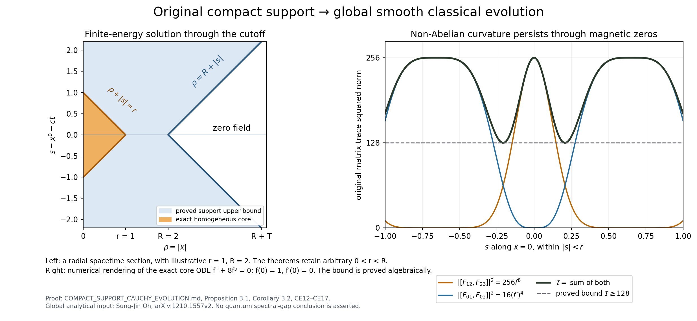
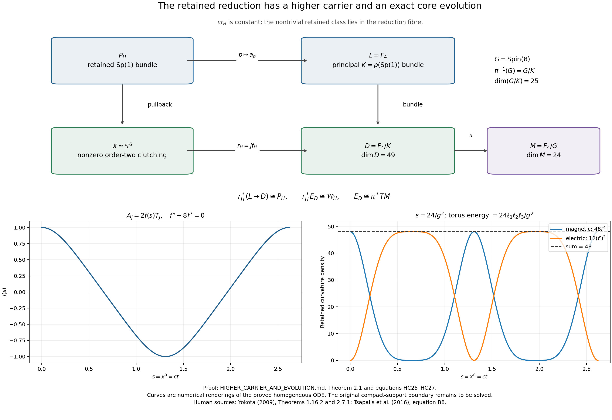
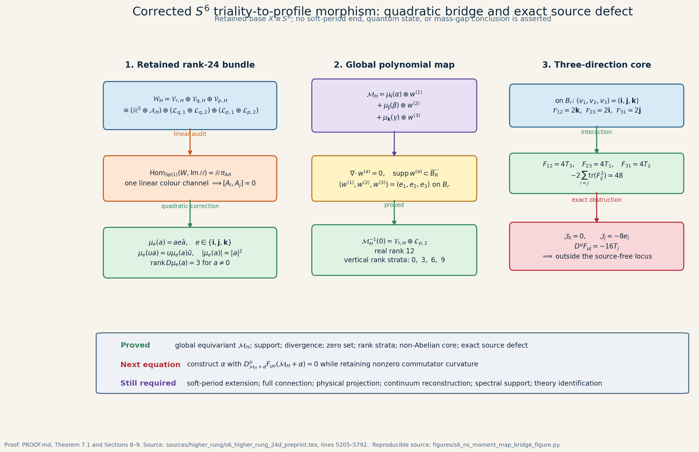
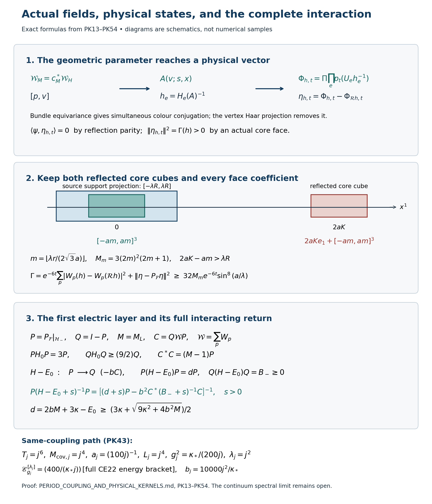
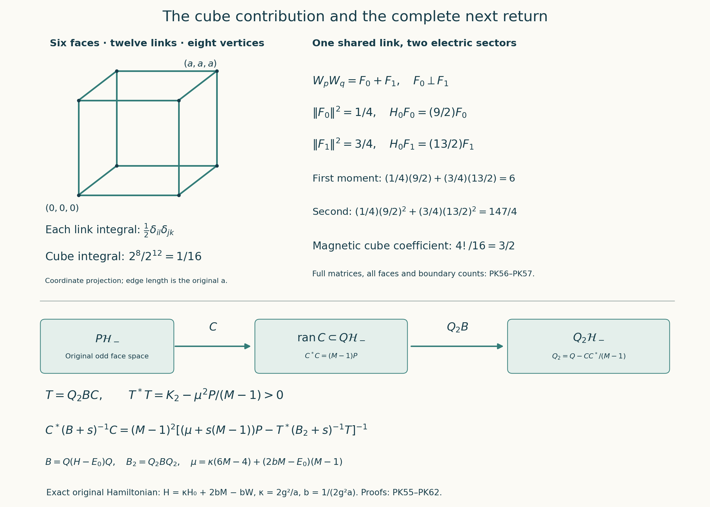
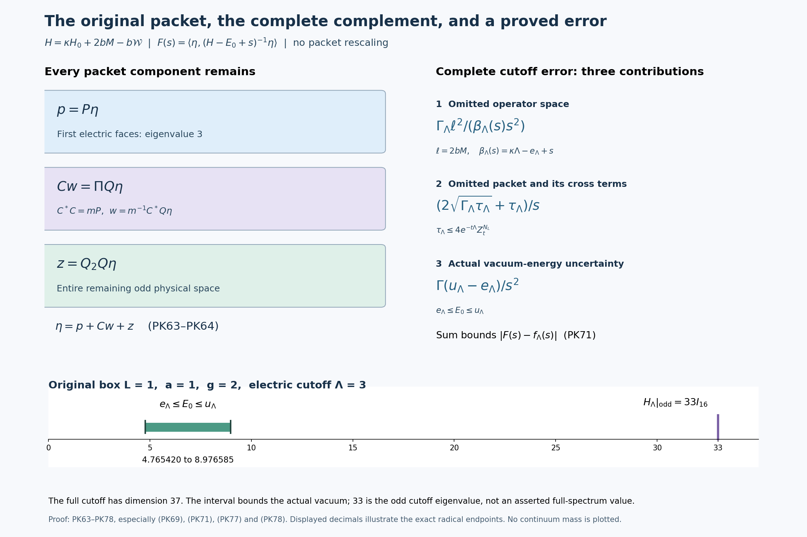

# S6-reduced triality-to-profile bridge for the Yang–Mills gapless-state programme

**Date:** 8 October 2026
**Status:** the original compactly supported family now has global smooth finite-energy source-free classical evolution, by an exact application of Sung-Jin Oh’s theorem. Complete proofs here give its support, energy, parameter, bundle and holonomy maps. The continuation now also constructs nonzero finite-lattice physical vectors, their complete kernels and an exact interacting return. The continuum spectral programme remains active.

## Programme goal

The programme goal is to construct a globally smooth, interacting, gapless state within the stated four-dimensional Yang–Mills axioms and then derive the resulting contradiction of the mass-gap statement. That is the research goal. It is not a conclusion of this continuation.

The construction starts with a global fibrewise polynomial map from the retained rank-24 triality bundle. Its [higher-carrier and evolution continuation](HIGHER_CARRIER_AND_EVOLUTION.md) now proves the missing base relation through \(F_4/\rho(\operatorname{Sp}(1))\), a 49-dimensional reduction carrier over the 24-dimensional flag. It also proves the full connection formula and turns the static source into an initial-acceleration calculation.

The [full compact-support Cauchy proof](COMPACT_SUPPORT_CAUCHY_EVOLUTION.md) applies [Sung-Jin Oh’s global theorem](https://arxiv.org/abs/1210.1557v2) to every original input, including its cutoff region and all four initial rank strata. It proves finite propagation, exact agreement with the homogeneous core inside its initial light cone, the full cutoff energy polynomial and its rank-12 zero set, smooth parameter dependence, bundle descent, dilation and actual link holonomies. For the equal-colour core, the sum of the two stated curvature-commutator squared norms remains at least 128 throughout that light cone. The [complete TeX source](COMPACT_SUPPORT_CAUCHY_EVOLUTION.tex) is available; [PDF compilation remains unverified](COMPACT_CAUCHY_TEX_COMPILE_STATUS.json) because the built-in compiler could not locate its standard platform directories.

The earlier correction \(A=C+s^2S/2\) and its computed residual are retained in the [higher-carrier proof](HIGHER_CARRIER_AND_EVOLUTION.md). The new classical solution supplies the full correction \(A-C\), with the expanding support bound and every original cutoff term. The finite physical-state construction is supplied below. The continuum state and spectral conclusion remain required.







*The retained nontrivial `Sp(1)` reduction supplies quaternionic line coordinates. Three equivariant quadratic moment maps convert those coordinates into three colour directions; three compactly supported curls convert them into spatial directions. The resulting core has nonzero commutator curvature and the displayed nonzero Yang–Mills source. The figure source is [s6_ns_moment_map_bridge_figure.py](figures/s6_ns_moment_map_bridge_figure.py).*

## Result proved here

Let \(X\cong S^6\), let \(P_H\to X\) be the retained pulled-back principal \(\operatorname{Sp}(1)\)-bundle, and write

\[
 \mathcal A_H=P_H\times_{\operatorname{Ad}}\operatorname{Im}\mathbb H,
 \qquad
 \mathcal L_H=P_H\times_L\mathbb H.
\]

The retained rank-24 bundle has the exact labelled splitting

\[
 \mathcal W_H\cong
 \mathbb R^5_{\mathrm{triv}}\oplus
 \mathcal A_H\oplus
 \mathcal L_{q,1}\oplus\mathcal L_{q,2}\oplus
 \mathcal L_{p,1}\oplus\mathcal L_{p,2}.
\]

The complete proof establishes four linked facts.

1. **The linear obstruction is exact.** Fibrewise,

   \[
   \operatorname{Hom}_{\operatorname{Sp}(1)}
   \bigl(\mathbb R^5_{\mathrm{triv}}\oplus
   \operatorname{Im}\mathbb H_{\operatorname{Ad}}\oplus
   \mathbb H_L^{\oplus4},
   \operatorname{Im}\mathbb H_{\operatorname{Ad}}\bigr)
   =\mathbb R\,\pi_{\operatorname{Ad}}.
   \]

   Every equivariant linear profile map therefore has one colour direction, so its commutator curvature vanishes.

2. **Quadratic moment maps overcome that obstruction.** For \(e\in\{\mathbf i,\mathbf j,\mathbf k\}\),

   \[
   \mu_e(a)=ae\bar a
   \]

   is \(\operatorname{Sp}(1)\)-equivariant and obeys

   \[
   |\mu_e(a)|=|a|^2,
   \qquad
   D\mu_e(a)D\mu_e(a)^{\mathsf T}=4|a|^2I_3,
   \qquad
   \det\!\bigl(D\mu_eD\mu_e^{\mathsf T}\bigr)=64|a|^6.
   \]

   Thus its differential has rank three away from the zero coordinate and rank zero at zero.

3. **The required global bundle morphism exists.** Choose the three compactly supported divergence-free curls \(w^{(1)},w^{(2)},w^{(3)}\) given in [PROOF.md](PROOF.md). With \(\zeta\) denoting every retained coordinate outside the four labelled quaternionic lines, define

   \[
   \mathcal M_H(\zeta;\alpha,\beta;\gamma,\delta)
   =\boldsymbol\mu_{\mathbf i}(\alpha)\otimes w^{(1)}
   +\boldsymbol\mu_{\mathbf j}(\beta)\otimes w^{(2)}
   +\boldsymbol\mu_{\mathbf k}(\gamma)\otimes w^{(3)}.
   \]

   This is a globally defined smooth fibrewise polynomial morphism from \(\mathcal W_H\) to compactly supported \(\mathcal A_H\)-valued divergence-free spatial profiles. Its zero set is the rank-12 subbundle retaining \(\mathcal V_{r,H}\) and the unused line \(\mathcal L_{p,2}\). Where exactly \(m\) of \(\alpha,\beta,\gamma\) are nonzero, its vertical differential has rank \(3m\).

4. **The first three-colour core is interacting and sourced.** On the constant-cutoff core at \(\alpha=\beta=\gamma=1\), the quaternionic potential components are \((\mathbf i,\mathbf j,\mathbf k)\), so

   \[
   \mathcal F_{12}=2\mathbf k,
   \qquad
   \mathcal F_{23}=2\mathbf i,
   \qquad
   \mathcal F_{31}=2\mathbf j.
   \]

   Under the exact Lie-algebra map

   \[
   \varphi(\mathbf i,\mathbf j,\mathbf k)=2(T_1,T_2,T_3),
   \qquad T_a=-\frac{i}{2}\sigma_a,
   \]

   this becomes

   \[
   F_{12}=4T_3,
   \qquad F_{23}=4T_1,
   \qquad F_{31}=4T_2,
   \]

   with magnetic density \(48\). The covariant source is

   \[
   \mathcal J=(-8\mathbf i,-8\mathbf j,-8\mathbf k),
   \qquad
   D^\mu F_{\mu j}=-16T_j.
   \]

The nonzero source is a proved obstruction, and it defines the next object rather than ending the programme:

\[
 \mathfrak C_{\mathcal M_H}
 =\left\{\alpha:\
 D_{\mathcal M_H+\alpha}^{\mu}
 F_{\mu\nu}(\mathcal M_H+\alpha)=0,
 \quad
 [\mathcal M_H+\alpha,\mathcal M_H+\alpha]\not\equiv0,
 \quad
 \text{Gauss, support, boundary, and regularity conditions hold}
 \right\}.
\]

The full Cauchy continuation constructs the correction \(A-C\) for every input, retaining all four quaternionic-line labels and the bundle transition law. Equations CE15–CE17 verify non-Abelian curvature for the equal-colour example. Equations CE34a and CE42–CE45 give the exact equal-field fibres and holonomy maps. The period/kernel continuation now carries out that coupling and finite-state construction. Its PK54 complementary return supplies the next exact spectral calculation.

## Corrections to the earlier route

The audit found several scope errors and repaired each affected statement.

- The earlier chart-supported bump profile showed that the receiving profile space was nonempty. It was independent of the rank-24 bundle point and therefore was not the required domain-to-profile map. The map \(\mathcal M_H\) above is the replacement.
- The proved \(\operatorname{Sp}(1)\) reduction is a bundle over \(X\cong S^6\). No reduction of the tangent frame bundle of \(F_4/\operatorname{Spin}(8)\) has been proved.
- The displayed spatial coefficients form a partial connection along the \(\mathbb R^3\) fibres. Section 4 of the [higher-carrier continuation](HIGHER_CARRIER_AND_EVOLUTION.md) now supplies the base components and computes every mixed curvature term.
- Equations CE42–CE45 now construct link holonomies of the actual classical solution family. PK24–PK45 construct physical projection, a nonzero vector orthogonal to the unique finite-lattice vacuum, the full Hamiltonian kernel and finite dynamics. Continuum reconstruction, its vacuum uniqueness, interaction and spectral support at arbitrarily small positive energy remain to be established.
- The retained Navier–Stokes material supplies regular divergence-free profiles and exact curvature/current formulae. It does not identify fluid time with Yang–Mills Hamiltonian time, and its singular endpoint is excluded from the smooth target.

The complete finding-by-finding record is [CLAIM_LEDGER.md](CLAIM_LEDGER.md), with a compact machine-readable companion in [CURRENT_CLAIM_DISPOSITIONS.json](CURRENT_CLAIM_DISPOSITIONS.json).

## Research programme

The [higher-domain programme](HIGHER_DOMAIN_PROGRAM.md) formalizes the proposed route: identify a domain functionally analogous to the retained \(S^6\) construction, preserve the soft-period and gauge data that matter, map the domain into interacting Yang–Mills profiles, solve the source equations, construct physical states, and test the reconstructed spectrum. The retained 24-dimensional triality carrier is a candidate source of structure; it is not already the desired domain.

The [spectral programme](SPECTRAL_PROGRAM.md) sharpens the “locally gapped, globally gapless” direction found in Claude's assessment. A viable limit must have nonzero continuum spectral weight in every \((0,\varepsilon)\), no second zero-energy vector, a unique vacuum, strong continuity, gauge-invariant local observables, reconstruction axioms, nontrivial interaction, and an exact identification with the theory selected by the original Yang–Mills action. High-energy escape by itself fails to create a nonzero continuum vector.

## Reading order

| Step | File | Purpose |
| --- | --- | --- |
| Current | [PERIOD_COUPLING_AND_PHYSICAL_KERNELS.md](PERIOD_COUPLING_AND_PHYSICAL_KERNELS.md) | Complete cusp coupling, finite physical vectors and kernels, corrected path, first electric layer and interacting return. |
| First | [COMPACT_SUPPORT_CAUCHY_EVOLUTION.md](COMPACT_SUPPORT_CAUCHY_EVOLUTION.md) | Global classical Cauchy theorem application and complete proofs of propagation, energy, parameter, bundle, dilation and holonomy formulas. |
| 0 | [HIGHER_CARRIER_AND_EVOLUTION.md](HIGHER_CARRIER_AND_EVOLUTION.md) | Exact higher-carrier pullback, full connection, complete temporal correction equation, Gauss-preserving path, and global homogeneous evolution. |
| 1 | [PROOF.md](PROOF.md) | Complete corrected theorem, all maps, ranks, curvature, source calculation, and next correction space. |
| 2 | [SP1_BUNDLE_BRIDGE.md](SP1_BUNDLE_BRIDGE.md) | Retained cusp class, subgroup injection, colour bundle, metric factors, and corrected partial-connection statement. |
| 3 | [HIGHER_DOMAIN_PROGRAM.md](HIGHER_DOMAIN_PROGRAM.md) | Full domain-to-state-to-spectrum programme and the exact role of S6, triality, and regular Navier–Stokes profiles. |
| 4 | [SPECTRAL_PROGRAM.md](SPECTRAL_PROGRAM.md) | Reconstruction requirements and the exact distinction among low-energy weight, a second vacuum, and spectral escape. |
| 5 | [CLAIM_LEDGER.md](CLAIM_LEDGER.md) | Overclaims, underclaims, corrected statements, proof locators, and unresolved consequences. |
| 6 | [SOURCE_PROVENANCE.md](SOURCE_PROVENANCE.md) | Source identity, authorship, hashes, reading coverage, and exact uses. |

## Reproduction

The six symbolic calculations check the stated coordinate identities; the newest has 60 exact checks. They do not certify the analytical global theorem. Its source application and the complete new arguments are in the written proofs.

```bash
python checks/verify_sp1_bundle_bridge.py
python checks/verify_sp1_moment_map_bridge.py
python checks/verify_three_colour_curvature.py
python checks/verify_higher_carrier_evolution.py
python checks/verify_compact_cauchy.py
python checks/verify_period_physical_kernels.py
python build_public_records.py
python verify_public_package.py
```

The published receipts are:

- [SP1_BUNDLE_BRIDGE_CHECK.json](checks/SP1_BUNDLE_BRIDGE_CHECK.json)
- [SP1_MOMENT_MAP_BRIDGE_CHECK.json](checks/SP1_MOMENT_MAP_BRIDGE_CHECK.json)
- [THREE_COLOUR_CURVATURE_CHECK.json](checks/THREE_COLOUR_CURVATURE_CHECK.json)
- [HIGHER_CARRIER_EVOLUTION_CHECK.json](checks/HIGHER_CARRIER_EVOLUTION_CHECK.json)
- [COMPACT_CAUCHY_CHECK.json](checks/COMPACT_CAUCHY_CHECK.json)
- [PUBLIC_VALIDATION.json](PUBLIC_VALIDATION.json)
- [PUBLIC_MANIFEST.json](PUBLIC_MANIFEST.json)

The six symbolic checks require Python and SymPy. The package verifier uses only Python's standard library. Retained programme source files are under [sources/](sources/); exact original-author reading records and external source links are in [SOURCE_PROVENANCE.md](SOURCE_PROVENANCE.md).

## Finite physical-state continuation, 8 October 2026

The [complete period and physical-kernel proof](https://github.com/KokunoYumeto/yang-mills-interacting-workbench/blob/main/yang-mills/continuations/20260930-s6-ns-moment-map-bridge/PERIOD_COUPLING_AND_PHYSICAL_KERNELS.md) now supplies the
full angular pullback, exact physical gauge projection, actual Gram and
Hamiltonian kernels, and a nonzero vector orthogonal to the interacting
finite-lattice vacuum. Equations PK43–PK43g correct the joint path while
retaining the same coupling and every original cutoff energy term.

Theorem 9.1 identifies the complete first electric layer. Equations PK47–PK49
strengthen the raw norm using all faces in both reflected core cubes.
Equations PK50–PK54 retain the full magnetic operator, calculate its first
compression and the exact complementary resolvent return. The continuum
spectral measure, reconstruction and theory identification remain the active
calculation; decreasing classical energy does not settle them.



[Complete TeX source](PERIOD_COUPLING_AND_PHYSICAL_KERNELS.tex), [sixty exact checks](checks/PERIOD_PHYSICAL_KERNEL_CHECK.json), [dated mathematical results](RESULTS_20261008.md), and [compilation status](PERIOD_PHYSICAL_TEX_COMPILE_STATUS.json) accompany the proof.

## Complete complementary moment, 9 October 2026

The [full complementary calculation](https://github.com/KokunoYumeto/yang-mills-interacting-workbench/blob/main/yang-mills/continuations/20260930-s6-ns-moment-map-bridge/PERIOD_COUPLING_AND_PHYSICAL_KERNELS.md) evaluates the second
electric moment and fourth magnetic compression, including every six-face
cube term. Theorem 9.2 and PK55–PK62 give the original C*B^2C, the nonzero
next map, its complete Gram and bounds, an exact second return, and a stronger
finite-volume upper resolvent bound. The vacuum shift, both coupling factors,
all face labels and boundary counts remain explicit. The next calculation is
the full second-complement return and actual heat-packet coefficients; the
continuum endpoint remains active.

[Forty-three exact checks](checks/COMPLEMENTARY_SECOND_MOMENT_CHECK.json) and [dated results](RESULTS_20261009.md) accompany the full proof.



## Full packet and complete cutoff, 9 October 2026

The [full packet calculation](https://github.com/KokunoYumeto/yang-mills-interacting-workbench/blob/main/yang-mills/continuations/20260930-s6-ns-moment-map-bridge/PERIOD_COUPLING_AND_PHYSICAL_KERNELS.md) gives both exact complementary
returns for the actual heat packet, with every cross term. PK65–PK75
give a finite electric cutoff, a proved interval for the actual vacuum
energy, and an explicit error for the full raw spectral transform.
The cutoff is specified on the original regulator path with error at most
Gamma_j/(kappa_* j). PK76–PK78 evaluate the whole first cutoff and the
original smallest-box example. A positive lower spectral mass and the
interacting continuum state remain active research calculations.

[Thirty-nine exact checks](checks/FULL_PACKET_RESOLVENT_CHECK.json) and [dated results](RESULTS_20261009.md) accompany the complete proof.



## Actual packet moments and spectral escape, 9 October 2026

The [complete PK79–PK100 calculation](https://github.com/KokunoYumeto/yang-mills-interacting-workbench/blob/main/yang-mills/continuations/20260930-s6-ns-moment-map-bridge/PERIOD_COUPLING_AND_PHYSICAL_KERNELS.md) evaluates the actual
first and second interacting moment kernels, with every shared-link
contraction and vacuum-shift term. A sharper variational vacuum bound
and an original-graph Haar estimate prove that the fixed-heat packet
loses its spectral-weight fraction even below the expanding threshold
kappa_* j. Its accurate finite cutoff is not the reason the low-mass
test failed: the actual fraction tends to zero.

The next state map is constructed using the full interacting semigroup.
Its raw norms, decreasing relative energy and preserved spectral support
are proved. The scale of its supported bottom and the required continuum
construction remain active research. This result concerns the specified
packet family; it does not settle the spectrum of other states.

## Actual odd vacuum observable, 9 October 2026

The [complete PK101–PK131 proof](https://github.com/KokunoYumeto/yang-mills-interacting-workbench/blob/main/yang-mills/continuations/20260930-s6-ns-moment-map-bridge/PERIOD_COUPLING_AND_PHYSICAL_KERNELS.md) constructs a bounded
smooth reflection-odd observable on the actual interacting vacuum.
At each fixed box its raw first-cluster weight tends to 3/32, and its
supported bottom is the actual lowest odd excitation. All limiting
raw spectral weights and the Euclidean-time correlation are evaluated.
The entire higher-carrier total space receives a global smooth map
through its three selected quaternionic squared norms, with the exact
original zero subbundle and parameter-dependent weights retained.

The original simultaneous path still needs estimates for its actual
odd energy and raw weights. The full continuum construction remains
the research target. The earlier vacuum upper bound is now linked
to its retained spatial-continuum proof with an exact parameter map.
