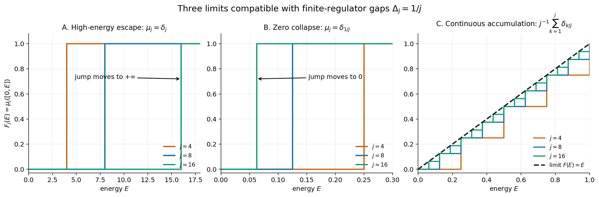

# Locally gapped, globally gapless Yang--Mills limits

## A research program extracted from the current source record

**Status:** research-program document, 2026-09-29.  It contains two proved
spectral propositions, an exact toy realization, a correction to the Claude
assessment, a map of the results already established in the spatial source,
and a sequence of calculations needed to decide whether the mechanism can
occur in a reconstructed Yang--Mills continuum.  It does **not** claim that
four-dimensional Yang--Mills has been constructed or shown to be gapless.

**Audit, 2026-09-30.**  The consistency model and Propositions 1--2 were
rechecked and remain valid at their stated abstract spectral scope.  They do
not turn a comparison measure into a gauge-theory state.  The corrected
classical domain map \(\mathcal M_H\) in
`PROOF.md` also does not meet the entry
conditions here: its first explicit interaction core has nonzero
Yang--Mills source, and no physical projection or continuum reconstruction
has been constructed.

*Figure 1.  Three mathematically different limits can accompany finite gaps
\(\Delta_j=1/j\).  In A, the observed unit mass leaves every bounded energy
interval.  In B, a vacuum-orthogonal unit mass becomes a zero-energy atom.  In
C, the measures converge to a continuous measure with support reaching zero
and with no atom at zero.  Only C has the spectral shape required for a
unique-vacuum, gapless limit.  The reproducible source is
`figures/locally_gapped_spectral_limits.py`.*

## 1. Decision

The direction is well posed after one essential sharpening.  The phrase
"finite gaps close while spectral weight escapes" joins two different
phenomena.  Closing finite gaps is compatible with a gapless continuum.
Escape of a normalized state's spectral mass to arbitrarily high energy is an
obstruction to using that state as a continuum vector.  The desired mechanism
is instead **nonzero continuum spectral weight in every interval
\((0,\varepsilon)\), no extra atom at zero, and a common continuum
reconstruction in which those measures are spectral measures of local
gauge-invariant observables**.

This is a precise construction problem.  If it succeeds for a nontrivial
four-dimensional \(SU(2)\) theory satisfying reconstruction axioms and having
a unique vacuum, it produces a gapless continuum Yang--Mills theory.  A
counterexample claim additionally requires identification with the theory
selected by the Yang--Mills action through a universality or uniqueness
theorem.  That identification is part of the programme goal rather than an
optional classification after the spectral construction.  The research
direction is therefore scientifically sharp and exceptionally
demanding.  The likely failure modes are also mathematically informative:
triviality, a free massless limit, vacuum degeneracy, loss of strong
continuity, path dependence, or failure of the reconstruction axioms.

## 2. The formulation found in Claude's paper

Claude's assessment occurs in `y9a_directions.tex`, lines 5--7, under
"Locally gapped, globally gapless sequences."  It says that the direction is
well posed and identifies the next requirement as a sequence whose limit
satisfies the reconstruction axioms.  The corresponding exact question is
`y9_open.tex`, line 12:

> Can a sequence of the spatial line's kind, in which finite gaps close while
> spectral weight escapes to high energy, be realised along a path whose limit
> satisfies the reconstruction axioms of the continuum problem?

That question is the right starting point, but two corrections are needed.

1. High-energy escape is a negative control, not the desired continuum
   spectral behavior.  The spatial source itself proves that the selected
   normalized magnetic state loses all probability on bounded energies and
   that its positive-time autocorrelation tends to zero while its norm at
   time zero stays one.  Such data do not define a strongly continuous
   Hamiltonian orbit of a nonzero limiting vector.
2. Claude's preceding description says that Section 20 has a
   "unique-vacuum realisation" of the second observable.  The source proves
   the opposite.  Equations (251)--(256), especially lines 4639--4657, give
   \(\nu_{g_j,j}\Rightarrow d\delta_0\),
   \(d=1-2^{-3/2}>0\), for nonzero vacuum-orthogonal vectors.  Any continuum
   realization preserving the centering then has a second zero-energy vector
   and cannot have a unique vacuum.

Claude's verdict survives both corrections.  They make the target more
specific and turn the existing failures into exact tests for every proposed
construction.

## 3. Exact object to be constructed

For each regulator index \(j\), retain the full data

\[
 \mathcal R_j=
 (\Lambda_j,a_j,g_j,\mathcal H_j^{\mathrm{phys}},\mathcal A_j,
  H_j,\psi_j,E_j,\Delta_j),
\]

where

\[
 \Lambda_j=\{-L_j,\ldots,L_j\}^3,\qquad
 A_j=H_j-E_j\ge 0,
\]

and the Hamiltonian is retained in its original normalization,

\[
 H_j=\frac{2g_j^2}{a_j}\sum_e E_e+
     \frac{1}{2g_j^2a_j}\sum_p(2-W_p).
\]

The physical Hilbert space is the gauge-invariant subspace, including gauge
transformations at boundary vertices.  The finite gap is

\[
 \Delta_j=\inf\bigl(\operatorname{spec}(A_j)\setminus\{0\}\bigr)>0.
\]

The existing spatial diagonal uses

\[
 L_j=j^2,\qquad a_j=\frac1{100j},\qquad
 \ell_j=a_j(2L_j+1)=\frac{2j^2+1}{100j}\longrightarrow\infty.
\]

A **locally gapped, globally gapless Yang--Mills limit** consists of these
regulator data together with exact refinement or comparison maps for a common
algebra of bounded, gauge-invariant, physically supported observables and a
reconstructed limit

\[
 (\mathcal H,\mathcal A,\Omega,A),\qquad A\ge0,
\]

with all of the following properties established:

1. every \(A_j\) has a unique vacuum and \(\Delta_j>0\);
2. the finite Euclidean correlation functions converge on the common
   observable algebra, with support, adjoint, gauge action, time ordering,
   and every renormalization factor specified;
3. the limiting correlations satisfy the chosen Osterwalder--Schrader or an
   equally strong reconstruction system, yielding \(\mathcal H\), \(\Omega\),
   and the strongly continuous semigroup \(e^{-tA}\);
4. the limit is nontrivial and interacting, proved by a nonzero local
   variance and at least one connected correlation that is not a Wick
   contraction of a free field;
5. \(\ker A=\mathbb C\Omega\);
6. \(\inf(\operatorname{spec}(A)\cap(0,\infty))=0\).

Items 2--6 prevent a closing finite-volume eigenvalue from being mistaken for
a continuum field theory.

## 4. The concept is mathematically consistent

The following construction proves that "gapped at every finite regulator,
gapless with a unique vacuum in the limit" is not internally contradictory.

For \(j\ge1\), let

\[
 \mathcal K_j=\mathbb C\Omega_j\oplus\mathbb C^j,
 \qquad
 B_j\Omega_j=0,
 \qquad
 B_je_{j,k}=\frac{k}{j}e_{j,k}\quad(1\le k\le j).
\]

Then \(\ker B_j=\mathbb C\Omega_j\) and the finite gap is exactly
\(1/j\).  Put

\[
 v_j=\frac1{\sqrt j}\sum_{k=1}^j e_{j,k}.
\]

Its spectral measure is

\[
 \mu_j=\frac1j\sum_{k=1}^j\delta_{k/j}.
\]

Define

\[
 \mathcal K=\mathbb C\Omega\oplus L^2((0,1),dE),
 \qquad B\Omega=0,\qquad (Bf)(E)=Ef(E),
\]

and define the exact isometry

\[
 I_j\Omega_j=\Omega,
 \qquad
 I_je_{j,k}=\sqrt j\,\mathbf 1_{((k-1)/j,k/j]}.
\]

The images of the \(e_{j,k}\) are orthonormal, \(I_jv_j=\mathbf1_{(0,1)}\),
and on \(I_j\mathcal K_j\)

\[
 \left\|I_jB_jI_j^*-B\right\|\le\frac1j.
\]

Indeed, on the \(k\)-th interval the two multiplication functions are
\(k/j\) and \(E\), whose difference lies in \([0,1/j]\).  Hence the
spectral measures converge by the Riemann-sum identity

\[
 \int f\,d\mu_j=\frac1j\sum_{k=1}^j f(k/j)
 \longrightarrow\int_0^1 f(E)\,dE
\]

for every continuous \(f\) on \([0,1]\).  Multiplication by \(E\) has no
nonzero \(L^2\) vector supported at the measure-zero set \(\{0\}\), so

\[
 \ker B=\mathbb C\Omega,
 \qquad \operatorname{spec}(B)=\{0\}\cup[0,1],
 \qquad \inf(\operatorname{spec}(B)\cap(0,\infty))=0.
\]

This exact morphism proves logical consistency.  It contains no gauge fields,
locality, or interaction, so it supplies a model for the spectral mechanism
and nothing more.

## 5. Two proved spectral criteria

### Proposition 1: a continuum spectral detector

Let \(A\ge0\) be self-adjoint on \(\mathcal H\), let
\(\ker A=\mathbb C\Omega\), and let \(v\perp\Omega\) be nonzero.  Write
\(\mu_v(S)=\langle v,\mathbf1_S(A)v\rangle\).  If

\[
 \mu_v((0,\varepsilon))>0\qquad\text{for every }\varepsilon>0,
\]

then \(A\) has no positive spectral gap.

**Proof.**  If a gap \(m>0\) existed, the spectral projection
\(\mathbf1_{(0,m)}(A)\) would vanish.  This would give
\(\mu_v((0,m))=0\), contrary to the stated property.  The condition
\(v\perp\Omega\) and the identity \(\ker A=\mathbb C\Omega\) also give
\(\mu_v(\{0\})=0\).  Thus the measure reaches arbitrarily low positive
energy without producing a second vacuum.  \(\square\)

### Proposition 2: the positive-time form needed for distributional fields

Let \(\nu\) be a nonzero, locally finite positive measure on
\([0,\infty)\) such that

\[
 C(t)=\int_0^\infty e^{-tE}\,d\nu(E)<\infty
 \qquad(t>0).
\]

For any \(s>0\), the finite measure
\(d\mu_s(E)=e^{-sE}d\nu(E)\) has exactly the same support as \(\nu\).
If \(\nu(\{0\})=0\) and \(\nu((0,\varepsilon))>0\) for every
\(\varepsilon>0\), then every positive-time vector represented by
\(\mu_s\) detects gaplessness by Proposition 1.  Moreover,

\[
 \lim_{t\to\infty}-\frac1t\log C(t)=0.
\]

**Proof.**  The multiplier \(e^{-sE}\) is strictly positive at every
finite \(E\), so it neither removes nor adds support.  For the decay rate,
fix \(\varepsilon>0\).  Positivity on \((0,\varepsilon)\) gives

\[
 C(t)\ge e^{-t\varepsilon}\nu((0,\varepsilon)).
\]

Consequently

\[
 \limsup_{t\to\infty}-t^{-1}\log C(t)\le\varepsilon.
\]

The expression has nonnegative limit inferior because \(C(t)\le C(s)\)
for \(t\ge s>0\), and the constant \(C(s)\) disappears after division by
\(t\).  Sending \(\varepsilon\downarrow0\) proves the limit.  \(\square\)

Proposition 2 is important for the directional-electric source.  Its raw
time-zero norm diverges, but its positive-time spectral measures are finite.
Ultraviolet divergence of a field at a sharp time does not by itself remove
the low-energy support.  What remains to be proved is that these positive-time
vectors belong to one reconstructed interacting Yang--Mills Hilbert space.

## 6. Three obstruction spaces

Every obstruction defines a precise space of regulator sequences.

### 6.1 High-energy escape space \(\mathfrak E_\infty\)

A normalized sequence \(v_j\perp\psi_j\) belongs to
\(\mathfrak E_\infty\) when

\[
 \mu_{v_j}([0,R])\longrightarrow0
 \qquad\text{for every }R<\infty.
\]

Then
\(\langle v_j,e^{-tA_j}v_j\rangle\to0\) for every fixed \(t>0\), while
the value at \(t=0\) remains one.  Any proposed nonzero vector limit with
these correlations violates strong continuity at zero.  Sections 18 and 26
provide Yang--Mills examples of this type.

### 6.2 Zero-collapse space \(\mathfrak E_0\)

A centered sequence belongs to \(\mathfrak E_0\) when its nonzero raw mass
converges to \(d\delta_0\), \(d>0\).  If centering and norm survive, the
limit contains a nonzero vector orthogonal to the vacuum in \(\ker A\).
Section 20 and the radial vacuum image in Section 22 provide exact examples.

### 6.3 Continuous-accumulation space \(\mathfrak E_{\mathrm{cont}}\)

The desired spectral sequences have a common continuum interpretation and a
locally finite limiting measure \(\nu\) satisfying

\[
 \nu(\{0\})=0,
 \qquad
 0<\nu((0,\varepsilon))<\infty
 \quad(\varepsilon>0),
 \qquad
 \int e^{-tE}\,d\nu(E)<\infty
 \quad(t>0).
\]

These conditions distinguish continuous infrared accumulation from both
escape and vacuum degeneracy.  They are spectral conditions; the common
observable algebra and reconstruction work is what turns them into a field
theory.

## 7. What is already available in the Yang--Mills source

The current spatial manuscript supplies much more than the phrase "closing
gaps."  The following table records the exact role of each family.

| Source object | Established behavior | Role in this program |
|---|---|---|
| Weighted electric covariance \(\Gamma=\sum_{e=(n,1)}n_2^2E_e\), Sections 17--18 and 25 | Fixed-box oscillator transfer; exact raw measure; on \(L_j=j^2\), \(a_j=(100j)^{-1}\), bounded-energy probability has order \(j^{-5}\); selected actual sequence and native magnetic transfer are proved | Negative control for normalized probabilities; source of exact raw finite-energy scaling |
| Bounded low-mode observable, Section 20 | \(\nu_{g_j,j}\Rightarrow (1-2^{-3/2})\delta_0\) on a separately selected sequence | Exact test for vacuum degeneracy |
| Radial family, Sections 22--23 | Raw mass occurs in every \((0,\varepsilon)\), but the centered vacuum image produces a nonzero zero-energy limit; an exact finite-band correspondence to local curvature profiles is proved with leakage retained | Bridge between phase directions and local profiles; zero-collapse control |
| Direction-one electric family, Section 24 | For nonzero compact smooth \(h\), the exact density \(\rho_h^E(\omega)\) is positive for every \(\omega>0\), has no zero atom, and has finite positive-time Laplace transforms; actual selected positive couplings give vague raw convergence on bounded energies | Strongest present seed for \(\mathfrak E_{\mathrm{cont}}\) |
| Original noncompact weighted trace, Section 25 | \(a^2\ell^{-7}m_{L,a}^\Gamma\to \omega^4(102400\pi^2)^{-1}d\omega\) locally; total mass and finite-energy fraction are computed; transfer is on a selected coupling and strengthened cusp | Exact macroscopic scaling benchmark |
| Original finite-angle native state, Section 26 | Low-energy probability is smaller than every power of the selected positive coupling; the original-depth selected sequence has maximal spectral separation | Negative control for finite-angle native continuation |

The key positive density is equation (381):

\[
 \rho^E_h(\omega)=\frac1{2560\pi^5}
 \int_{|k|<\omega}|\widehat h(k)|^2
 \left[(\omega^2-|k|^2)^2+
       (\omega^2-|k|^2)(|k|^2-k_1^2)+
       (|k|^2-k_1^2)^2\right]dk.
\]

For every nonzero \(h\in C_c^\infty(\mathbb R^3;\mathbb R)\), the source
proves

\[
 \rho_h^E(\omega)>0\quad(\omega>0),
 \qquad \nu_h^E(\{0\})=0,
 \qquad \nu_h^E((0,\varepsilon))>0\quad(\varepsilon>0).
\]

Near zero, if \(m\) is the first nonzero homogeneous Taylor degree of
\(\widehat h\), equation (392) gives

\[
 \rho_h^E(\omega)=A^E_{h,m}\omega^{7+2m}
                  +O_h(\omega^{8+2m}),
 \qquad A^E_{h,m}>0.
\]

This already has the required infrared shape.  Its present common Hilbert
representation is the explicitly free transverse two-particle
multiplication representation of Section 24.6.  The source expressly does
not identify it with the full interacting continuum theory or establish the
products of several local observables.  Those are the central missing maps.

## 8. The research program

### Work package A: freeze the directed regulator category

Retain the exact finite Hamiltonians and construct explicit refinement maps
between physically supported gauge-invariant observable algebras.  For a
bounded physical region \(O\subset\mathbb R^3\), define
\(\mathcal A_j(O)\) from Wilson loops, electric-energy insertions, and bounded
functional calculus of those operators whose lattice support lies in \(O\).
For \(j<k\), construct

\[
 \iota_{j,k,O}:\mathcal A_j(O)\longrightarrow\mathcal A_k(O^{+r_{j,k}})
\]

with the support enlargement \(r_{j,k}\) stated exactly and tending to zero.
Prove compatibility with adjoints, gauge invariance, disjoint supports, and
composition.  Record the exact defect when strict composition fails; that
defect defines the corresponding enlarged observable space.

The output is a common local algebra on which correlation convergence has a
meaning independent of changing Hilbert-space dimension.

### Work package B: replace selected diagonals by prescribed trajectories

The source selects \(g_j\) after asking that finitely many stage-\(j\) tests
hold.  This proves existence of useful diagonals but does not define a
renormalization trajectory.  Carry both stated trajectories until one is
excluded by proof:

\[
 g_j^2=\frac1{\log j},
 \qquad
 g_j^2=\frac{\kappa_*}{200j}.
\]

Also formulate a step-scaling trajectory by fixing one gauge-invariant
finite-volume observable at a reference physical scale.  The observable, its
boundary conditions, and the equation determining \(g_j\) must be exact.
Prove existence and uniqueness of the chosen bare coupling at each stage,
then compare that trajectory with the two displayed paths.

The first concrete estimate should concern the Section 24 positive-time
covariances.  For compact profiles \(h,k\) and \(t\ge t_0>0\), derive a
growing-volume bound for

\[
 \left|C^E_{g_j;h,k}(t)-C^{E,L_j,a_j}_{0;h,k}(t)\right|.
\]

The fixed-box convergence used to select dyadics is insufficient.  The needed
bound must display its dependence on \(L_j,a_j,g_j,t_0\) and the exact
seminorms of \(h,k\).  Positive-time damping is retained because it controls
the ultraviolet mass without altering the infrared support.

### Work package C: multiscale control of the actual vacuum

The strong-coupling local expansion does not persist automatically toward
\(g_j\downarrow0\).  Use the exact ground-state transform together with the
blocking maps to prove scale-dependent bounds for actual-vacuum connected
correlations.  The required estimates include:

\[
 \left|\langle X_1\cdots X_n\rangle_{\psi_j}^{\mathrm{conn}}\right|
\]

for bounded gauge-invariant operators with specified supports and, separately,
the weighted fourth and sixth moments entering the exact finite-angle
remainder.

The source isolates the latter obstruction in equations (P1)--(P6).  Its
exact relative remainder is bounded by

\[
 \frac13\theta_j^2
 \frac{\|\Gamma^2\psi_j\|}{\|v_{\Gamma,j}\|},
\]

and the available estimate grows like \(j^4g_j^{-2}\).  What would close the
calculation is control of the **centered** fourth and sixth fluctuations at
their natural covariance scale, rather than control by the full
\(\|\Gamma^2\psi_j\|\).  In the comparison scaling

\[
 g_j^4\|v_{\Gamma,j}\|^2\asymp L_j^7,
\]

a centered fourth-order norm of order \(g_j^{-4}L_j^7\) would make the
relative fourth-order contribution scale as

\[
 \theta_j^2g_j^{-2}L_j^{7/2}.
\]

With \(L_j=j^2\) and \(\theta_j\asymp j^{-6}\), this is
\(j^{-5}g_j^{-2}\), hence \(j^{-5}\log j\) on the logarithmic path and a
constant multiple of \(j^{-4}\) on the fixed-electric-coefficient path.
This calculation identifies the exact gain required from a connected-moment
theorem.  It does not assert that the theorem already holds.

The directional-electric route should be pursued first because it avoids
expanding the finite-angle magnetic operator and already has an exact positive
infrared density.  The finite-angle route remains an independent comparison
and universality test.

### Work package D: construct Euclidean correlation limits

For ordered Euclidean times \(t_1\le\cdots\le t_n\) and bounded members of
the common algebra, retain the exact finite-regulator functions

\[
 S_j(O_1,t_1;\ldots;O_n,t_n)=
 \left\langle\psi_j,
 O_1e^{-(t_2-t_1)A_j}O_2\cdots
 e^{-(t_n-t_{n-1})A_j}O_n\psi_j\right\rangle.
\]

Establish convergence jointly in insertion times and spatial translations on
a countable dense test algebra, then extend by the proved bounds.  Keep the
renormalization factor of every unbounded or distributional field explicit.
For the Section 24 field, use positive-time insertions first; its raw norm is
known to diverge.

The limit must retain:

- Euclidean-time translation and reflection;
- spatial translation and the restoration of rotations, including rotation
  of the preferred direction-one axis used in the source calculation;
- reflection positivity;
- symmetry under permutation of spacelike-separated gauge-invariant
  insertions;
- the regularity needed for reconstruction;
- clustering in the vacuum sector;
- projective consistency as the physical box grows.

Reflection positivity at each regulator is useful only after the observable
maps and limiting topology are fixed.  Prove that the positivity cone is
closed in that topology.

### Work package E: reconstruct and prove uniqueness

Apply the chosen reconstruction theorem to the completed limiting Schwinger
functional.  Construct the Hilbert space as the quotient by its exact null
space, prove strong continuity of time translations, and identify their
nonnegative generator \(A\).

Prove vacuum uniqueness from a cluster theorem on the completed local
algebra.  Test every candidate field against the zero-collapse criterion:
any nonzero centered vector with constant positive-time autocorrelation must
be exhibited as a second kernel vector and excludes that branch.

Nontriviality requires a gauge-invariant local observable with strictly
positive limiting variance.  Interaction requires more: calculate a
connected four-point function and prove that it differs from the sum of Wick
pairings.  Without this step, the Section 24 representation may describe only
a free transverse massless sector.

### Work package F: transport the infrared density into the reconstructed theory

For a fixed nonzero \(h\in C_c^\infty(\mathbb R^3;\mathbb R)\), construct
the reconstructed positive-time vector \(v_{h,s}\) whose finite-regulator
spectral measures are

\[
 d\mu_{j,h,s}(E)=e^{-sE}\,d\nu^E_{j,h}(E).
\]

Prove convergence against every compactly supported continuous energy test
and identify

\[
 d\mu_{h,s}(E)=e^{-sE}\rho_h^E(E)\,dE
\]

or compute the exact interacting replacement.  Then prove

\[
 \mu_{h,s}(\{0\})=0,
 \qquad
 \mu_{h,s}((0,\varepsilon))>0
 \quad(\varepsilon>0).
\]

Proposition 1 then proves gaplessness in the reconstructed Hilbert space.
If interaction changes the density, the program needs only the two displayed
support properties, but every changed coefficient and threshold must be
derived.

### Work package G: determine the role of the \(S^6\) period data

The current bridge uses the full regular-fibre expression

\[
 D=L_Tq_T+6m_T^2>0,
 \qquad \theta=\frac{2\pi a^2}{D},
\]

to define a magnetic background.  Keep \(D\) explicit.  Run the continuum
construction for two distinct admissible period data and compare all local
gauge-invariant Schwinger functions.

There are two mathematically distinct outcomes:

1. the limits agree, in which case the period data select regulator
   representatives but disappear from local continuum observables;
2. the limits differ, in which case construct the exact map from period data
   to superselection or background sectors and prove the reconstruction
   axioms in each sector.

The proposed higher-dimensional or Leech-lattice extension begins only after
this dichotomy is decided.  It is not needed to establish the core spectral
mechanism.

### Work package H: universality and comparison of paths

Repeat the reconstructed local correlations and infrared spectral measure on
the prescribed paths that survive Work package B.  Construct an isomorphism
of the resulting local nets, vacua, and time-translation generators.  If an
exact invariant distinguishes the limits, record it as the definition of the
remaining comparison space and continue by constructing the morphism needed
to identify the intended Yang--Mills theory.  Matching only a gap sequence is
insufficient; the comparison must include products of local observables and
the interaction witness.

## 9. Milestones and dependency order

1. **R1 -- Exact regulator morphisms.**  Complete Work package A and verify
   the maps on Wilson loops, electric energies, and the Section 24 profiles.
2. **R2 -- Prescribed-path two-point estimate.**  Prove the growing-volume
   positive-time bound in Work package B on at least one prescribed path.
3. **R3 -- Multiscale vacuum bounds.**  Establish the connected local bounds
   needed for all \(n\)-point functions; separately settle the centered
   fourth/sixth-moment estimate for the native magnetic route.
4. **R4 -- Limiting Schwinger functional.**  Construct all mixed local
   correlations on a dense algebra and prove reflection positivity,
   regularity, Euclidean covariance, and clustering.
5. **R5 -- Reconstruction.**  Build \((\mathcal H,\mathcal A,\Omega,A)\),
   prove \(\ker A=\mathbb C\Omega\), and prove nontriviality.
6. **R6 -- Interaction witness.**  Prove a nonzero connected local
   correlation beyond Wick pairings.
7. **R7 -- Infrared transport.**  Identify the spectral measure of one
   reconstructed local positive-time vector and prove that it has positive
   mass in every \((0,\varepsilon)\) and no atom at zero.
8. **R8 -- Gaplessness conclusion.**  Apply Proposition 1 only after R4--R7
   are complete.
9. **R9 -- Period and path comparison.**  Decide whether \(D\) and the
   prescribed bare-coupling path disappear, label sectors, or produce
   inequivalent limits.

R2 is the next calculation.  It attacks the strongest existing candidate
measure without waiting for the harder native finite-angle moment problem.

## 10. Exact failure certificates

Each unsuccessful branch must end with one of the following proved records,
not with an informal statement that the limit "does not work."

- **Escape certificate:** a compact-energy probability tends to zero and the
  time-zero/positive-time correlation discontinuity is shown.
- **Zero-collapse certificate:** a centered nonzero vector converges to an
  atom at zero, producing a second kernel vector.
- **Triviality certificate:** every bounded gauge-invariant local observable
  acts by a scalar in the limiting vacuum sector.
- **Free-limit certificate:** all connected correlations above order two
  vanish and the two-point function identifies the free transverse
  representation.
- **Axiom certificate:** name the failed reconstruction property and exhibit
  the exact test functions for which it fails.
- **Path certificate:** two prescribed trajectories give different local
  correlation invariants.
- **Gauge certificate:** the proposed observable or comparison map fails to
  preserve the physical gauge-invariant space.

These spaces of failed limits remain mathematical outputs and guide the next
construction.

## 11. Underclaims, overclaims, and propagation

| ID | Finding | Correction or strengthening | Propagation |
|---|---|---|---|
| LGGG-20260929-001 | Claude calls the direction well posed | Agreed after separating high-energy escape from continuous infrared accumulation | Definition in Sections 3 and 6; milestones R4--R8 |
| LGGG-20260929-002 | Claude describes a unique-vacuum realization in Section 20 | Overclaim: the source proves a second zero-energy vector if centering survives | Exclusion test in Work package E and failure certificates |
| LGGG-20260929-003 | Claude emphasizes escape as the distinguishing phenomenon | Strengthening: Section 24 already proves an exact locally finite density with positive mass in every positive interval and no zero atom | Directional-electric route becomes the first positive candidate |
| LGGG-20260929-004 | The spatial source treats diverging unfiltered mass as part of its limit analysis | Proposition 2 shows that finite positive-time measures preserve the full infrared support; divergence at sharp time is compatible with a distributional field | Work packages D and F |
| LGGG-20260929-005 | Selected dyadic couplings establish many simultaneous tests | They do not define a prescribed renormalization trajectory | Work package B and universality milestone R9 |
| LGGG-20260929-006 | The \(S^6\) number \(D\) drives the magnetic background | The abstract spectral mechanism does not require \(D\); its continuum role must be proved by a two-background comparison | Work package G |

## 12. Source witnesses and reading scope

1. **Claude assessment.**
   `sources/claude/y9a_directions.tex`,
   SHA-256
   `2a1a53ad2245a2ead619b038efd55eca7de1b7a8e48eb08d22ad0df6737fc8eb`,
   whole file read; exact locator lines 5--7.
2. **Claude open question.**
   `sources/claude/y9_open.tex`,
   SHA-256
   `a21350081133a66ea6e0c0720848c50831a893a29f2777dc0ec66dfba46985c0`,
   whole file read; exact locator line 12.
3. **Spatial source.**
   `sources/spatial/spatial_continuum.tex`,
   SHA-256
   `e035407b59854b77307ad1bb0021a4f834aa13231ca6028f2b8de5409ab5aba4`.
   Passages used here: Sections 17--18; equations (251)--(256); Sections
   22--26; equations (378)--(417), (418)--(448), (P1)--(P6); and the
   conclusion in Section 28.  This reading does not certify every other
   theorem in the 8,991-line manuscript.
4. **Official problem target.**  The
   [Clay Mathematics Institute problem page](https://www.claymath.org/millennium/yang-mills-the-maths-gap/),
   checked on 30 September 2026, identifies the problem as unsolved and links
   the official problem description by Arthur Jaffe and Edward Witten.  That
   official description requires a nontrivial quantum Yang--Mills theory on
   \(\mathbb R^4\) for every compact simple gauge group, a positive mass gap,
   and axiomatic properties at least as strong as the cited systems.  No
   author TeX source is offered there; the HTML page and its linked official
   description are therefore recorded as the accessible primary statement.
   The programme's reconstruction and theory-identification requirements are
   tied to this target.

## 13. Completion condition

The program is complete only when one prescribed regulator trajectory has a
common gauge-invariant local observable algebra, convergent Euclidean
correlations satisfying the reconstruction axioms, a nontrivial interacting
reconstructed theory with a unique vacuum, and a reconstructed local
positive-time vector whose spectral measure has no zero atom and positive
mass in every \((0,\varepsilon)\).  It must also prove the universality or
identification theorem connecting that reconstruction to the
four-dimensional Yang--Mills theory in the mass-gap statement and derive the
contradiction.  Closing finite gaps, selected-diagonal convergence, a
spectral density living only in the free comparison space, or an unidentified
gapless branch does not meet this condition.

## Higher carrier and source evolution — proved continuation

The complete derivation is in [HIGHER_CARRIER_AND_EVOLUTION.md](HIGHER_CARRIER_AND_EVOLUTION.md).
Its Theorem 2.1 constructs the exact map \(r_H:X\to D=F_4/\rho(\operatorname{Sp}(1))\),
with \(r_H^*(F_4\to D)\cong P_H\), \(\pi r_H\) constant, and
\(E_D\cong\pi^*T(F_4/\operatorname{Spin}(8))\). The dimensions are
\(\dim D=49\), \(\dim(F_4/\operatorname{Spin}(8))=24\), and fibre dimension 25.
The profile map extends to \(E_D\); its pullback is exactly \(\mathcal M_H\).
Section 4 supplies a full parameter-space connection and retains its mixed curvature.

For the original compactly supported profile \(C=\mathcal M_H(v)\), the source
\(S_j=\sum_iD_iF_{ij}(C)\) is a permitted initial acceleration with zero
initial electric field. Proposition 6.1 proves that \(A=C+s^2S/2\) preserves
Gauss's law exactly, retains the support, and has the complete residual
\(s^2L/2+s^4Q/4+s^6N/8\). Theorem 7.1 constructs the exact source-free
homogeneous core evolution for every input and every initial rank stratum.
For the equal-colour core, \(f''+8f^3=0\) has
\(f'^2+4f^4=4\) and physical energy density \(24/g^2\).

The homogeneous solution has finite energy on each stated spatial torus and
infinite total energy on \(\mathbb R^3\) when it is nontrivial. The original
cutoff boundary still requires the full PDE correction. Proposition 9.1 proves
that a nonzero-curvature compactly supported correction cannot remain static.
At this earlier checkpoint the next calculation retained time evolution, the support boundary,
and the full soft-period data. The quantum-state and reconstruction goal remains active.

## Global compact-support Cauchy continuation

The complete proof is [COMPACT_SUPPORT_CAUCHY_EVOLUTION.md](COMPACT_SUPPORT_CAUCHY_EVOLUTION.md).
Theorem 2.1 applies Oh's established global theorem to the original cutoff
data with zero electric field, checking every hypothesis and the metric,
trace, coupling and time conventions. Proposition 3.1 gives the support
bound \(R+|s|\), and Corollary 3.2 proves exact agreement with the
homogeneous solution on \(|x|+|s|<r\). The gauge-invariant core witness
in CE17 is at least 128, including at magnetic zeros.

Proposition 4.1 identifies the energy-zero inputs exactly with the original
rank-12 subbundle. CE22 retains all cutoff energy terms. Sections 5–6 prove
smooth parameter dependence, exact solution-map ranks and fibres, bundle
descent and every mixed curvature component. CE38–CE45 retain dilation,
support, energy and the ordered gauge-equivariant link-holonomy map.

The classical finite-energy Cauchy step is now supplied. The complete
period and monodromy coupling, physical gauge projection, actual Gram and
Hamiltonian kernels, quantum spectrum and continuum reconstruction remain
active. Classical energies tending to zero are not quantum spectral weight.

## Finite physical-state continuation, 8 October 2026

The [complete period and physical-kernel proof](https://github.com/KokunoYumeto/yang-mills-interacting-workbench/blob/main/yang-mills/continuations/20260930-s6-ns-moment-map-bridge/PERIOD_COUPLING_AND_PHYSICAL_KERNELS.md) now supplies the
full angular pullback, exact physical gauge projection, actual Gram and
Hamiltonian kernels, and a nonzero vector orthogonal to the interacting
finite-lattice vacuum. Equations PK43–PK43g correct the joint path while
retaining the same coupling and every original cutoff energy term.

Theorem 9.1 identifies the complete first electric layer. Equations PK47–PK49
strengthen the raw norm using all faces in both reflected core cubes.
Equations PK50–PK54 retain the full magnetic operator, calculate its first
compression and the exact complementary resolvent return. The continuum
spectral measure, reconstruction and theory identification remain the active
calculation; decreasing classical energy does not settle them.

## Complete complementary moment, 9 October 2026

The [full complementary calculation](https://github.com/KokunoYumeto/yang-mills-interacting-workbench/blob/main/yang-mills/continuations/20260930-s6-ns-moment-map-bridge/PERIOD_COUPLING_AND_PHYSICAL_KERNELS.md) evaluates the second
electric moment and fourth magnetic compression, including every six-face
cube term. Theorem 9.2 and PK55–PK62 give the original C*B^2C, the nonzero
next map, its complete Gram and bounds, an exact second return, and a stronger
finite-volume upper resolvent bound. The vacuum shift, both coupling factors,
all face labels and boundary counts remain explicit. The next calculation is
the full second-complement return and actual heat-packet coefficients; the
continuum endpoint remains active.

## Full packet and complete cutoff, 9 October 2026

The [full packet calculation](https://github.com/KokunoYumeto/yang-mills-interacting-workbench/blob/main/yang-mills/continuations/20260930-s6-ns-moment-map-bridge/PERIOD_COUPLING_AND_PHYSICAL_KERNELS.md) gives both exact complementary
returns for the actual heat packet, with every cross term. PK65–PK75
give a finite electric cutoff, a proved interval for the actual vacuum
energy, and an explicit error for the full raw spectral transform.
The cutoff is specified on the original regulator path with error at most
Gamma_j/(kappa_* j). PK76–PK78 evaluate the whole first cutoff and the
original smallest-box example. A positive lower spectral mass and the
interacting continuum state remain active research calculations.

## Actual packet moments and spectral escape, 9 October 2026

The [complete PK79–PK100 calculation](https://github.com/KokunoYumeto/yang-mills-interacting-workbench/blob/main/yang-mills/continuations/20260930-s6-ns-moment-map-bridge/PERIOD_COUPLING_AND_PHYSICAL_KERNELS.md) evaluates the actual
first and second interacting moment kernels, with every shared-link
contraction and vacuum-shift term. A sharper variational vacuum bound
and an original-graph Haar estimate prove that the fixed-heat packet
loses its spectral-weight fraction even below the expanding threshold
kappa_* j. Its accurate finite cutoff is not the reason the low-mass
test failed: the actual fraction tends to zero.

The next state map is constructed using the full interacting semigroup.
Its raw norms, decreasing relative energy and preserved spectral support
are proved. The scale of its supported bottom and the required continuum
construction remain active research. This result concerns the specified
packet family; it does not settle the spectrum of other states.

## Actual odd vacuum observable, 9 October 2026

The [complete PK101–PK131 proof](https://github.com/KokunoYumeto/yang-mills-interacting-workbench/blob/main/yang-mills/continuations/20260930-s6-ns-moment-map-bridge/PERIOD_COUPLING_AND_PHYSICAL_KERNELS.md) constructs a bounded
smooth reflection-odd observable on the actual interacting vacuum.
At each fixed box its raw first-cluster weight tends to 3/32, and its
supported bottom is the actual lowest odd excitation. All limiting
raw spectral weights and the Euclidean-time correlation are evaluated.
The entire higher-carrier total space receives a global smooth map
through its three selected quaternionic squared norms, with the exact
original zero subbundle and parameter-dependent weights retained.

The original simultaneous path still needs estimates for its actual
odd energy and raw weights. The full continuum construction remains
the research target. The earlier vacuum upper bound is now linked
to its retained spatial-continuum proof with an exact parameter map.
